## 影响性能的相关因素

### 商业需求对性能的影响

应用系统中的每一个功能在设计初衷肯定都是出于为用户提供某种服务，或者满足用户的某种需求,但是，并不是每一个功能在最后都能成功，甚至有些功能的退出可能在整个系统中是画蛇添足。不仅没有为用户提高人物体验度，也没有为用户改进多少功能易用性，反而在整个系统中成为一个累赘，带来资源的浪费。

#### 案例1
需求:一个论坛帖子总量的实时统计
* 分析 : 用户不会每次去查看总量是否真的增加了,但是会对数据库造成压力

**实现:**
* select count(* ) 会查询整张表，数据多时性能不好

**解决方案:**
* 可以使用redis缓存总量，隔一段时间再同步，不做实时统计

#### 案例2

**分页:**
1. 根据条件查询符合条件的总数有多少(总页数，总条数)
2. 根据条件查询结果集

**方案:**
* 使用redis 保存总页数,隔一段时间去保存


* 牺牲准确性，但是能提升性能


例如: 京东淘宝后台数据很多，只会查询预估的值，不会查询全部的数据,正常用户不会翻到100页,不值得为了少数用户的需求牺牲性能


#### 无用功能堆积是系统过度复杂影响整体性能
* 将已经在系统运行一段时间的功能撤下是非常困难的
* 对于开发部门，可能要重新整理很多的代码，找出可能存在与增加该功能所编写的代码有交集的其他功能点，删除没有关联的代码，修改有关联的代码
* 对于测试部门，所有相关功能点都需要重新测试


<br>
---

## 系统架构及实现对性能的影响


### 不适合在数据库中存储的数据

**二进制多媒体数据**
  * |-- 数据库空间资源耗用非常严重
  * |-- 数据的存储很消耗数据库主机的CPU资源
  * |-- 这种数据主要包括图片，音频、视频和其他一些相关的二进制文件


**流水队列数据:**
  * |-- 数据库中为了保证事务的安全性,会频繁地记录变更的日志信息
  * |-- 流水队列数据就是日志数据的表中的数据会不断的被INSERT，UPDATE和DELETE，而每一个操作都会生成与之对应的日志信息,会导致主业务的资源被占用
  * |-- 应该和业务数据分离开，不放在同一个数据库中

**超大文本数据**
  * |-- 5.0.3之前的MySQL版本，VARCHAR类型的数据最长只能存放255个字节
  * |-- 如果需要存储更长的文本数据到一个字段，我们就必须使用TEXT类型（最大可存放64KB）的字段，甚至是更大的LONGTEXT类型（最大4GB）
  * |-- TEXT类型数据的处理性能要远比VARCHAR类型数据的处理性能低下很多
  * |-- 超大文本数据存放在数据库中不仅会带来性能低下的问题，还会带来空间占用的浪费问 题


### 是否合理利用应用层Cache机制

* 对于较少变化的活跃数据或是无关紧要的实时显示数据(类似评论数),没有必要经常每次都去数据库中查询
* 通过应用层的Cache机制Cache到内存中，对性能的提升肯定是成数量级的


**系统各种配置及规则数据**(不变的数据)
  * |-- 由于这些配置信息变动的频率非常低，访问概率又很高，所以非常适合存使用Cache；

**活跃用户的基本信息数据**(经常查询的活跃数据)
  * |-- 网站客户量很大,用户信息不会经常发生修改,用户的基本信息在应用系统中的访问频率极其频繁
  * |--对于经常访问网站的用户的用户信息进行缓存

**准实时的统计信息数据**
  * |-- 不需要实时更新的数据，但是需要在每次重新统计数据时做数据的更新操作
  * |-- 种数据即使通过数据库来读取效率可能也会比较高,比较消耗数据库资源，也可以保存在缓存中Cache


### 多度依赖数据库sql语句的功能造成数据库操作效率下降
例如: 用三条sql查询比一条sql的性能高时，使用性能高的

### 其他不合理的架构导致性能低下


1. Cache系统的不合理利用导致Cache命中率低下造成数据库访问量的增加，同时也浪费了Cache 系统的硬件资源投入；

2. 过度依赖面向对象思想，对系统带来不必要的压力.

3. 对可扩展性的过渡追求，促使系统设计的时候将对象拆得过于离散，造成系统中大量的复杂Join 语句，而MySQLServer在各数据库系统中的主要优势在于处理简单逻辑的查询，这与其锁定的机制也有较大关系;

4. 对数据库的过渡依赖，将大量更适合存放于文件系统中的数据存入了数据库中，造成数据库资源的浪费，影响到系统的整体性能，如各种日志信息；

5. 过度理想化系统的用户体验，使大量非核心业务消耗过多的资源，如大量不需要实时更新的数据 做了实时统计计算。


* 如果加多了很多扩展字段会导致关联查询时造成压力


### 冷热数据的分离
loginInfo ： 不会一直修改的(使用缓存)
account : 经常修改的数据,可以直接去查询数据库


#### 硬件环境对系统性能的影响
服务器性能的优劣也会影响数据库的性能

#### Query 语句对系统性能的影响
SQL写得好坏直接影响到查询效率.

<br>
---
## 综合考虑
在整个系统的性能优化中，如果按照百分比来划分上面几个层面的优化带来的性能收益，可以得出大概如下的数据：
需求和架构及业务实现优化：55%
Query 语句的优化：30%
数据库自身的优化：15%


## sql 优化

### MYSQL 系统架构
1. Mysql 启动时会读取系统配置文件,到缓冲区申请存储空间(初始化模块)
    |-- 系统参数和命令行参数，并按照参数来初始化整个系统
    |-- 当整个系统初始化结束后，由连接管理模块接手。连接管理模块会启动处理客户端连接请求的监听程序
2. 客户端请求发送过来，网络监听器收到后，将请求交给连接管理模块
3. 连接管理模块将请求分发给连接进程模块，有一个线程池，把请求交给线程处理
    |-- 有空闲线程就直接使用线程
    |-- 没有则创建线程处理请求
4. 分配线程处理请求之前，需要先进行用户模块的校验，才能分发线程
5. 用户请求到命令分发器
  * |-- query 命令: sql语句需要进行解析(需要命令解析器)
  * |-- commond命令 ：不需要经过命令解析器就直接执行的命令,比如对数据库层面操作的命令
6. 命令解析器
  * |-- 发现命令时select 命令会去查询缓存模块查询,如果存在缓存记录，直接将结果返回(一般不开，命中率比较低,默认关闭)
  * |--  解析命令成对应的类型分发给不同的模块,对表进行不同的操作
7. 访问控制模块,查询用户是否有表的操作权限, 查询是否有表字段的权限
9. 存储引擎接口: 调用存储引擎模块,(不同引擎对表的作用是不一样的)
10. 请求结束后将结果返回给网络响应给客户端,如果请求处理过程中发生错误，也会将错误信息发送回去


<br>
---

### 常用引擎介绍

#### MyISAM引擎
MyISAM 存储引擎的表在数据库中，每一个表都被存放为三个以表名命名的物理文件。
* 首先肯定会有任何存储引擎都不可缺少的存放**表结构定义信息的.frm 文件**
* 另外还有.MYD和.MYI 文件，分别存放了**表的数据（.MYD）和索引数据（.MYI）** 。
* 每个表都有且仅有这样三个文件做为 MyISAM 存储类型的表的存储，也就是说不管这个表有多少个索引，都是存放在同一个.MYI 文件中。


#### Innodb引擎
在物理存储方面，Innodb 存储引擎也和 MyISAM 不太一样，虽然也有.frm 文件来存放表结构定义相关的元数据，但是表数据和索引数据是存放在一起的。

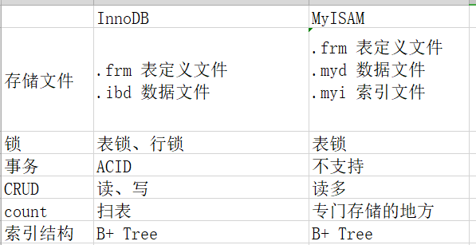


## 索引


### 什么是索引?
索引是对数据库表中一列或多列的值进行排序的一种结构，使用索引可快速访问数据库表中的特定信息。

MySQL官方对索引的定义为：索引（Index）是帮助MySQL高效获取数据的数据结构。

### 案例
select * from table where col2='77'
没有使用索引时，属于全表查询


* 使用索引定义数据结构保存数据，只需要查询俩次就能查询到数据

* 在数据之外，数据库系统还维护着满足特定查找算法的数据结构，这些数据结构以某种方式引用（指向）数据，这样就可以在这些数据结构上实现高级查找算法。这种数据结构，就是索引。

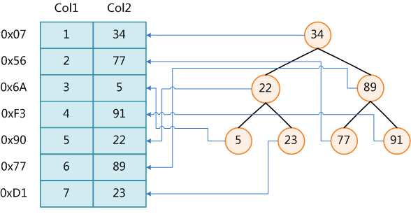


### 索引类型分类?

数据结构演示网站 : https://jsproxy.ga/-----https://www.cs.usfca.edu/~galles/visualization/Algorithms.html


#### B+TREE

使用平衡树实现索引，是mysql中使用最多的索引类型；
在innodb中，存在两种索引类型
* 第一种是主键索引（primary key），在索引内容中直接保存数据的地址；
* 第二种是其他索引，在索引内容中保存的是指向主键索引的引用；
* 所以在使用innodb的时候，要尽量的使用主键索引，速度非常快；

注意:
* 无论是innodb 和 myIsm 创建时保存索引类型，都是保存b+tree
* mysql每个节点可以保存200-300阶
* 搜索检索路径很短,空间连续，磁盘中可以连续进行读取
* 用like 'l%' 只能用前缀查询,做不了'%l'后缀查询，后缀查询会导致索引失效
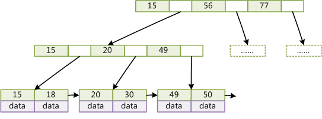

哪些情况下索引会失效？: https://www.cnblogs.com/hongfei/archive/2012/10/20/2732589.html


#### hash

把索引的值做hash运算，并存放到hash表中，使用较少，一般是memory引擎使用；因为使用hash表存储，按照常理，hash的性能比B-TREE效率高很多。

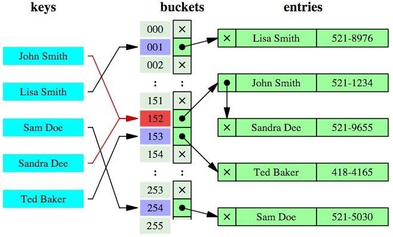

hash索引的缺点：
	1，hash索引只能适用于精确的值比较，=，in，或者<>, 因为只需要经过一次算法即可找到相应的键值；
	2，无法使用索引排序,因为原先是有序的键值，经过哈希算法后，有可能变成不连续的了，就没办法再利用索引完成范围查询检索；
	3，组合hash索引无法使用部分索引,以及like ‘xxx%’ 这样的部分模糊查询（这种部分模糊查询，其实本质上也是范围查询）；
	4，如果大量索引hash值相同，链表会很长，查询复杂,性能较低；


## MySQL索引实现

在MySQL中，索引属于存储引擎级别的概念，不同存储引擎对索引的实现方式是不同的，我们主要讨论MyISAM和InnoDB两个存储引擎的索引实现方式。

主键:
mysql 没有创建主键会有一个隐藏列,隐藏列看不到，保证数据不重复


### InnoDB和MyISAM引擎支持hash索引吗?

参考资料:https://blog.csdn.net/doctor_who2004/article/details/77414742

* MySQL 最经常使用存储引擎 InnoDB 和 MyISAM 都不支持 Hash 索引，它们默认的索引都是 B-Tree。可是假设你在创建索引的时候定义其类型为 Hash，MySQL 并不会报错，并且你通过 SHOW CREATE TABLE 查看该索引也是 Hash，仅仅只是该索引实际上还是 B-Tree。
* 虽然常见存储引擎并不支持 Hash 索引，但 InnoDB 有另一种实现方法：自适应哈希索引。InnoDB 存储引擎会监控对表上索引的查找，如果观察到建立哈希索引可以带来速度的提升，则建立哈希索引。


### MyISAM索引实现

MyISAM引擎使用B+Tree作为索引结构，叶节点的data域存放的是数据记录的地址(物理地址)。

#### 主索引(Primary Key)

这里设表一共有三列，假设我们以Col1为主键，图解一个MyISAM表的主索引（Primary key）示意。可以看出MyISAM的索引文件仅仅保存数据记录的地址

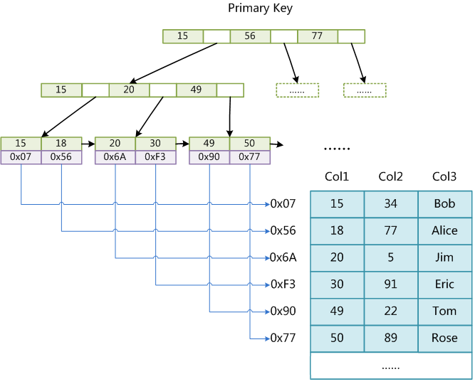


#### 辅助索引(Second Key)


在MyISAM中，主索引和辅助索引（Secondary key）在结构上没有任何区别，只是主索引要求key是唯一的，而辅助索引的key可以重复。如果我们在Col2上建立一个辅助索引，则此索引的结构如图所示

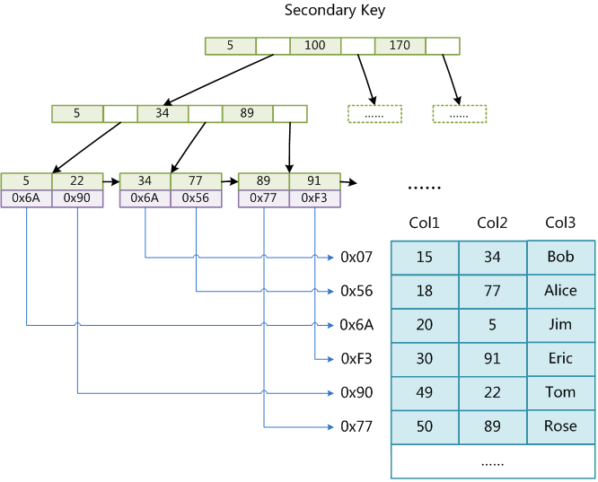

同样也是一颗B+Tree，data域保存数据记录的地址。因此，MyISAM中索引检索的算法为首先按照B+Tree搜索算法搜索索引，如果指定的Key存在，则取出其data域的值，然后以data域的值为地址，读取相应数据记录。

MyISAM的索引方式也叫做“非聚集”的，之所以这么称呼是为了与InnoDB的聚集索引区分。


<br>
---
### InnoDB索引实现

虽然InnoDB也使用B+Tree作为索引结构，但具体实现方式却与MyISAM截然不同。

* 第一个重大区别是InnoDB的数据文件本身就是索引文件。从上文知道，MyISAM索引文件和数据文件是分离的，索引文件仅保存数据记录的地址。
* 而在InnoDB中，表数据文件本身就是按B+Tree组织的一个索引结构，这棵树的叶节点data域保存了完整的数据记录。这个索引的key是数据表的主键，因此InnoDB表数据文件本身就是主索引。


#### 主索引(Primary Key)

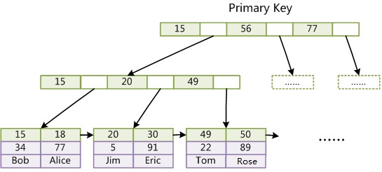


* 示意图中可以看到叶节点包含了完整的数据记录。这种索引叫做聚集索引。
* 因为InnoDB的数据文件本身要按主键聚集，所以**InnoDB要求表必须有主键**（MyISAM可以没有）
* 如果没有显式指定，则MySQL系统会自动选择一个可以唯一标识数据记录的列作为主键，* 如果不存在这种列，则MySQL自动为InnoDB表生成一个隐含字段作为主键，这个字段长度为6个字节，类型为长整形。

#### 辅助索引(Second Key)

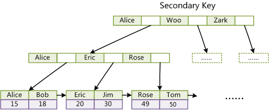

1. 与MyISAM索引的不同是InnoDB的辅助索引data域存储相应记录主键的值而不是地址。换句话说，InnoDB的所有辅助索引都引用主键作为data域。

2. 聚集索引这种实现方式使得按主键的搜索十分高效，但是辅助索引搜索需要检索两遍索引：
  * 首先检索辅助索引获得主键;
  * 然后用主键到主索引中检索获得记录。


<br>
---

#### Innodb 为什么不保存主键的物理地址?
因为每插入一条元素，会导致数据的物理地址发生变化

#### MyISAM 和 innerdb 使用辅助索引查找数据，哪一个查找比较快?
MyISAM比较快根据地址就可以找到，Innodb就需要查找俩次

<br>
---


### 什么是聚簇索引?
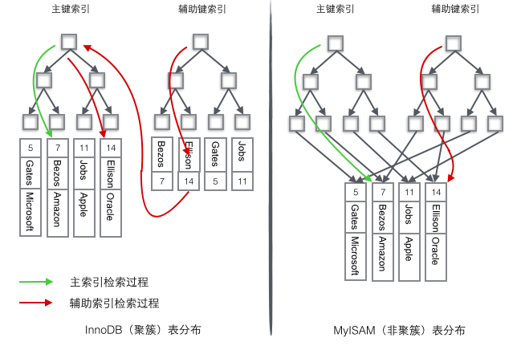
聚集索引是指数据库表行中数据的物理顺序与键值的逻辑（索引）顺序相同。
通俗讲:
* 聚簇索引：将数据存储与索引放到了一块，找到索引也就找到了数据
* 非聚簇索引：将数据存储于索引分开结构，索引结构的叶子节点指向了数据的对应物理地址


<br>
---

### 索引的利弊
1. 索引的好处:
	* 提高表数据的检索效率；
	* 如果排序的列是索引列，大大降低排序成本；
	* 在分组操作中如果分组条件是索引列，也会提高效率；

2. 索引的问题：索引需要额外的维护成本；

### 如何创建索引

如果索引的字段多了，新增数据时，都需要对索引进行维护，重新编排生成索引

1，较频繁的作为查询条件并且比较少更新的字段应该创建索引；
2，唯一性太差的字段不适合单独创建索引，即使频繁作为查询条件；
    |-- 如男/女这样的数据(没有达到筛选数据的目的)
3，更新非常频繁的字段不适合创建索引；(多次更新索引都会重新编排)
4，不会出现在WHERE 子句中的字段不该创建索引；(字段不进行条件筛选查询，没有意义)


##### 案例

select * from table where 条件A and 条件B and 条件C

1. 使用三个索引去查询，但是只会查询一个
2. 此时应该建立联合索引或者是组合索引,查询时按照顺序去查询


<br>
---

## 性能分析命令
### 导入数据

```
数据下载:https://github.com/datacharmer/test_db

MySQL官方文档中提供的示例数据库之一：employees。

使用命令导入数据:
mysql -uroot -padmin -t < employees.sql
```

### Explain 命令

```
id : 查询顺序
select_type :  查询类型
    |-- SIMPLE : 简单的单表查询
    |--
    |--
table : 查询的表名
type : 连接(通过什么去查的，通过外键，空值等等)
possiable_key : 有可能用上的索引
key : 真正使用的索引
key_len : 使用索引key的长度
ref : 怎么去连接,对应的列名
rows : 多大的数据量，内部统计信息,应该要小一点
filtered : 显示了通过条件过滤出的行数的百分比估计值。
Extra : 该列包含MySQL解决查询的详细信息
```
EXplain select * from employees

show profiles;可以显示使用的sql 的所用时间


联合索引满足最左原则才会使用索引

1. 条件A
条件A,条件B

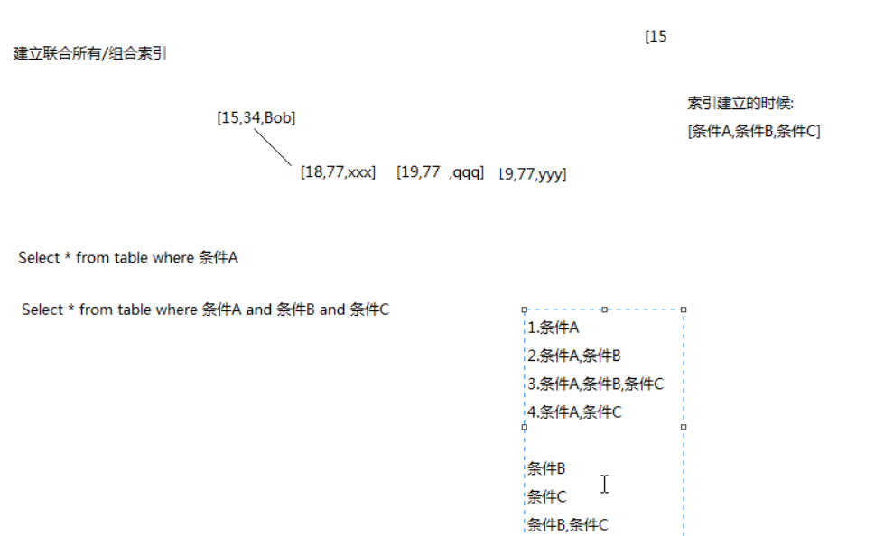


2. 出现范围查询只会用到范围查询的舱底

### 索引的选择性和前缀索引
索引的选择性是指索引列中不同值的数目与表中记录数的比。如果一个表中有2000条记
录，表索引列有1980个不同的值，那么这个索引的选择性就是1980/2000=0.99。

一个索引的选择性越接近于1，这个索引的效率就越高。


### Innodb 的主键选择
如果是插入uuid的话，会随机插入到b+tree上，不是连续的，因此影响性能


### 理解join原理
index>block>simple算法


### join 优化原则
小结果集驱动大结果集
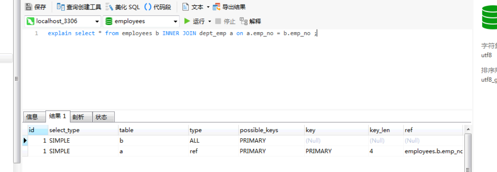

不使用select * ，* 会查询出所有的字段

### 其他优化

order by 优化:

排序字段刚好是索引字段时，不会使用filesort,直接返回

双路排序: 磁盘中的数据会读取俩次

单路排序: 只读一次

不使用select * ，* 会查询出所有的字段


http://mysql.taobao.org/monthly/2015/03/04/


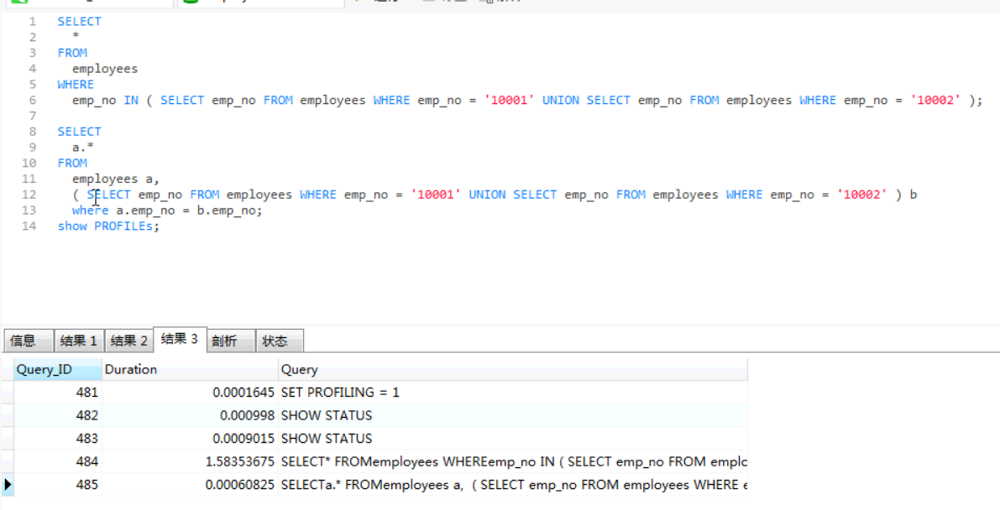
