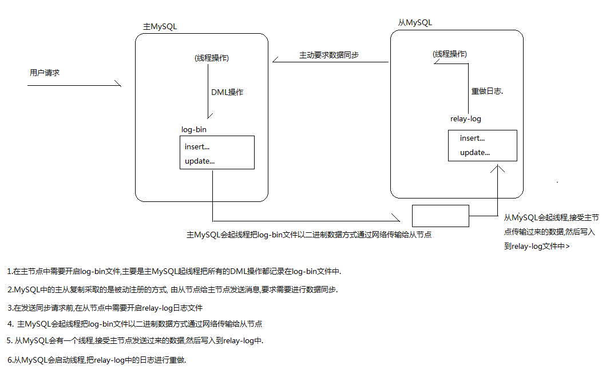
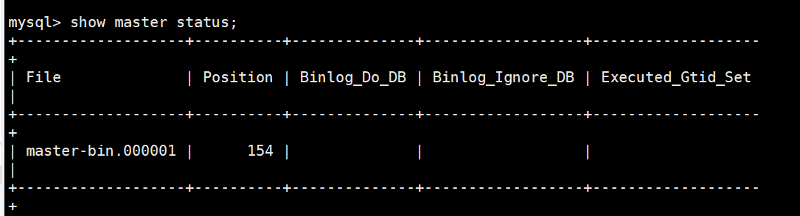
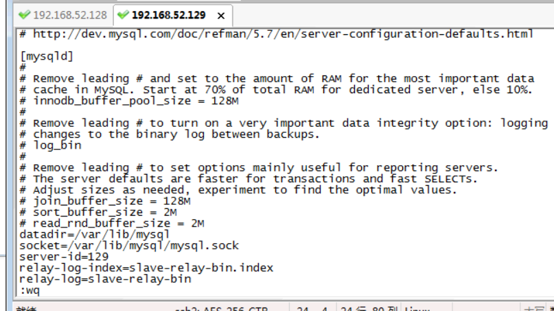
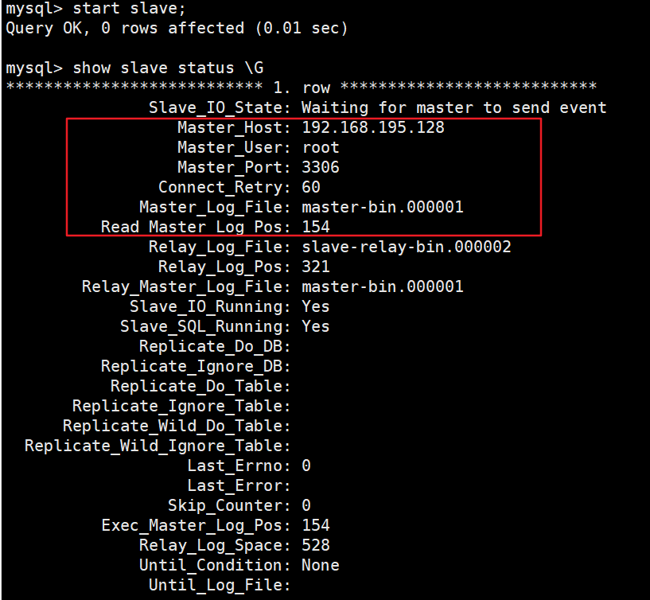
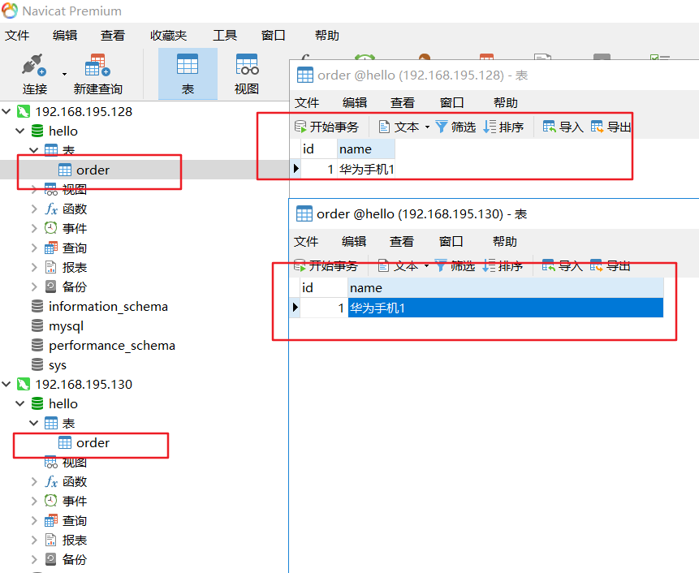

## mysql主从复制


### 主从复制原理:

1. MySQL的复制是异步执行的，因为MySQL的特殊机制，让复制的延迟控制较小；

2. MySQL的复制是从一个MySQL进程复制到另一个MySQL进程，被复制方我们称为Master；复制方我们称为Slave；

3. MySQL的复制依赖一种叫做bin-log的日志文件，bin-log记录了所有在Master端执行的DDL/DML/事务操作序列，并同步到Slave端，Slave根据日志复现操作序列，即完成同步；

4. 复制流程：
	1. Slave 上面的IO 线程连接上Master，并请求从指定日志文件的指定位置之后的日志内容；

	2. Master 接收到来自Slave 的IO 线程的请求后，通过负责复制的IO线程根据请求信息读取指定日志指定位置之后的日志信息，返回给Slave 端的IO线程；

	3. Slave 的IO 线程接收到信息后，将接收到的日志内容依次写入到Slave 端的Relay Log 文件(mysql-relay-bin.xxxxxx)的最末端；

	4. Slave 的SQL 线程检测到Relay Log 中新增加了内容后，会马上解析该Log 文件中的内容成为在Master 端真实执行时候的那些可执行的Query 语句，并在自身执行这些Query；

5. 复制一定会存在延迟和数据丢失的风险；




## 配置主/从

步骤:
1. 克隆4台mysql虚拟机,动态生成mac地址
2. 修改ip 为静态ip,动态ip会多次变化

#### 主服务器中的配置
1. 在主服务器/etc/my.cnf 中添加：
```
//给数据库服务的唯一标识，一般为大家设置服务器Ip的末尾号
server-id=1
log-bin=master-bin
log-bin-index=master-bin.index
```


2. 启动主服务器；
systemctl start mysqld;

3. 执行show master status;  查看主服务器状态；
master-bin.000001 : 数据库保存DML操作的日志文件名(log-bin)
154 : 文件所在的位置


4. 复制当前主服务器中的数据库内容；


### 从服务器配置
在从服务器中创建主服务器数据库:

1. 在从服务器/etc/my.cnf中添加：
```
server-id=2
relay-log-index=slave-relay-bin.index
relay-log=slave-relay-bin
```


2. 启动从服务器；
3. 在从服务中执行：
```
change master to master_host='192.168.195.133', //Master 服务器Ip
master_user='root',
master_password='Kiva_2019',
master_log_file='master-bin.000001',//Master服务器产生的日志
master_log_pos=154;
```
4. 启动从服务：start slave;
5. 查看状态:  show slave status \G


6. 在主服务器中添加一条数据，查看在从服务器中是否同步成功；
```
//注意克隆服务器，需要
mv /var/lib/mysql/auto.cnf /var/lib/mysql/auto.cnf_bak
然后再重新启动mysql
```

### 测试
1. 创建数据库查看同步
2. 写数据库只能再主节点，从节点数据修改不会改变主节点的数据


