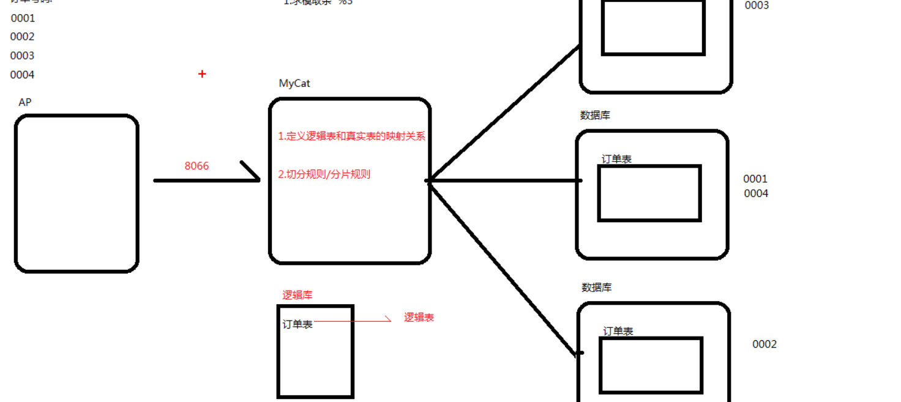
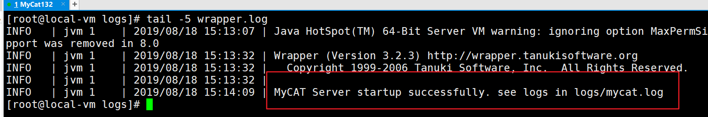
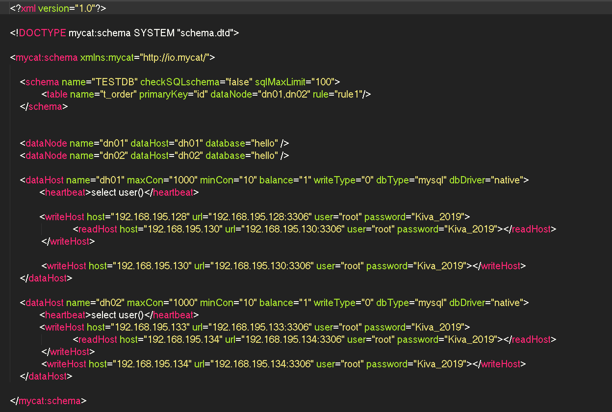
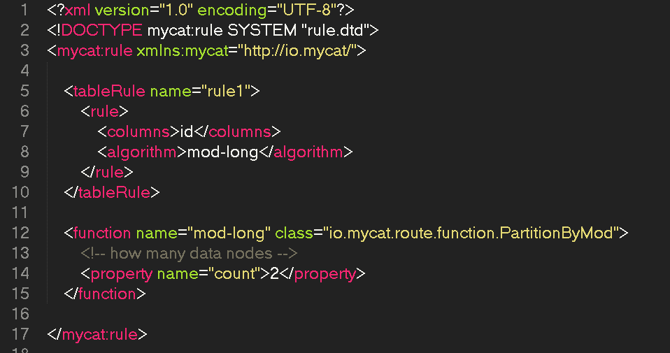

## 数据库中间件Mycat

### Mycat介绍

#### 主要作用
主要作为分布式数据库系统的中间层
1. 可以实现数据库的读写分离
2. 支持负载均衡
3. 支持后端MySQL高可用
4. 数据库的垂直拆分
5. 数据库水平拆分

#### 应用场景
1. 需要读写分离的场景
2. 需要进行分库分表的场景
3. 多租户场景


#### 基本概念:
1. 定义逻辑库和真实表的映射关系
2. 切分规则/分片规则
3. 默认8066端口
逻辑库,逻辑表: 服务器连接MyCat,Mycat 提供的逻辑库和逻辑表映射多个真实库和真真实表





#### 关键特性
1. 支持SQL92标准
2. 支持MySQL集群
3. 支持JDBC连接数据库
4. 支持NOSQL数据库
5. 支持故障切换，高可用性
6. 支持读写分离
7. 支持全局表
8. 支持独有的基于ER关系的分片策略
9. 支持一致性HASH分片
10. 多平台支持，部署简单方便
11. 支持全局序列号

### 安装步骤；
1. 安装JAVA环境
2. 下载Mycat
3. 解压Mycat
4. 配置环境变量
配置文件相关配置信息:
```
server.xml : mycat 的配置信息,访问权限
server.xml : mycat 的配置信息,访问权限
scheme.xml : 逻辑库和逻辑表的映射配置
  |-- 删除所有
  |-- dataNode : 节点，对应哪台服务器中的那个数据库
  |-- balance ： 设置负载均衡
      |-- 0 : 不开启读写分离
      |-- 1 : 开启读写分离
rule.xml : 配置分片规则
  |-- mod-long : 求模取余的规则
  |-- count : dataNode的数量
```
5. 启动Mycat
  * 切换到bin 目录下 ./myCat start
  * 查看是否启动成功: 切换到log目录下，查看wrapper.log文件



### 配置主从

```xml
<?xml version="1.0"?>
<!DOCTYPE mycat:schema SYSTEM "schema.dtd">

<mycat:schema xmlns:mycat="http://io.mycat/">

    <schema name="TESTDB" checkSQLschema="false" sqlMaxLimit="100">
      <!-- 配置表名，主键，数据节点：单主从  -->
	     <table name="order" primaryKey="id" dataNode="dn01"/>
    </schema>

    <!-- 配置节点  -->
    <dataNode name="dn01" dataHost="dh01" database="hello" />  
    <dataHost name="dh01" maxCon="1000" minCon="10" balance="1" writeType="0" dbType="mysql" dbDriver="native">
            <!-- 心跳 -->
            <heartbeat>select user()</heartbeat>  
            <writeHost host="192.168.195.128" url="192.168.195.128:3306" user="root" password="Kiva_2019">
                  <!-- 配置从节点作为读节点 -->
		              <readHost host="192.168.195.130" url="192.168.195.130:3306" user="root" password="Kiva_2019"></readHost>
	         </writeHost>
           <!-- 主节点失效时，从节点成为写节点 -->
	          <writeHost host="192.168.195.130" url="192.168.195.130:3306" user="root" password="Kiva_2019"></writeHost>
    </dataHost>
</mycat:schema>
```


### 配置分库分表:
1. 克隆俩台虚拟机,配置另外俩台主从的服务器
2. 修改server.xml,需要配置俩个主节点，俩个从节点
3. 修改rule.xml
    |-- mod-long : 求模取余的规则
    |-- count : dataNode的数量
4. 重启mycat
5. 测试，分片规则是根据id去求模取余

server.xml


rule.xml



