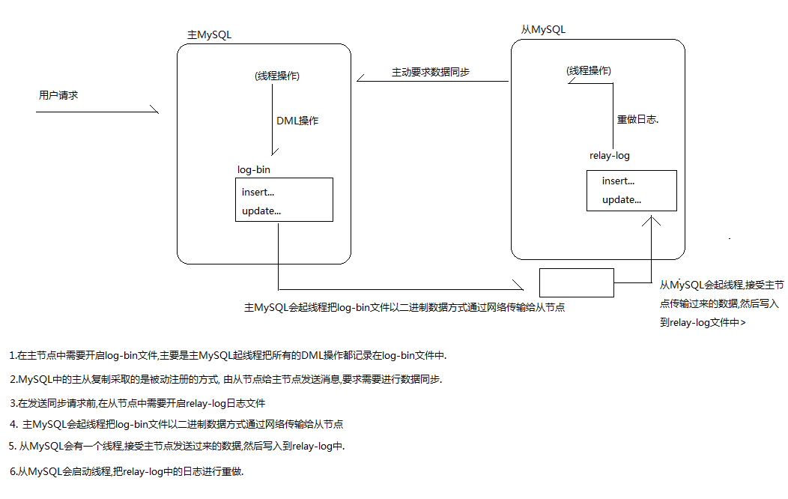
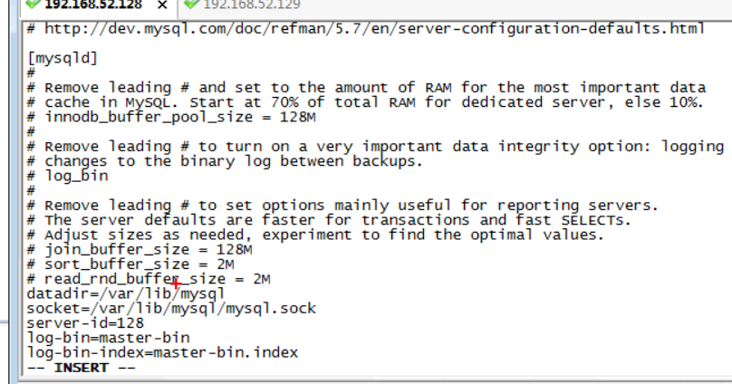
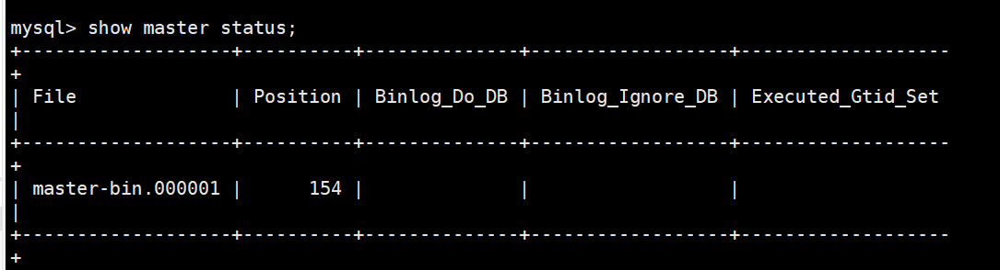
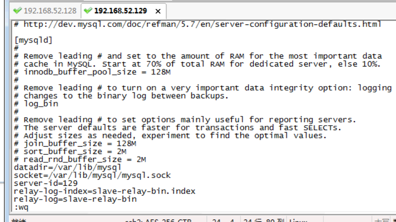
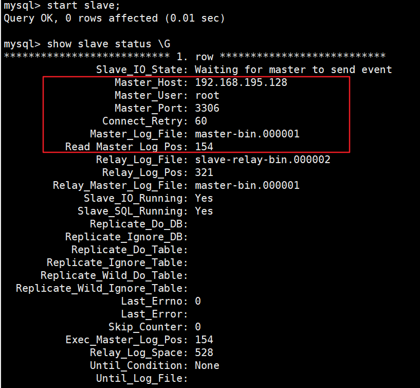
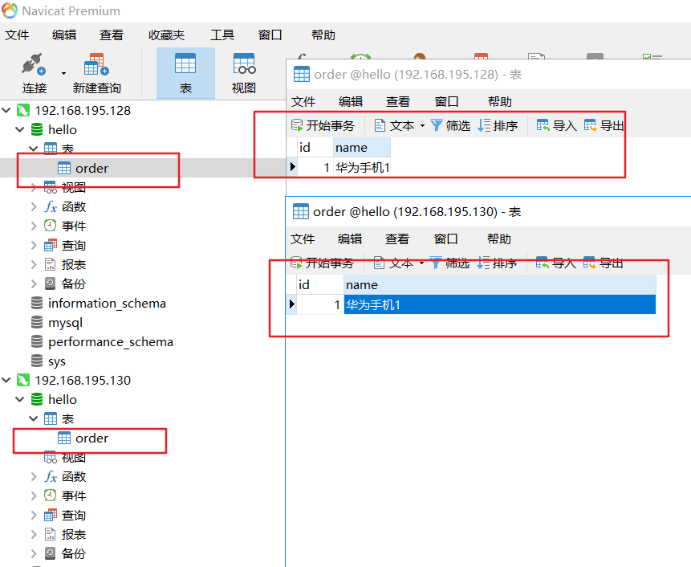
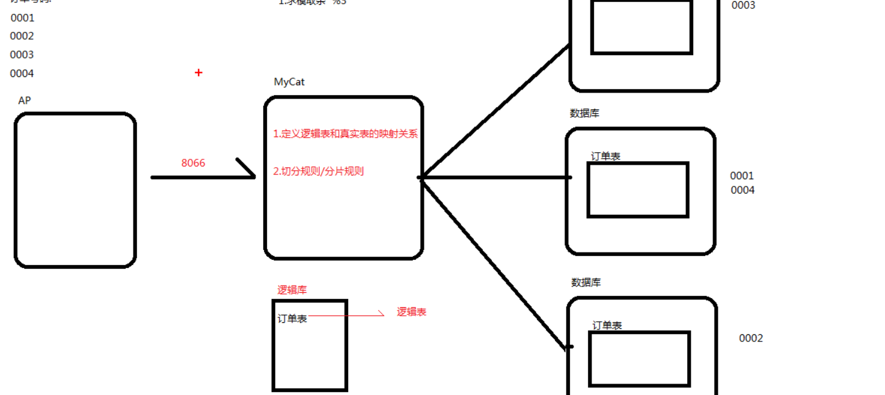
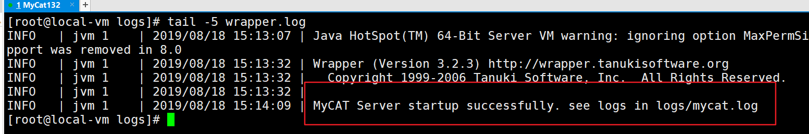
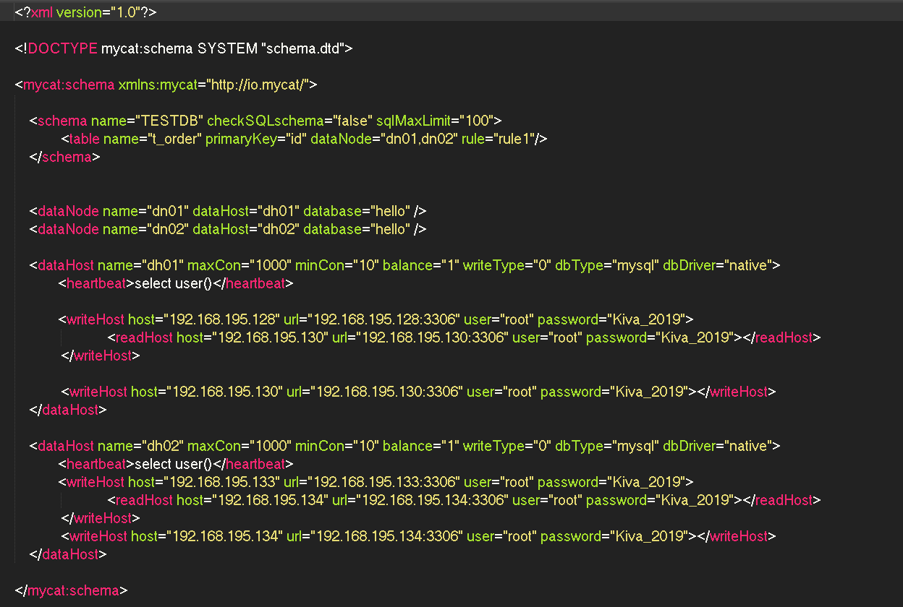
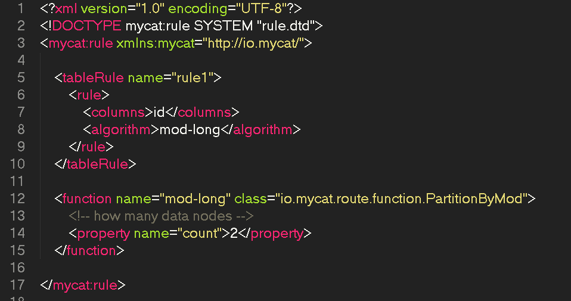

## mysql主从复制


### 主从复制原理:

1. MySQL的复制是异步执行的，因为MySQL的特殊机制，让复制的延迟控制较小；

2. MySQL的复制是从一个MySQL进程复制到另一个MySQL进程，被复制方我们称为Master；复制方我们称为Slave；

3. MySQL的复制依赖一种叫做bin-log的日志文件，bin-log记录了所有在Master端执行的DDL/DML/事务操作序列，并同步到Slave端，Slave根据日志复现操作序列，即完成同步；

4. 复制流程：
	1. Slave 上面的IO 线程连接上Master，并请求从指定日志文件的指定位置之后的日志内容；

	2. Master 接收到来自Slave 的IO 线程的请求后，通过负责复制的IO线程根据请求信息读取指定日志指定位置之后的日志信息，返回给Slave 端的IO线程；

	3. Slave 的IO 线程接收到信息后，将接收到的日志内容依次写入到Slave 端的Relay Log 文件(mysql-relay-bin.xxxxxx)的最末端；

	4. Slave 的SQL 线程检测到Relay Log 中新增加了内容后，会马上解析该Log 文件中的内容成为在Master 端真实执行时候的那些可执行的Query 语句，并在自身执行这些Query；

5. 复制一定会存在延迟和数据丢失的风险；




## 配置主/从

步骤:
1. 克隆4台mysql虚拟机,动态生成mac地址
2. 修改ip 为静态ip,动态ip会多次变化

#### 主服务器中的配置
1. 在主服务器/etc/my.cnf 中添加：
```
//给数据库服务的唯一标识，一般为大家设置服务器Ip的末尾号
server-id=1
log-bin=master-bin
log-bin-index=master-bin.index
```



2. 启动主服务器；
systemctl start mysqld;

3. 执行show master status;  查看主服务器状态；
master-bin.000001 : 数据库保存DML操作的日志文件名(log-bin)
154 : 文件所在的位置


4. 复制当前主服务器中的数据库内容；


### 从服务器配置
在从服务器中创建主服务器数据库:

1. 在从服务器/etc/my.cnf中添加：
```
server-id=2
relay-log-index=slave-relay-bin.index
relay-log=slave-relay-bin
```


2. 启动从服务器；
3. 在从服务中执行：
```
change master to master_host='192.168.195.133', //Master 服务器Ip
master_user='root',
master_password='Kiva_2019',
master_log_file='master-bin.000001',//Master服务器产生的日志
master_log_pos=154;
```
4. 启动从服务：start slave;
5. 查看状态:  show slave status \G


6. 在主服务器中添加一条数据，查看在从服务器中是否同步成功；
```
//注意克隆服务器，需要
mv /var/lib/mysql/auto.cnf /var/lib/mysql/auto.cnf_bak
然后再重新启动mysql
```

### 测试
1. 创建数据库查看同步
2. 写数据库只能再主节点，从节点数据修改不会改变主节点的数据




## 数据库中间件Mycat

### Mycat介绍

#### 主要作用
主要作为分布式数据库系统的中间层
1. 可以实现数据库的读写分离
2. 支持负载均衡
3. 支持后端MySQL高可用
4. 数据库的垂直拆分
5. 数据库水平拆分

#### 应用场景
1. 需要读写分离的场景
2. 需要进行分库分表的场景
3. 多租户场景


#### 基本概念:
1. 定义逻辑库和真实表的映射关系
2. 切分规则/分片规则
3. 默认8066端口
逻辑库,逻辑表: 服务器连接MyCat,Mycat 提供的逻辑库和逻辑表映射多个真实库和真真实表





#### 关键特性
1. 支持SQL92标准
2. 支持MySQL集群
3. 支持JDBC连接数据库
4. 支持NOSQL数据库
5. 支持故障切换，高可用性
6. 支持读写分离
7. 支持全局表
8. 支持独有的基于ER关系的分片策略
9. 支持一致性HASH分片
10. 多平台支持，部署简单方便
11. 支持全局序列号

### 安装步骤；
1. 安装JAVA环境
2. 下载Mycat
3. 解压Mycat
4. 配置环境变量
配置文件相关配置信息:
```
server.xml : mycat 的配置信息,访问权限
server.xml : mycat 的配置信息,访问权限
scheme.xml : 逻辑库和逻辑表的映射配置
  |-- 删除所有
  |-- dataNode : 节点，对应哪台服务器中的那个数据库
  |-- balance ： 设置负载均衡
      |-- 0 : 不开启读写分离
      |-- 1 : 开启读写分离
rule.xml : 配置分片规则
  |-- mod-long : 求模取余的规则
  |-- count : dataNode的数量
```
5. 启动Mycat
  * 切换到bin 目录下 ./myCat start
  * 查看是否启动成功: 切换到log目录下，查看wrapper.log文件



### 配置主从

```xml
<?xml version="1.0"?>
<!DOCTYPE mycat:schema SYSTEM "schema.dtd">

<mycat:schema xmlns:mycat="http://io.mycat/">

    <schema name="TESTDB" checkSQLschema="false" sqlMaxLimit="100">
      <!-- 配置表名，主键，数据节点：单主从  -->
	     <table name="order" primaryKey="id" dataNode="dn01"/>
    </schema>

    <!-- 配置节点  -->
    <dataNode name="dn01" dataHost="dh01" database="hello" />  
    <dataHost name="dh01" maxCon="1000" minCon="10" balance="1" writeType="0" dbType="mysql" dbDriver="native">
            <!-- 心跳 -->
            <heartbeat>select user()</heartbeat>  
            <writeHost host="192.168.195.128" url="192.168.195.128:3306" user="root" password="Kiva_2019">
                  <!-- 配置从节点作为读节点 -->
		              <readHost host="192.168.195.130" url="192.168.195.130:3306" user="root" password="Kiva_2019"></readHost>
	         </writeHost>
           <!-- 主节点失效时，从节点成为写节点 -->
	          <writeHost host="192.168.195.130" url="192.168.195.130:3306" user="root" password="Kiva_2019"></writeHost>
    </dataHost>
</mycat:schema>
```


### 配置分库分表:
1. 克隆俩台虚拟机,配置另外俩台主从的服务器
2. 修改server.xml,需要配置俩个主节点，俩个从节点
3. 修改rule.xml
  |-- mod-long : 求模取余的规则
  |-- count : dataNode的数量
4. 重启mycat
5. 测试，分片规则是根据id去求模取余

server.xml


rule.xml


Kiva_2019
