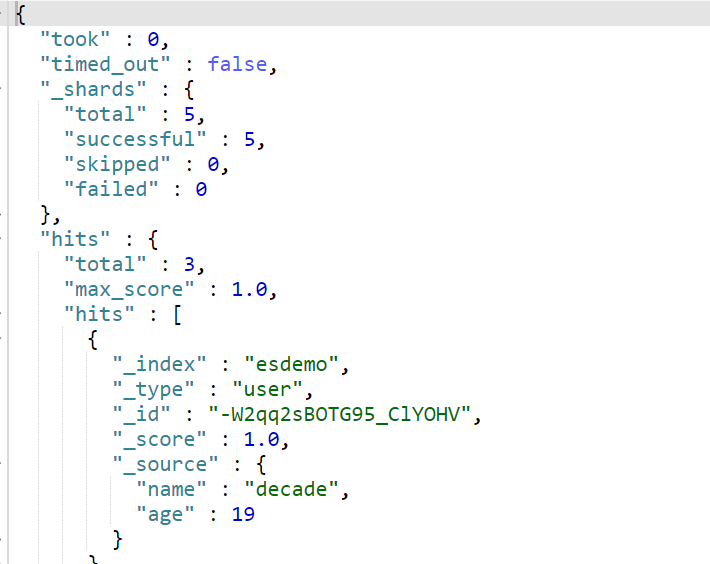
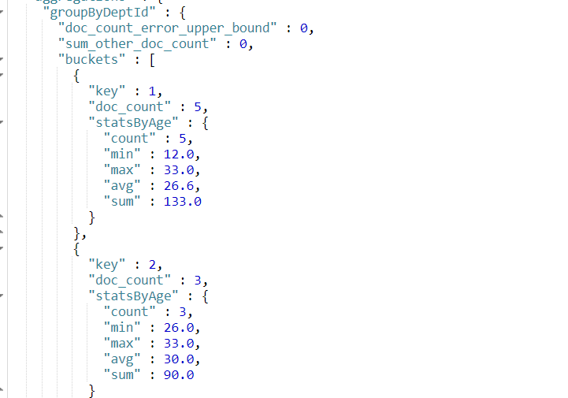

Elasticsearch 重在查询

概念名词:
1. Elasticsearch 6.0 开始一个索引只能有一个类型


### 数据存储图


### 主要组件

* 索引
ES将数据存储于一个或多个索引中，索引是具有类似特性的文档的集合。
类比传统的关系型数据库领域来说，索引相当于SQL中的一个数据库，或者一个数据存储方案(schema)。
索引由其名称(必须为全小写字符)进行标识，并通过引用此名称完成文档的创建、搜索、更新及删除操作。一个ES集群中可以按需创建任意数目的索
引。

* 类型
类型是索引内部的逻辑分区(category/partition)，然而其意义完全取决于用户需求。因此，一个索引内部可定义一个或多个类型(type)。
一般来说，类型就是为那些拥有相同的域的文档做的预定义。例如，在索引中，可以
定义一个用于存储用户数据的类型，一个存储日志数据的类型，以及一个存储评论数据的类型。
类比传统的关系型数据库领域来说，类型相当于表。
* 映射
Mapping,就是对索引库中索引的字段名称及其数据类型进行定义，类似于mysql中的表结构信息。不过es的mapping比数据库灵活很多，它可以动态识别字段。一般不需要指定mapping都可以，因为es会自动根据数据格式识别它的类型，如果你需要对某些字段添加特殊属性（如：定义使用其它分词器、是否分词、是否存储等），就必须手动添加mapping。我们在es中添加索引数据时不需要指定数据类型，es中有自动影射机制，字符串映射为string，数字映射为long。通过mappings可以指定数据类型是否存储等属性
* 文档
文档是Lucene索引和搜索的原子单位，它是包含了一个或多个域的容器，基于JSON格式进行表示。文档由一个
或多个域组成，每个域拥有一个名字及一个或多个值，有多个值的域通常称为多值域。每个文档可以存储不同
的域集，但同一类型下的文档至应该有某种程度上的相似之处。


## 索引操作

#### 建立索引
建立索引，相当于建立数据库

```js
语法:put /索引名

在没有特殊设置的情况下，默认有5个分片，1个备份，也可以通过请求参数的方式来指定
参数格式：
{
    "settings": {
    "number_of_shards": 5, //设置5个片区
    "number_of_replicas": 1 //设置1个备份
    }
}

例子:
put /esdemo
```

#### 删除索引
```
语法 :  delete /索引名
```

## 文档操作

#### 添加文档
```json
语法:put /索引名/类型名/文档id

put /demo/user/1
{
  "name":"bunny",
  "age":18
}

// 使用post请求，id会自动生成uuid
post /demo/user
{
  "name":"decade",
  "age":18
}
```

#### 查询
```json
get /esdemo/user/id
```
结果如下:
```json
{
  "_index" : "esdemo",
  "_type" : "user",
  "_id" : "1",
  "_version" : 1,
  "found" : true,
  "_source" : {
      "name" : "decade",
      "age" : 18
  }
}
```

每一个文档都内置以下字段
```
_index：所属索引
_type：所属类型
_id：文档ID，若不指定则需要使用POST请求，会自动生成UUID值
_version：乐观锁版本号
_source：数据内容
```


#### 查询多个
```
get /esdemo/user/_ search
```
查询的结果中包含以下字段
```
took：耗时
_shards.total：分片总数
hits.total：查询到的数量
hits.max_score：最大匹配度
hits.hits：查询到的结果
hits.hits._score：匹配度/匹配值
```

返回结果: max_socre最大得分,用于测试性能



#### 更新文档

更新时需书写所有的字段，否则会发生覆盖
```js
语法：
POST /索引名/类型名/文档ID
{
    field1: value1,
    field2: value2,
    ...
}

示例:
POST /demo/user/id
{
  "age":18,
  "name":"decade"
}
```


#### 删除文档
注意: 删除不是真正意义上的删除，只是清空内容,只是版本号会出现递增
```js
语法： DELETE /索引名/类型名/文档ID
例子:  DELETE /demo/user/id
```

<br>
---

#### 排序查询
```json
语法:
{
  "sort":[
    {"field":"排序规则"}
  ]
}
排序规则 : asc  desc

例子:
GET /rbac/employee/_search
{
  "sort":[
    {"age":"asc"}
  ]
}
```

#### 分页查询
```json
语法:
{
  "form":start,
  "size":pageSize
}

示例
GET /rbac/employee/_search
{
  "form":0,
  "size":2
}
```

阶段练习：
```json
1：使用POST方法往rbac/employee中加入一个文档，文档具有id,name,age,deptId属性
POST /rbac/employee
{
  "id":1,
  "name":"decade",
  "age":18,
  "deptId":1
}

2：使用POST方法基于文档ID更新一个文档
POST /rbac/employee/文档id
{
  "id":1,
  "name":"kiva",
  "age":36,
  "deptId":1
}

3：使用GET方法基于文档ID查询一个文档
GET /rbac/employee/文档id

4：使用DELETE方法基于文档ID删除一个文档
DELETE /rbac/employee/文档id

5：查询rbac/employee中的所有文档，按照年龄排序
GET /rbac/employee/_search
{
  "sort": [
    {"age": {"order": "desc"} }
  ]
}

6：分页查询rbac/employee中的文档，每页显示3个，显示第2页
GET /rbac/employee/_search
{
  "from": 3,
  "size": 3
}
```

### 高级查询
#### 查询所有
```json
1：查询rbac/employee中所有文档
GET /rbac/employee/_search
{
  "query":{"match_all":{}}
}
query：配置查询类型，系统会对查询结果评分
match_all: 查询所有
```

#### 投影查询
* 只查特定的某些字段
* 常用于大数据数据分析

```json
2：查询rbac/employee中所有文档，只显示name,age字段

GET /rbac/employee/_search
{
  "_source":["name","age"]
}
```

#### 检索查询
```json
语法:
{
    "query": {
        检索方式: {field: value}
    }
}

GET /rbac/employee/_search
{
  "query":{
    "term":{"name":"wang kun"}
  }
}

GET /rbac/employee/_search
{
  "query":{
    "match_phrase":{"name":"wang kun"}
  }
}

GET /rbac/employee/_search
{
  "query":{
    "match":{"name":"wang kun"}
  }
}
```
* term表示精确匹配，value值不会被分词器拆分，按照倒排索引匹配，一般用于filter中
* match_phrase表示短语检索，value值不会被分词器拆分，直接去倒排索引中匹配
* match表示全文检索，value值会被分词器拆分，然后去倒排索引中匹配


#### 逻辑查询

* 逻辑规则：must / should / must_not，相当于and / or / not

```js
{
  "query":{
    "bool":{
      "逻辑规则":[
        {"检索条件":{"field":"value"}},
        ...
      ]
    }
  }
}


例子:
// 2：查询rbac/employee中所有name含有zhang并且age=26的文档
GET /rbac/employee/_search
{
  "query":{
    "bool":{
      "must":[
        {"match":{"name":"wang"}},
        {"match":{"age":26}}
      ]
    }
  }
}
```

#### 范围查询

```js
参数格式：
{
    "query": {
        "bool": {
            "filter": [
                检索方式: {
                    field: value
                }，
                "range": {
                    field: {比较规则: value, ...}
                }
            ]
        }
    }
}
range：范围过滤
比较规则：gt / gte / lt / lte 等
注意：filter表示在查询的结果中做过滤，该操作不涉及评分，有缓存，适用于完全精确匹配，范围查询
```

例子:
* filter : 表示在查询的结果中进行过滤,有缓存，越查越快
* filter 中的操作不涉及评分

```js
 // 查询rbac/employee中所有name含有zhang并且26<=age<=33的文档
GET /rbac/employee/_search
{
  "query": {
    "bool": {
      "must": [
        {"match":{"name":"zhang"}}
      ],
      "filter": {
        "range": {
          "age": {"gte": 26,"lte": 33}
        }
      }
    }
  }
}

// -------对分数没有影响--------
GET /rbac/employee/_search
{
  "query": {
    "bool": {
      "filter": [
        {"match":{"name":"zhang"}},
        {"range": { "age": { "gte":26,"lte":33 } } }
      ]
    }
  }
}
```

### 分组查询
```js
参数格式：
{
    "size": 0, // 不显示分组查询的数据
    "aggs": {
      自定义分组字段: {
        "terms": {"field": 分组字段, "order": {自定义统计字段:排序规则}},
        "aggs": { //分组后的统计查询，相当于MySQL分组函数查询
          自定义统计字段: {
            分组运算: {
            "field": 统计字段
            }
          }
        },
        "size": 10 //默认显示10组
      }
    }
}

分组运算：avg / sum / min / max / value_count / stats(执行以上所有功能的) 注意：这里是size=0其目的是为了不要显示hit内容，专注点放在观察分组上
```

##### 示例：
##### 按照部门编号分组，统计数量
* 数量统计不需要加第二个aggs
* 配置size==0，就不会显示出参与分组的数据
* "size":2, 结果只显示2组数据

```js
GET /rbac/employee/_search{
  "size":0,    //不显示出参与分组的数据
  "aggs":{
    "groupByDept":{ // 给分组区别名
      "terms":{"field":"deptId","size":2}  // 根据deptId隐藏好
    }
  }
}
```

##### 统计各个部门的平均年龄

```json
GET /rbac/employee/_search{
  "size":0,  
  "aggs":{
    "groupByDept":{
      "terms":{"field":"deptId","order":{"avg_age":"desc"}}
    },
    "aggs":{
      "avg_age":{  
        "avg":{
          "field":"age"
        }
      }
    }
  }
}
```


统计各部门的年龄状态
```json
GET /rbac/employee/_search{
  "size":0,  
  "aggs":{
    "groupByDept":{
      "terms":{"field":"deptId"}
    },
    "aggs":{
      "stats_age":{  
        "stats":{
          "field":"age"
        }
      }
    }
  }
}
```
查询结果:


## 批处理
当需要集中的批量处理文档时，如果依然使用传统的操作单个API的方式，将会浪费大量网络资源，Elasticsearch为了提高操作的性能，专门提供了批处理的API

#### mget 批量查询
```json
GET /rabc/employee/_mget{
  "docs":[
    {"_id":1},
    {"_id":3},
    {"_id":5}
  ]
}
```
#### 批量增删改
* json 数据不能换行进行格式化

```js
语法:
POST /索引名/类型/_bulk
{动作:{"_id": 文档ID}
{...}
{动作:{"_id": 文档ID}
{...}
动作：create / update / delete，其中delete只有1行JSON，其他操作都是有2行JSON，并且JSON不能格式化


示例:
POST /rbac/employee/_bulk
{"create":{"_id":11}}
{"id":11,"age":12,"name":"wjc","deptId":1}
{"update":{"_id":"_m1mrGsBOTG95_ClQuFc"}}
{"doc":{"id":50,"age":12,"name":"decade123","deptId":1}}
{"delete":{"_id":11}}
```


.\navicat-patcher.exe "D:\software_install\Navicat Premium 12"
