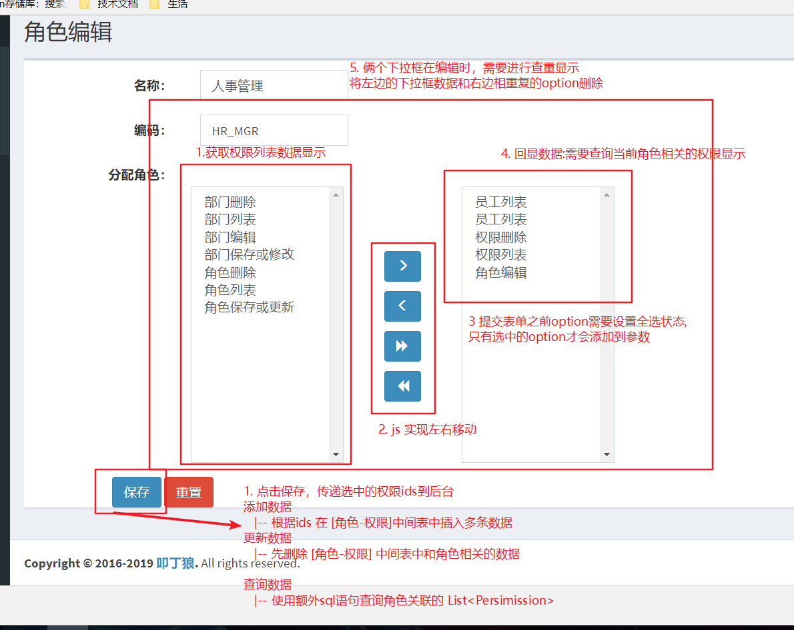
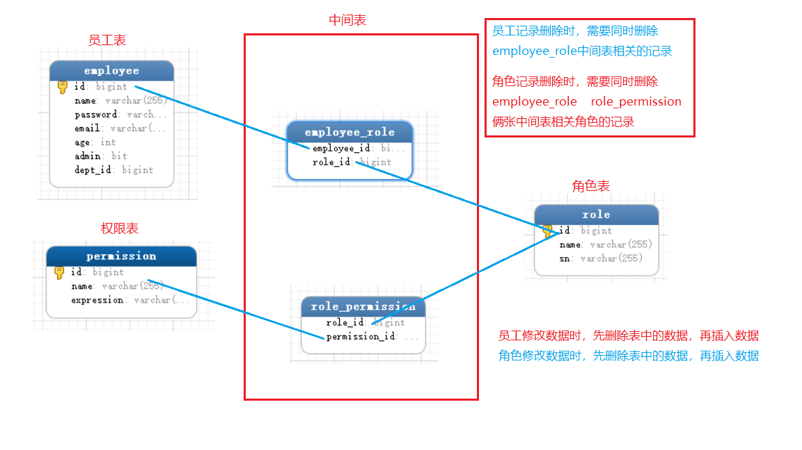

## RBAC
---

RBAC 概述:(Role Based Access Control)基于角色管理控制

管理流程
1. 在角色管理界面，为角色分配权限
2. 在员工管理界面，为员工分配角色(用户添加)
3. 用户对系统资源进行访问时，检查用户是否有权限访问对应的资源

注解:
元数据：用来描述注解的注解,在需要权限的方法上添加权限


#### 准备工作:
1. 创建数据库
2. 编写依赖，导入配置文件

#### 部门模块:
1. 自动生成部门mapper
2. 创建service,controller,实现增删改查方法
  * Collections.EMPTY_LIST : 创建一个空的list对象
3. 使用jquery 分页插件实现分页


#### 员工模块
```
主要步骤:
    (员工列表页面)实现简单单表的员工表增删改查，分页
    ---> 查询关联部门表多表查询
    ---> 多条件查询

    (员工详情页面)
    ---> 界面数据回显
          |-- 查询部门列表到下拉框中显示
              |-- 部门信息回显，需要在获取员工信息时，多表查询关联部门信息
          |-- admin 选择框的数据回显
    ---> 添加时有密码布局，编辑时没有密码布局
          |-- 编辑时不需要密码，update sql语句中不需要password字段

    (维护员工和角色管理)
    ---> 获取选中的角色参数
              |-- 查询所有角色信息(左边下拉框回显数据)
              |-- 实现左移右移
              |-- 提交前设置用户选择边框为选中状态
              |-- Long[] roleIds 接收参数
    ---> 保存操作
              |-- 遍历roleIds插入关系记录到中间表
    ---> 查询操作
              |-- 额外sql 查询关联的role列表数据
              |-- 数据回显,去重操作
    ---> 更新操作
              |-- 删除旧关系，保存新关系
    ---> 删除操作
              |-- 删除记录时，删除中间表相关数据
```
* 员工列表界面

```
  1. 员工列表页面需要关联部门，查询员工表时使用左外连接关联部门表进行多表查询

  2. 在查询列表方法(list方法中),查询部门列表数据(下拉框数据显示)

  3. 在js-system->btn-query中对查询按钮设置了点击事件

  4. 新建一个EmployeeQueryObject,字段包括keyword,deptId 主要用来接收关键字和部门选择的参数
      * 重写keyword getter方法,如果字符串类型是null或空字符串，直接返回null
      * deptId 默认值设置为-1(否则数据为空时，需要在动态sql中进行校验)

  5. 回显条件数据时,需要先设置使用ModelAttribute,设置传递数据别名
```

mapper 映射文件中
```xml

<resultMap id="BaseResultMap" type="com.kiva.rbac.domain.Employee">
   <id column="id" property="id"/>
   <result column="name" property="name"/>
   <result column="password" property="password"/>
   <result column="email" property="email"/>
   <result column="age" property="age"/>
   <result column="admin" property="admin"/>

   <!--多表查询:查询关联的部门属性-->
   <association property="dept" javaType="Department">
       <id column="d_id" property="id"/>
       <result column="d_name" property="name"/>
   </association>
</resultMap>

<select id="queryPage" resultMap="BaseResultMap">
    select e.id, e.name, email, age, d.id d_id, d.`name` d_name
    from employee e
    LEFT JOIN department d
    ON e.dept_id = d.id
    <!--
      条件查询 : ()括号的使用
      //设置deptId的默认值是-1,默认是null 需要加多一个判断null的条件
    -->
    <where>
        <if test="keyword!=null">
            AND ( e.name like concat("%",#{keyword},"%") OR e.email like concat("%",#{keyword},"%"))
        </if>
        <if test="deptId!=-1">
            AND e.dept_id=#{deptId}
        </if>
    </where>
    limit #{startIndex},#{pageSize}
</select>
```
EmployeeController类
```java
@RequestMapping("/list")
public String list(@ModelAttribute("eqo") EmployeeQueryObject qo, Model model){
    //加载部门列表数据,下拉框数据
    model.addAttribute("deptList",departmentService.getList());
    model.addAttribute("result",service.queryPage(qo));
    return "employee/list";
}
```
部门下拉框数据回显
```html

<label> 部门:</label>
<select id="dept" name="deptId">
   <option value="-1">全部</option>
   <c:forEach items="${deptList}" var="d">
       <option value="${d.id}">${d.name}</option>
   </c:forEach>
</select>

<%--数据回显--%>
<script>
   $(function () {
       $("#dept").val(${eqo.deptId});
   })
</script>
```


### 员工详情界面

```
    |-- 界面数据回显
          |-- 查询部门列表到下拉框中显示
              |-- 部门信息回显，需要在获取员工信息时，多表查询关联部门信息
          |-- admin 选择框的数据回显
    |-- 添加时有密码布局，编辑时没有密码布局
          |-- 编辑时不需要密码，update sql语句中不需要password字段
```

```
    1. 修改布局界面
    2. 在edit 方法中查询部门列表进行数据显示
    3. admin 字段参数的获取
          * checkbox 勾选了之后,admin=on,如果没有提交，admin 字段不会提交,设置admin=false,默认值
          * 字段应该修改成boolean 基本数据类型，否则，会将空数据保存到数据库中
    4. 如果是添加界面有密码选项,如果是编辑，不能修改密码,不需要密码选项
          * 通过 empty e 判断,是否需要添加密码输入框
    5. 部门信息的回显+getEmployeeById(id)方法-->使用多表查询获得部门信息
        * 使用${dept.id}获取数据
        * 使用name="dept.id" 传递部门参数
    6. 超级管理员的回显 (js)
        |-- admin = 1时，checkbox 设置成选中状态
    7. 编辑不需要修改密码，此时update sql 语句不需要password字段
    8. 页面加载完成绑定超级管理checkbox 的change 事件
```

页面加载完成时，如果选中超级管理checkbox,隐藏角色布局;如果没选中显示

```js
$function({
  //修改超级管理员复选框的选中状态，删除或者显示下面的角色的页面片段
  var role;
  $("#admin").change(function(){
    // 如果值为true,执行删除
    if(this.checked){
        role=$(role).detach();//保留元素的事件
    }else{// 如果值为false，执行
        // closest: 从元素本身开始，逐级向上级元素匹配，并返回最先匹配的元素
        $(this).closest(".form-group").after(role);
    }
  })

  //当编辑的时候---在添加页面会有问题
  // 页面加载完成，如果当前员工是超级管理员，将角色片段删除
  <c:if test=${! empty e}>
    if(${e.admin}){
      role=$(role).detach();
    }
  </c:if>

})
```

数据回显

```js
// 需要在查询部门信息(部门下拉框)
$("select[name='dept.id']").val(${e.dept.id});
// 超级管理员的回显
$("input[name=admin]").prop("checked",${e.admin})
```

<br>
---

### 维护用户和角色的关系

1. 需求分析

```
添：保存用户信息
      |--- 添加角色的关系数据(employee_role)
删: 删除用户和角色的关系数据
改: 修改用户的信息
      |---修改用户和角色的关系数据(删除旧关系，保存新关系)
查: 当前用户的信息
      |-- 当前用户拥有的角色，使用额外sql查询用户的角色信息
```


实现步骤:

```
1. 在edit方法中查询所有的角色信息roleService.getAll(),左边下拉框回显数据
2. 使用js 实现全部移动,在input.jsp页面中
3. 获取右边框的所有的角色提交 (roleIds)
    * |--- 下拉框选中的option才会提交(用户提交的时候，需要将右边框所有的选项都选中)
    * |--- 在表单提交的时候，将所有右边表单设置成选中
4. Long roleIds 接收参数,传到service方法中

5. service中遍历roleIds 中，保存员工和角色的关系(插入多条数据到关系表中)

6. 在employeeMapper中插入数据到employee_role 关系表中

7. 查询employee当前用户的角色属性，employee---rolds(列表)[多对多]
    ---> 额外sql 映射（使用延时加载）

8. 关联employee中的role列表属性，需要使用roleMapper，sql中书写多表查询[role--中间表]

9. 去重操作(页面加载完成时操作)
    * |--- 将右边框分配给用户的角色从左边删除
        * |-- 获取右边框中option的value,存到数组中
        * |-- 遍历左边框中option的value，如果在数组中则移除

10. 更新操作
    * |-- 根据empId 删除中间表中相关的数据
    * |-- 保存rolds 的数据到中间表中
11. 删除employee自己的时候，删除中间表相关数据
```

* 查询employee当前用户的角色属性，employee---rolds(列表)[多对多] 额外sql方式

```xml
------------ EmployeeMapper中书写 额外sql查询 --------------
 <collection column="id" property="roles" select="com.kiva.rbac.mapper.RoleMapper.selectRole" />

------------ RoleMapper中 ---------------
<!--多表查询: 角色表和中间表关联，查询指定empId的数据-->
<select id="selectRole" resultMap="BaseResultMap">
   select r.* from role r
   LEFT JOIN employee_role er
   on r.id=er.role_id
   where er.employee_id=#{empId}
</select>
```

* 表单提交前需要先设置option为选中状态

```js
$function({
  //表单提交时，会先执行这里的函数
  $("#editForm").submit(function(){
      $(".selfRoles option").prop("selected",true);
  })
})
```

<br>
---

### 角色权限分配

#### 知识点:
1. 权限表 expression 格式确保权限的唯一性
2. 权限数据:不属于用户管理，由程序开发人员生成权限数据(name/expression)
3. 生成权限数据的时机
    * 服务器启动的时候
    * 用户控制生成的时间
4. 使用注解实现权限管理 的功能
    * |-- 获取容器对象
    * |-- 获取对象的字节码对象
    * |-- 获取字节码对象中的方法对象
    * |-- 获取方法对象中的注解annotation
    * |-- 获取注解的数据

### 权限模块
1. 生成权限数据
    * 定义注解
    * 在需要权限处理的方法上添加注解(描述当前方法需要权限才能访问)
    * 扫描所有controller 中的所有方法，获取到对应的权限注解中的数据，保存到数据库
2. 为角色添加权限

<br>
---
### 定义权限数据

#### 详细步骤
> 1. 定义注解 @RequiredPermission保存属性保存权限相关数据
    * |-- 在controller 方法上声明注解
2. 生成permission的mapper相关
    * |-- 更新和根据id获取的方法不需要
    * |-- 添加分页查询相关方法
3. PermissionService中的方法
    * |-- delete  listAll  query(QueryObject qo) reload
4. PermissionController
    * |-- list delete reload(权限加载)
5. 在页面添加重新加载权限按钮(用户控制权限生成的时间)
    * |-- /permission/reload 发送请求
6. reload方法调用service中的方法reload
7. 书写 reload 方法
    1. 获取Spring容器  (Autowried可以注入容器对象)
    2. 从容器中获取所有的Controller对象
    3. 获取每个controller中的方法
    4. 获取方法上贴的注解
    5. 获取注解中传递的参数
    6. 将参数保存到数据库中
8. 重新加载会导致数据重复插入，需要进行去重处理


##### 1. 定义注解

```java
//指定能贴的位置:贴方法上
@Target(ElementType.METHOD)
//需要在运行时期使用反射获取注解
// 需要设置获取注解保存的时期为运行时期
@Retention(Retention.RUNTIME)
public @interface RequiredPermission{
  //定义一个数组 {"权限名称","表达式"}
  String[] value();
}
```
##### 2. 添加注解

```java
//-----在需要设置权限的方法上设置--------
@RequiredPermission("员工列表","employee:list")
```

##### 3. 扫描注解，生成权限数据

```java
//------------------service 业务层中的方法----------

//1. 获取Spring容器
@Autowried
ApplicationContext ctx;

public void reload(){

  // ---------去重判断(如果表达式已经在数据库则不添加)-----
  // 先查询出表中所有权限的表达式
  List<String> expressions=mapper.selectAllExpressions();

  //2. 从容器中获取所有的Controler对象
    // key: bean 的名称 value:controller对象
    Map<String,Object> beansWithAnnotation=ctx.getBeansWithAnnination(Controller.class);
    Collection<Object> controllers=beansWithAnnotation.vaules();
  //3. 获取每个controller中的方法
  for (Object controller : controllers) {
      Method[] methods=controller.getClass().getDeclaredMethods();

      for (Method m : methods) {
        //判断方法上是否由指定的注解
        if(m.isAnnotationPresent..(RequiredPermission.class)){
            //4. 获取方法上贴的注解
            RequiredPermission anno=method.getAnnotation(RequiredPermission.class);
              //5. 获取注解中传递的参数
            String[] value =anno.value();
            String name=value[0];
            String expression=value[1];

            //如果当前表达式存在数据库中
            // 存在于expressions集合 中
            if(!expressions.contaions(expression)){
              //6. 将参数保存到数据库中
              mapper.insert(new Permission());
            }
        }
      }
  }
}
```
<br>
---

### 角色编辑页面

##### 为角色添加权限

* ##### 页面数据参数提交
  1. 查询所有权限数据，添加到页面显示
  2. 添加下拉框移动的事件
  3. 表单提交之前，需要选中下拉框下所有的option

* ##### 维护角色-权限的关系
  ```
  4. 传递Long[] 类型permissonIds到controller接收参数
  5. rolerService中插入多条数据
      * |-- 添加时插入多条数据到[role-permission]中间表
          * |-- 修改时先删除数据再添加
          * |-- 删除角色时
              * |-- 删除和权限的中间表
              * |-- 删除和用户的中间表相关数据
              * |-- 复用employeeMapper中的删除方法
      * |-- 多表查询,查询中间表

  6. 去重操作
    * |-- 获取用户权限的所有option保存到数组中
    * |-- 遍历左边框的列表数据,判断是否在数组中，存在则移除option元素
  ```




查询角色相关的权限数据
```xml
//-------roleMapper.xml [额外sql查询角色的权限数据]----------
<!--使用额外sql 查询关联的权限数据-->
<collection property="permissions"
           select="com.kiva.rbac.mapper.PermissionMapper.selectPermissionByRoleId"
           column="id"/>

//------------permissionMapper.xml------ [权限和中间表多表查询]
<!--根据角色的id 查询对应的权限信息： 关联中间表使用多表查询-->
 <select id="selectPermissionByRoleId" resultMap="BaseResultMap">
     select p.id,p.name,p.expression from permission  p
     LEFT JOIN role_permission rp
     ON p.id=rp.permission_id
     WHERE rp.role_id=#{roleId}
 </select>
```

删除角色数据时需要删除关联的 [角色-员工] 中间表的数据(复用同一条sql语句)
```java
------------------mapper中方法定义-----------
 void deleteEmployeeRelationOfRole(@Param("empId")Long empId,@Param("roleId")Long roleId);

----------mapper.xml sql 语句进行条件判断---------
<delete id="deleteEmployeeRelationOfRole">
        delete from employee_role
        <where>
            <if test="empId!=null">
                AND employee_id=#{empId};
            </if>
            <if test="roleId!=null">
                AND role_id=#{roleId};
            </if>
        </where>
</delete>

------ 使用 ---------
//删除员工数据时，删除 [角色-员工] 中间表的数据
employeeMapper.deleteEmpAndRoleRelation(empid,null);
//删除角色数据时，删除 [角色-员工] 中间表的数据
employeeMapper.deleteEmpAndRoleRelation(null,roleId);
```

<br>
---
### 新的知识点

#### javaScript 相关
遍历多个jauery 对象的方法

```js
// ---------- ----------
//-------jquery 对象访问  each(callback)
$(".selfPermissions option").each(function (index,option) {
    values.push(option.value);
})
//------ jQuery.each(object, [callback]) 用于遍历对象和数组。
$.each($(".selfRoles option"), function (index, option) {
   values.push($(option).val());
})
```
closest函数
```js
closest : 从元素本身开始，逐级向上级元素匹配，并返回最先匹配的元素
//2. 如果不是否选状态，添加角色布局
// 将移除的role 布局保存到指定的位置
$("#admin").closest(".form-group").after(role);

-------------html代码-------------
<div class="form-group">
  <label>超级管理员：</label>
  <div>
      <input type="checkbox" id="admin">
  </div>
</div>
```

<br>
---

#### 细节:
* 超级管理员: admin字段 : bit -->0|1 对应java中的boolean
* javabean 中出现boolean基本数据类型getter才需要使用is
* 在条件封装javabean中，如果字符串类型是null或空字符串，直接返回null
* 快捷键: 按住alt 向下拉，编辑多行
* boolean admin ; 是非空的，可以直接使用基本类型
* 保存部门数据到employee时，name="dept.id" ,保存到employee的dept对象中
* 获取Spring容器  (Autowried可以注入容器对象)
* 获取注解方法上指定的注解对象，需要判断方法上是否有这个注解
* @ModelAttribute("qo"):重命名共享数据
* 同一条删除语句，条件参数不同,但可以复用同一条sql语句 (【员工和角色】)
* 删除字段的方式
    * |-- 不删除记录，添加标志状态字段(是否删除)
    * |-- 删除记录，将相关引用外键置空
* ctrl +alt+enter 在xml第一行插入代码
* try-catch 后需要将异常打印出来


<br>
---

#### 回顾:
batis查询关联数据
1. 额外sql
    * |-- 可以在需要的时候再执行查询(不需要经常查询时使用)
    * |-- 如果经常需要查询关联的数据，会出现N+1问题
2. 多表查询
    * |-- 经常需要查询关联的数据,使用多表查询

下拉框常见需求
  * select 设置value属性，选中相关值的option
  * option 中value值的设置

注解相关:

```java
@Target:表示注解可以用来贴在哪个位置
ElementType.FIELD :只能修饰字段
ElementType.METHOD:修饰方法
ElementType.PARAMETER:修饰参数
ElementType.TYPE:修饰类，接口

@Retention：注解保存的时期
SOURCE  : 源码时期,能在源码中存在
            |---辅助编译，写源码时有作用
CLASS   : 字节码时期,能在字节码中存在
RUNTIME : 运行时期存在; 源码，字节码(编译)，运行时期都存活
```

拦截器:

#### 员工-角色-权限中间表关系图


