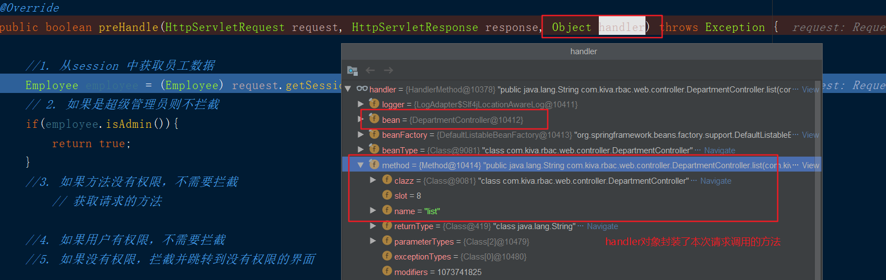
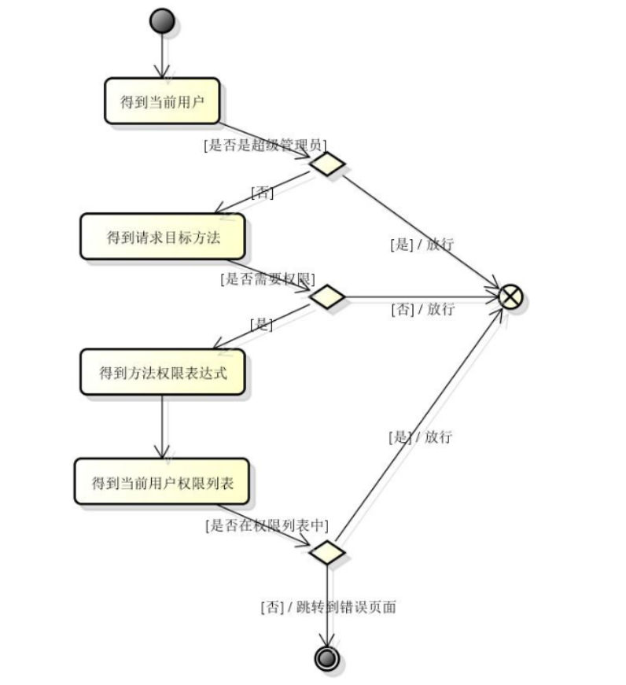

## 登陆拦截&权限拦截

---


### 登陆拦截实现
#### 1. 需求分析
##### Controller层 :
1. 接收账号/密码
2. 调用service 执行登陆业务逻辑
   * |-- 失败 ： 共享错误信息，调换到登陆页面
   * |-- 成功：共享当前用户，跳转到主页面

##### Service层:
调用mapper 中方法执行sql
* 返回值为null
    * |-- 失败，抛异常
* 返回值不为空
    * |-- 共享当前用户
    * |-- 共享当前用户的所有权限表达式(登陆时查询，可以多次使用)

mapper:
```
select * from employee
where name=? and password=?
```

### 2. 知识点
* 如何在service(非表现层)中获取session作用域?
> 不能直接使用表现层的api,但是可以间接使用,
可以将表现层的api封装到一个工具中，然后调用工具
的方法来访问表现层的api

```java
//-----在非表现层中获取session对象-----
public static HttpSession getSession(){
    // 需要做类型强转
    ServletRequestAttributes requestAttributes = (ServletRequestAttributes) RequestContextHolder.getRequestAttributes();
    return requestAttributes.getRequest().getSession(true);
}
```

* 在拦截器方法中获取当前请求访问的controller对象的方法
> 拦截器方法参数 handler对象封装了获取请求的方法

* 用户-多个角色-多个权限可能会出现权限数据重复,去重的俩种方式:
  * java 代码:set集合
  * sql 代码: distinct

<br>
### 开发步骤

1. 添加登陆静态资源
2. 书写controller login方法
    * |-- 登陆成功，跳转主页面
    * |-- 登陆失败，携带异常信息，返回登陆界面
3. 书写service login方法
    * |-- 调用mapper方法，根据账号密码查询员工数据
    * |-- 查询失败抛出异常,查询对象不为空，直接
    * |-- 在非表示层中获取session，使用 RequestContextHolder 获取
    * |-- 保存employee到session中
    * |-- 查询员工的权限数据并保存到session中(一次登陆保存所有的权限，在每次权限拦截的时候方便获取)
4. 编写登陆拦截器
5. 注销操作,销毁session,回到登陆页面

<br>
---
##### controller 代码示例
```java
  @RequestMapping("/login")
   public String login(String name, String password, Model model){
       try{
           employeeService.login(name,password);
           // 登陆成功跳转主页面
           return "redirect:/department/list";
       }catch (Exception e){
           e.printStackTrace();
           //登陆失败携带错误信息，跳转登陆页面
           model.addAttribute("errorMsg",e.getMessage());
           return "forward:/login.jsp";
       }
   }
```


<br>
##### service 中的login 代码示例:
```java
public void login(String name,String password){
  // 根据账号和密码查询数据
  Employee currentEmp=mapper.selectByNameAndPassword(name,password);
  if(currentEmp==null){
    //失败
    throw new LogicException("账号或密码失败");
  }
  //成功
  // 保存用户信息
    // 在非表现层中获取session对象,保存employee 员工信息
  UserContext.setEmployeeSession(employee);

  //共享当前用户拥有的权限表达式
  // 查询当前用户的权限表达式 需要关联三张表
 // 查询用户权限数据--> 用户id -[用户-角色表]--[角色-权限关系表]--权限
  List<String> expression=permissionMapper.selectExpressionsByEmpId(currentEmp.getId());
  UserContext.setExpressionList(expressions);
}


/**
  自定义的业务逻辑异常
*/
class LogicException extends RunTimeException{
  // 复写构造器
}
```
<br>
##### mapper.xml sql 语句代码示例
```sql
<!-- 根据账号和密码查询数据  -->
<select id="selectByNameAndPassword">
  select * from employee
  where name=#{name} AND password=#{password}
</select>

<!--根据员工id查询权限表达式： 需要加 distinct 去重处理 -->
<select id="selectExpressionByEmployeeId" resultType="java.lang.String">
    select distinct p.expression
    from permission p
         left join role_permission rp on p.id = rp.permission_id
         left join employee_role er on rp.role_id = er.role_id
    where er.employee_id = #{id}
</select>
```


#### 注销操作
```java
class Logout{
  @RequestMapping("/logout")
  public String login(HttpSession session){
    //销毁session数据
    session.invalite();
    return "redirect:/login.jsp";
  }
}
```
#### 登陆拦截器
```java
public class CheckLoginInterceptor extends HandlerInterceptorAdapter {
  Object currentEmp=request.getSession().getAttribute("EMPLOYEE_IN_SESSION");
  if(currentEmp==null){//不存在，返回登陆页面
    responce.sendRedirect("/login.jsp");
    return false;
  }
  return true; //放行
}

-----------注册拦截器----------
<!--登陆拦截器-->
<mvc:interceptor>
	<mvc:mapping path="/**"/>
	<mvc:exclude-mapping path="/login"/>
	<mvc:exclude-mapping path="/login.jsp"/>
	<mvc:exclude-mapping path="/css/*"/>
	<mvc:exclude-mapping path="/js/*"/>
	<bean class="com.kiva.rbac.web.interceptor.LoginInterceptor"/>
</mvc:interceptor>


--------- *.do 和 / 的区别 ----------
* .do:不会拦截静态资源
/ : 拦截器会拦截静态资源 css/js/jsp，如果用户没有登陆,访问静态资源会出现死循环
```

<br>
---
### 权限拦截器

需求分析:
1. 如果当前用户是超级管理员，放行
2. 如果当前访问的方法不需要权限，放行
    * |-- handler对象获取用户当前访问的方法对象
    * |-- 判断当前方法上是否有贴RequiredPermission注解
3. 如果当前用户有访问当前方法的权限,放行
    * |-- 获取当前用户拥有的所有的权限表达式
    * |-- 判断用户权限表达式是否包含当前方法的表达式
4. 其他情况拦截，跳转到没有权限的界面


SecurityInterceptor拦截器
```java
public class PermissionInterceptor extends HandlerInterceptorAdapter {
    // handler 真实类型可以获取方法
@Override
public boolean preHandle(HttpServletRequest request, HttpServletResponse response, Object handler) throws Exception {

        //如果当前用户是超级管理员，放行
  Employee currentEmp=request.getSession().getAttribute("EMPLOYEE_IN_SESSION");
        if(currentEmp.isAdmin()){
          return true;
        }

        //如果当前访问的方法不需要权限，放行
          //获取用户当前访问的方法对象
          HandlerMethod hm=(HandlerMethod)handler;
          Method method=hm.getMethod();
          // 判断当前方法上是否有贴RequiredPermission
          if(!method.isAnnotationPresent(RequiredPermission.class)){
            return true;
          }

          //如果当前用户有访问当前方法的权限,放行
          RequiredPermission requiredPermission=method.getAnnotation(RequiredPermission.class);

          String expression=requiredPermission.value()[1];

          //获取当前拥有的所有的权限表达式
List<String> expressions=request.getSession().getAttribute("EXPRESSION_IN_SESSION");
          if(expressions.contaions(expression)){
              return true;
          }

          //拦截
          resp.getRequestDispatcher("/WEB-INF/views/common/nopermission.jsp")
          .forward(req,resp);
          return false;
    }

}

```

<br>
---
#### 代码优化
1. 抽取一个baseBean通用的实体类，将domain 相同的都id抽取出来,实体类集成baseBean
2. 抽取一个UserContext的工具类封装
3. 将session使用常量封装到SessionConstant常量类中

```java
public class UserContext{

  // 获取session
  public static HttpSession getSession(){
    ServletRequestAttributes requestAttributes = (ServletRequestAttributes) RequestContextHolder.getRequestAttributes();
      return requestAttributes.getRequest().getSession(true);
  }

  //共享当前用户
  public static void setCurrentEmp(Employee currentEmp){
    getSession().setAttribute(SessionConstant.EMPLOYEE_IN_SESSION,employee);
  }

  //获取当前用户
  public static Employee getCurrentEmp(){
    return (Employee) getSession().getAttribute(SessionConstant.EMPLOYEE_IN_SESSION);
  }

  //共享当前用户的权限表达式
  public static void setExpressionList(List<String> expressions){
     getSession().setAttribute(SessionConstant.EXPRESSION_IN_SESSION,expressions);
  }

  //获取当前用户的权限表达式
  //从session中获取员工数据
 public static List<String> getExpressionList(){
     return (List<String>) getSession().getAttribute(SessionConstant.EXPRESSION_IN_SESSION);
 }

}
```
session 数据常量类
```java
public class SessionConstant {
    /***
     *  保存登陆的员工数据
     */
    public static final String EMPLOYEE_IN_SESSION = "EMPLOYEE_IN_SESSION";
    /**
     * 保存权限表达式
     */
    public static final String EXPRESSION_IN_SESSION = "EXPRESSION_IN_SESSION";
}

```

权限拦截分析

