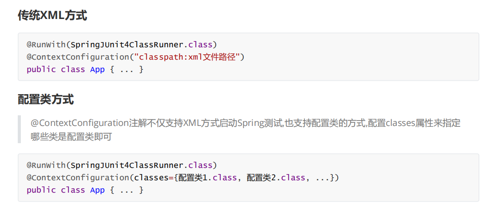
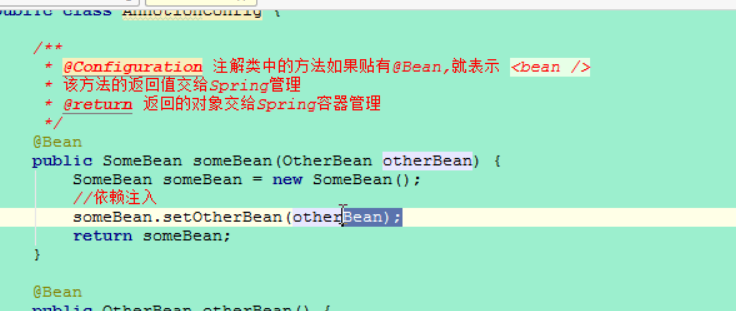
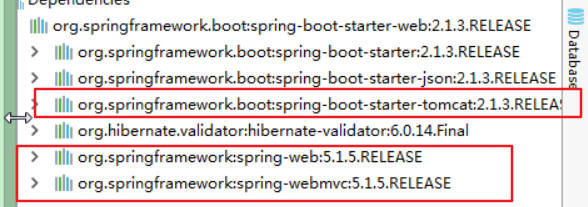
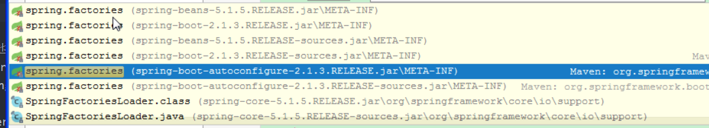

## Springboot
> 简化Spring应用开发的一个框架；
整个Spring技术栈的一个大整合；
J2EE开发的一站式解决方案；


## AnnotationConfig
* Spring的JavaConfig也叫做Annotataion配置
* 从Spring 3起，JavaConfig功能已经包含在Spring核心模块，它允许开发者将bean的定义和Spring的配置编写到到Java类
* javaConfig 使用约定大于配置的思想,替换xml来管理bean 和 配置spring


<br>
---

## 搭建spring javaconfig 项目
1. 添加依赖
  |- spring 相关依赖
  |- lomkom 插件
  |- junit 依赖

2. 创建domain 类

```java
@Setter@Getter@ToString
@Component
public class SomeBean {

    private OtherBean otherBean;

    public SomeBean() {System.out.println("SomeBean被创建");}

    public void init() {System.out.println("SomeBean被初始化");}

    public void destroy() {System.out.println("SomeBean被销毁");}

}

@Setter@Getter@ToString
public class OtherBean {
    public OtherBean() {System.out.println("OtherBean被创建");}
}
```


<br>
---

## AnnotationConfig 方式配置IoC

* @Configuration : 在类上贴注解表示该类取代applicationContext 配置<br>
* @Bean : 在Spring的配置类的方法上贴该注解表示该方法的返回的对象交给Spring容器管理,替代applicationContext.xml中的bean标签<br>
* @ComponentScan : 配置注解扫描,默认值是当前配置类所在的包
AnnotationConfigApplicationContext: 该类是ApplicationContext接口的实现类,该对象是基于AnnotationConfig的方式来运作的Spring容器 <br>

```java
// Configuration : 贴在哪个类，这个类就是spring配置文件
@Configuration
@ComponentScan("basepackage")
public class AnnotationConfig{
    // 注解类中的方法贴有bean ,表示<bean>
    // 方法返回对象交给sprging管理
    @Bean
    public SomeBean SomeBean(){
      return new SomeBean();
    }
}
```

```java
class App{
    @Test
    public void test01(){
        //创建spring容器,加载配置类
        ApplicationContext ctx=new AnnotationConfigApplicationContext(AnnocationConfig.class);
        //从容器中获取对象
        SomeBean bean = ctx.getBean(SomeBean.class);
        System.out.println(bean);
    }
}
```
* 使用ComponentScan组件扫描时，
   * 在配置类上添加ComponentScan注解,指定扫描包路径；
   * 在扫描包下的类需要添加 @Component @Controller @Service 等注解声明对象

```java
//在配置类中开启组件扫描器,指定扫描路径
@Configuration
@ComponentScan("com.kiva.annocation.common")
public class ScanConfig {

}

-----在bean 类上添加 @Compoment------
@Component
public class SomeBean {
  ...
}
```

<br>
---


## SpringTest方式加载配置类





```java
@RunWith(SpringJUnit4ClassRunner.class)
@ContextConfiguration(classes = {AnnocationConfig.class})
public class TestConfig {
    @Autowired
    SomeBean someBean;

    @Test
    public void test02(){
        //获取
        System.out.println(someBean);
    }
}
```


AnnotationConfig配置子DI


导入xml配置和配置类

Configuration
1. 模拟连接池
2. @P


## SpringBoot 入门的WEB 案例
SpringBoot : 一键启动spring

1. 引入依赖
    |-- 继承springboot-parent
    |-- 依赖 spring-boot
2. 打包方式是 jar 包
3. 创建一个helloController

```java
@Controller
@SpringBootApplication
public class HelloController{

}
```

相关问题:
1. 为什么打包方式使用jar包，不是war包

对于SpringBoot项目来说无论是普通应用还是web应用,其打包方式都是jar即可,当然web应用也能打war包,但是需要额外添加许多插件来运行,比较麻烦

2. 父项目spring-boot-starter-parent帮我们管理和导入了许多的基础依赖
  |-- 使用时在子项目引入依赖即可
  |--- 定义了department-manager,plugn-manager
3. spring-boot-starter-web集成了运行网站应用的相关环境和工具,包括:SpringMVC / Tomcat / Jackson 等等

  |-- tomcat embed: apache 为springboot 做的嵌入式tomcat
  |-- tomcat服务器以嵌入式的方式嵌入到程序中, 都是以java
  |-- 微服务开发不需要jsp等视图jar包,只需要提供json数据给前端即可
4.  spring-boot-starter-web依赖中嵌入的Tomcat9服务器,默认端口8080

5. SpringBootApplication: 集成了以前所有的spring中配置信息
  * @SpringBootApplication注解内部是3大注解功能的集成
  * @ComponentScan: 开启组件扫描
  * @SpringBootConfiguration: 作用等同于@Configuration注解,也是用于标记配置类
  * @EnableAutoConfiguration: 内部导入AutoConfigurationImportSelector,该类中有个
getCandidateConfigurations方法,加载jar包中META-INF/spring.factories文件中配置的配置对象,自动配置定义的功能,包括: AOP / PropertyPlaceholder / FreeMarker / HttpMessageConverter(做了mvc:annotation配置) / Jackson /
DataSource / DataSourceTransactionManager / DispatcherServlet / WebMvc 等等配置类


6.  SpringApplication.run(..)的作用
启动SpringBoot应用
加载自定义的配置类,完成自动配置功能
把当前项目配置到嵌入的Tomcat服务器
启动嵌入的Tomcat服务器


## Spring boot 项目的独立运行
spring 不能直接打包,需要添加springboot打包插件
  |-- 使用命令java -jar xx.jar 运行jar包
  |-- jar 包 : springboot项目,包含jar包和字节码
  |-- original包: 只包含字节码


## Spring Boot 参数配置

1. 命令行启动项目时传入的参数, 如: java -jar xxx.jar --server.port=80
2. ServletConfig和ServletContext
3. 操作系统环境变量
4. application-{profile}.properties或者YAML文件

YAML:
  |-- 创建 application.yml
```java
server:
  port: 80
```
## application.properties 优先级
1. 在项目根目录下/config/application.properties

## 属性绑定
场景: 自定义连接池的连接参数

1. 在application.properties
```
jdbc.username=root
jdbc.password=root
```
2. 创建一个MyDataSource

ConfigurationProperties("jdbc")
  |-- 拿到所有属性前缀以jdbc开头的属性
  |-- 并且剩余部分和该对象的属性一致，就会自当注入
  |-- jdbc.username-->该对象的username属性

Spring boot
  |-- SpringBootApplication
      |-- 配置对象
      |-- 组件扫描
      |-- 自动配置
