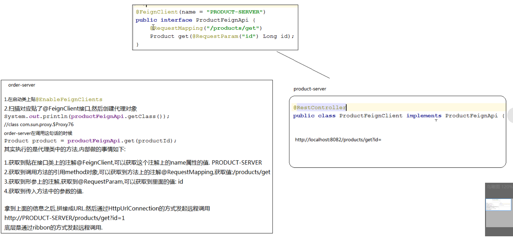
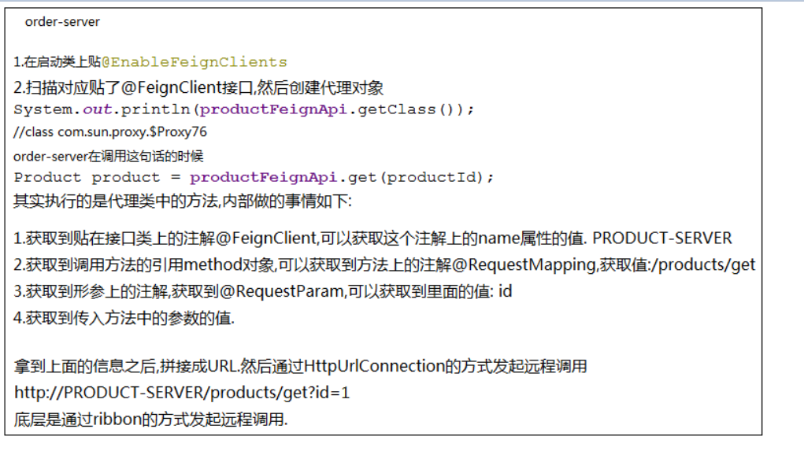

### 微服务调用方式 Feignc

使用RestTemplate实现远程调用不方便，Feignc 封装了Region的相关操作，更容易使用

步骤:
1. 需要添加springCloud 可选依赖
2. 导入openfeign依赖
3. api 创建一个接口ProductFeignApi,@FeignClient
4. server 创建一个ProductFeignClient,实现ProductFeignApi接口,同时作为controller类
5. order-server 中启动类中不需要RestTemplate
6. 开启注解扫描器, 需要注意扫描器是扫描当前包下的注解
7. 直接注入ProductFeignApi 对象，调用方法


1. 需要添加springCloud 可选依赖

```xml
<properties>
  ...
   <spring-cloud.version>Greenwich.SR2</spring-cloud.version>
</properties>

<dependencyManagement>
    <dependencies>
        <dependency>
            <groupId>org.springframework.cloud</groupId>
            <artifactId>spring-cloud-dependencies</artifactId>
            <version>${spring-cloud.version}</version>
            <type>pom</type>
            <scope>import</scope>
        </dependency>
    </dependencies>
</dependencyManagement>
```

2. 导入openfeign依赖

```xml
<dependency>
	<groupId>org.springframework.cloud</groupId>
	<artifactId>spring-cloud-starter-openfeign</artifactId>
</dependency>
```

3. api 创建一个接口ProductFeignApi
@RequestParam("id"): 其中id是指定参数的名字

```java
@FeignClient(name = "PRODUCT-SERVER")  // 服务名称
public interface ProductFeignApi {

    @RequestMapping("/product/get")   // 映射路径
    Product getById(@RequestParam("id") long id);

}
```


4. server 创建一个ProductFeignClient,实现ProductFeignApi接口,同时作为controller类

```java
@RestController
class ProductFeignClient implement ProductFeignApi{
  ...
}
```

5. order-server 中启动类中不需要RestTemplate
6. 开启注解扫描器 @EnableFeignClients , 需要注意扫描器是扫描当前包下的注解

```java
@SpringBootApplication
@EnableFeignClients
public class OrderServerApplication {
    public static void main(String[] args) {
        SpringApplication.run(OrderServerApplication.class, args);
    }
  /*  @Bean
    @LoadBalanced
    public RestTemplate getRestTemplate(){
        return new RestTemplate();
    }*/
}
```


7. 直接注入ProductFeignApi 对象，调用方法


```java
@Service
public class OrderService {

//    @Autowired
//    RestTemplate restTemplate;

    @Autowired
    ProductFeignApi productFeignApi;

    public Order save(Long productId, Long userId){
      ...
        product=productFeignApi.getById(productId);
      ...
    }
}
```


### 实现原理




