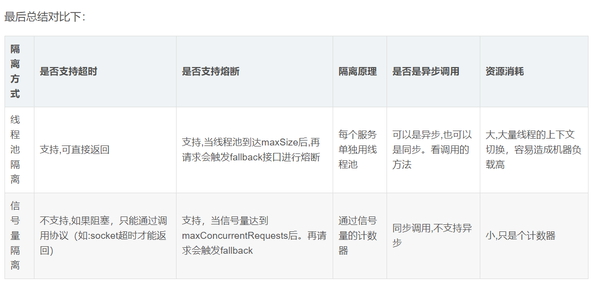

### 熔断隔离策略
参考网站 ： https://github.com/Netflix/Hystrix/wiki/How-it-Works
https://www.jianshu.com/p/df1525d58c20
https://blog.csdn.net/javaer_lee/article/details/87942816
https://www.jianshu.com/p/dc0410558fc9

隔离策略 : 实现不同服务的限流
1. 线程池
  * 为每一个服务分配一个线程池，从线程池中分配一个线程处理每一个请求, 如果请求数超出线程池的maxsize，再请求会再触发fallback接口再进行熔断,用于处理耗时操作，线程之间不会相互影响
  * 服务返回比较耗时使用,线程上下文切换
2. 信号量
  * 在单个线程中处理请求，每接收一个请求，信号量+1,当请求数大于最大请求数时，不再处理请求;
  * 服务响应很快的建议使用信号量.比如访问的缓存服务等.

#### 修改配置
 HystrixCommandProperties中,有一个execution.isolation.strategy,可以进行修改

如果要使用信号量模式，需要配置参数execution.isolation.strategy = ExecutionIsolationStrategy.SEMAPHORE

