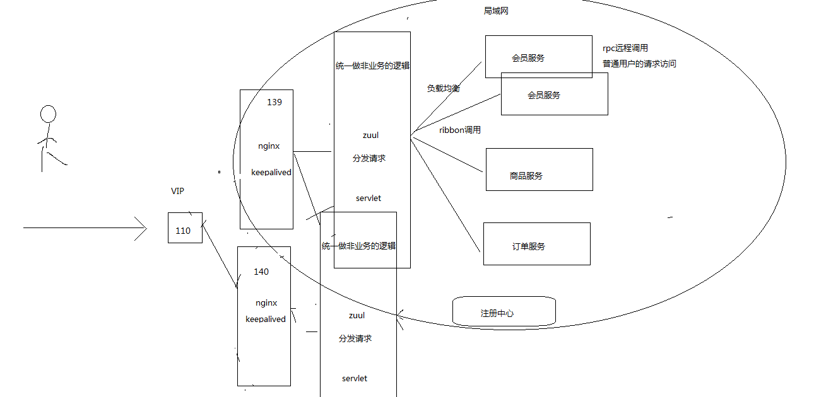
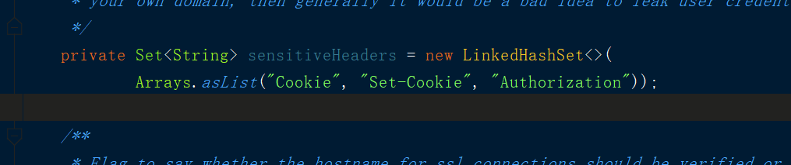

## 微服务网关Zuul

Zuul网关是系统的唯一对外的入口，介于客户端和服务器端之间的中间层，处理非业务功能 提供路由请求、鉴权、监控、缓存、限流等功能

#### zuul 作用
1.验证与安全保障: 识别面向各类资源的验证要求并拒绝那些与要求不符的请求。

2.审查与监控: 在边缘位置追踪有意义数据及统计结果，从而为我们带来准确的生产状态结论。

3.动态路由: 以动态方式根据需要将请求路由至不同后端集群处。

4.压力测试: 逐渐增加指向集群的负载流量，从而计算性能水平。

5.负载分配: 为每一种负载类型分配对应容量，并弃用超出限定值的请求。

6.静态响应处理: 在边缘位置直接建立部分响应，从而避免其流入内部集群。

7.多区域弹性: 跨越AWS区域进行请求路由，旨在实现ELB使用多样化并保证边缘位置与使用者尽可能接近。


#### zuul简介：
1. 可以统一做非业务逻辑
2. 做负载均衡
3. zuul 网管也需要注册中心
4. 可以做网络隔离
    |-- 服务都在局域网中,zuul 网关提供外网访问
5. zuul 时servelt 实现，性能不好，需要使用集群和nginx



### 网关项目zuul-server搭建
步骤:
1. 使用Spring Initializr创建SpringBoot项目，选择Cloud Discover->Eureka Discover , Cloud Rounting -> Zuul
2. 添加application.yml配置文件并添加相关的配置信息.
3. 在启动类上贴上@EnableZuulProxy注解
4. 访问 ：
localhost:9000/product-server/product/get?id=1

application.yml 相关配置
```yml
server:
  port: 9000
spring:
  application:
    name: zuul-server
eureka:
  client:
    serviceUrl:
      defaultZone: http://localhost:8761/eureka/
```


### 自定义路由规则
routes :定义多个规则
order-server-route : 规则的名字，不重复即可
path : 重新配置的服务名
serviceId : 配置相关的服务
ignoredPatterns : 忽略以前的配置

访问 ：
localhost:9000/product/product/get?id=1

```yml
zuul:
  ignoredPatterns: /*-server/**
  routes:
    order-server-route:
      path: /order/**
      serviceId: order-server
    product-server-route:
      path: /product/**
      serviceId: product-server
```


### Cookie请求头的问题
1. 在save方法中,通过请求头获取token 和 cookie
2. 获取到的cookie是null,原因是网关默认过滤cookie
3. 修改不过滤cookie
  *  ZuulProperties--> 有一个senstiveHeaders包含了需要过滤的信息



默认情况，网关会把Cookie", "Set-Cookie", "Authorization"这三个请求头过滤掉，下游的服务是获取不到这几个请求头的。
如果不需要过滤这个请求头，可以修改过滤的集合的值.
下面这个属性直接设置：
```yml
zuul:
  sensitive-headers:   # 配置不要过滤cookie请求头
```


### zuul流程分析
参考网站 : https://github.com/Netflix/zuul/wiki/How-it-Works

zuul 实现底层是一个ZuulServlet
ZuulServlet
    |-- 先执行pre --> rounting  --> post
            |-- 出错时 ---> error -->post


### 自定义Zuul过滤器实现登录鉴权
#### 方法解析:
* filterType  :  指定拦截器的类型
* filterOrder : 如果是同类型的过滤器，执行的顺序，数值越小越先执行
* shouldFilter : 需要符合条件才进行拦截,返回true 需要拦截(会执行run方法)，返回false放弃拦截(不会执行run方法)
* run :具体需要执行的业务逻辑

步骤:
1.  继承ZuulFilter实现相关方法
2.  定义
  * filterType=PRE_TYPE
  * filterOrder=1
  * shouldFilter : 只拦截订单模块，订单模块才返回true,只拦截order订单模块
  * run :
      1. 如果token=123 返回null,不做任何拦截
      2. token !=123
        |-- sendZuulResponse(false);// 不再去往后调用远程服务去返回结果
        |-- setResponseStatusCode(401); // 设置没有通过权限认证的状态码
3. 需要交给Spring 管理

相关代码如下:

```java
@Component
public class AuthorZuulFilter extends ZuulFilter {

    @Override
    public String filterType() {
        // 定义过滤器的类型
        return PRE_TYPE;
    }

    @Override
    public int filterOrder() {
        // 在相同拦截类型下的执行顺序，数值越小越先执行
        return 1;
    }

    @Override
    public boolean shouldFilter() {
        //拦截过滤的条件，返回true拦截(调用run方法) ，返回false不拦截(不调用run方法)
        // 这里只对订单模块进行拦截
        RequestContext currentContext = RequestContext.getCurrentContext();
        HttpServletRequest request = currentContext.getRequest();
        if(request.getRequestURI().indexOf("/order")>=0){// 如果是订单模块,才拦截
            return true;
        }
        return false;
    }

    @Override
    public Object run() throws ZuulException {
        // 拦截业务的执行方法
        // 有携带token的才放行，否则不去调用远程服务的方法,响应401状态码
        RequestContext currentContext = RequestContext.getCurrentContext();
        HttpServletRequest request = currentContext.getRequest();
        String token = request.getHeader("token");
        if(!StringUtils.isEmpty(token)&&"123".equals(token)){ // 不做处理
            System.out.println("----token --------"+token);
            return null;
        }
        currentContext.setSendZuulResponse(false);// 不调用远程服务
        currentContext.setResponseStatusCode(HttpStatus.UNAUTHORIZED.value());
        return null;
    }
}

```
