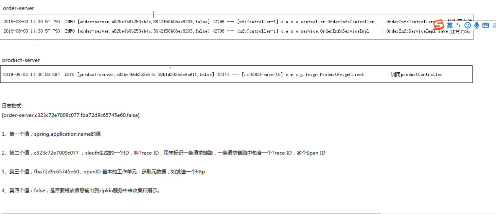
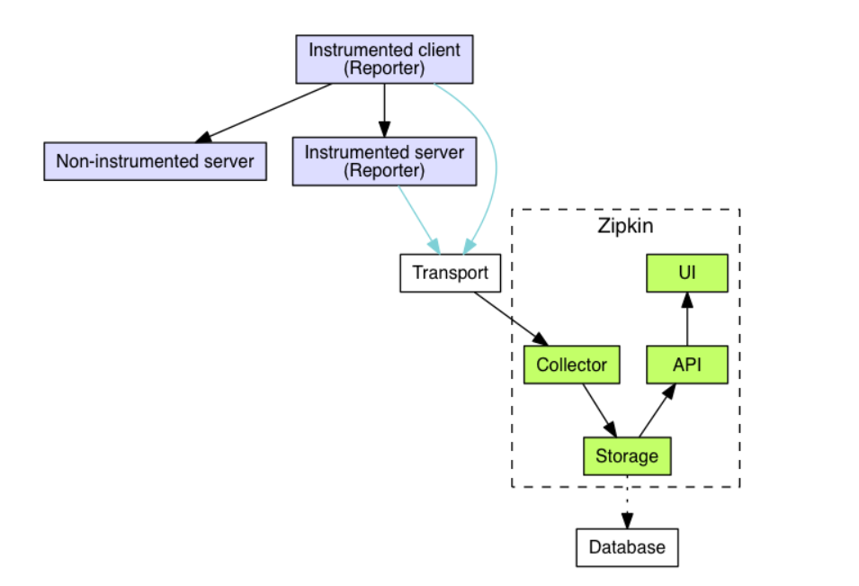
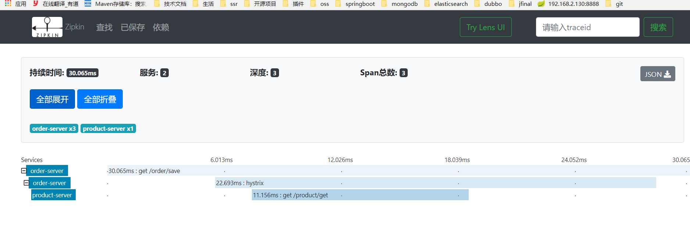
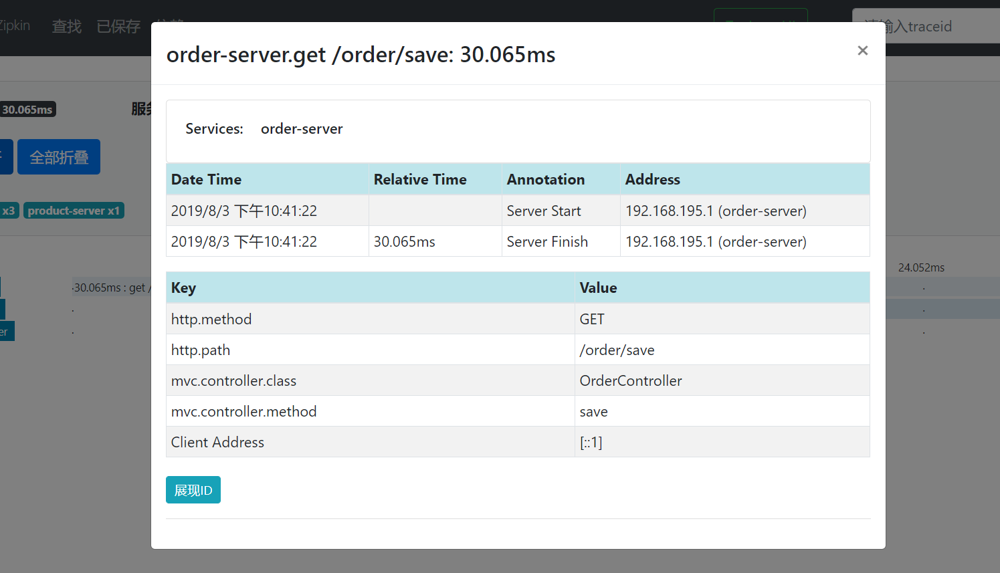

## 链路追踪组件

#### 为什么需要链路追踪组件
微服务架构中，必须实现分布式链路追踪，去跟进一个请求到底有哪些服务参与，参与的顺序又是怎样的，从而达到每个请求的步骤清晰可见，出了问题，很快定位。

在微服务系统中，一个来自用户的请求，请求先达到前端A（如前端界面），然后通过远程调用，达到系统的中间件B、C（如负载均衡、网关等），最后达到后端服务D、E，后端经过一系列的业务逻辑计算最后将数据返回给用户。
对于这样一个请求，经历了这么多个服务，怎么样将它的请求过程的数据记录下来呢？这就需要用到服务链路追踪。


* 多个微服务都需要记录日志
  *  一次请求到多个服务器，使用标记当前请求在不同服务器上的日志
  *  可以根据标识定位在其他日志文件中的报错信息

#### 什么是埋点
所谓埋点就是在应用中特定的流程收集一些信息，用来跟踪应用使用的状况，后续用来进一步优化产品或是提供运营的数据支撑，包括访问数（Visits），访客数（Visitor），停留时长（Time On Site），页面浏览数（Page Views）和跳出率（Bounce Rate）。这样的信息收集可以大致分为两种：页面统计（track this virtual page view），统计操作行为（track this button by an event）。

### 集成链路追踪组件Sleuth
Sleuth是一个专门用于记录链路数据的开源组件
https://cloud.spring.io/spring-cloud-static/Greenwich.SR1/single/spring-cloud.html#sleuth-adding-project

方式一:创建log 对象
```java
Logger log=LoggerFactory.getLogger(OrderInfoController.class);
try{
  log.info("hello");
  log.debug("hello");
}catch(){
  log.error(e.getMessage);
}
```

方式二:直接在类上添加 @Slf4j 注解


步骤:
1. 在product-server和order-server中添加sleuth依赖
2. 在需要写日志的类上贴@Slf4j,然后再order-server,product-server中打印日志。

```xml
<dependency>
    <groupId>org.springframework.cloud</groupId>
    <artifactId>spring-cloud-starter-sleuth</artifactId>
</dependency>
```


### 日志格式分析
参数1 ： 服务的名字
参数2 ： 全局唯一ip
参数3 ： 同一个服务下的标志ip
参数4 ： false 是否将该信息输出到zipkin 服务收集和展示



### 什么是zipkin
zipkin是Twitter基于google的分布式监控系统Dapper（论文）的开发源实现，zipkin用于跟踪分布式服务之间的应用数据链路，分析处理延时，帮助我们改进系统的性能和定位故障。

官网:https://zipkin.io/

#### 跟踪操作流程

对程序中的日志记录存储到数据库或es，zh转换成api,形成可视化界面进行展示


#### ZipKin + Sleuth 整合

1. 使用jar 包形式运行zipkin,访问 http://localhost:9411/zipkin/
2. 在微服务项目中添加zipkin依赖(zipkin依赖中已经包含sleuth,所以可以把之前的sleuth依赖删除)
3. 在yml文件配置zipkin 的地址
4. zipkin 只收集10% 的日志数据,可通过配置进行修改日志记录比例


```xml
<!-- zipkin 依赖  -->
<dependency>
	<groupId>org.springframework.cloud</groupId>
	<artifactId>spring-cloud-starter-zipkin</artifactId>
</dependency>
```

```yml
spring:
  zipkin:
    base-url: http://localhost:9411   # zipkin 的地址
  sleuth:
    sampler:
      probability: 1  # 修改记录 10% 的日志
```

访问结果:




