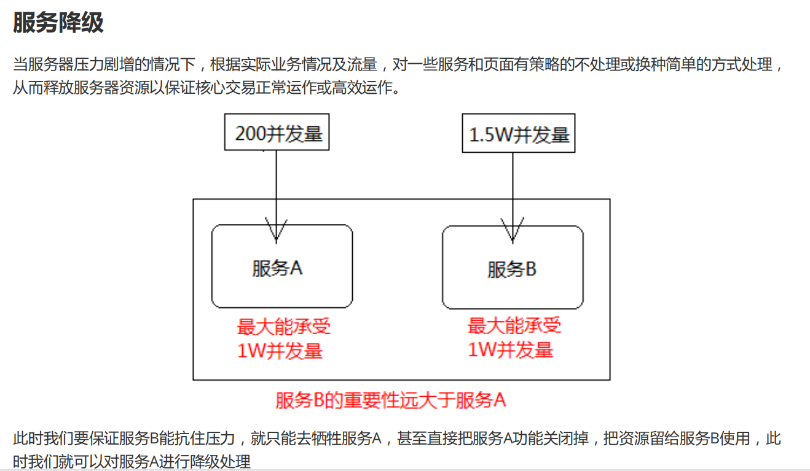

### 服务熔断与降级Hystrix

熔断 : 类似保险丝. 防止整个系统故障，保护自己和下游服务
降级 : 抛弃非核心业务，保障核心页面的正常运行.

#### 雪崩产生的原因:
商品详情展示服务会依赖商品服务， 价格服务，商品评论服务，调用三个依赖服务会共享商品详情服务的线程池，如果其中的商品评论服务不可用（超时，代码异常等等）, 就会出现线程池里所有线程都因等待响应而被阻塞, 从而造成服务雪崩。

概括：大量请求线程同步等待造成的资源耗尽

#### 服务雪崩解决方案

1. 如果一个服务挂了，会导致一直等待，直到服务器资源耗尽，需要设置超时机制
2. 如果非核心业务出现报错，引入降级，返回null，不影响其他业务的正常显示,牺牲非核心业务的资源给核心业务
3. 如果调用服务多次失败时，使用熔断不再调用服务
4. 如果所有的请求都去访问一个服务，会导致资源被一个服务占用，使用限流，将100个资源分配给多个服务，可以避免资源被某个服务占用

* 超时机制
如果我们加入超时机制，例如2s，那么超过2s就会直接返回了，那么这样就在一定程度上可以抑制消费者资源耗尽的问题

* 服务限流
通过线程池+队列的方式或者通过信号量的方式。比如商品评论比较慢，最大能同时处理10个线程，队列待处理5个，那么如果同时20个线程到达的话，其中就有5个线程被限流了，其中10个先被执行，另外5个在队列中

* 服务熔断
当依赖的服务有大量超时时，在让新的请求去访问根本没有意义，只会无畏的消耗现有资源，比如我们设置了超时时间为1s，如果短时间内有大量请求在1s内都得不到响应，就意味着这个服务出现了异常，此时就没有必要再让其他的请求去访问这个服务了，这个时候就应该使用熔断器避免资源浪费

* 服务降级
有服务熔断，必然要有服务降级。
所谓降级，就是当某个服务熔断之后，服务将不再被调用，此时客户端可以自己准备一个本地的fallback（回退）回调，返回一个缺省值。 例如：(备用接口/缓存/mock数据)，这样做，虽然服务水平下降，但好歹可用，比直接挂掉要强，当然这也要看适合的业务场景
