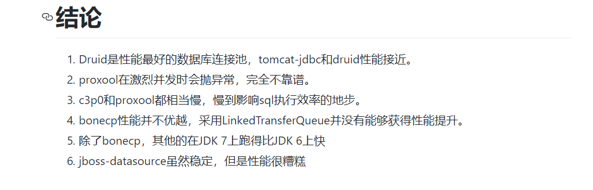

## 事务&获取主键&连接池

---

#### 事务操作
事务: 将多个操作作为一个整体包装成一个事务，所有操作都成功，事务提交；
如果有一个没执行完成，事务回滚
1. 开启事务
2. 提交事务
3. 回滚

#### 事务的特性

|1. 原子性:事务包裹的操作是最小不可分割，要么同时成功要么同时失败
|--
|2. 一致性:数据在提交之前和提交之后数据总量不应发生变化,事务前后的数据的完整性必须保持一致
|3. 隔离性:多个事务在并发发生时会出现的问题,脏读，不可重复读等 ,事务的隔离性是指多个用户并发访问数据库时，一个用户的事务不能被其他用户的事务所干扰，多个并发事务之间数据要互相隔离
|4. 持久性:保证事务提交之后的操作的数据必须保存到存储设备中,事务一旦提交后，它对数据库中的数据的改变是永久性的，接下来即使数据库发生故障也不应该对其有任何影响


#### 事务操作模板
```
try{
  1. 开启事务,设置手动提交
  conn.setAutoCommit(false);
  操作...
  2. 提交事务
  conn.commit();
}catch(Exception e){
  3. 回滚事务
  conn.rollback();
}finally{
  关闭资源
}
```

#### 事务相关细节
1. 默认情况下，事务自动提交，需要控制事务时，需要设置手动提交
2. 查询操作不需要事务
3. 没有提交事务的情况下，数据不会发生变化
4. 在mysql中只有InnoDB存储引擎支持事务
5. 事务操作在service中

#### 转账事务代码

```
@Test
	public void testTran02(){

		String fromAccount="decade";
		String toAccount="kiva";
		double money=100d;

		Connection conn=JDBCUtil.getConnection();

		String sql="select * from account where name=? and money>?";
		String sql01="update account set money=money-? where name=?";
		String sql02="update account set money=money+? where name=?";

		PreparedStatement ps=null;
		PreparedStatement ps01=null;
		PreparedStatement ps02=null;

		try {
			conn.setAutoCommit(false);  //-----------> 手动操作事务

			ps=conn.prepareStatement(sql);
			ps.setObject(1, fromAccount);
			ps.setObject(2, money);
			ResultSet set=ps.executeQuery();
			if(!set.next()){
				System.out.println("余额不足");
				return;
			}

			ps01=conn.prepareStatement(sql01);
			ps01.setObject(1, money);
			ps01.setObject(2, fromAccount);
			ps01.executeUpdate();

//			int num=1/0;

			ps02=conn.prepareStatement(sql02);
			ps02.setObject(1, money);
			ps02.setObject(2, toAccount);
			ps02.executeUpdate();

			conn.commit(); //------------->提交事务
		} catch (SQLException e) {
			e.printStackTrace();
			try {
				if(conn!=null){
					conn.rollback();  //------------>回滚事务
				}
			} catch (SQLException e1) {
				e1.printStackTrace();
			}
		}finally{
			JDBCUtil.close(null, ps01, conn);
			try {
				if(ps02!=null){
					ps02.close();
				}
			} catch (SQLException e) {
				e.printStackTrace();
			}
		}

	}
```
---

#### 获取自动生成的主键
在开发中不需要我们维护主键，在保存数据生成主键id时，需要再次使用到对应的id,此时需要获取主键id

场景:
1. 注册用户后，需要获取id,后根据id 更新信息

步骤:
```
1. 获取主键需要设置一个标记
    Statement.NO_GENERATED_KEYS
    Statement.RETURN_GENERATED_KEYS
    prepareStatement(sql,autoGeneratedKeys);
2.获取主键
    ResultSet rSet=ps.getGeneratedKeys();
```


示例代码:
```

	/**
	 * 测试获取主键方法
	 */
	@Test
	public void testKey(){
		String sql="insert into student values(null,?,?)";
		Connection conn =null;
		PreparedStatement ps=null;
		ResultSet set=null;
		try {
			conn = JDBCUtil.getConnection();
			//设置需要返回主键的标志
			ps = conn.prepareStatement(sql, Statement.RETURN_GENERATED_KEYS);
			ps.setObject(1, "莫邪");
			ps.setObject(2, 18);

			ps.executeUpdate();

			//获取主键
			set=ps.getGeneratedKeys();
			if(set.next()){
				Object id=set.getObject(1);//获取第一列就是主键
				System.out.println(id);
			}
		} catch (SQLException e) {
			e.printStackTrace();
		}finally{
			JDBCUtil.close(set, ps, conn);
		}
	}
```

---
##### 为什么使用连接池
* 池化技术:把数据装到一个容器中,可以作为一个缓存
* 使用普通jdbc数据库连接每次请求都要向数据库请求连接，
创建数据库连接对象需要消耗大量时间和资源，没有达到重复利用
* 使用连接池达到重复利用连接池对象

##### 连接池概述
* 用池来管理Connection，这样可以重复使用Connection
* 接口DataSource由驱动程序供应商实现
* 常用的DataSource实现
    * C3P0:Hibernate框架推荐的(不再更新使用)
    * DBCP:Spring框架推荐
    * druid:阿里巴巴推荐

##### 连接池对象的获取
|没有使用连接池|使用连接池
:---:|:---:|:---:|
获取数据库连接对象|DriverManager.getConnection()|dataSource对象.getConnection();
释放资源|conn.close();断开连接|conn.close();将连接归还给连接池

---

##### --DBCP的使用---

###### 1. 导包

```
下载:
http://commons.apache.org/proper/commons-dbcp/download_dbcp.cgi
commons-dbcp2-2.1.1.jar
commons-pool2-2.4.2.jar
commons-logging-1.2.jar
```

###### 2. 获取连接

###### 方式一(使用代码设置参数):

```
public static DataSource getDataSource() {
        BasicDataSource ds = new BasicDataSource();
        ds.setDriverClassName("com.mysql.jdbc.Driver");
        ds.setUrl("jdbc:mysql:///javaweb");
        ds.setUsername("root");
        ds.setPassword("root");
        return ds;
}

public static Connection getConnection(){
  return getDataSource().getConnection();
}

```
###### 方式二(使用配置文件):

```

//连接池--->线程安全
private static DataSource ds;

//只需要创建一个连接池对象
static{
  InputStream in=Thread.currentThread()
      .getContextClassLoader()
      .getResourceAsStream("db.Properties");
  Properties ps=new Properties();
  ps.load(in);
  ds=BasicDataSourceFactory.createDataSource(ps);
}
public static Connection getConnection(){
  return ds.getConnection();
}

-----------db.Properties文件--------(key属性名和DBCP中的key相对应)
dirverClassName=com.mysql.jdbc.Driver
url=jdbc:mysql:///javaweb
username=root
password=root
```

注意:连接池对象只能有一个，线程安全;
Connection对象每个请求都有一个连接对象，不能作为成员变量

---

##### ----Druid 使用---
* github 网址:https://github.com/alibaba/druid/wiki

* Druid 是阿里巴巴研发出来的号称Java语言领域性能最高的连接池.


```
使用:
1. 导包 druid-1.0.26.jar
2. 使用DruidDataSourceFactory 创建数据库连接池对象
```
代码示例:
```
private static DataSource ds;

	/**
	 * 创建数据库连接池
	 */
	static{
		Properties ps=new Properties();
		InputStream in=Thread.currentThread()
				.getContextClassLoader()
				.getResourceAsStream("db.properties");
		try {
			ps.load(in);
			//通过加载配置文件，创建数据库连接池
			ds=DruidDataSourceFactory.createDataSource(ps);
		} catch (Exception e) {
			e.printStackTrace();
		}
	}


	/**
	 * 获取连接对象
	 * @return
	 */
	public static Connection getConnection(){
		try {
			return ds.getConnection();
		} catch (SQLException e) {
			e.printStackTrace();
		}
		return null;
	}
```

#### JDBC 缺陷
```
1. JDBC 重复代码
    解决:DML,DQL:抽取模板方法
2. sql 硬编码问题
    解决:sql写在配置文件中
3. 解析结果集存在硬编码
    解决:抽取模板方法
```

### 总结
```

事务概述:
事务:将多个操作包装在一个事务中，如果每个操作都执行成功，事务提交；如果有一个事务操作失败，事务回滚

事务特性:
原子性:事务是一个不可分割的整体，要么同时成功，要么同时失败
一致性:事务执行前后数据的总量不变
隔离性:多个事务之间的操作是彼此隔离的，一个事务操作的数据不能影响另一个事务
持久性:事务执行完成后的数据都应该保存到数据库中

事务操作:
try{
  1.设置事务手动提交

  操作...

  2. 事务提交
}catch (Exception e) {
  e.printStackTrace();
  3.事务回滚
}

----------获取主键--------------------:
在新增记录后需要获取主键进行下一步操作时，需要获取主键

步骤:
1.设置主键标志
2.获取主键

----------Connection连接池-------
使用jdbc时，会出现每次操作数据库时，创建一个Connection对象，
Connection 获取需要耗费资源和时间，消耗性能
不能实现重复利用

数据库连接池原理:
1. 使用一个容器保存多个连接对象，在需要使用的使用，获取conn对象，执行操作完成后，返回到容器中
2. 实现重复利用connection

---------常用的数据库连接池------
c3p0,DBCP,Druid

--------使用jdbc的缺陷-------
1. DMl 和DQL 代码重复
2. sql 语句硬编码
3. resultset 解析存在硬编码

```
