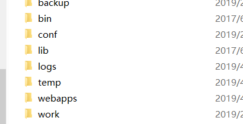

### javaWeb 基础之 Tomcat的配置
---
#### URI 和URL
* URI:统一资源标识符（Uniform Resource Identifier，或URI)是一个用于标识某一互联网资源名称的字符串。包含:主机名,标识符,相对URI.


如:http://java.sun.com:80/j2se/1.3/hello.html
    相对的路径和绝对的路径表示一个资源.

* URL:统一资源定位符是对可以从互联网上得到的资源的位置和访问方法的一种简洁的表示，是互联网上标准资源的地址。
* 互联网上的每个文件都有一个唯一的URL，它包含的信息指出文件的位置以及浏览器应该怎么处理它。


* 在Java中,URI表示一个统一资源的标识符,不能用于定位任何资源,唯一的作用就是解析.
* 而URL则包含一个可以打开到达该资源的输入流,可以简单理解URL是URI的特例.
* 简单理解: URI和URL都表示一个资源路径.

#### 传输层协议
* TCP和UDP的区别:TCP基于连接的协议,UDP基于数据报包的协议.

* TCP ：面向连接(经历三次握手)、传输可靠(保证数据正确性,保证数据顺序)、用于传输大量数据(流模式)、速度慢，建立连接需要开销较多(时间，系统资源)。 服务端和客户端

* UDP：面向非连接,基于数据报包、传输不可靠(丢包[数据丢失])、用于传输少量数据(数据报包模式)、速度快。

---
### C/S 和 B/S 架构
c/s: Clinet/Server 客户端和服务端的架构
b/s:Browser/Server 浏览器和服务器的架构(通过浏览器访问的应用)


c/s:
* 优点:直观，用户体验好，界面美观
* 缺点:每次升级，需要重新安装,不跨平台


b/s:使用浏览器访问
* 优点：可移植性高，开发和维护好
* 缺点: 用户体验不够好，界面不够丰富,安全性较低


---

#### TCP 协议

* 成员和职责:
* 客户端:
    * 往服务端发送数据,然后接收服务端返回的数据
* 服务端:
    * 接收客户端发送的数据,并做出反馈


```
客户端:
步骤:
1:创建一个连接某个服务端的Socket对象
2:从Socket中拿到输出流往服务端发送数据
3:调用Socket对象对象shutdownOutput方法通知服务端数据发送完毕
4:从Socket中拿到输入流获取服务端回馈的数据
5:调用Socket对象对象shutdownInput方法通知服务端数据接收完毕
6:关闭Socket对象
------------------------------
服务端:
步骤:
1:创建一个服务端对象(ServerSocket)
2:侦听客户端的连接
3:获取和客户端通信的Socket对象
4:从Socket获取输入流,接收服务器发送的数据
5:调用Socket对象对象shutdownInput方法通知客户端数据接收完毕
6:从Socket中拿到输出流往客户端发送数据
7:调用Socket对象对象shutdownOutput方法通知客户端数据发送完毕
8:关闭Socket对象
```


#### 服务器
服务器分类:
* 软件服务器: 提供B/s运行环境 的软件
* 硬件服务器: 一台计算机设备安装了软件服务器


##### Tomcat的配置



* bin: 存放tomcat 执行文件和脚本文件
* conf : 存放配置文件
* lib : 存放核心jar包和依赖包
* logs : 存放日志文件
* webapp:管理web项目
* work : 存放jsp的文件翻译成servlet的代码


#### 项目的webapp目录

```
webapp 目录
  |---web项目
      |--html,js,css 直接属于根文件，可以被外界直接访问(静态资源可以直接被访问)
      |--WEB-INF(外界不能直接访问)
          |---classes: web应用的字节码输出路径
          |---lib : 第三方的jar包
          |---web.xml:当前web应用的配置信息
```

##### 部署Tomcat
* 方式1：直接把项目的web根路径,拷贝到Tomcat根/webapps目录中.
* 方式2：告诉Tomcat服务器,从指定的路径去部署项目.

ALt + T :重启tomcat

```
server.xml中部署项目
Tomcat 可以配置多个项目，但是在一个Host中,path必须唯一
docBase : 需要部署的项目的路径-->到根位置
path: 上下文路径
访问路径 : http://localhost:8080/上下文路径/资源名
<Context docBase="F:\work\spring\TestWeb\webapp" path="/web"></Context>
```
