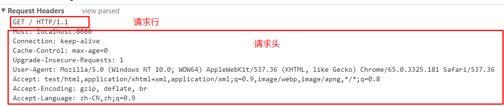
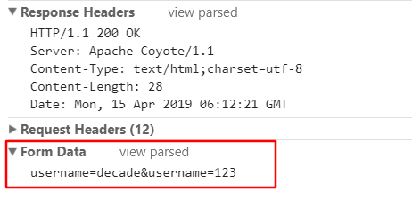
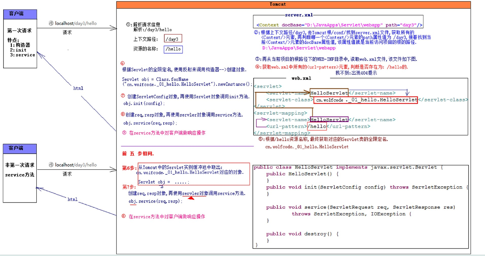
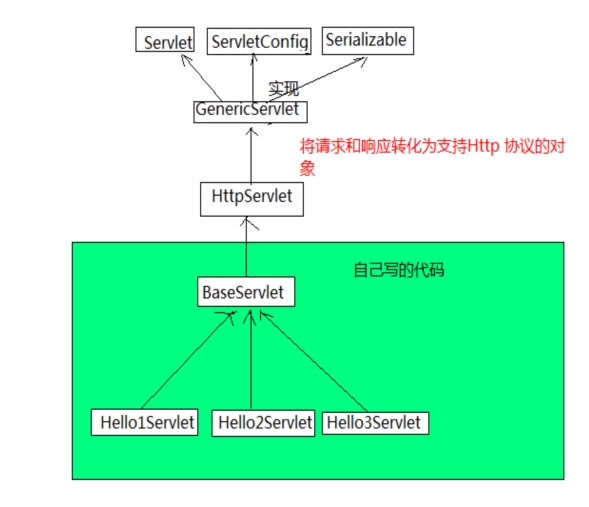
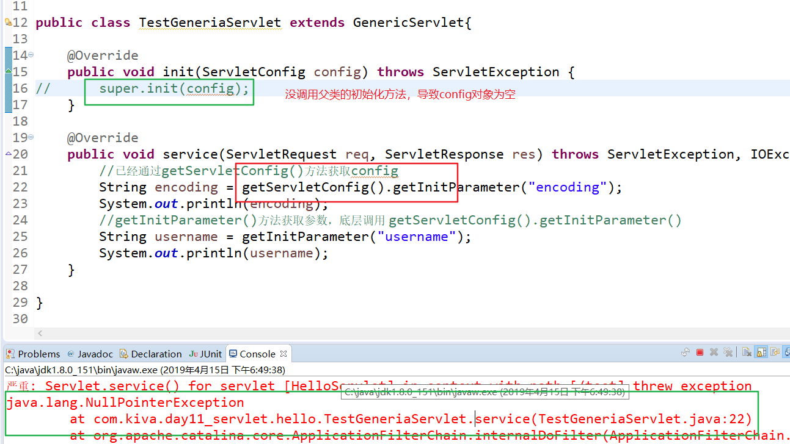

### Http & Servlet
---
### Http 协议
#### 概述
* http协议:Web 浏览器和服务器交互数据遵循的规范
* Http :特点：无状态，默认端口是80

#### 版本:
* Http 协议版本:http1.0 http1.1
  * Http1.0 : 每次请求资源都需要建立TCP 连接
  * Http 1.1 : 只需要在建立第一次TCP连接，多次请求和响应，响应结束再关闭连接

#### 请求信息
```
请求行:位于请求消息的第一行
    格式 : 请求方式  资源路径  Http版本号
请求头:
  Accept:浏览器可接受MIME 类型(内容类型)--Tomcat安装目录/conf/server.xml
  Content-Type:通知服务器，请求正文的MIME类型，
              取值: application/x-www-form-uelencoded 默认值
              对应form表单的enctype属性
  User-Agent : 告诉服务器使用哪个浏览器
请求实体:从第一个空行后的剩下文本都是请求实体(post请求才有请求实体)
```


#### 响应信息

```
响应行：位于响应消息的第一行
    格式 ： Http版本号  状态码  状态码描述信息
响应头: 从第二行开始到第一个空行
Server:告知客户端服务使用什么类型的服务器
Cotent-Encoding:发送数据采用的压缩格式
Content-Type:告知客户端响应的正文的MIME类型
Set-Cookie : SS.... 服务器发送的Cookie
响应实体：响应正文，空行之后的文本数据

```


* 常见的状态码：
  * 200:响应成功状态码
  * 404:服务器无法找到被请求的页面。
  * 500:请求未完成。服务器遇到不可预知的情况。

##### MIME
```
MIME的英文全称是"Multipurpose Internet Mail Extensions" 多用途互联网邮件扩展，
它是一个互联网标准，在1992年最早应用于电子邮件系统，但后来也应用到浏览器。
服务器会将它们发送的多媒体数据的类型告诉浏览器，
MIME类型就是设定某种扩展名的文件用一种应用程序来打开的方式类型
```

#### get 和 post 请求的区别

```
<!DOCTYPE html>
<html>
  <head>
    <meta charset="utf-8">
    <title></title>
  </head>
  <body>
    <h3>请求</h3>
    <form action="#" method="post">
        账号:<input type="text" name="username" > <br>
        邮箱:<input type="text" name="email" > <br>
        <input type="submit"  value="提交">
    </form>
  </body>
</html>
```

```
get 方式请求:
      请求数据在浏览器的地址行
      请求信息存储在请求行上

post 方式请求:
      请求数据保存在请求实体
      post 请求更安全
```
* get 和 post 区别:
    * get 请求数据在地址栏，post 不会
        post 相对与get更安全
    * post 请求参数存放在请求实体中，而get 放在请求行中
    * get 方式请求数据不能超过2KB,而POST 没有上限
         （文件上传时使用post）
    * get 可以缓存，而post 没有缓存

---

### Servlet
#### Servlet 概述
servlet(Server Applet) ： 动态web 技术，是实现了Servlet 接口的类

#### 第一个程序
开发步骤:
1. 导入servlet-api.jar
2. 创建类实现servlet
3. 导入源码 (Tomcat 的源码中由servlet的源码)
4. 在web.xml中配置servlet


```
public class HelloServlet implements Servlet{

  public HelloServlet(){
    System.out.println("创建对象...");
  }

	@Override
	public void init(ServletConfig config) throws ServletException {
		System.out.println("init()");
	}

  @Override
	public void service(ServletRequest req, ServletResponse res) throws ServletException, IOException {
		System.out.println("service()");
	}

	@Override
	public void destroy() {
		System.out.println("destroy()");
	}

	@Override
	public ServletConfig getServletConfig() {
		System.out.println("getServletConfig()");
		return null;
	}

	@Override
	public String getServletInfo() {
		System.out.println("getServletInfo()");
		return null;
	}

}


<!-- 配置servlet -->
	<servlet>
		<servlet-name>HelloServlet</servlet-name>
    // servlet 的完整类名
		<servlet-class>com.kiva.day11_servlet.hello.HelloServlet</servlet-class>
	</servlet>
	<servlet-mapping>
		<servlet-name>HelloServlet</servlet-name>
    // 映射路径: 必须加斜杠
		<url-pattern>/hello</url-pattern>
	</servlet-mapping>
```


#### servlet 的生命周期
* servlet 的生命周期: servlet 创建对象-->初始化--->执行操作--->销毁(由tomcat管理)
* Servlet 在整个生命周期中是只存在一个对象（tomcat 开启->关闭 ）

* 生命周期的方法

```
servlet构造器 : 必须保证有一个公共的无参构造器
void init(ServletConfig config): 初始化方法,只执行一次
void service(ServletRequest req, ServletResponse res):服务方法,每次请求执行一次
void destroy():销毁操作,只执行一次(正常关闭才会执行)
```
* ServletConfig getServletConfig():获取当前servlet 的配置信息
* String getServletInfo() :返回作者，版本，版权信息


### servlet 的执行流程

```
1. 浏览器发送请求  localhost/day03/hello
  解析请求地址 :
      day03 : 上下文路径
      /hello : 资源名称

2. tomcat server.xml 中查找所有的Context,匹配一个day03的配置
  找的到 : 得到项目的绝对路径
  找不到 : 404
3. 去项目的绝对路径去找web.xml
4. 获取所有的<url-pattern> 匹配名称叫/hello 得到<servlet-name>
5. 通过<servlet-name> 得到完整类名xxx.HelloServlet对象
6. 从tomcat 的实例缓冲池中去找xxx.HelloServlet对象
  找的到 : 9
  找不到 : 7
7. 使用反射创建对象
  Object obj=class.forName("xxx.HelloServlet").newInstance();
  把对象存入tomcat的实例缓冲池
  map.put("xxx.HelloServlet",obj);
8. 创建ServletConfig 对象调用init()方法
  obj.init(config);
9. 创建req,resp 调用service(req,resp)方法
  obj.service(req,resp);
```



---

##### ServletConfig 类
 * String getServletName() : 获取当前servlet的 <servlet-name>中的内容
 * ServletContext getServletContext() : 获取上下文对象,一个应用只有一个上下文对象
 * String getInitParamter(String name) : 根据指定名称获取初始化参数
 * Enumeration<String> getInitParameterNames() : 获取所有的初始化参数的名字

```
service(){
  String encoding="gbk";
  if("utf-8".equal(encoding)){
    System.out.print("你好世界");
  }else{
    System.out.print("hello world");
  }
}
```

以上代码会出现硬编码问题，使用自带的web.xml
* 使用<init-param>标签设置初始化参数

```
<servlet>
  <servlet-name>HelloServlet</servlet-name>
  <servlet-class>com.kiva.day11_servlet.hello.HelloServlet</servlet-class>

   <init-param>
			<param-name>encoding</param-name>
			<param-value>utf-8</param-value>
	</init-param>

	<init-param>
		<param-name>username</param-name>
		<param-value>root</param-value>
	</init-param>

</servlet>
<servlet-mapping>
  <servlet-name>HelloServlet</servlet-name>
  <url-pattern>/hello</url-pattern>
</servlet-mapping>
```

* 获取初始化参数

```

  private ServletConfig config;

	@Override
	public void init(ServletConfig config) throws ServletException {
		this.config=config;
	}

  @Override
	public void service(ServletRequest req, ServletResponse res) throws ServletException, IOException {
		//获取编码
		String encoding = config.getInitParameter("encoding");
		String username = config.getInitParameter("username");

		System.out.println(encoding);
		System.out.println(username);

    //获取所有参数名，再根据参数名，获取初始化参数值
		Enumeration<String> params = config.getInitParameterNames();
		while (params.hasMoreElements()) {
			String name = (String) params.nextElement();
			String value = config.getInitParameter(name);

			System.out.println(name);
			System.out.println(value);
		}
	}
```

---

#### Servlet 继承体系
* 问题1: 每个Servlet 都需要去实现5个方法,而我们可能需要重写的就2个方法
    * 解决: 代码重构 （使用GenericServlet）
* 问题2: 目前Servlet 只能处理一般的请求和响应,而我们做 BS 是和浏览器打交道,
  需要的是遵循HTTP 协议的请求和响应前转请求和响应
    * 抽取出 HttpServlet (使用HttpServlet)





##### GenericServlet 类实现

1. GenericServlet implements Servlet, ServletConfig,Serializable
2. 实现了Servlet的5个方法,init()
3. 实现了ServletConfig 的方法,getInitParamter() ,getInitParameterNames()


GenericServlet 主要源码

```
package javax.servlet;

import java.io.IOException;
import java.util.Enumeration;

public abstract class GenericServlet implements Servlet, ServletConfig,
        java.io.Serializable {

    private static final long serialVersionUID = 1L;

    private transient ServletConfig config;

    //初始化设置config
    @Override
    public void init(ServletConfig config) throws ServletException {
        this.config = config;
        this.init();
    }

    // 子类可直接重写方法
    public void init() throws ServletException {
        // NOOP by default
    }


    @Override
    public abstract void service(ServletRequest req, ServletResponse res)
            throws ServletException, IOException;

    @Override
    public ServletConfig getServletConfig() {
        return config;
    }

    @Override
    public String getInitParameter(String name) {
        return getServletConfig().getInitParameter(name);
    }

    @Override
    public Enumeration<String> getInitParameterNames() {
        return getServletConfig().getInitParameterNames();
    }

    ....
}

```
子类实现GeneriaServlet

```
public class TestGeneriaServlet extends GenericServlet{

  //子类使用init()进行初始化操作，由父类调用
	@Override
	public void init() throws ServletException {
	}

	@Override
	public void service(ServletRequest req, ServletResponse res) throws ServletException, IOException {
		//已经通过getServletConfig()方法获取config
		String encoding = getServletConfig().getInitParameter("encoding");
		System.out.println(encoding);

		//getInitParameter()方法获取参数，底层调用 getServletConfig().getInitParameter()
		String username = getInitParameter("username");
		System.out.println(username);
	}

}
```
* 重写init方法，如果没有调用父类的 init(config)方法，会导致config没有设置值
* 提供了init()方法用于子类写自己的初始化操作




#### HttpServlet 类
1. HttpServlet extends GenericServlet
2. 主要在service 中将req,resp 转换成http对象
3. 子类如果调用父类的或doGet(),doPost()方法会返回405报错信息

子类实现模板

```
/**
 * HttpServlet 作用: 将req 和 resp 转换成 http 对象
 * @author deku
 *
 */
public class TestHttpServlet extends HttpServlet{

	@Override
	protected void doGet(HttpServletRequest req, HttpServletResponse resp) throws ServletException, IOException {
		doPost(req,resp);
	}

	@Override
	protected void doPost(HttpServletRequest req, HttpServletResponse resp) throws ServletException, IOException {
		System.out.println("doPost 方法");
	}

}
```

HttpServlet 源码

```
public abstract class HttpServlet extends GenericServlet {

  // 将req,resp 转换成http对象
    @Override
   public void service(ServletRequest req, ServletResponse res)
       throws ServletException, IOException {

       HttpServletRequest  request;
       HttpServletResponse response;

       try {
           request = (HttpServletRequest) req;
           response = (HttpServletResponse) res;
       } catch (ClassCastException e) {
           throw new ServletException("non-HTTP request or response");
       }
       service(request, response);
   }

   //直接发送错误信息
   protected void doGet(HttpServletRequest req, HttpServletResponse resp)
       throws ServletException, IOException
   {
       String protocol = req.getProtocol();
       String msg = lStrings.getString("http.method_get_not_supported");
       if (protocol.endsWith("1.1")) {
           resp.sendError(HttpServletResponse.SC_METHOD_NOT_ALLOWED, msg);
       } else {
           resp.sendError(HttpServletResponse.SC_BAD_REQUEST, msg);
       }
   }

   //根据不同的请求方式调用相对的方法
   protected void service(HttpServletRequest req, HttpServletResponse resp)
        throws ServletException, IOException {

        String method = req.getMethod();

        if (method.equals(METHOD_GET)) {
            long lastModified = getLastModified(req);
            if (lastModified == -1) {
                doGet(req, resp);
            } else {
                long ifModifiedSince;
                try {
                    ifModifiedSince = req.getDateHeader(HEADER_IFMODSINCE);
                } catch (IllegalArgumentException iae) {
                    ifModifiedSince = -1;
                }
                if (ifModifiedSince < (lastModified / 1000 * 1000)) {
                    maybeSetLastModified(resp, lastModified);
                    doGet(req, resp);
                } else {
                    resp.setStatus(HttpServletResponse.SC_NOT_MODIFIED);
                }
            }

        } else if (method.equals(METHOD_HEAD)) {
            long lastModified = getLastModified(req);
            maybeSetLastModified(resp, lastModified);
            doHead(req, resp);

        } else if (method.equals(METHOD_POST)) {
            doPost(req, resp);

        } else if (method.equals(METHOD_PUT)) {
            doPut(req, resp);

        } else if (method.equals(METHOD_DELETE)) {
            doDelete(req, resp);

        } else if (method.equals(METHOD_OPTIONS)) {
            doOptions(req,resp);

        } else if (method.equals(METHOD_TRACE)) {
            doTrace(req,resp);

        } else {
            String errMsg = lStrings.getString("http.method_not_implemented");
            Object[] errArgs = new Object[1];
            errArgs[0] = method;
            errMsg = MessageFormat.format(errMsg, errArgs);

            resp.sendError(HttpServletResponse.SC_NOT_IMPLEMENTED, errMsg);
        }
    }
  }
```

---

#### 总结

```
Http 协议:浏览器和服务器交互数据约定的规范格式

http 请求
请求行:请求方式 资源路径 http版本
请求头:多个请求头
请求体:在第一个空行之后的请求数据，get没有,post 有

http 响应
响应行: 协议 响应状态码 状态码描述信息
响应头
响应实体

get和post的区别
get : 请求参数显示在地址栏上，不安全
    : 请求参数在请求行
    : get 有大小限制 2kb
    : get 请求有缓存数据
post
    |---较安全
    |---请求参数存放在请求实体中
    |---post 没有大小限制
    |---没有缓存

Servlet 的生命周期
      |---servlet 对象创建
          -->init() : 初始化操作，只执行一次
          --> service() : 多次执行,每次请求调用一次
          --> destroy() :正常关闭时执行,只执行一次

Servlet 访问的执行流程
  1. 根据浏览器中的url 路径解析 (localhost:8080/test/hello)
        |--- /test 上下文路径
        |--- /hello 资源路径
  2. 在tomcat 的conf -->server.xml中--> 所有Context 元素
        判断 上下文路径和/test 相等的绝对路径
        找到: 找绝对路径下的web.xml
        找不到:404
  3. 找到web.xml 所有的url-pattern ,判断是否有 /hello
        找到: 根据 servlet-name 找到servlet-class ，拿到完整类名
        找不到:404
  4. 在tomcat 对象缓存池中判断是否有servlet 对象
        有: 7
        没有:5
  //-------------
  5. 创建servlet 对象，将对象保存到缓存池中
    Object obj=Class.forName("完整类名").newInstance();
    map.put("完整类名",obj);
  6. 调用创建servletConfig 对象，调用init()方法
  //-----------------
  7. 创建req,resp ,调用service(req,resp) 方法
  8. 返回响应


Servlet 继承体系
1. GenericServlet implements Servlet,ServletConfig,Serializable
2. GenericServlet 实现了servlet  的接口
3. 子类可以实现init()方法

HttpServlet
1. HttpServlet extends GenericServlet
2. 主要将req 和 resp 强转成http 对象
2. 子类调用HttpServlet 的doGet() 和 doPost()会报405

```
