## web组件之间的跳转 & EL & jstl
---
#### web组件职责

* web 组件(Servlet/jsp)的交互 : web组件之间的跳转，数据共享

* 为什么需要跳转？
 * 一个需求需要多个组协同完成

* 为什么需要共享
 * 多个组件之间跳转，需要传递数据

Servlet 组件:
1. 接收请求，封装数据
2. 调用业务方法，处理业务逻辑
3. 控制页面跳转

jsp 组件:显示数据

---

#### 跳转方式
web组件之间的跳转方式:
* 方式1 : 请求转发(forward)
* 方式2: URL重定向(redirect)
* 方式3：请求包含(include)


#### 请求转发
需求:从AServlet 跳转到BServlet
语法:
* req.getRequestDispatcher(path).forward(req, resp);
 * path: 指定要跳转的资源路径,不加上下文路径


##### 请求转发特点
1. 浏览器地址栏不发生改变
2. 请求转发只发送一个请求
3. 共享一个请求中的数据
4. 最终响应只有BServlet
3. 不能跨域访问
4. 请求转发可以访问WEB-INF 下目录的资源

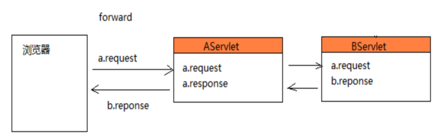

#### 示例代码

```
@WebServlet("/forward/a")
public class AServlet extends HttpServlet {

	@Override
	protected void service(HttpServletRequest req, HttpServletResponse resp) throws ServletException, IOException {
		resp.setContentType("text/html;charset=utf-8");
		PrintWriter out = resp.getWriter();

		System.out.println("----a begin---");

		out.println("---- a 输出,转发前----");
		//转发到servlet
		req.getRequestDispatcher("/forward/b").forward(req, resp);
		//可以访问 WEB-INF 下的资源
//		req.getRequestDispatcher("/WEB-INF/web.xml").forward(req, resp);
		//不能跨域访问
		//req.getRequestDispatcher("http://www.baidu.com").forward(req, resp);
		out.println("---- a 输出,转发后----");

		System.out.println("----a end---");
	}

}


@WebServlet("/forward/b")
public class BServlet extends HttpServlet {

	@Override
	protected void service(HttpServletRequest req, HttpServletResponse resp) throws ServletException, IOException {
		resp.setContentType("text/html;charset=utf-8");
		PrintWriter out = resp.getWriter();
    // 只有b输出
		System.out.println("----b begin---");
		out.println("---- b 输出-----<br>");
		System.out.println("----b end---");
	}

}
```

###### 控制台打印
```
----a begin---
----b begin---
----b end---
----a end---
```
###### 页面打印


---

### 重定向
语法:
* resp.sendRedirect(path);
  * path 不能访问WEB-INF下的文件;能访问域外;跳转servlet 需要加上下文路径

特点:
1. 浏览器地址栏发生改变
2. 发送了俩个请求(相当把资源路径拷贝了在浏览器再次去发送请求)
3. 没有共享请求数据
4. 最后响应由Servlet2 输出
5. 支持跨域访问
6. 不能访问WEB-INF下的文件内容

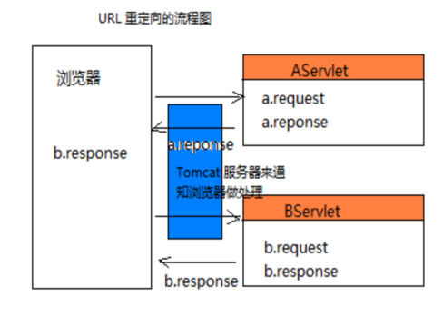

##### 代码示例

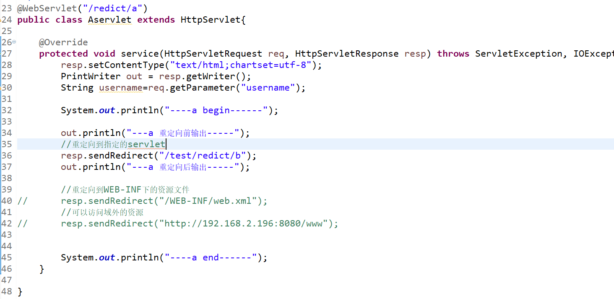
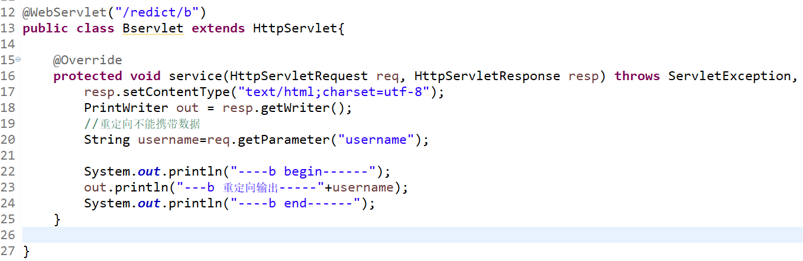

##### 运行结果

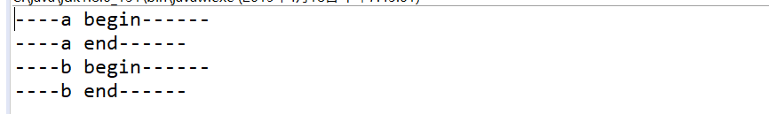

##### 浏览器输出

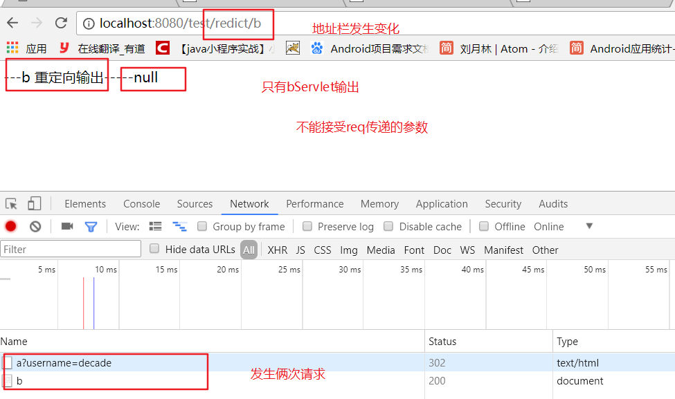

---

#### forword 和 redirect 选择；
必选项:
1. 必须使用请求转发的情况
  * 共享一个请求的数据
  * 可以访问WEB-INF 目录的资源
2. 必须使用重定向
  * 需要跨域访问

3. 其他，任选

---

### 数据共享的方式

* 作用域:在一个范围内共享数据

* Servlet 的三大作用域:
 * request:请求作用于域，在一个请求的多个跳转之间去共享数据
 * session:在一个会话中的多个请求之间去共享数据
    * 会话: 打开浏览器访问网站会话对象创建,直接去操作网站上的数据点击a标签等等操作到关闭浏览器就是一个会话.
 * application/ServletContext:应用对象，一个应用只有一个应用对象，
多个会话之间去共享数据


#### 作用域的类型:

作用域|类型|描述
---|:--:|:---:
request|HttpServletRequest|在一次请求过程中可以共享数据.
session|HttpSession|在一次会话过程中,不同的多个请求都可以共享数据.
application|ServletContext|在服务器启动过程中,都可以共享的数据.关闭服务器,application消失.

#### 三大作用域对象的获取

```
request : 直接service方法中使用
session : 使用request对象来获取 req.getSession()
application :
    |---getServiceConfig().getServletContext()
        ---通过serviceConfig获取
    |---super.getServletContext();
        ---通过父类实现了serviceConfig接口获取
    |---req.getServletContext();
        ---通过请求对象获取
    |---session.getServletContext();
        ---通过session对象获取
```


#### 三大作用域的数据共享

```
1. 存入数据到作用域中
  作用域对象.setAttribute(String name,Object value);
      |---name 给共享的数据设置唯一的名字
      |---value: 存入共享的数据
2. 从作用域中获取数据
  作用域对象.getAttribute(String name);
      |---name 需要获取数据的name
3. 移除作用域的数据
  作用域对象.removeAttribute(String name);
```
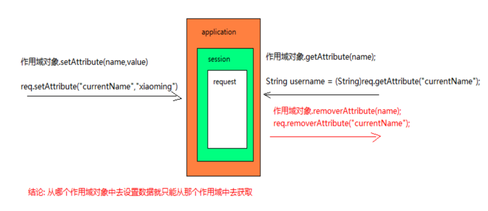


---

#### ServletContext 对象
##### 如何获取ServletContext对象
```
1. servletConfig : 调用servlet父类方法getServletContext()
2. request : 使用请求对象获取
      |--request.getServletContext();
3. session : 使用session获取
      |--request.getSession().getServletContext();
* 获取都是同一个对象
```
##### 常用方法:
```
------获取绝对路径-------
getRealPath(String path); 获取相对于项目根路径的资源的绝对路径
    |---path 是相对于根路径
    |---路径是假的，是直接拼接的
    |---context.getRealPath("/WEB-INF/hello.jsp");

-----获取上下文路径------
getContextPath();  获取上下文路径

-------获取初始化参数-------
多个web 组件之间有相同的初始化参数，获取全局的初始化参数
getInitParamter():
getInitParamterName():

全局初始化 web.xml中
<context-param>
		<param-name>username</param-name>
		<param-value>root</param-value>
</context-param>

```

#### 代码示例

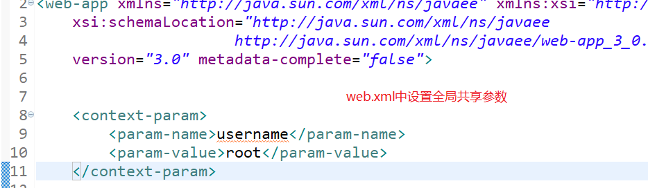

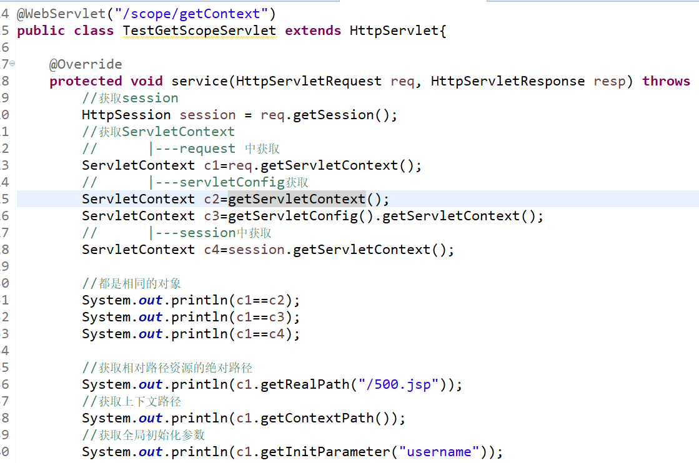

#### 运行结果
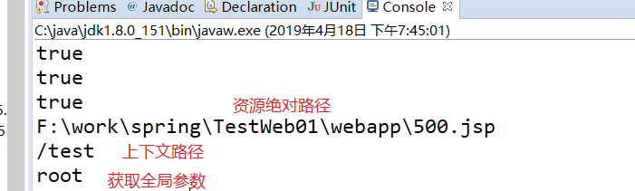

#### 面试题
###### req.getParameter 和  servletConfig/servletContext.getInitParameter区别

```
req.getParamter(name):获取用户请求提交的数据
servletConfig/servletContext.getInitParamter(name):自己配置的初始化参数值
```

#### 域范围设置参数案例
需求:从ScopeServlet中设置共享数据,在ResultServlet中响应数据
```
@WebServlet("/app/scope")
public class ScopeServlet extends HttpServlet {

	@Override
	protected void service(HttpServletRequest req, HttpServletResponse resp) throws ServletException, IOException {
		//从某作用域中获取参数，
		//    |---如果参数为空，设置为1，
		//    |---参数不为空+1
		Object reqCount=req.getAttribute("count");
		if(reqCount==null){
			req.setAttribute("count", 1);
		}else{
			Integer count=(Integer) reqCount;
			req.setAttribute("count", count++);
		}

		//从session中获取
		HttpSession session = req.getSession();
		Object sessionCount=session.getAttribute("count");
		if(sessionCount==null){
			session.setAttribute("count", 1);
		}else{
			Integer count=(Integer) sessionCount;
			session.setAttribute("count", count+1);
		}

		//从context中获取数据
		ServletContext context = getServletContext();
		Object contextCount=context.getAttribute("count");
		if(contextCount==null){
			context.setAttribute("count", 1);
		}else{
			Integer count=(Integer) contextCount;
			context.setAttribute("count", count+1);
		}
		req.getRequestDispatcher("result").forward(req, resp);
	}

}
```

```
@WebServlet("/app/result")
public class ResultServlet extends HttpServlet {

	@Override
	protected void service(HttpServletRequest req, HttpServletResponse resp) throws ServletException, IOException {

		resp.setContentType("text/html;charset=utf-8");
		PrintWriter out = resp.getWriter();

		Object reqCount = req.getAttribute("count");
		Object sessionCount = req.getSession().getAttribute("count");
		Object contextCount = getServletContext().getAttribute("count");

		out.print("requestCount:"+reqCount); //每次请求都是1
		out.print("<br>sessionCount:"+sessionCount); //每次打开新的浏览器窗口都是1
		out.print("<br>contextCount:"+contextCount);//服务器关闭才为1
	}

}
```
#### 运行结果
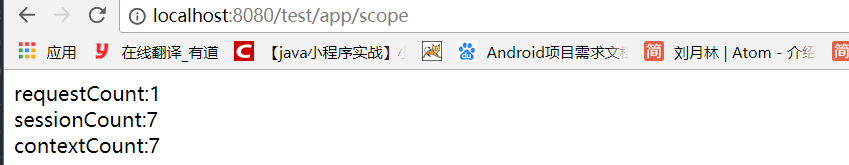


----

#### EL 表示式
El表达式:
* 从page,request,session,application 顺序检索数据,找到则显示，找不到
继续找下一个，没有则显示空字符串
* 语法:${属性名}
* 注意: ${}中间不能带双引号

##### EL 表达式的语法:
* 方式一:${对象.属性名} : 使用点的方式来获取属性值
* 方式二:${对象["属性名"]}:使用指定名称的方式获取
* 方式三：${对象.getter方法}:只有tomcat7.0才能使用
注意：属性名命名时不适用特殊符号,例如‘.’

如果不使用EL 表达式
```
 在域中设置参数  page<request<session<application
<%
  pageContext.setAttribute("name", "pageContext.attribute");
  request.setAttribute("name", "request.attribute");
  session.setAttribute("name", "session.attribute");
  application.setAttribute("name", "application.attribute");
%>

<!-- 使用jsp 脚本表达式获取对象 -->
<%=pageContext.getAttribute("name")%><br>
<%=request.getAttribute("name")%><br>
<%=session.getAttribute("name")%><br>
<%=application.getAttribute("name")%><br>

<!-- 从四大作用域中按 page,request,session,application 顺序查找,没有找到返回null  -->
<%=pageContext.findAttribute("name")%>

```

#### el表达式的原理

```
按照 page,request,session,application 顺序查找属性,有就返回数据，没有就返回空字符串
pageContext.findAttribute("msg")==null?"":pageContext.findAttribute("msg");

<!-- 使用el表达式 -->
	${name}<br>
  指定从哪个作用域去获取，不会从小到大去检索
  ${requestScope.name}<br>
```

#### EL 中的作用域内置对象
使用EL 表达式时可以指定从哪个作用域对象中直接去获取数据而不是从小到大去检索
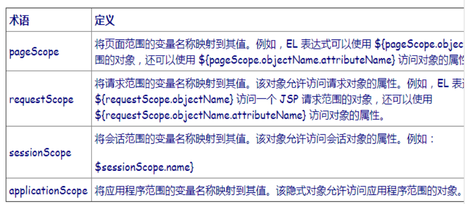

使用El 获取属性
```

class Person{
  private String name="decade";
  private Integer age=18;
  private String[] hobby={"读书","健身","写代码"};
  private List list=Arrays.asList("A","B","C");
  private Map<String,String> map=new HashMap<>(){
    //代码块
    {
        this.put("name","");
        this.put("host","www.baidu.com");
    }
  };
}

class ELServlet{

  service(request,responce){
    Person p=new Person();
    //存入到作用域对象中
    req.setAttribute("p",person);
    //跳转到jsp 页面
    req.getRequestDispatcher().forward();
  }

}

${p.getUserName()} --->${p.username}--->${p{"username"}}
${p.age}
${p.hobby[0]}
${p.list[0]}
${p.map}
${p.map.name}---> ${p.map.host}
//出现属性名冲突，使用 []
${p.map["www.baidu.com"]}
```

----

#### jsp 算数运算
```
获取
<%
  request.getContextPath();
%>

${pageContext.getRequest().getContextPath()}
${pageContext.request.contextPath}

el算数运算
${1+3/2} :  2.5
${empty list} : 判断集合元素是否为空 (空引用和size()==0)
```

---

#### jstl 标记
* jstl : java 标准标签库,可以用来判断和遍历数据

jstl 的使用:
```
* 准备工作:
  1. 导入jar包
  2. 使用jsp的指令tablib 导入标签库

<%@ taglib uri="http://java.sun.com/jsp/jstl/core"  prefix="c"%>

<%
//存数据到作用域
List<String> list=Arrays.asList("A","B","C");
request.setAttribute("list",list);
%>

```

循环标签

```
begin : 开始索引
end : 结束索引
step : 步长
var : 每次循环数据存入的变量名
items : 集合对象
<c:foreach begin="1" end="10" step="1" var="val" >
  ${val}
</c:foreach>

<c:foreach var="val" items="${list}">
  ${val}
</c:foreach>

```

条件标签
```
判断 num 是否大于10,
如果大于10 ，显示num大于10
如果小于10 ，显示num小于10
如果等于10 ，显示num等于10
<%
  request.setAttribute("num",num);
%>
1. 单条件的选择语句
  test: 存boolean 表达式的值
<c:if test="${num>10}">
    num大于10
</c:if>
<c:if test="${num<10}">
    num小于10
</c:if>
<c:if test="${num==10}">
    num等于10
</c:if>
```

2. 多条件的选择语句

```
<c:choose>
  <c:when test="${num>10}">num大于10</c:when>
  <c:when test="${num<10}">num小于10</c:when>
  <c:otherwise>num等于10</c:otherwise>
</c:choose>
```

3. 国际化标签

```
<%@ taglib uri="http://java.sun.com/jsp/jstl/fmt"  prefix="fmt"%>
<fmt:formatDate value="${date}" pattern="yyyy-MM-dd HH:mm:ss"/>
```
