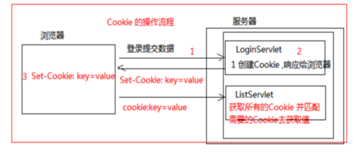
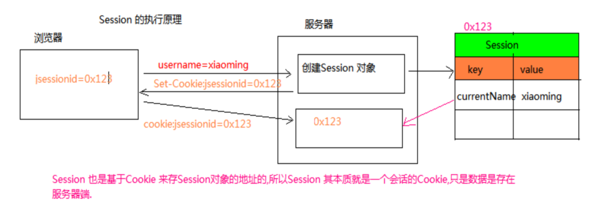

### Cookie & Session
---
问题概述:
 * Http是无状态协议，无法在多个请求中共享数据

解决方法:
 * 会话跟踪技术:cookie 和session

---

#### Cookie

Cookie 是客户端技术，服务器通过cookie将用户数据传递给用户浏览器
,用户浏览器再次访问浏览器时，会携带cookie信息，从而标识不同的用户请求



```
1. cookie 的创建
    Cookie cookie=new Cookie(String name,String value)
      name : 给共享的数据起一个唯一的标志
      value : 要存入的用户的数据
2. 如何响应Cookie 到浏览器
   resp.addCookie(Cookie cookie)
3. 如何获取Cookie的数据
   Cookie[] cookies=req.getCookies();
```

#### Cookie 中的细节

```
4. 修改cookie
方式一:重新创建cookie
Cookie cookie=new Cookie(String name,String value);
方式二:直接给Cookie赋值
cookie.setValue(name);
俩种方式都需要重新响应到浏览器去覆盖cookie
resp.addCookie(cookie);

5. Cookie 的中文问题
Cookie 中的name 和value不支持中文,内容有中文会报错

URLEncoder: 编码，将中文转换成非中文的字符串
  String username =URLEncoder.encode(username,"utf-8");
URLDecoder:编码，将非中文转换成中文的字符串
  username=URLDecoder.decode(username,"utf-8");

6. cookie 的分类
  会话cookie: 浏览器关闭cookie就失效
  持久cookie: cookie 可以保留一定的时间
  cookie.setMaxAge(int seconds);
  单位是秒
    |--负数:-1: 不保存
    |--0: 删除cookie
    |--正数:设置存活的时间(s为单位)

7. 删除cookie
cookie.setMaxAge(0); 设置为0就是删除
删除时给Cookie设置setMaxAge之后需要再响应覆盖旧的数据

8. 设置路径和域
cookie 中有一个path属性，浏览器只会对cookie
默认情况下,path 是在创建cookie资源所在的目录下才会发送cookie

如果需要再项目下的任意资源路径访问都会带上Cookie，
设置cookie.setPath("/")
  /:标识在上下文路径下的访问都会传递cookie

Cookie 的域问题:
域名不同，不管path 怎么设置都无法共享数据

如果需要在二级域名间共享数据，需要给cookie 设置domain
cookie.setDomain(".baidu.com");
    //---- www.baidu.com    yun.baidu.com
```
#### Cookie  的缺陷

1. 安全问题
2. Cookie存储中文比较麻烦
3. 一个Cookie 只能存储一个数据
4. 一台服务器在一个客户端存储Cookie大小和数量有限
  Cookie 大小限制在4KB之内
5. cookie 可能丢失

---

#### Session
Session 是服务器端技术，为每一个用户的浏览器创建一个独享的session对象中



原理:
1. 浏览器首次访问服务器端资源带上数据
2. 服务器就为当前用户创建一个独立的session对象
3. 服务器以cookie形式将session的唯一标志传递给浏览器
4. 浏览器再次访问，携带session 唯一标志，提供给服务器查找session对象
#### session 的使用
1. 创建或获取session对象

```
   getSession(true) : 如果存在session对象，直接返回;如果不存在，创建一个新的session对象
   getSession(false) :如果存在session对象，直接返回;如果不存在，返回 null
   getSession() : 默认和 getSession(true)

2. 设置共享数据
   session.setAttribute(String name,Object value);
   参数:name :共享数据的唯一标识
        value :要共享的数据

3. 获取共享数据
    session.getAttribute(name);
4. 移除session中的数据
  1> 删除指定属性名的值
  session.removeAttribute(name);
  2> 销毁session对象
  session.invalidate();
```

5.session的超时管理

```
如果超过指定的存活时间，session 对象销毁,防止对象一致存在服务器，没有销毁
tomcat -->conf--->web.xml 默认超时时间30分钟y
<session-config>
  <session-timeout>30</session-timeout>
</session-config>
setMaxInactiveInterval(int seconds)
```

6. URL 重写
Session 是一个特殊的Cookie ,存在浏览器上,用户可选择不接受Cookie

```
第一种方式:
* 使用参数形式  jsessionid 传递给下一个请求,使用 ; 来设置参数的值
<a href="/session/list;jsessionId=<%=session.getId()"%>

第二种方式:
  * 调用方法来生成带有 jsessionid 的 url
  * resp.encodeURL("/session/list")
<a href="<%=resp.encodeURL("/session/list")%>"%>
```

7. session的使用规范

```
1> session中属性命名  (XX_IN_SESSION)
    例: USER__IN_SESSION
2> 存放多个属性
3> 多服务器共享session ，session中的 对象类型(User) 需要实现序列化接口

序列化:把对象信息存储为二进制
反序列化:把二进制信息转换成对象
```


总结:
```
Cookie 的原理
1. 浏览器访问服务器时，由服务器创建一个cookie对象
2. 将cookie对象响应回浏览器，浏览器保存cookie信息
3. 浏览器每次访问，携带cookie信息到服务器,服务器借此区别不同的用户访问

cookie 的创建
  1. Cookie cookie=new Cookie(name,value);
cookie的删除
  cookie.setMaxAge(0) //设置0
cookie 的设置值
  1. 重新创建cookie 对象
  Cookie cookie=new Cookie(name,value);
  2. 直接设置值
  cookie.setValue(value);


session 的原理:
1. 浏览器请求首次访问服务器，服务器创建一个session
2. 通过cookie 将JSessionId传递给浏览器
3. 之后浏览器每次请求将JSessionId唯一标识传递给服务器，查找session对象

session 的简单使用
1. session 的创建
request.getSession(); 同request.getSession(true)
request.getSession(true);  如果第一次获取session，session为空则创建session，不为空则直接返回session
request.getSession(false); 如果第一次获取session,session不为空则直接返回，否则返回空

2. session 设置共享数据
session.setAttribute(name,value);

3. session 删除共享数据
session.removeAttribute(name);
```
1. 清楚Http无状态有什么问题
2. 掌握cookie的原理
3. 掌握session的原理
4. 掌握session的简单使用
