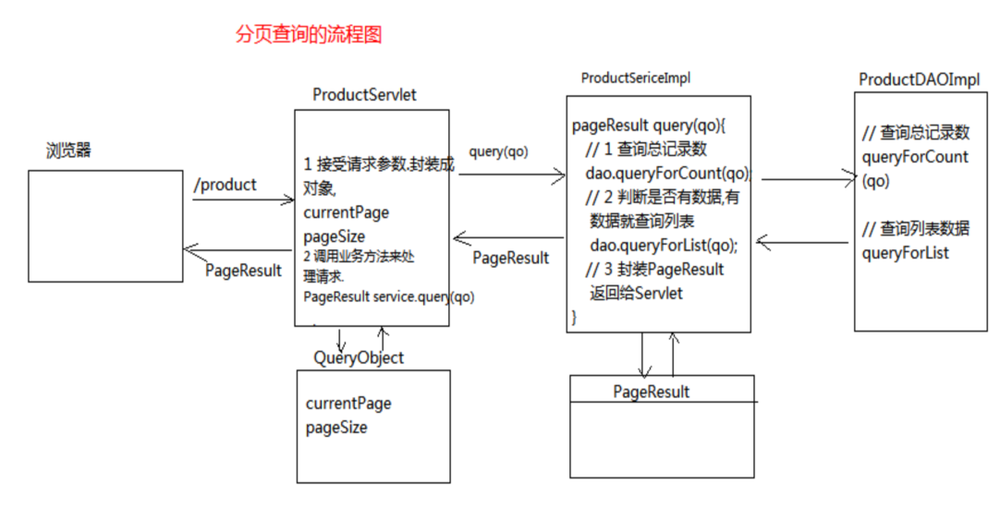
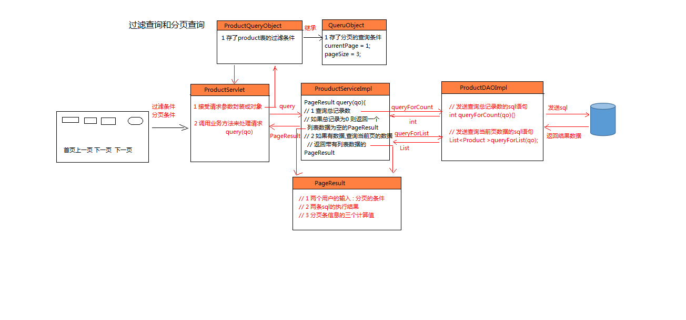

## 基于MyBatis 的高级查询
---

#### 分页需要的SQl语句
查询当前页的所有数据
```
select * from user limit (currentPage-1)* pageSize,pageSize
```
查询满足条件的记录数
```
select count(* ) from user
```
#### 分页需要依赖的数据

```
currentPage : 当前页码
pageSize : 每页显示的最大记录数

list 当前页的数据
totalCount:总记录数

beginIndex:首页
prevPage : 上一页
nextPage : 下一页
totalPage:尾页

总页数:
totalPage=totalCount%pageSize==0？totalCount/pageSize:totalCount/pageSize+1
上一页:prevPage=currentPage-1>=1?currentPage-1:1
下一页:nextPage=currentPage+1<=totalPage?totalPage+1:totalPage
```

#### 控制台分页实现

sql 的执行需要俩个参数,但是在MyBatis 中只能带一个参数
使用一个类封装currentPage 和pageSize

* 封装分页查询的条件

```
class QueryObject{
  private Integer currentPage=1;
  private Integer pageSize=3;

  //返回当前页开始截取的索引值
  public Integer getBeginIndex(){
    return (currentPage-1)* pageSize;
  }
}
```

dao
```
List<Product> queryForList(QueryObject qo);
Integer queryForCount(QueryObject qo);
```

mapper
```
分页查询
select * from product limit #{beginIndex},#{pageSize}
查询总记录数
select count(* ) from product
```

test
```
  @Test
	public void testGetCount() {

		int currentPage=2;//当前页
		int pageSize=10;	//每页记录数

		ProductQueryObject qo=new ProductQueryObject();
		qo.setCurrentPage(currentPage);
		qo.setPageSize(pageSize);

		获取分页列表
		List<Product> list=dao.getPageList(qo);
		总记录数
		int totalCount=dao.getCount(qo);

		总页数=总记录数/当前页数
		int totalPage=(totalCount+pageSize-1)/pageSize;
		上一页
		int prePage=currentPage-1>=1?currentPage-1:1;
		下一页
		int nextPage=currentPage+1<=totalPage?currentPage+1:totalPage;

		System.out.println("totalCount-->"+totalCount);
		System.out.println("总页数:"+totalPage);
		System.out.println("上一页:"+prePage);
		System.out.println("下一页:"+nextPage);
	}
```

#### 封装PageResult
页面响应出去的数据，需要进行统一管理,将数据封装到一个类re
```
//封装查询结果的数据,当前页的数据和分页条的信息
class PageResult{
  //用户输入
  private int currentPage;
  private int pageSize;

  sql 查询
  private List list;
  private totalCount;

  3个需要计算的值
  private int totalPage;
  private int prevPage;
  private int nextPage;

  如果没有记录时调用此构造器
  public PageResult(int currentPage,int pageSize){
    this(currentPage,pageSize,new ArrayList(),0);
  }

  public PageResult(int currentPage,int pageSize,List list,int totalCount){
    this.currentPage = currentPage;
    this.pageSize = pageSize;
    this.listData = listData;
    this.totalCount = totalCount;

    计算三个值
    totalPage=(totalPage+pageSize-1)/pageSize;
    int prevPage=currentPage-1>=1?currentPage-1:1;
    int nextPage=currentPage+1<=totalPage?totalPage+1:totalPage;
  }

}
```

#### service 层
```
public interface IProductService{
  //查询某一页的数据
  //qo 查询条件
  //返回结果数据(当前页数据和页面)
  public PageResult query(QueryObject qo);
}

public class serviceImpl implements IProductService{
    public PageResult query(QueryObject qo){
      Integer totalCount=dao.queryForCount();
      //如果没有查询到数据，不需要去查询列表数据
      if(totalCount==0){
        return new PageResult(qo.getCurrentPage,qo.getPageSize);
      }
      List<Product> listData=dao.queryForList(qo);
      return new PageResult(qo.getCurrentPage,qo.getPageSize,listData,totalCount);
    }
}
```
#### 网页前端
```
servlet{

  @Override
	protected void service(HttpServletRequest req, HttpServletResponse resp) throws ServletException, IOException {
	  QueryObject qo=new QueryObject();
    将请求数据转化成QueryObject对象
    req2QO(req,qo);
    PageResult ps=service.query(qo);
    req.setAttribute(ps);
		// 设置参数
		req.setAttribute("result", result);
		// 跳转页面
		req.getRequestDispatcher("/WEB-INF/view/product/list.jsp").forward(req, resp);
	}

  public void req2QO(req,qo){
    String currentPageStr=req.getParamter("currentPage");
    if(StringUtil.hasLength(currentPageStr)){
        qo.setCurrentPage(Integer.valueOf(currentPageStr));
    }

    String pageSizeStr=req.getParamter("pageSize");
    if(StringUtil.hasLength(pageSizeStr)){
        qo.setPageSize(Integer.valueOf(pageSize));
    }
  }

}

```

```
<form method="post">
<a href="/product?currentPage=1">首页</a>
<a href="/product?currentPage=${result.prevPage}">上一页</a>
<a href="/product?currentPage=${result.nextPage}">下一页</a>
<a href="/product?currentPage=${result.totalPage}">尾页</a>
共${result.totalCount}条数据  页次${result.currentPage}/${result.totalPage}页
<select name="pageSize">
  <option value="2">2</option>
  <option value="3">3</option>
  <option value="5">5</option>
</select>
<input type="text" name="currentPage" style="width:20px"><br>
<input type="submit" value="跳转">
</form>
```
#### 分页查询流程图



#### 多条件查询

书写jsp
```
货品名<input type="text" name="productName">
价格<input type="text" name="productName">
-<input type="text" name="productName">
<input type="submit" value="查询">
```


封装product表的多条件查询的条件
```
class ProductQueryObject extends QueryObject{
  private String productName;
  private BigDecimal minSalePrice;
  private BigDecimal maxSalePrice;
}
```
* 将servlet中 的QueryObject修改成ProductQueryObject

#### mapper.xml 书写
* 书写Mapper.xml步骤：

```

1. 把条件用if 标签来拼接sql语句
  if 标签会去判断and前面是否有条件，没有则去掉
2. 使用where 标签解决需不需要where的问题
  把where 定义在条件之前，如果所有的条件都是空，多了where
作用:判断<where> 括起来的条件是否存在，如果存在则加上where,不存在就不加where
3. 使用concat 来按格式去定义模糊查询的数据
4. 使用转义符转化特殊符号
```

##### 转义符
```
MyBatis转移符号
&lt;     <  小于号
&gt;    >  大于号
&amp;  &  与符号
&apos;  '  单引号
&quot;  " 双引号                                      '
```

##### MyBatis 动态Sql
```
MyBatis 文档中有一个动态sql
if：用来判断是否由数据，用来拼接sql
where: 由MYBatis 自动判断是否需要加where

------concat--------
concat 关键词,用于连接函数,连接字符串
select * from product where productName like CONCAT('%','M','%')
```

```
select * from product
<where>
<if test="productName!=null and productName!=''">
   productName like concat('%',#{productName},'%')
</if>
<if test="minSalePrice!=null">
  and minSalePrice &gt;=#{minSalePrice}
</if>
</where>
```
如果productName为空,where不会被添加

异常:
动态sql语句:productName!=' ' 多写一个空格会出错

---

#### 表单数据缺失
步骤:
1. 定义js 函数来接受点击的操作
2. 在js中接受点击操作传递的currentPage的数据,复制给id为currentPage的input标签的值
3. 获取表单元素，调用提交方法

点击a 标签和表单提交是俩个不同的请求,需要在a 链接点击提交时，提交表单数据
使用js 来提交表单数据
```
<script>
  function gotoPage(pageNum){
    alert(pageNum);
    //获取点击传入的数据，设置给id 为currentPage的input元素的value
    document.getElementById("currentPage").value=pageNum;
    //获取表单元素,调用提交方法
    document.forms[0].submit();
  }
</script>

<a href="javascript:gotoPage(1)">首页</a>
```

---




##### 总结和回顾

```
步骤:
1. 创建一个QueryObject 来存currentPage 和pageSize
   创建ProductQueryObject来集成QueryObject
2. 创建PageResult用来封装结果的数据和分页条的信息
3. 修改dao 接口和实现类
  |--queryForCount(qo) : 查询满足条件的总记录数
  |--queryForList(qo) : 查询当前页的数据
4. 在dao实现类中书写
5. 修改Mapper.xml 文件中的sql语句
6. 测试dao的queryForCount和queryForList方法
7. 实现业务层的分页操作
    service.query(QueryObject qo){
        1. 获取满足条件的总记录数
        2. 判断是否有数据
            |--有数据，查询满足条件的数据封装PageResult
            |--没有数据，直接封装空集合的PageResult
    }
8. 测试service.query(qo)
9. 书写ProductServlet
10. 书写jsp
    |--分页条信息
11. 书写list.jsp 中的多条件查询的收集框
12. 在ProductServlet 中接受过滤条件并封装到ProductQueryObject中
13. 修改Mapper.xml 中的sql 加入if 和where 拼接sql 条件
14. 解决数据回显问题
15. 表单数据提交问题

```
