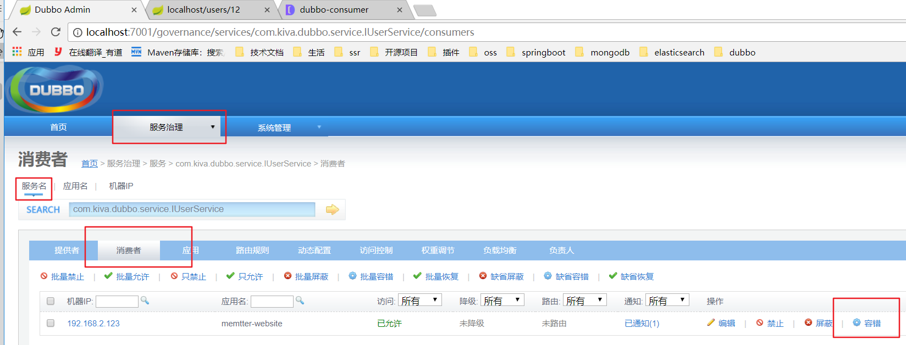
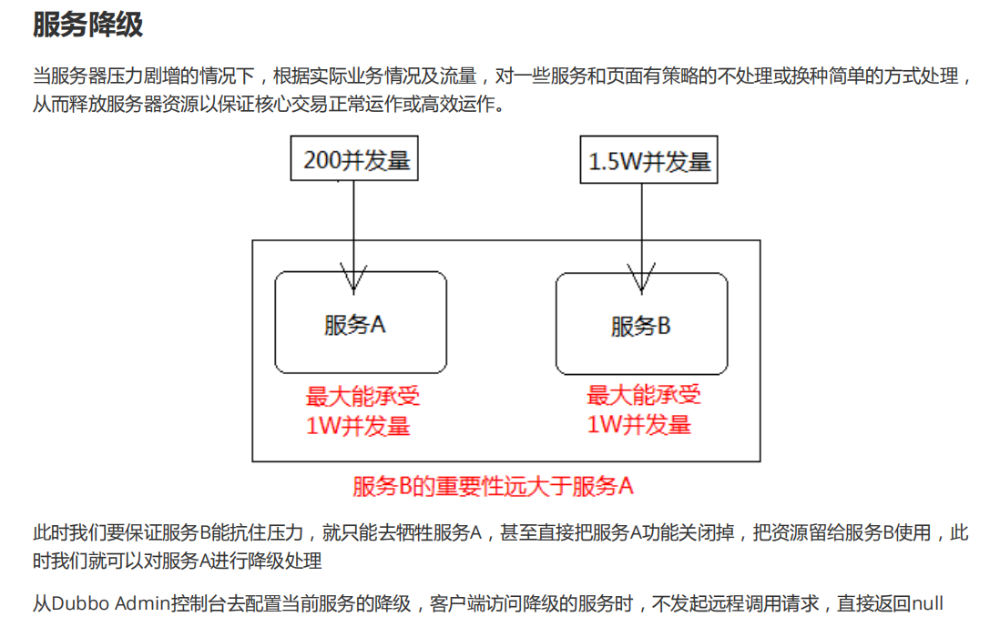
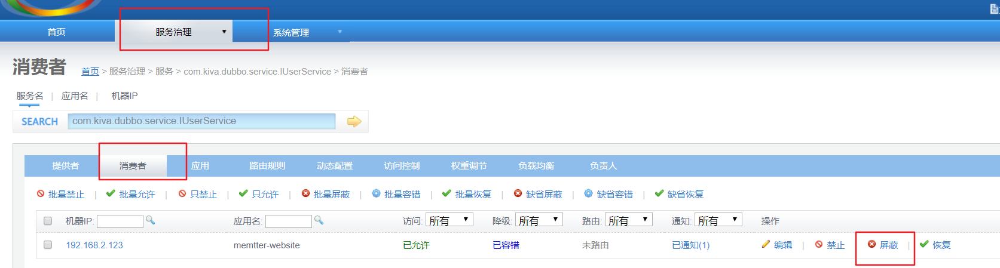

## java Api 开发
 member-api
 ```
  |-- 创建domain.User 实现序列化接口
  |-- 创建 interface IUserService
      |-- User get(Long id);

 member-server:
  |-- 创建module,和member-api同级，不添加父目录
  |-- 添加依赖
  |-- 创建service实现类 UserServiceImpl

模拟运行生产者发布的服务
```java
  |-- 创建应用的配置对象，设置应用名称
  ApplicationConfig applicationConfig=new ApplicationConfig("memtter-service");
  |-- 创建服务发布的端口，设置端口和协议
  ProtocolConfig protocolConfig=new ProtocolConfig("dubbo",20880);
  |-- 创建注册中心配置，设置注册中心
 RegistryConfig registryConfig=new RegistryConfig("zookeeper://localhost:2181");

  |-- 创建服务发布配置对象，设置需要发布的服务对象
  ServiceConfig<IUserService> serviceConfig=new ServiceConfig();
  serviceConfig.setApplication(applicationConfig);
  serviceConfig.setProtocol(protocolConfig);
  serviceConfig.setRegistry(registryConfig);

  |-- 发布服务--> 注册中心
  serviceConfig.setInterface(IUserService.class);//设置接口类型
  serviceConfig.setRef(new UserServiceImpl());
  serviceConfig.export();// 往注册中心发布服务，准备接受RPC调用

  |-- 模拟服务器的运行状态
  System.in.read();
```

 member-website:
  |-- 创建module,和member-api同级，不添加父目录
  |-- 添加依赖
  |-- 创建一个测试类 websiteApp

```java

@Test
public void test(){
   // 创建应用的配置对象，设置应用名称
   ApplicationConfig applicationConfig=new ApplicationConfig("memtter-website");
  //  创建注册中心配置对象，配置注册地址
  RegistryConfig registryConfig=new RegistryConfig("zookeeper://localhost:2181");

  // 获取引用远程发布对象的代理
 ReferenceConfig<IUserService> referenceConfig=new ReferenceConfig();
 referenceConfig.setApplication(applicationConfig);
 referenceConfig.setRegistry(registryConfig);

  serviceConfig.setInterface(IUserService.class);
  //获取引用远程发布对象
  IUserService userService=serviceConfig.get();
  User user = userService.getUser(12L);
  System.err.println(user);
}

```

<br>
---

## 使用springboot 集成

#### -----------service 端------------
1. Server中创建ProviderDubboApplication
2. app 类上添加EnableDubbo  开启dubbo容器
3. 在application.properties中配置
4. 在service实现类上添加 dubbo 的service注解
5. 允许被覆盖

```java

@SpringBootApplication
@EnableDubbo  // 开启dubbo容器
public class ServiceApplication {
    public static void main(String[] args) {
        SpringApplication.run(ServiceApplication.class, args);
    }
}
//-----------  service 实现类 --------------
import org.apache.dubbo.config.annotation.Service;

@Service
public class UserServiceImpl implements IUserService {
  @Override
  public User getUser(Long id) {
      return new User(id,"decade");
  }
}
```

```properties
# ApplicationConfig
dubbo.application.name=member-server
# ProtocolConfig
dubbo.protocol.name=dubbo
dubbo.protocol.port=20880
dubbo.registry.address=zookeeper://localhost:2181
#允许bean覆盖
spring.main.allow-bean-definition-overriding=true
```

#### -------------消费端----------
步骤:
1. website中创建ProviderDubboApplication
2. 类上添加EnableDubbo  开启dubbo容器
3. 类上引用userService 对象注入，使用@Reference注解
  注入dubbo提供的动态代理对象
4. 调用动态代理对象方法进行访问
5. 如果注册中心挂断，依旧可以访问

```java
@SpringBootApplication
@EnableDubbo // 开启dubbo容器
public class WebsiteApplication {
    public static void main(String[] args) {
        SpringApplication.run(WebsiteApplication.class, args);
    }
}

----------- userController--------------
@RestController
@RequestMapping("/users")
public class UserController {
    @Reference  // 引入代理对象
    IUserService userService;

    @RequestMapping("/{id}")
    public User getUser(@PathVariable Long id){
        return userService.getUser(id);
    }

}
```

## Dubbo Admin 管控台

github源码地址：https://github.com/apache/dubbo-admin/tree/master


* 该项目是SpringBoot开发的需要使用maven命令打包后运行，或者直接放在idea工具中运行也可以
* 该项目的运行必须有注册中心的支持，也就是说必须先运行zookeeper
* zookeeper开启后直接使用java命令执行jar包即可

```
java -jar dubbo-admin.jar
```

默认端口：7001 ，账号密码都是root

## dubbo 的服务治理
#### 1. 启动时检测
 * 多个服务之间相互引用时，启动任何一个服务都会出现服务不存在，此时直接提示出现异常
 * 一般由消费者配置启动项目不检查服务是否存在
 * 消费者优先级更高，因为提供者先设置，生产者先设置都会被消费者覆盖
 * 但只是能保证正常启动，程序运行找不到服务依旧会报错


```properties
# 不检查服务是否存在: 不存在时也可以正常启动
dubbo.consumer.check=false
```

<br>
---

#### 2.服务集群
高并发访问同一个服务对象可能会导致服务挂掉，可以多发布几个服务对象，通过设置负载均衡策略缓解单一服务对象压力过大的问题
1. 生产者发布多个服务对象，需要设置不同的发布端口

```properties
#生产者1
#dubbo.protocol.port=20880
# ---------------------
#生产者2
dubbo.protocol.port=20881
```

2. 消费者可以修改负载均衡策略访问不同的服务对象
以下负载均衡策略可以选择

```
RandomLoadBalance：随机（random），默认策略
RoundRobinLoadBalance：轮询（roundrobin）
ConsistentHashLoadBalance：hash一致（consistenthash）
LeastActiveLoadBalance：最少活跃（leastactive）--> 选择压力最小的服务对象
```
```properties
# 修改客户端负载均衡策略  --> 轮询
dubbo.consumer.loadbalance=roundrobin
```

<br>
---

#### 3.多版本发布
1. 服务对象升级时，由于不确定升级服务版本是否存在bug,因此使用版本过度的方式，要求俩个版本同时存在
2. 如果新版本没有问题，就可以新版本

实现:
1. 在生产者生产服务时，指定服务的版本号

```java
@Service(version = "1.0")
public class UserServiceImpl implements IUserService {...}
// 指定新发布的版本
@Service(version = "2.0")
public class UserServiceImpl implements IUserService {...}
```
2. 在消费者引用服务时指定版本

```java
@Reference(version ="1.0")
IUserService userService;

@Reference(version ="2.0")
IUserService userService;

@Reference(version ="*") //---->运行时使用任意版本
IUserService userService;
```

<br>
---

### 服务的超时，重试，容错
#### 1. 超时 :
 * 服务生产者网络环境较差时，消费者发送多个请求
 * 可能出现长时间没有响应,可以设置消费者的等待时间，超过等待时间时，放弃等待远程的响应
 * 默认等待时间是1s

#### 2. 重试：
  * dubbo 框架出现超时时，不会马上放弃响应，还会进行重试
  * 默认重试次数 : 2次

可以通过修改消费端配置修改默认超时时间和重试连接次数

```
# 设置客户端超时时间 1500
dubbo.consumer.timeout=1500
# 设置连接远程服务的次数
dubbo.consumer.retries=0

# 注意：只有幂等性操作才能重试，非幂等性操作是不能重试的
# f(x)^n=f(x): 幂等性,n此操作等于1次操作
# 如查询操作+根据id删除数据
```

#### 3. 容错:
  * 消费者调用服务失败时会直接返回错误信息到页面上
  * 可以在Dubbo admin控制台上配置当前服务的容错，当出现异常信息时，返回null代替异常信息




服务集群后还能配置集群下的容错机制，有以下策略可以选择：


> FailoverCluster：失败自动切换其他服务对象，默认策略，用于幂等性操作，如：查询
FailfastCluster：快速失败，只发起一次调用，失败立即报错，用于非幂等性操作，如：插入数据
FailsafeCluster：失败安全，出现异常时，直接忽略。通常用于写入审计日志等操作
FailbackCluster：失败自动恢复，后台记录失败请求，定时重发。通常用于消息通知操作
ForkingCluster：并行调用多个服务器，只要一个成功即返回。通常用于实时性要求较高的读操作，但需要浪费更多服务资源。可通过 forks="2" 来设置最大并行数
BroadcastCluster：广播调用所有提供者，逐个调用，任意一台报错则报错。通常用于通知所有提供者更新缓存或日志等本地资源信息

在消费端配置容错策略
```
#客户端配置服务集群容错策略
dubbo.consumer.cluster=failfast
```


## 服务降级





服务降级: 双11使用花呗支付，只能支付，不能查看账单
，关闭了查看账单的服务，开启支付的功能
