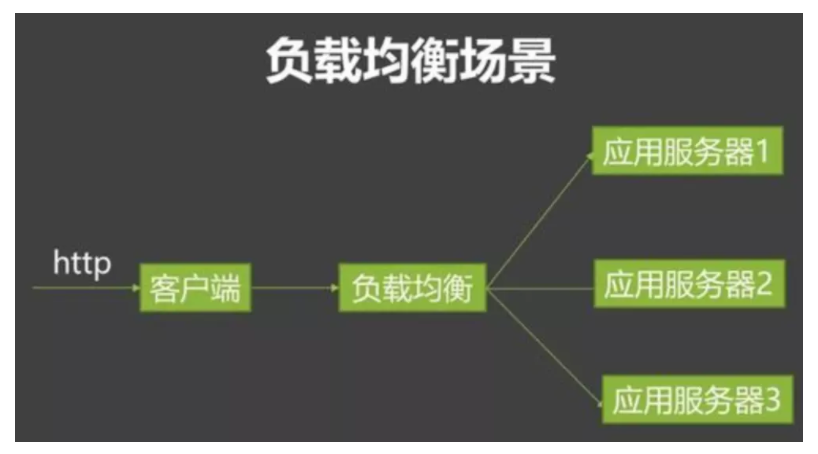
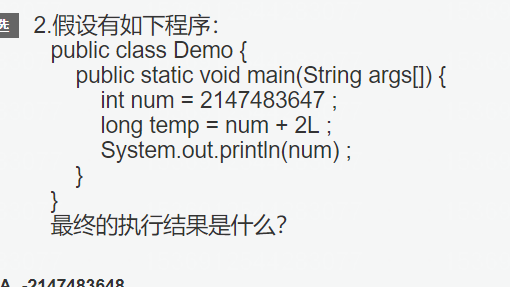
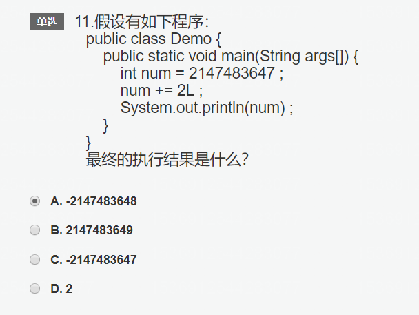
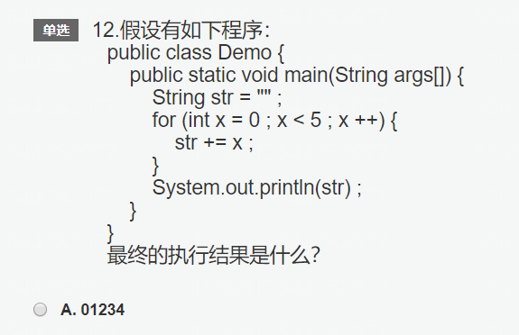
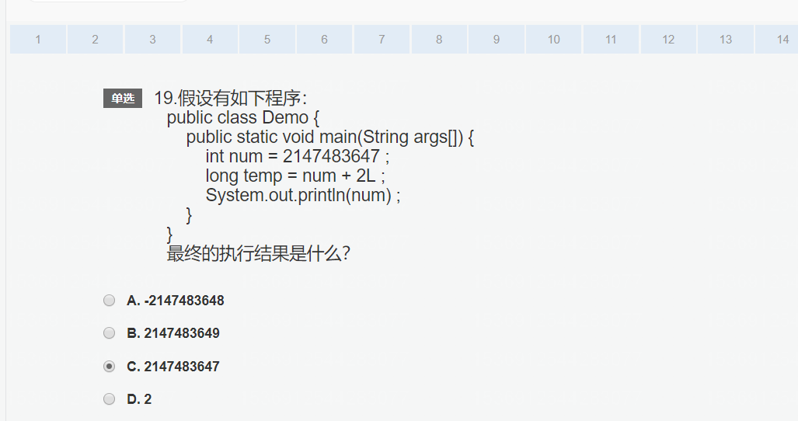
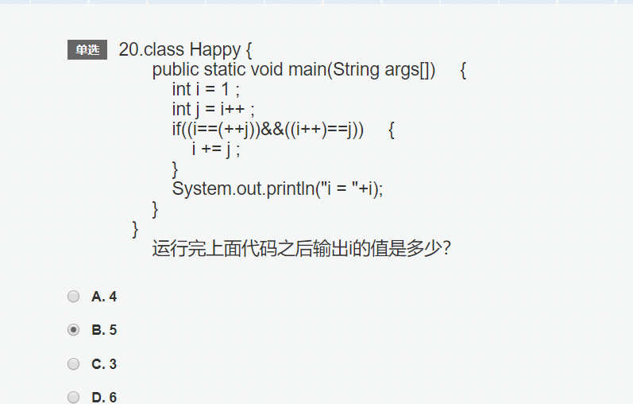
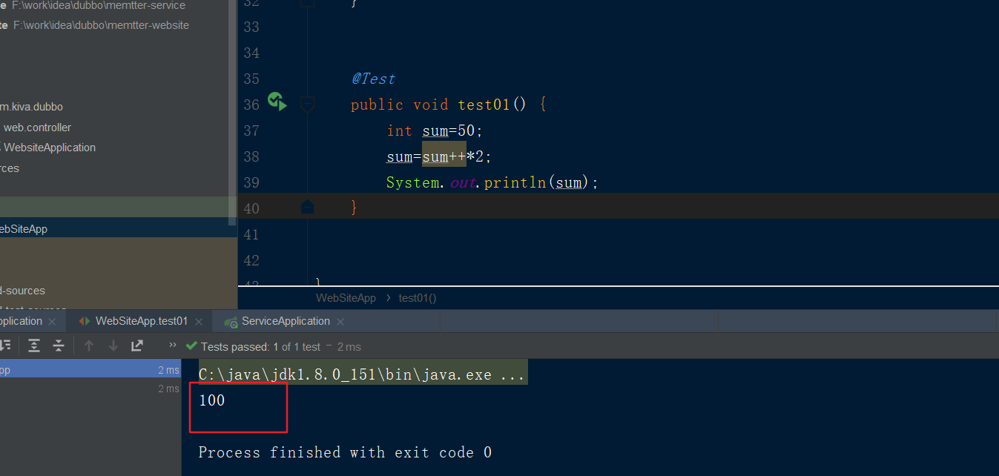

### 分布式
将一套系统拆分成不同子系统部署在不同服务器上
### 集群
部署多个相同的子系统在不同的服务器上
### 负载均衡
部署在不同服务器上的同一个子系统(集群)需要做负载均衡。

在服务器集群中，需要有一台服务器充当调度者的角色，用户的所有请求都会首先由它接收，调度者再根据每台服务器的负载情况将请求分配给某一台后端服务器去处理。那么在这个过程中，调度者如何合理分配任务，保证所有后端服务器都将性能充分发挥，从而保持服务器集群的整体性能最优，这就是负载均衡。

参考网站:
https://www.jianshu.com/p/749241b9fb2f
https://blog.csdn.net/qq_37788067/article/details/79250623

区别:
* 将一套系统拆分成不同子系统部署在不同服务器上（这叫分布式），然后部署多个相同的子系统在不同的服务器上（这叫集群），部署在不同服务器上的同一个子系统应做负载均衡。

* 分布式：一个业务拆分为多个子业务，部署在多个服务器上 。

* 集群：同一个业务，部署在多个服务器上

