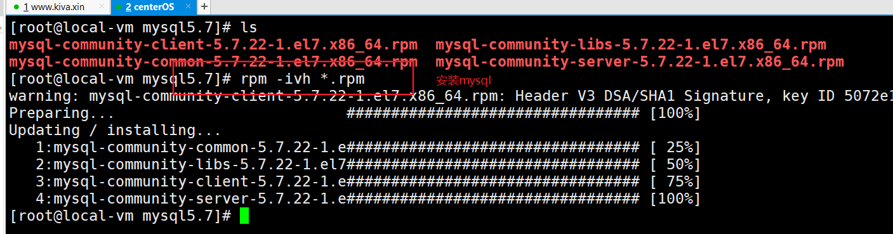
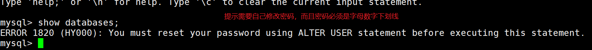
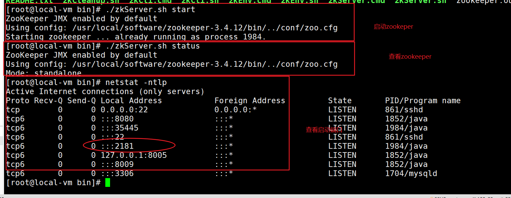
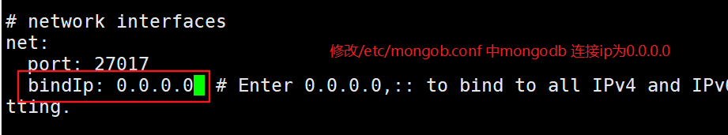

## vi 操作命令

参考网站: https://www.runoob.com/linux/linux-vim.html

#### 命令模式

| 按键   | 注释   |
| :------------- | :------------- |
| [Ctrl] + [f]   | 屏幕『向下』移动一页，相当于 [Page Down]按键 (常用)  
|  [Ctrl] + [b]  | 屏幕『向上』移动一页，相当于 [Page Up] 按键 (常用)
|0 或功能键[Home] | 数字『 0 』:移动到这一行的最前面字符处 (常用)
|$ 或功能键[End]| 移动到这一行的最后面字符处(常用)
|G	| 移动到这个档案的最后一行(常用)
| g | 	移动到这个档案的第一行，相当于 1G 啊！ (常用)
|gg |	移动到这个档案的第一行，相当于 1G 啊！ (常用)

#### 搜索替换

| 按键   | 注释   |
| :------------- | :------------- |
|/word	| 向光标之下寻找一个名称为 word 的字符串。
|?word	| 向光标之上寻找一个字符串名称为 word 的字符串。
|n	| 这个 n 是英文按键。代表重复前一个搜寻的动作。举例来说， 如果刚刚我们执行 /vbird 去向下搜寻 vbird 这个字符串，则按下 n 后，会向下继续搜寻下一个名称为 vbird 的字符串。如果是执行 ?vbird 的话，那么按下 n 则会向上继续搜寻名称为 vbird 的字符串！
|N	| 这个 N 是英文按键。与 n 刚好相反，为『反向』进行前一个搜寻动作。 例如 /vbird 后，按下 N 则表示『向上』搜寻 vbird 。
|:n1,n2s/word1/word2/g |	n1 与 n2 为数字。在第 n1 与 n2 行之间寻找 word1 这个字符串，并将该字符串取代为 word2 ！举例来说，在 100 到 200 行之间搜寻 vbird 并取代为 VBIRD 则：『:100,200s/vbird/VBIRD/g』。(常用)
|:1,$s/word1/word2/g 或 :%s/word1/word2/g	| 从第一行到最后一行寻找 word1 字符串，并将该字符串取代为 word2 ！(常用)

#### 删除、复制与贴上
| 按键   | 注释   |
| :------------- | :------------- |
|x, X |	在一行字当中，x 为向后删除一个字符 (相当于 [del] 按键)， X 为向前删除一个字符(相当于 [backspace] 亦即是退格键) (常用)
|dd |	删除游标所在的那一整行(常用)
|ndd |	n 为数字。删除光标所在的向下 n 行，例如 20dd 则是删除 20 行 (常用)
|yy |	复制游标所在的那一行(常用)
|nyy |	n 为数字。复制光标所在的向下 n 行，例如 20yy 则是复制 20 行(常用)
|p, P |	p 为将已复制的数据在光标下一行贴上，P 则为贴在游标上一行！
|u	| 复原前一个动作。(常用)
|[Ctrl]+r |	重做上一个动作。(常用)


#### 底行命令
| 按键   | 注释   |
| :-----------------| :------------- |
|:set nu |   显示行数
|:set nonu | 取消显示行数
|:w | 	将编辑的数据写入硬盘档案中
|:w! |	若文件属性为『只读』时，强制写入该档案。不过，到底能不能写入， 还是跟你对该档案的档案权限有关啊！
|:q |	离开 vi (常用)
|:q! |	若曾修改过档案，又不想储存，使用 ! 为强制离开不储存档案。
|:wq |	储存后离开，若为 :wq! 则为强制储存后离开 (常用)

注意一下啊，那个惊叹号 (!) 在 vi 当中，常常具有『强制』的意思～
## 用户管理

权限:定义资源或服务的访问能力,称之为权限

Linux系统是一个多用户多任务的分时操作系统，任何一个要使用系统资源的用户，都必须首先向系统管理员申请一个账号，然后以这个账号的身份进入系统。

定义一类用户具有访问某个资源或服务的能力. 用户组(存放一些列用户的容器),同时用户组还拥有具有访问某个资源的权限

定义一个资源的权限:
	① 用户具有该资源的权限(文件所有者,属主)
	② 用户组具有该资源的权限(属组)
	③ 其他用户(既不是属主,也不是属组)

#### 用户账号的添加、删除与修改。
```
查看系统用户
cat /etc/passwd

创建用户
useradd [用户名]

创建用户并分配一个组
useradd -G [组名] [用户名]

删除用户 ：-r，它的作用是把用户的主目录一起删除。
userdel -r [用户名]

修改用户
usermod -G [组名] [用户名]  修改用户组信息

设置用户密码
passwd 用户名
```
#### Linux系统用户组的管理
```
创建用户组
groupadd 组名

查看系统用户组
cat /etc/group

删除组
groupdel 组名
```

## 文件权限

Linux系统是一种典型的多用户系统，不同的用户处于不同的地位，拥有不同的权限。为了保护系统的安全性，Linux系统对不同的用户访问同一文件（包括目录文件）的权限做了不同的规定。

使用ls 查看显示一个文件的属性以及文件所属的用户和组如下:
```
[root@local-vm ~]# ls -l
drwxr-xr-x. 4 root root   32 Jul 27 21:56 project
```


#### 文件类型：
在Linux中第一个字符代表这个文件是目录、文件或链接文件等等。

当为[ d ]则是目录
当为[ - ]则是文件；
若是[ l ]则表示为链接文档(link file)；
#### 文件角色权限
文件所有者 :  u
文件所属组 :  g
其他人 :  o

#### 修改文件权限
Linux文件属性有两种设置方法，一种是数字，一种是符号。

Linux文件的基本权限就有九个，分别是owner/group/others三种身份各有自己的read/write/execute权限。

#### 使用数字设置
可以使用数字来代表各个权限，各权限的分数对照表如下

r ： 4   （100）
w :  2   （010）
x :  1	 （001）

```
示例: rwxr-xr-x	755
chmod 755 文件
```

#### 使用符号设置

还有一个改变权限的方法，从之前的介绍中我们可以发现，基本上就九个权限分别是：

(1)user
(2)group
(3)others
那么我们就可以使用 u, g, o 来代表三种身份的权限！

此外， a 则代表 all，即全部的身份。读写的权限可以写成 r, w, x，也就是可以使用下表的方式来看：


例子:
```
#给当前用户添加指定文件的x执行权限
chmod u+x 文件

#给该文件用户组合其他人添加指定文件的w写的权限
chmod g+w,o+w 文件

#给该文件的当前用户,当前组,其他人 添加rwx可读可写可执行的权限
chmod a=rwx 文件
```

### 修改文件所有者
```
修改文件的所有者:	用法:chown 用户名 文件名

修改文件的所属组:	用法:chgrp 组名 文件名
```

## 计算机网络
1. ip 地址: 计算机在网络上的标志，是一个逻辑地址
2. Mac地址 ：物理地址，和计算机的网卡是绑定的，唯一的
3. 子网掩码: 不同ip之间的通信，使用位运算判断是否是同一个网段
4. DNS 域名解析服务器


## 系统服务管理

```
启动服务：systemctl start <服务名>
关闭服务：systemctl stop <服务名>
重启服务：systemctl restart <服务名>
查看服务状态：systemctl status <服务名>
添加开机启动项：systemctl enable <服务名>
禁止开机启动项：systemctl disable <服务名>
查看开机启动项：systemctl list-unit-files
```


## 进程查看
用于报告当前系统的进程状态。可以搭配kill指令随时中断、删除不必要的程序。
```
ps -ef 显示出的结果：
    1.UID       用户ID
    2.PID        进程ID
    3.PPID      父进程ID
    4.C           CPU占用率
    5.STIME     开始时间
    6.TTY         开始此进程的TTY----终端设备
    7.TIME       此进程运行的总时间
    8.CMD       命令名.

杀死进程:kill -9 pid   :kill  pid
```

### 防火墙

```
防火墙配置命令：firewall-cmd
防火墙帮助：
fireweall-cmd --help

查看防火墙状态：
firewall-cmd --state

查看所有打开的端口：
firewall-cmd --zone=public --list-ports

开启端口：
firewall-cmd --zone=public --add-port=端口号/tcp --permanent（--permanent参数为永久生效，不加则重启后失效）

更新防火墙规则：
firewall-cmd --reload

删除端口：
firewall-cmd --zone=public --remove-port=端口号/tcp --permanent
```


```


开启防火墙
systemctl start firewalld

查看防火墙的状态是否开启
systemctl status firewalld

关闭防火墙
    |-- 关闭  systemctl stop firewalld
    |-- 关闭开机启动  systemctl disable firewalld

添加一个放行端口 3306
firewall-cmd --zone=public --add-port=27017/tcp --permanent
# 重新开启规则
firewall-cmd --reload

删除端口 9200
firewall-cmd --zone=public --remove-port=3306/tcp --permanent
```


## linux 应用
### linux 系统软件安装的方式

Linux系统是使用软件包管理器来进行软件的安装、卸载和查询等操作的。
软件包管理器又分为后端工具和前端工具。
后端工具有rpm， dpt
前端工具有yum

后端工具存在的问题：
X --->Y
X --->Y --->Z
X --->Y ---X

所以前端工具yum的出现是为了解决后端工具软件依赖关系的问题

如何解决？
具体就是yum工具会根据你要安装的软件解析该软件的依赖树，然后把整个依赖树的软件从网上（yum库）下载下来，再进行安装。
其实yum工具是基于后端软件包管理工具的。

### rpm 安装
```
强制安装
rpm -ivh httpd-2.4.29-5.fc28.x86_64.rpm  --nodeps --force

查询软件是否安装
rpm -q 软件名称

查看所有被安装的软件
rpm -qa |grep httpd

查看安装目录
rpm -ql 软件名称

查看软件的配置文件
rpm -qc 软件名称

卸载
rpm -e 软件名称
```

### yum 常用命令

```
查看yum库中的所有包
yum list

安装软件，会自动添加依赖
yum install 软件名 -y

卸载软件
yum remove 软件名 -y

搜索指定命令对应的软件
yum search 软件名称
```

#### 安装ifconfig
搜索指定命令对应的软件
yum search ifconfig
yum install net-tools.x86_64 -y

#### 安装httpd
yum install httpd -y

## jdk 的安装
1. 解压 tar.gz ,移动到 /usr/local
    |-- tar -zxvf  文件名 -C /usr/local
2. 配置环境变量/etc/profile
  export JAVA_HOME=/usr/local/jdk1.8
  export PATH=$PATH:$JAVA_HOME/bin
$PATH 是原先的环境变量，使用 : 作为分割符
4. source /etc/profile 重新加载配置文件
5. java -version 验证是否安装成功

## tomcat 的安装
1. 解压压缩
tar -zxvf tomcat安装包 -C 解压到对一个的文件路径
2. 启动tomcat
sh startup.sh
3. 查看是否启动
      |-- ps -ef |grep tomcat    // 查看进程
      |--netstat -ntlp  // 查看服务端口
      |-- tail -100f catalog.log  //查看日志文件
4. 需要注意防火墙

## mysql 的安装
注意 ：
1. 先把postfix 和mariadb-libs卸载掉，不然的会有依赖包冲突：
```
[root@root]#  rpm -e postfix mariadb-libs
```

2. 安装mysql的依赖net-tools和 perl
```
yum -y install net-tools perl
```

3. 同时安装对应的rpm 包
```
rpm -ivh *.rpm
```


4. 设置开机启动
[root@root]#  systemctl enable mysqld

5. 启动服务

```
[root@root]#  systemctl start mysqld
查看是否启动成功
1. ps -ef |grep mysqld
2. netstat -ntlp
3. systemctl status mysqld
```

6. 使用临时密码登陆并且修改密码

```
1. 查看/var/log/mysqld.log 文件
临时密码: IpA>9Qbjh=Ot
2. 修改密码
ALTER USER 'root'@'localhost' IDENTIFIED BY 'Kiva_2019';
```

提示需要修改密码


7. 配置远程连接

```
开放远程登录权限
mysql> GRANT ALL PRIVILEGES ON *.* TO 'root'@'%' IDENTIFIED BY 'Kiva_2019'  WITH GRANT OPTION;
mysql> FLUSH PRIVILEGES;  // 刷新缓存
```

8. 关闭防火墙或开放3306端口

```
开放mysql的3306端口
[root@wolfcode]# firewall-cmd --zone=public --add-port=3306/tcp --permanent
[root@wolfcode]# firewall-cmd --reload
```

## crm 项目的部署
1. 配置项目中的数据库连接
|-- 修改mysql的密码
|-- 解决中文乱码问题,配置数据库的连接utf-8格式
useUnicode=true&characterEncoding=utf-8


2. 创建crm 目录，存放war包
3. 使用unzip 解压项目
4. 修改server.xml
```
|-- docBase="路径"
|-- path="/"
  <Context docBase="/root/project/crm" path="/"/>
```
5. 重新启动tomcat
6. 查看日志
  |-- tail -100f 配置文件

## zookeeper 安装
1. 解压zookeeper
  |-- tar -zxvf 软件名 -C 安装路径
  tar -zxvf zookeeper-3.4.12.tar.gz -C /usr/local/software/
2. 在zookeeper-3.4.12 目录下创建data 目录用于保存数据
```
/usr/local/software/zookeeper-3.4.12/data
```
3. 拷贝zoo_sample.cfg zoo.cfg
```
[root@local-vm conf]# pwd
/usr/local/software/zookeeper-3.4.12/conf  // 当前目录
[root@local-vm conf]# cp zoo_sample.cfg zoo.cfg  //赋值一份配置文件
```
4. 修改配置文件 dataDir=data 文件夹
```
dataDir=/usr/local/software/zookeeper-3.4.12/data
```
5. 启动zookeeper
```
启动zookeeper
[root@local-vm bin]# ./zkServer.sh start
查看状态
[root@local-vm bin]# ./zkServer.sh status
```
6. 使用netstat -ntlp : 查询2181端口




## mongodb的安装
1. 使用rpm安装
```
rpm -ivh  /root/soft/mongodb-org-server-4.0.10-1.el7.x86_64.rpm
```
2. 查看状态
```
[root@local-vm etc]# systemctl status mongod
```
3. 开启服务
```
[root@local-vm etc]# systemctl start mongod
```
4. 查看mongodb 的配置文件的位置
```
[root@local-vm sofe]# rpm -qc mongodb-org-server-4.0.10-1.el7.x86_64
/etc/mongod.conf
/var/log/mongodb/mongod.log
```
5. 修改配置文件/etc/mongod.conf, 设置可以远程访问
```
vi /etc/mongod.conf
修改bindIp:0.0.0.0
```


6. 重启服务  systemctl restart mongod
7. 使用netstat -ntlp 查看27017端口

## 安装es 服务
1. 使用rpm安装
```
[root@local-vm sofe]# rpm -ivh elasticsearch-6.5.4.rpm
```

2. 修改elasticsearch-env ,配置环境变量JAVA_HOME

```
1. 切换到  /usr/share/elasticsearch/bin 目录下修改elasticsearch-env
[root@local-vm bin]# vi elasticsearch-env
2.  在第一行,指定JAVA_HOME的路径 配置
#!/bin/bash
export JAVA_HOME=/usr/local/software/jdk1.8
```

第一次启动时报错，需要在elasticSearch中配置java_home


2. 查看状态
[root@local-vm bin]# systemctl start elasticsearch
3. 开启服务
[root@local-vm bin]# systemctl start elasticsearch
4. 使用netstat -ntlp 查看9300端口

## 安装ik分词器插件
1. 查看elasticsearch 的路径, ql列出elasticsearch该包中有哪些文件
[root@local-vm sofe]# rpm -ql elasticsearch
/usr/share/elasticsearch/plugins 存放插件目录

2. 赋值 ik 插件到插件目录下
[root@local-vm sofe]# cp elasticsearch-analysis-ik-6.5.4 /usr/share/elasticsearch/plugins

3. 重新启动 elasticsearch
[root@local-vm plugins]# systemctl restart elasticsearch


## 安装可视化插件kibana
1. 直接解压kibana插件
tar -zxvf kibana-6.5.4-linux-x86_64.tar.gz  -C /usr/local/software
2. 切换到config
  cd /usr/local/software/kibana-6.5.4-linux-x86_64/config
3. 查看kibana.yml
    |-- 修改 server.host: "0.0.0.0"
4. 在bin目录下启动 kibana
5. 访问kibana ip:5601


## redis 的安装(先编译后安装)
1. 解压redis
  tar -zxvf /root/soft/redis-3.2.9.tar.gz -C /usr/local/software/redis-3.2.9.tar.gz
2. 安装gcc编译工具
  yum install gcc -y
3. 执行编译与安装
   进入到redis目录,执行make
   进入到src目录,执行make install
4. 配置后台启动,修改配置文件redis.conf
	daemonize：后台运行，值为yes | no 默认为no
	vi /usr/local/redis-3.2.9/redis.conf
	daemonize yes
5. 启动redis
/usr/local/redis-3.2.9/src/redis-server /usr/local/redis-3.2.9/redis.conf
6. 验证启动是否成功:
ps -ef | grep redis 查看是否有redis服务
查看端口:netstat -ntlp | grep 6379


## luowowo 项目部署
1. 启动项目
    |-- java -jar 启动多个服务
2. 修改的配置信息
    |-- 修改mysql 连接信息
    |-- 修改图片上传的路径
3. 打包项目
    |-- springboot 打包插件


```xml

需要修改的信息:
application-jdbc.properties  修改数据库连接密码

后台和前台系统的文件存路径
file.path=/img/upload

	在父项目中配置
        <!--告诉idea去src/main/java加载一些配置文件, 这里仅仅用于将mybatisxml文件方指定mapper接口包中, idea也可以加载-->
        <resources>
            <resource>
                <directory>src/main/java</directory>
                <includes>
                    <include>**/*.xml</include>
                </includes>
            </resource>
            <resource>
                <directory>src/main/resources</directory>
            </resource>
        </resources>

  打成可执行Jar包

    <build>
        <finalName>名字记得修改</finalName>
        <plugins>
            <plugin>
                <groupId>org.springframework.boot</groupId>
                <artifactId>spring-boot-maven-plugin</artifactId>
                <executions>
                    <execution>
                        <goals>
                            <goal>repackage</goal>
                        </goals>
                    </execution>
                </executions>
            </plugin>
        </plugins>
    </build>

对于不用打成可执行jar包的配置maven插件
    <build>
        <finalName>trip-article-api</finalName>
        <plugins>
            <plugin>
                <groupId>org.apache.maven.plugins</groupId>
                <artifactId>maven-compiler-plugin</artifactId>
                <configuration>
                    <source>1.8</source>
                    <target>1.8</target>
                    <encoding>UTF-8</encoding>
                </configuration>
            </plugin>
        </plugins>
    </build>

```
