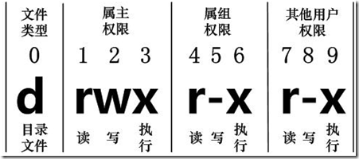
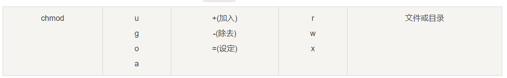

## 文件权限

Linux系统是一种典型的多用户系统，不同的用户处于不同的地位，拥有不同的权限。为了保护系统的安全性，Linux系统对不同的用户访问同一文件（包括目录文件）的权限做了不同的规定。

使用ls 查看显示一个文件的属性以及文件所属的用户和组如下:
```
[root@local-vm ~]# ls -l
drwxr-xr-x. 4 root root   32 Jul 27 21:56 project
```



#### 文件类型：
在Linux中第一个字符代表这个文件是目录、文件或链接文件等等。

当为[ d ]则是目录
当为[ - ]则是文件；
若是[ l ]则表示为链接文档(link file)；
#### 文件角色权限
文件所有者 :  u
文件所属组 :  g
其他人 :  o

#### 修改文件权限
Linux文件属性有两种设置方法，一种是数字，一种是符号。

Linux文件的基本权限就有九个，分别是owner/group/others三种身份各有自己的read/write/execute权限。

#### 使用数字设置
可以使用数字来代表各个权限，各权限的分数对照表如下

r ： 4   （100）
w :  2   （010）
x :  1	 （001）

```
示例: rwxr-xr-x	755
chmod 755 文件
```

#### 使用符号设置

还有一个改变权限的方法，从之前的介绍中我们可以发现，基本上就九个权限分别是：

(1)user
(2)group
(3)others
那么我们就可以使用 u, g, o 来代表三种身份的权限！

此外， a 则代表 all，即全部的身份。读写的权限可以写成 r, w, x，也就是可以使用下表的方式来看：



例子:
```
#给当前用户添加指定文件的x执行权限
chmod u+x 文件

#给该文件用户组合其他人添加指定文件的w写的权限
chmod g+w,o+w 文件

#给该文件的当前用户,当前组,其他人 添加rwx可读可写可执行的权限
chmod a=rwx 文件
```

### 修改文件所有者
```
修改文件的所有者:	用法:chown 用户名 文件名

修改文件的所属组:	用法:chgrp 组名 文件名
```
