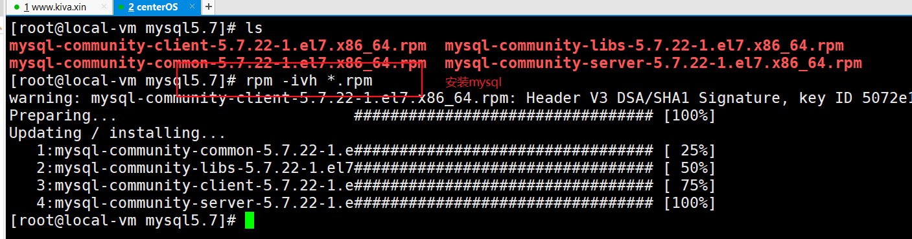
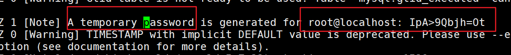
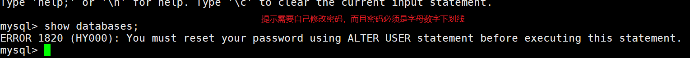
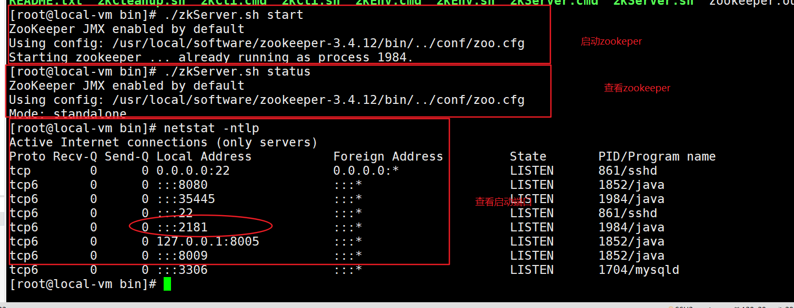
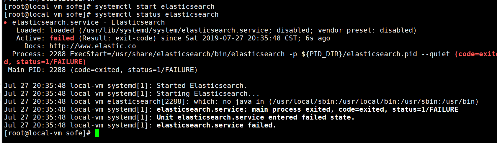

## jdk 的安装
1. 解压 tar.gz ,移动到 /usr/local
    |-- tar -zxvf  文件名 -C /usr/local
2. 配置环境变量/etc/profile
    export JAVA_HOME=/usr/local/soft/jdk1.8
    export PATH=$PATH:$JAVA_HOME/bin
$PATH 是原先的环境变量，使用 : 作为分割符
4. source /etc/profile 重新加载配置文件
5. java -version 验证是否安装成功

## tomcat 的安装
1. 解压压缩
tar -zxvf tomcat安装包 -C 解压到对一个的文件路径
2. 启动tomcat
sh startup.sh
3. 查看是否启动
      |-- ps -ef |grep tomcat    // 查看进程
      |--netstat -ntlp  // 查看服务端口
      |-- tail -100f catalog.log  //查看日志文件
4. 需要注意防火墙

## mysql 的安装
注意 ：
1. 先把postfix 和mariadb-libs卸载掉，不然的会有依赖包冲突：
```
[root@root]#  rpm -e postfix mariadb-libs
```

2. 安装mysql的依赖net-tools和 perl
```
yum -y install net-tools perl
```

3. 同时安装对应的rpm 包
```
rpm -ivh *.rpm
```


4. 设置开机启动
[root@root]#  systemctl enable mysqld

5. 启动服务

```
[root@root]#  systemctl start mysqld
查看是否启动成功
1. ps -ef |grep mysqld
2. netstat -ntlp
3. systemctl status mysqld
```

6. 使用临时密码登陆并且修改密码

```
1. 查看/var/log/mysqld.log 文件
临时密码: IpA>9Qbjh=Ot
2. 修改密码
ALTER USER 'root'@'localhost' IDENTIFIED BY 'Kiva_2019';
```

提示需要修改密码


7. 配置远程连接

```
开放远程登录权限
mysql> GRANT ALL PRIVILEGES ON *.* TO 'root'@'%' IDENTIFIED BY 'Kiva_2019'  WITH GRANT OPTION;
mysql> FLUSH PRIVILEGES;  // 刷新缓存
```

8. 关闭防火墙或开放3306端口

```
开放mysql的3306端口
[root@wolfcode]# firewall-cmd --zone=public --add-port=3306/tcp --permanent
[root@wolfcode]# firewall-cmd --reload
```

## crm 项目的部署
1. 配置项目中的数据库连接
|-- 修改mysql的密码
|-- 解决中文乱码问题,配置数据库的连接utf-8格式
useUnicode=true&characterEncoding=utf-8


2. 创建crm 目录，存放war包
3. 使用unzip 解压项目
4. 修改server.xml
```
|-- docBase="路径"
|-- path="/"
  <Context docBase="/root/project/crm" path="/"/>
```
5. 重新启动tomcat
6. 查看日志
    |-- tail -100f 配置文件

## zookeeper 安装
1. 解压zookeeper
    |-- tar -zxvf 软件名 -C 安装路径
    tar -zxvf zookeeper-3.4.12.tar.gz -C /usr/local/software/
2. 在zookeeper-3.4.12 目录下创建data 目录用于保存数据
```
/usr/local/software/zookeeper-3.4.12/data
```
3. 拷贝zoo_sample.cfg zoo.cfg
```
[root@local-vm conf]# pwd
/usr/local/software/zookeeper-3.4.12/conf  // 当前目录
[root@local-vm conf]# cp zoo_sample.cfg zoo.cfg  //赋值一份配置文件
```
4. 修改配置文件 dataDir=data 文件夹
```
dataDir=/usr/local/software/zookeeper-3.4.12/data
```
5. 启动zookeeper
```
启动zookeeper
[root@local-vm bin]# ./zkServer.sh start
查看状态
[root@local-vm bin]# ./zkServer.sh status
```
6. 使用netstat -ntlp : 查询2181端口




## mongodb的安装
1. 使用rpm安装
```
rpm -ivh  /root/soft/mongodb-org-server-4.0.10-1.el7.x86_64.rpm
```
2. 查看状态
```
[root@local-vm etc]# systemctl status mongod
```
3. 开启服务
```
[root@local-vm etc]# systemctl start mongod
```
4. 查看mongodb 的配置文件的位置
```
[root@local-vm sofe]# rpm -qc mongodb-org-server-4.0.10-1.el7.x86_64
/etc/mongod.conf
/var/log/mongodb/mongod.log
```
5. 修改配置文件/etc/mongod.conf, 设置可以远程访问
```
vi /etc/mongod.conf
修改bindIp:0.0.0.0
```


6. 重启服务  systemctl restart mongod
7. 使用netstat -ntlp 查看27017端口

## 安装es 服务
1. 使用rpm安装
```
[root@local-vm sofe]# rpm -ivh elasticsearch-6.5.4.rpm
```

2. 修改elasticsearch-env ,配置环境变量JAVA_HOME

```
1. 切换到  /usr/share/elasticsearch/bin 目录下修改elasticsearch-env
[root@local-vm bin]# vi elasticsearch-env
2.  在第一行,指定JAVA_HOME的路径 配置
#!/bin/bash
export JAVA_HOME=/usr/local/software/jdk1.8
```

第一次启动时报错，需要在elasticSearch中配置java_home



2. 查看状态
[root@local-vm bin]# systemctl start elasticsearch
3. 开启服务
[root@local-vm bin]# systemctl start elasticsearch
4. 使用netstat -ntlp 查看9300端口

## 安装ik分词器插件
1. 查看elasticsearch 的路径, ql列出elasticsearch该包中有哪些文件
[root@local-vm sofe]# rpm -ql elasticsearch
/usr/share/elasticsearch/plugins 存放插件目录

2. 赋值 ik 插件到插件目录下
[root@local-vm sofe]# cp elasticsearch-analysis-ik-6.5.4 /usr/share/elasticsearch/plugins

3. 重新启动 elasticsearch
[root@local-vm plugins]# systemctl restart elasticsearch


## 安装可视化插件kibana
1. 直接解压kibana插件
tar -zxvf kibana-6.5.4-linux-x86_64.tar.gz  -C /usr/local/software
2. 切换到config
    cd /usr/local/software/kibana-6.5.4-linux-x86_64/config
3. 查看kibana.yml
    |-- 修改 server.host: "0.0.0.0"
4. 在bin目录下启动 kibana
5. 访问kibana ip:5601


## redis 的安装(先编译后安装)
1. 解压redis
    tar -zxvf /root/soft/redis-3.2.9.tar.gz -C /usr/local/software/redis-3.2.9.tar.gz
2. 安装gcc编译工具
    yum install gcc -y
3. 执行编译与安装
   进入到redis目录,执行make
   进入到src目录,执行make install
4. 配置后台启动,修改配置文件redis.conf
	daemonize：后台运行，值为yes | no 默认为no
	vi /usr/local/redis-3.2.9/redis.conf
	daemonize yes
5. 启动redis
/usr/local/redis-3.2.9/src/redis-server /usr/local/redis-3.2.9/redis.conf
6. 验证启动是否成功:
ps -ef | grep redis 查看是否有redis服务
查看端口:netstat -ntlp | grep 6379
7. 访问不了时关闭redis.conf 中的protected的保护模式


## luowowo 项目部署
1. 启动项目
    |-- java -jar 启动多个服务
2. 修改的配置信息
    |-- 修改mysql 连接信息
    |-- 修改图片上传的路径
3. 打包项目
    |-- springboot 打包插件


```xml

需要修改的信息:
application-jdbc.properties  修改数据库连接密码

后台和前台系统的文件存路径
file.path=/img/upload

	在父项目中配置
        <!--告诉idea去src/main/java加载一些配置文件, 这里仅仅用于将mybatisxml文件方指定mapper接口包中, idea也可以加载-->
        <resources>
            <resource>
                <directory>src/main/java</directory>
                <includes>
                    <include>**/*.xml</include>
                </includes>
            </resource>
            <resource>
                <directory>src/main/resources</directory>
            </resource>
        </resources>

  打成可执行Jar包

    <build>
        <finalName>名字记得修改</finalName>
        <plugins>
            <plugin>
                <groupId>org.springframework.boot</groupId>
                <artifactId>spring-boot-maven-plugin</artifactId>
                <executions>
                    <execution>
                        <goals>
                            <goal>repackage</goal>
                        </goals>
                    </execution>
                </executions>
            </plugin>
        </plugins>
    </build>

对于不用打成可执行jar包的配置maven插件
    <build>
        <finalName>trip-article-api</finalName>
        <plugins>
            <plugin>
                <groupId>org.apache.maven.plugins</groupId>
                <artifactId>maven-compiler-plugin</artifactId>
                <configuration>
                    <source>1.8</source>
                    <target>1.8</target>
                    <encoding>UTF-8</encoding>
                </configuration>
            </plugin>
        </plugins>
    </build>

```
