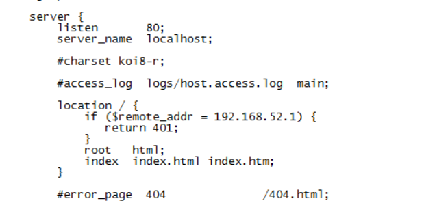

## location配置

nginx虚拟主机配置:

``` shell
server {
        #监听端口
        listen       80;
        #监听域名
        server_name  localhost;

        #返回的相应文件地址
        location / {
           #返回根路径地址（相对路径:相对于/usr/local/nginx/）
            root   html;
            index  index.html index.htm; #默认访问文件
        }
}
```

### 语法规则
```
语法规则： location [=|~|~*|^~] /uri/ { … }
==========================================================================
= 开头表示精确匹配
^~ 开头表示uri以某个常规字符串开头，理解为匹配 url路径即可。
~ 开头表示区分大小写的正则匹配
~*  开头表示不区分大小写的正则匹配
!~和!~*分别为区分大小写不匹配及不区分大小写不匹配 的正则
/ 通用匹配，任何请求都会匹配到。
首先匹配 =，其次匹配^~, 其次是按文件中顺序的正则匹配，最后是交给 / 通用匹配。当有匹配成功时候，停止匹配，按当前匹配规则处理请求。
```

### 匹配规则
```shell
# 精确匹配 /开头  
location = / {
   #规则A
}
# 精确匹配/login
location = /login {
   #规则B
}
# 匹配 以 /static/ 开头区分大小写
location ^~ /static/ {
   #规则C
}
#  ~ 区分大小写  $ 结尾  \. 是转译符
location ~ \.(gif|jpg|png|js|css)$ {
   #规则D
}
# 不区分大小写
location ~* \.png$ {
   #规则E
}
# 不匹配 .xhtml 结尾区分大小写
location !~ \.xhtml$ {
   #规则F
}
# 不匹配 .xhtml 结尾不区分大小写
location !~* \.xhtml$ {
   #规则G
}
# 通用匹配
location / {
   #规则H
}
```

案例:
```
那么产生的效果如下：
访问根目录/， 比如http://localhost/ 将匹配规则A
访问 http://localhost/login 将匹配规则B，http://localhost/register 则匹配规则H
访问 http://localhost/static/a.html 将匹配规则C
访问 http://localhost/a.gif, http://localhost/b.jpg 将匹配规则D和规则E，
但是规则D顺序优先，规则E不起作用，
而 http://localhost/static/c.png 则优先匹配到 规则C

访问 http://localhost/a.PNG 则匹配规则E， 而不会匹配规则D，因为规则E不区分大小写。

访问 http://localhost/a.xhtml 不会匹配规则F和规则G，
http://localhost/a.XHTML不会匹配规则G，因为不区分大小写。规则F，规则G属于排除法，符合匹配规则但是不会匹配到，所以想想看实际应用中哪里会用到。

访问 http://localhost/category/id/1111 则最终匹配到规则H，因为以上规则都不匹配，这个时候应该是nginx转发请求给后端应用服务器，比如FastCGI（php），tomcat（jsp），nginx作为方向代理服务器存在。
```


#### 实际应用配置
```
#直接匹配网站根，通过域名访问网站首页比较频繁，使用这个会加速处理，官网如是说。
#这里是直接转发给后端应用服务器了，也可以是一个静态首页
# 第一个必选规则
location = / {
    proxy_pass http://tomcat:8080/index
}

# 第二个必选规则是处理静态文件请求，这是nginx作为http服务器的强项
# 有两种配置模式，目录匹配或后缀匹配,任选其一或搭配使用
location ^~ /static/ {
    root /webroot/static/;
}
location ~* \.(gif|jpg|jpeg|png|css|js|ico)$ {
    root /webroot/res/;
}

#第三个规则就是通用规则，用来转发动态请求到后端应用服务器
#非静态文件请求就默认是动态请求，自己根据实际把握
#毕竟目前的一些框架的流行，带.php,.jsp后缀的情况很少了
location / {
    proxy_pass http://tomcat:8080/
}

```

监听客户端 : 配置ip 禁用
1. 查看 access.log 日志文件中访问的ip地址
2. 编辑 nginx.conf 配置文件，设置如果是指定的ip地址，返回401

```
if(条件为: =~~*) return、break、rewrite
if  ($remote_addr = 192.168.195.1)  {
	return 401;
}
```



