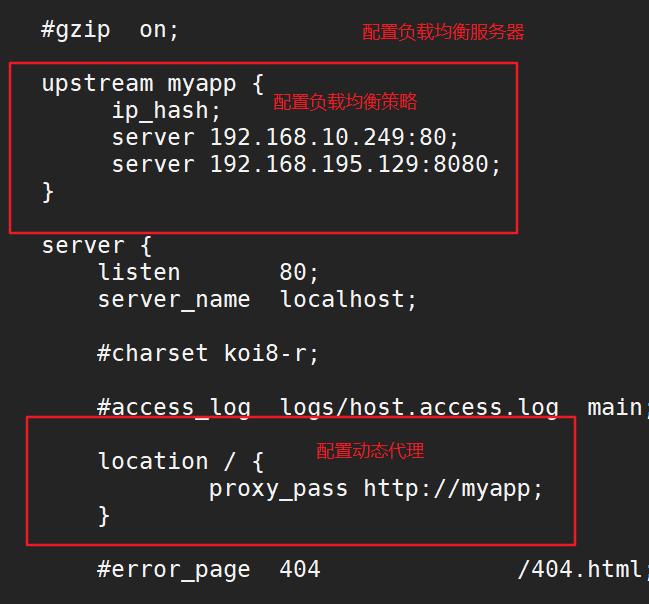

## 负载均衡

```
#设定负载均衡的服务器列表
	#upstream myproject {
		#weigth参数表示权值，权值越高被分配到的几率越大
		#max_fails 当有#max_fails个请求失败，就表示后端的服务器不可用，默认为1，将其设置为0可以关闭检查
		#fail_timeout 在以后的#fail_timeout时间内nginx不会再把请求发往已检查出标记为不可用的服务器
	#}

# 设置负载均衡服务器 + ip_hash 负载均衡策略，同一个客户端请求都访问同一个服务器
upstream myapp {  
 ip_hash;
 server 192.168.10.249:80 weight=1 max_fails=2 fail_timeout=30s;   
 server 192.168.195.129:8080 weight=1 max_fails=2 fail_timeout=30s;  
}

# 设置访问服务器
location / {
  proxy_pass http://myapp;  
}
```

步骤:
1. 在http{}中进行配置服务器
2. 修改location
3. 重启ngnix
4. 直接访问登陆基于session访问不了
5. 修改均衡策略为ip_hash,同一个客户端发送的请求访问的是同一台服务器





#### 负载均衡策略
参考网站 : https://www.cnblogs.com/1214804270hacker/p/9325150.html

1. 轮询
是upstream模块默认的负载均衡默认策略。每个请求会按时间顺序逐一分配到不同的后端服务器。
2. ip_hash: 指定负载均衡器按照基于客户端IP的分配方式，这个方法确保了相同的客户端的请求一直发送到相同的服务器，以保证session会话。这样每个访客都固定访问一个后端服务器，可以解决session不能跨服务器的问题。
3. url_hash :
按访问url的hash结果来分配请求，使每个url定向到同一个后端服务器，要配合缓存命中来使用。同一个资源多次请求，可能会到达不同的服务器上，导致不必要的多次下载，缓存命中率不高，以及一些资源时间的浪费。而使用url_hash，可以使得同一个url（也就是同一个资源请求）会到达同一台服务器，一旦缓存住了资源，再此收到请求，就可以从缓存中读取。
4. 权重
权重越高分配到需要处理的请求越多。
此策略比较适合服务器的硬件配置差别比较大的情况
