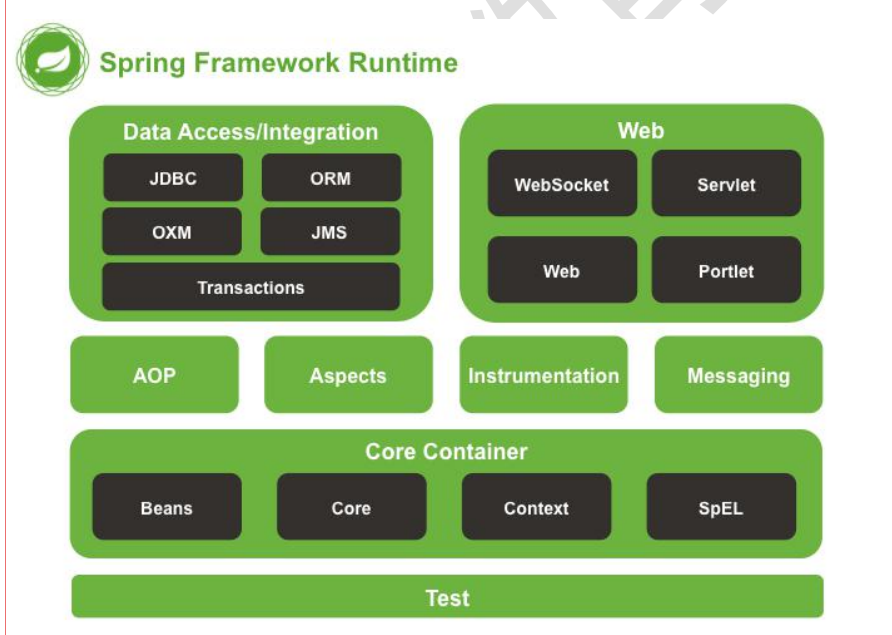
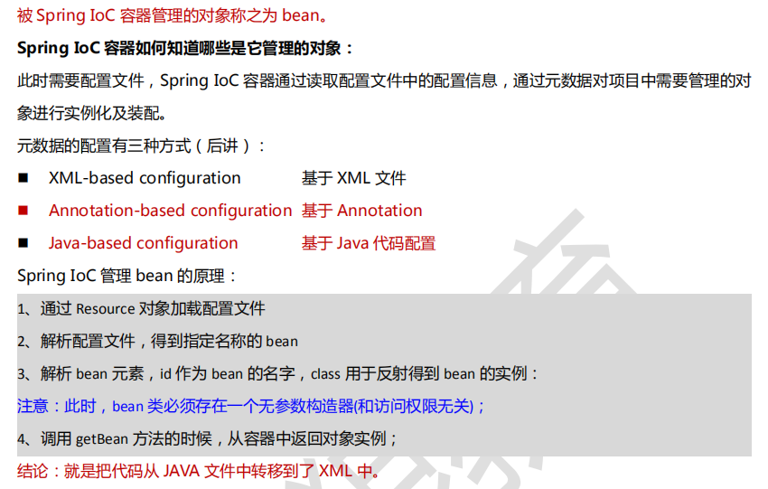
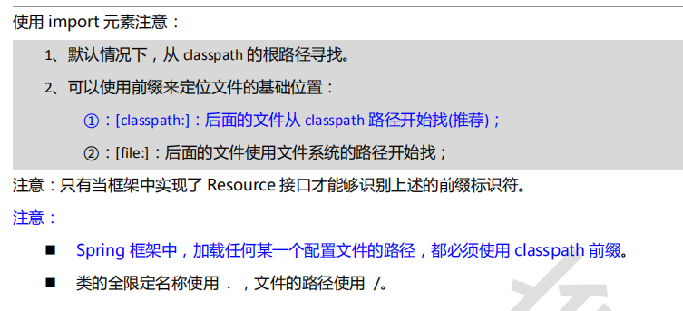
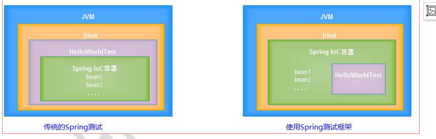
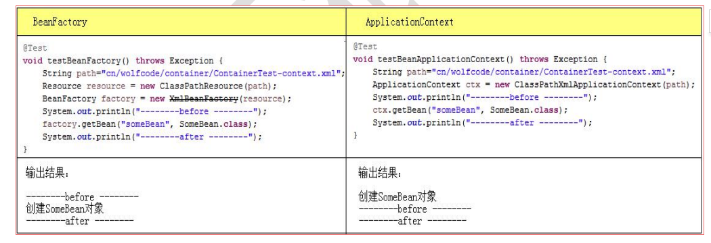

#### Spring IOC & DI & 整合MyBatis 框架
---
Spring 官网地址: [https://spring.io](https://spring.io)
#### Spring 介绍

* Spring 是一个轻量级的DI/IOC 和AOP容器的开源框架
* 容器:程序设计角度看是装对象的对象,由于存在存入与拿出的操作，因此，
容器还管理对象的生命周期

#### Spring  Framework



<br>
#### IoC 和 DI 思想
IoC : Inversion of Control（控制反转）
* 原本在程序中手动创建对象，交由Spring 框架的IoC容器管理

```
传统方式:创建对象需要对象以及该对象所依赖的对象的创建和组装
反转控制:调用者只需从Spring 中获取对象，无需关心对象的创建过程，以及对象依赖对象
的创建和组装,将对象的控制权反转给spring框架
```

DI : 依赖注入，指spring 创建对象的过程中，将对象依赖属性通过配置设值给该对象


#### spring 示例
```
使用maven 导入依赖
  |---junit
  |---spring-context
书写bean 类
```

代码:
```java
class HelloWorld{
  private String name;
  private Integer age;
  set/get
  public void sayHello(){
		System.out.println("我是"+name+",今年"+age+"岁");
	}
}


public class App{
  //创建HelloWorld对象，设置相关数据,调用sayHello方法

  public void testIoC(){
      HelloWorld world=null;
      //--------------
      //创建Bean 的工厂
      BeanFactory factory =null;

      Resource resource=new ClassPathResource("applicationContext.xml");
      factory=new XmlBeanFactory(resource);

      //从spring 的 IoC 容器获取指定名称的bean对象
      world=factory.getBean("HelloWorld");
      //--------------
      world.sayHello();
  }

  /**
	 * spring 底层使用反射和内省技术创建对象
	 * @throws Exception
	 */
	@Test
	public void testIntro() throws Exception{
		Class clazz=Class.forName("com.kiva.xin.test01.domain.User");

		User user=(User) clazz.newInstance();

		PropertyDescriptor[] pds = Introspector.getBeanInfo(clazz).getPropertyDescriptors();

		for (PropertyDescriptor pd : pds) {
			String name=pd.getName();
			if("name".equals(name)){
				pd.getWriteMethod().invoke(user, "decade");
			}else if("age".equals(name)){
				pd.getWriteMethod().invoke(user, 18);
			}
		}

		user.sayHello();
	}
}

```

书写配置文件 applicationContext.xml

```xml
bean 元素：配置需要spring 创建的对象
<bean id="" class="类的完整类名">
  <property name="name" value="decade"/>
  <property name="age" value="17"/>
</bean>
```


#### Api
BeanFactory  ：是Spring 的接口，表示Spring IoC 容器————生产bean对象，负责创建，配置，管理对象



#### Spring 基本配置
id 和 name
* name属性:给被管理的对象起个名字,获得对象时根据该名称获得对象,可以重复，可以使用特殊字符
* class属性:被管理对象的完整类名
* id属性:与name属性一摸一样，名称不可重复，不能使用特殊字符(建议使用)

```
<import resource="classpath:相对路径"/> 元素可以包含多个配置文件
```



<br>
#### Spring 测试框架
传统测试存在的问题:
1. 每个测试都要重新启动Spring ,启动容器的开销大，测试效率低下，
2. 不应该是测试代码管理Spring容器，应该是Spring容器在管理测试代码。
3. 不能正常的关闭Spring容器,Spring容器生命周期非正常退出



使用步骤:
1. 导包
  * spring-test
  * spring-context
  * spring-aop
  * spring-expression


```java
ContextConfiguration: 默认回去找当前测试类目录下的
ContextConfiguration(location="")
 @RunWith(SngJuintClassRunner.class)
 @ContextConfiguration
 public class App{

   //从IoC容器中找到HelloWorld类型的对象，自动设置给该字段
   @Autowired
   private HelloWorld world;

 }
```

<br>
---

### IoC 容器
Spring IoC 容器:
* BeanFactory: Spring 最底层的接口，只提供了IoC的功能，创建，组装和管理对象,一般不使用
* ApplicationContext : 继承BeanFactory,还提供了AOP ，事件传播等功能

区别:
* BeanFactory: 延迟加载，只有获取bean对象时才会创建bean
* ApplicationContext:启动spring容器时就会创建所有bean 对象



---

#### Bean 实例化方式

bean 对象的创建方式:
1. 无参构造器创建
2. 静态工厂方法实例化
3. 实例工厂方法实例化(需要创建factory)
4. 实现FactoryBean接口实例化:实例工厂变种,用于其他框架和spring 集成使用，如sqlSessionFactory
  * BeanFactory:强调的是工厂，创建bean 对象的工厂IoC容器
  * FactoryBean:强调的是对象的工厂对象，通过工厂模式帮我们创建对象的一种方式


##### 1.无参构造器创建
* 注意: 必须保证user有无参构造函数

```java
public class User {
	public User() {
		System.out.println("User.User()构造器被调用");
	}
}

-----applicationContext.xml---------
<bean id="user" class="com.kiva.xin.test01.domain.User">
</bean>
```


##### 2.静态工厂实例化创建

```java
public class UserFactory {
	/**
	 * 静态工厂方法
	 * @return
	 */
	public static User gettUser(){
		return new User();
	}
}
<!-- 使用静态工厂方法创建  -->
	<bean id="user01" class="com.kiva.xin.test01.factory.UserFactory" factory-method="gettUser">
	</bean>
```


##### 3.实例工厂实例化创建
```java
public class UserFactory {
	/**
	 * 动态工厂方法
	 * @return
	 */
	public User gettUser(){
		return new User();
	}
}

	<!-- 使用实例工厂方法创建  -->
	<bean id="user02" factory-bean="factory" factory-method="gettUser01">
	</bean>
	<bean id="factory" class="com.kiva.xin.test01.factory.UserFactory"></bean>
```


##### 4.实现FactoryBean接口实例化
```java
public class SomeBeanFactory implements FactoryBean<SomeBean>{
  //工厂类，创建的SomeBean 对象是否是单例
  public boolean isSingleton(){
    return true;
  }
  //如何创建对象
  public SomeBean getObject(){
    return new SomeBean();
  }
  //获取bean 对象的类型
  public Class<?> getObjectType(){
    return SomeBean.class;
  }

}

-----applicationContext.xml---------
<!-- FactoryBean 获取 -->
<bean id="user03" class="com.kiva.xin.test01.factory.SomeBean"></bean>

```

#### Bean作用域
作用域: spring 创建的bean 对象在其他bean 类中的请求可见范围

```xml
scope="singleton" 单例,缺省值,常用
scope="prototype" 多例,每次获取都是新的对象
<bean id="" class="" scope="作用域"/>
```

#### Bean 初始化和销毁
使用DataSource,SqlSessionFactory 这样的资源类，最后都需要关闭资源.
Spring 能在对象创建后做初始化操作，对象正常关闭后做销毁操作
```xml
<bean id="" class="" scope=""
init-Method="该类初始化方法名"
destroy-method="该类销毁方法名"/>
```

---

#### DI 核心
注入操作: IoC容器创建对象的时候，给对象设置属性值

注入方式有俩种:
* setter 方法注入
* 构造器注入

注入值类型
* 常量值  : value 元素
* 对象类型 : ref 元素
* 集合 : 对应集合类型的元素


1. 注入常量

```xml
public class Employee{
  private String name;
  private int age;
  private BigDecimal salary;
  private URL url;
}

value: 简单类型

<bean id="" class="">
  <property name="name" value="decade"/>
  <property name="age" value="12"/>
  <property name="age" value="8000"/>
  <property name="age" value="http://www.baidu.com"/>
</bean>
```


2. 注入对象 （通过set 方法设置给另一个对象）

```xml
public class EmployeeService{
  private EmployeeDao dao;
  setDao();
}
public class EmployeeDao{

}
创建service对象，需要注入dao
<bean id="employeeDao" class="">
</bean>
<bean id="employeeService" class="">
  <property name="dao" ref="employeeDao"/>
</bean>
```

<br>
---

#### 配置连接池
1. 拷贝mysql 驱动包，druid 连接池jar包
2. 使用context引用properties
3. 配置dataSource

```xml
-------applicationContext.xml--------
<beans>

<!-- 引入配置文件 -->
<context:property-placeholder location="classpath:db.properties"
      system-properties-mode="NEVER"/>

<!-- 配置连接池 -->
<bean id="dataSource" class="com.alibaba.druid.pool.DruidDataSource"
  init-method="init" destroy-method="close">
  <property name="driverClassName" value="${jdbc.driverClassName}"></property>
  <property name="url" value="${jdbc.url}"></property>
  <property name="username" value="${jdbc.username}"></property>
  <property name="password" value="${jdbc.password}"></property>
</bean>

</beans>

-------db.propertise------------
jdbc.driverClassName=com.mysql.jdbc.Driver
jdbc.url=jdbc:mysql:///javaweb
jdbc.username=root
jdbc.password=root


username: 如果直接使用username,会使用系统的用户名作为mysql登陆账号
  |-- 添加jdbc前缀
  |-- 设置system-properties-mode="NEVER"
```

<br>
---

#### Spring 和 MyBatis 集成

1. 导入 maven 配置

```
- junit , 日志组件, lombok ,
- mysql驱动包, druid , mybatis ,
- spring-jdbc , spring-test , spring-context
- mybatis-spring(集合桥梁，版本需要对照所支持的版本,不能任意拷贝)
```

2. 在resources中创建,mappers文件夹存放 UserMapper.xml
2. 创建UserMapper接口
3. 书写主配置文件
4. 书写applicationContext.xml

```
------applicationContext.xml--------
      |--- 加载db.properties 文件
        <context:property-placeholder/>
      |--- 配置Druid连接对象
          需要配置初始化方法和销毁方法
      |--- 配置SqlSessionFactory
        |--- 关联连接池
        |--- MyBatis 属性配置 |  MyBatis 主配置文件
        |--- 配置别名
        |--- 关联Maopper
      |-- 配置MapperFactoryBean,Spring 为我们创建mapper 的接口代理对象
        |---SqlSessionFactory
        |--- mapper接口完整类名
      |--配置service
        |-- 配置mapper接口对象
```

具体代码:
```xml

<?xml version="1.0" encoding="UTF-8"?>
<beans xmlns="http://www.springframework.org/schema/beans"
	xmlns:xsi="http://www.w3.org/2001/XMLSchema-instance"
	xmlns:context="http://www.springframework.org/schema/context"
	xsi:schemaLocation="http://www.springframework.org/schema/beans https://www.springframework.org/schema/beans/spring-beans.xsd
		http://www.springframework.org/schema/context http://www.springframework.org/schema/context/spring-context-4.3.xsd">

	<!-- 配置连接池 -->
	<context:property-placeholder location="classpath:db.properties"/>

	<bean id="dataSource" class="com.alibaba.druid.pool.DruidDataSource"
        init-method="init" destroy-method="close">

		<property name="driverClassName" value="${jdbc.driverClassName}"></property>
		<property name="url" value="${jdbc.url}"></property>
		<property name="username" value="${jdbc.username}"></property>
		<property name="password" value="${jdbc.password}"></property>
	</bean>


	<!-- sqlSessionFactory -->
	<bean id="sqlSessionFactory" class="org.mybatis.spring.SqlSessionFactoryBean">
		<!-- 配置连接池 -->
	 	<property name="dataSource" ref="dataSource"></property>
		<!-- 配置主配置文件 -->
		<property name="configLocation" value="classpath:mybatis-cfg.xml"></property>
		<!-- 配置属性 -->
		<property name="configurationProperties">
			<value>
				lazyLoadingEnabled=true
				aggressiveLazyLoading=false
				lazyLoadTriggerMethods=clone
			</value>
		</property>

		<!-- 配置mapper接口 -->
		<property name="mapperLocations" value="classpath:mappers/*Mapper.xml"></property>
		<!-- 配置别名 -->
		<property name="typeAliasesPackage" value="com.kiva.xin.spring_mybatis.domain"></property>
	</bean>


	<!-- 配置mapper接口 -->
	<bean id="mapperFactory" class="org.mybatis.spring.mapper.MapperFactoryBean">
		<property name="mapperInterface" value="com.kiva.xin.spring_mybatis.mapper.UserMapper"></property>
		<property name="sqlSessionFactory" ref="sqlSessionFactory"></property>
	</bean>

	<!-- 配置service -->
	<bean id="userService" class="com.kiva.xin.spring_mybatis.service.UserServiceImpl">
		<property name="userMapper" ref="mapperFactory"></property>
	</bean>

</beans>

```

<br>
---

总结:
```
IoC思想: 控制反转,将程序中对象的创建和组装交给spring
DI : 依赖注入，spring 创建一个bean对象时,spring 负责为对象属性赋值(注入依赖)

Spring IOC容器
  bean 实例化方式
    |-- 无参数构造器
      <bean id="" class="类的完整类名"/>
    |-- FactoryBean : 实现FactoryBean接口,在FactoryBean 中创建bean 对象
      <bean id="" class="实现了FactoryBean的子类"/>

  作用域:
    <bean id="" class="" scope=""/>
    |-- singleton : 单例,多次获取对象都是同一个对象
    |-- prototype : 多例,每次获取对象都会创建新的对象

  初始化和销毁
    |-- init-method:对象创建后调用
    |-- destroy-method : 容器正常关闭调用


SPring DI
  setter 方法注入
    简单值:value
    复合值:ref
    集合值:各自对应的元素 /set/list/array
  Mybatis 集成


BeanFactory 和Application 的区别
spring 测试集成
bean作用域,属性依赖注入的方式和类型
bean 创建的方式
bean 初始化和销毁
加载数据连接池
spring 和mybatis的集成
```
