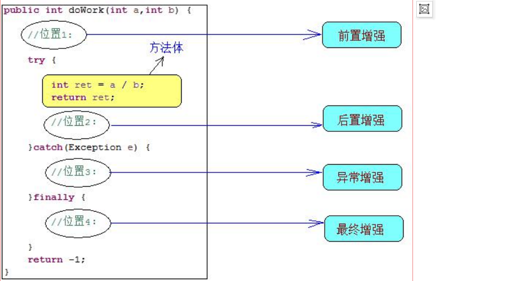
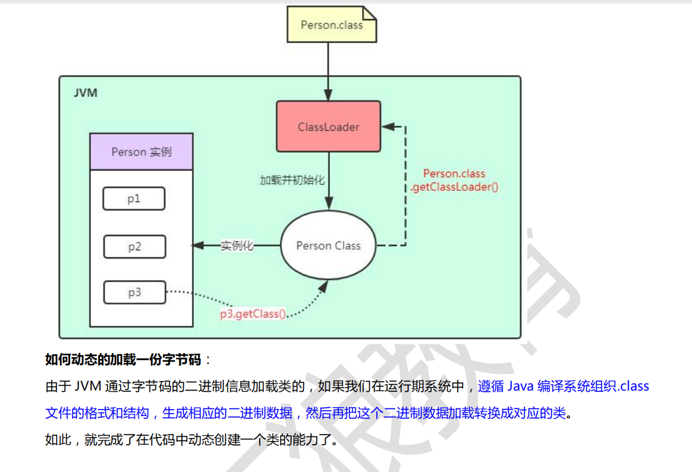
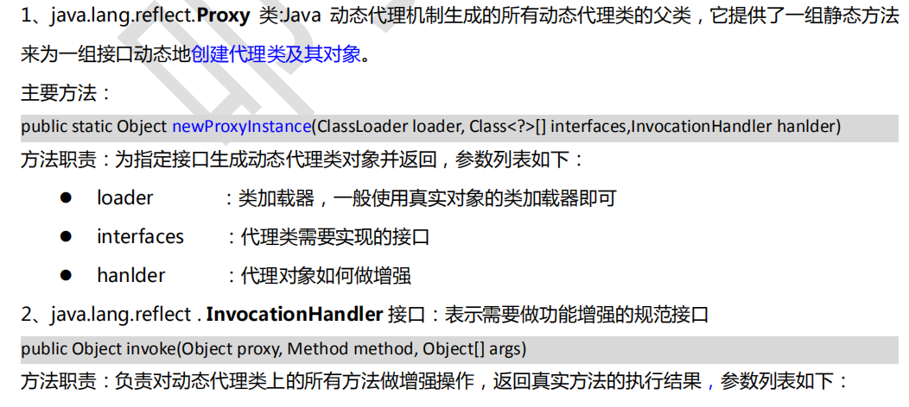
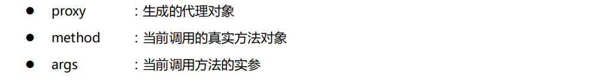
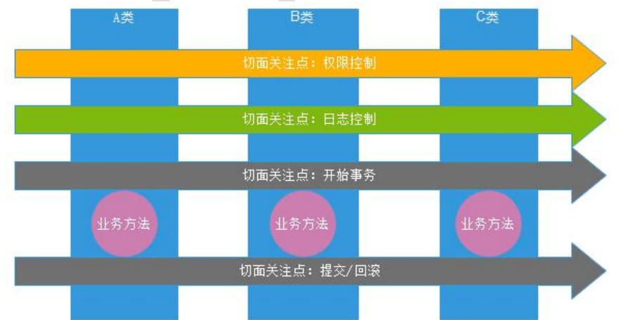

## Spring AOP & 动态代理
---


#### 增强和增强介绍
1. 增强（Advice）: 插入一段代码增强原来的方法
2. 如下入所示，在doWork 方法中不同时机插入一段代码，增强方法功能
3. 环绕增强= 前置增强+ 后置增强 + 异常增强 + 最终增强



### 静态代理

##### 代理模式
* 为其他对象提供一个代理控制对这个对象的访问,代理对象在客户端和目标对象起到中介作用

##### 特点:
1. 代理对象完全包含真实对象，客户端调用代理对象的方法，和真实对象无关
2. 代理的职责:将真实对象不该做的事情分离出来(职责分离)

##### 静态代理
* 在程序运行前已经存在代理类的字节码文件,代理对象和真实对象的关系已确定

优点:
1. 使业务类只需关注业务逻辑本身
2. 隐藏真实对象

缺点:
1. 每一个真实对象都需要定义一个代理
2. 每增加一个方法，都需要增加一个代理方法

##### 静态代理代码示例
```java
//模拟事务管理器
public class TransactionManager{

  public void begin(){
    System.out.print("-- 开启事务----");
  }

  public void commit(){
    System.out.print("-- 提交事务---");
  }
  public void rollback(){
    System.out.print("回滚事务");
  }

}


/**
*  IEmployeeService 的静态代理实现类
*/
public class EmployeeServiceProxy implements IEmployeeService{

  private IEmployeeService target; //被代理的对象(目标对象)
  private TransactionManager txManager;//模拟事务管理

	public void setTarget(IUserService target) {
		this.target = target;
	}

	public void setTxManager(TransactionManager txManager) {
		this.txManager = txManager;
	}

  public void save(Employee e){
    txManager.begin();
    try {
      target.save(e);
      txManager.commit();
    } catch(Exception e) {
      txManager.rollback();
    }
  }

}

//-----测试类-------
@RunWith(SpringJUnit4ClassRunner.class)
@ContextConfiguration
public class ProxyApp{

  @Autowired
  private EmployeeServiceProxy proxy;

  public void testSave(){
    Employee e=new Employee();
    proxy.save(e); // 调用静态代理类的增强方法
  }
}

```

applicationContext.xml配置
```xml
<!-- 引入其他配置文件 -->
	<import resource="classpath:mybatis-spring-context.xml"/>

	<!-- 配置事务操作 -->
	<bean id="txManager" class="com.kiva.xin.day02.proxy.staticProxy.TransactionManager">
	</bean>

	<!-- 配置静态代理对象 -->
	<bean id="employeeServiceProxy" class="com.kiva.xin.day02.proxy.staticProxy.EmployeeServiceProxy">
		<property name="target" ref="userService"></property>
		<property name="txManager" ref="txManager"></property>
	</bean>
```
<br>
---

### 动态代理
* 静态代理:在程序运行前就已经存在代理类的字节码文件,代理对象和真实对象的关系在运行前才确定
* 动态代理: 程序在运行期间由JVM 反射和等机制动态生成，所以不存在字节码文件,代理对象和真实对象的关系在运行时期才确定

##### 实现动态代理:
  1. 有接口: 使用JDK 动态代理
  2. 无接口: 使用CGLib或javassist组件

##### 使用动态代理的主要操作
  1. 如何创建代理对象
  2. 如何增强原来的方法

#### JVM动态加载一份字节码





<br>
----

### ＪＤＫ动态代理

#### jdk 动态代理APi 分析




##### jdk 动态代理实现步骤:

> 1. 实现InvocationHandler接口，创建自己实现的增强类
2. 为Proxy提供ClassLoader对象和代理类接口数组，创建代理对象
3. 在增强类中实现具体步骤

#### jdk 动态代理代码实现
```java
//事务管理增强--------代理对象生成器
public class TransactionManagerAdvice implements InvocationHandler{

  private Object target;
  private TransactionManager txManager;

  public void setTarget(Object target) {
		this.target = target;
	}


	public void setTxManager(TransactionManager txManager) {
		this.txManager = txManager;
	}

  //----创建代理对象
  public <T> T getProxyObject(){
      //loader 类加载器，使用真实类的加载器
      //interface 被代理的接口
      //InvokeHandler 如何增强的处理器

      return (T)Proxy.newProxyInstance(
      target.getClass().getClassLoader(),
      target.getClass().getInterface(),
      this);
  }

  // 如何做增强
  // proxy 创建的代理对象
  // method 被代理的真实方法
  //  args 被代理的真实方法的参数
  // 返回值时方法的返回值
  public Object invoke(Object proxy,Method method,Object[] args){
    txManager.begin();
    Object ret=null;
    try {
      //调用真实对象的真实方法
      ret=method.invoke(target,args);
      txManager.commit();
    } catch(Exception e) {
      txManager.rollback();
    }
    return ret;
  }

}

```

#### JDK 动态代理原理分析
原理:
调用动态代理对象的方法时，底层是调用handler.invoke()方法

注意:
* invoke 中调用proxy.toString() : 被增强覆盖，导致栈溢出
* proxy.getClass() 是final 修饰，不能被增强

##### 获取动态代理字节码文件
```java
@SuppressWarnings("all")
public class DynamicProxyClassGenerator {
	public static void main(String[] args) throws Exception {
		String ext = new Date().toLocaleString().replaceAll(":", "-");
		generateClassFile(UserServiceImpl.class, "EmployeeServiceProxy-" + ext);
	}

	public static void generateClassFile(Class<?> targetClass, String proxyName) throws Exception {
		//根据类信息和提供的代理类名称，生成字节码  
		byte[] classFile = sun.misc.ProxyGenerator.generateProxyClass(proxyName, targetClass.getInterfaces());
		String path = targetClass.getResource(".").getPath();
		System.out.println(path);
		FileOutputStream out = null;
		//保留到硬盘中  
		out = new FileOutputStream(path + proxyName + ".class");
		out.write(classFile);
		out.close();
	}
}
```

##### 使用gui 工具查看动态代理类字节码文件代码
```java
public final class EmployeeServiceProxy-2019-5-13 9-51-48 extends Proxy
  implements IUserService
{
  private static Method m1;
  private static Method m7;
  private static Method m5;
  private static Method m6;
  private static Method m2;
  private static Method m0;

  public EmployeeServiceProxy-2019-5-13 9-51-48(InvocationHandler paramInvocationHandler){
    super(paramInvocationHandler);
  }

  public final boolean equals(Object paramObject){
      return ((Boolean)this.h.invoke(this, m1, new Object[] { paramObject })).booleanValue();
  }

  // 直接调用了 handler 的invoke 方法
  public final void saveUser(User paramUser){
      this.h.invoke(this, m5, new Object[] { paramUser });
  }

  public final void updateUser(User paramUser){
      this.h.invoke(this, m6, new Object[] { paramUser });
  }

  public final String toString(){
      return ((String)this.h.invoke(this, m2, null));
  }

  public final int hashCode(){
      return ((Integer)this.h.invoke(this, m0, null)).intValue();
  }

  static
  {
      m1 = Class.forName("java.lang.Object").getMethod("equals", new Class[] { Class.forName("java.lang.Object") });
      m5 = Class.forName("com.kiva.xin.day01.spring_mybatis.service.IUserService").getMethod("saveUser", new Class[] { Class.forName("com.kiva.xin.day01.spring_mybatis.domain.User") });
      m6 = Class.forName("com.kiva.xin.day01.spring_mybatis.service.IUserService").getMethod("updateUser", new Class[] { Class.forName("com.kiva.xin.day01.spring_mybatis.domain.User") });
      m2 = Class.forName("java.lang.Object").getMethod("toString", new Class[0]);
      m0 = Class.forName("java.lang.Object").getMethod("hashCode", new Class[0]);
}
}
```

<br>
---

#### cgLib 动态代理
jdk 动态代理的前提是真实对象需要有接口,如果真实对象没有接口，可以使用cglib,spring 中自带的库

#### cglib 原理
cglib 通过生成动态代理类，继承于目标类，对目标类中可以继承的方法进行覆盖(final 修饰不能继承),调用代理对象时，实际调用代理对象的增强方法

```java
class A{
  doWork(){
    System.out.println("doWork");
  }
}

class AAA extends A{
  doWork(){
    System.out.print("---增强操作---");
    super.doWork();
    System.out.print("---增强操作---");
  }
}

```

##### cglib 具体实现代码

```java
//使用cgLib 完成动态代理
public class TransactionManagerAdvice implements InvocationHandler{

  private Object target;//真实对象

  public <T> T getProxyObject(){
    //创建一个增强器
    Enhancer enhancer=new Enhancer();
    enhancer.setSupperClass(target.getClass());//设置集成真实对象
    enhancer.setCallback(this);//设置增强处理器

    return enhancer.create(); //创建代理对象
  }


  // 如何做增强
  // proxy 创建的代理对象
  // method 被代理的真实方法
  //  args 被代理的真实方法的参数
  // 返回值时方法的返回值
  public Object invoke(Object proxy,Method method,Object[] args){
    txManager.begin();
    Object ret=null;
    try {
      //调用真实对象的真实方法
      ret=method.invoke(target,args);
      txManager.commit();
    } catch(Exception e) {
      txManager.rollback();
    }
    return ret;
  }

}
```


### 动态代理总结

<br>
### APO 思想
AOP(Aspect Oriencation Programmer):spring能够为容器中管理的对象生成动态代理对象，使用动态代理机制做增强业务功能，能够实现代码复用，提高维护性



<br>
#### AOP 中的核心概念
如何确定给某个方法做增强功能:
* where : 对哪些方法做增强操作(使用方法的权限定名)
* when : 在方法执行的什么时机执行增强 (之前，之后，异常，最终，环绕)
* what : 做什么功能的增强,将不同增强功能封装到不同的增强模块中1


##### 核心概念
```
JoinPoint 连接点:程序执行过程中的某个位置,如方法调用前后，方法,相当于切面的增强时机(when)
Pointcut切入点:需要做增强操作的方法(where)
Advice ：增强,增强的代码(what)
Aspect: 切面,Pointcut+Advice,在哪些方法中做什么增强
Target : 被代理目标对象
Weaving：织入，把Advice 加到Target上之后，创建出Proxy对象的过程
Proxy : 一个类被AOP 织入增强后，产生的代理类
```


<br>

### PointCut 语法
PointCut 语法主要用来表示需要对哪些方法进行增强

语法格式:
* execution(修饰符 返回类型 方法权限定名(参数类型) 异常类型 )

例子:
* public static Class<?> java.lang.Class.forName(String) throws ClassNotFoundException

通配符:
```
* : 匹配任何部分，在包路径中只能表示一个包，不包括子包
.. : 用于全限定名和方法名中,表示子包和 0-N个参数
```

常见的写法:
```
execution(* com.kiva.ssm.service.*.*(..))
execution(* com.kiva.ssm.service.*Service.*(..))
execution(* com.kiva..service.*Service.*(..))
```


<br>
---

### AOP 开发
```
spring-aop-5.1.6.RELEASE.jar
com.springsource.org.aopalliance-1.0.0.jar
com.springsource.org.aspectj.weaver-1.6.8.RELEASE.jar
spring5 后不需要导aopalliance包
```

开发步骤:
1. 导入aop,aopaliance,weaver jar包
2. 导入aop 命名空间
3. 书写配置

```xml
<!-- 1. what: 做什么增强  -->
<bean id="txManager" class=""/>
<!-- 2. where: 在哪些包中的那些类中的哪些方法做增强  -->
<!-- 3. 增强的时机 -->
<aop:config proxy-target-class="true">
  <!-- 切面  -->
  <aop:aspect ref="txManager">
    <!-- where ： 哪些方法需要增强  -->
    <aop:pointcut expression="execution(* com.kiva.xin.service.*Service.*(..))" id="txPointCut"></aop:pointcut>
    <!-- when : 设置时机 -->
    <aop:before method="begin" pointcut-ref="txPointCut"/>
    <aop:after-returning method="commit" pointcut-ref="txPointCut"/>
    <aop:after-throwing method="rollback" pointcut-ref="txPointCut"/>
    <aop:after method="close" pointcut-ref="txPointCut"/>
    <aop:around method="around" pointcut-ref="txPointCut"/>
  </aop:aspect>
</aop:config>


proxy-target-class=true: 设置强制使用cgklib动态代理
around : 设置环绕增强,需要注释掉其他的时机

```


### 增强的时机

### 增强方法参数配置
1. 获取异常信息

``` java
<aop:after-throwing method="rollback" pointcut-ref="pc" throwing="ex"/>

/**
 * 增强方法的参数配置: 获取异常对象
 * @param ex
 */
public void rollback(Throwable ex){
  System.out.println("--回滚事务---"+ex.getMessage());
}

```

2. 获取被增强的方法信息，并传递到增强方法中

Spring Aop 中提供了一个org.aspectj.lang.JoinPoint类，作为增强方法的第一个参数
* JoinPoint : 可以获取代理对象，真实对象和被增强的方法信息
* ProceedingJoinPoint:JoinPoint子类，用于环绕增强中,可以处理增强方法

代码示例
* 使用JoinPoint类

```java

	/**
	 * JoinPoint : 可以获取当前被增强方法的代理对象，真实对象和方法参数等
	 * @param jpt
	 */
	public void begin(JoinPoint jpt){
		System.out.println(jpt.getTarget().getClass());//获取目标对象
		System.out.println(jpt.getThis().getClass());//获取代理对象
		System.out.println(Arrays.toString(jpt.getArgs())); // 获取增强方法的参数
		System.out.println(jpt.getKind());//获取切入点的类型
		System.out.println(jpt.getSignature()); //获取切入点的签名
		System.out.println("--开启事务---");
	}
```

* 使用 ProceedingJoinPoint 类

```java

/**
 * 环绕增强:
 * @param pjp 操作被增强方法
 * @return
 */
public Object around(ProceedingJoinPoint pjp){
  System.out.println("around------开启事务-----");
  Object ret=null;
  try {
    //执行目标对象的方法
    ret=pjp.proceed();
    System.out.println("around----提交事务---");
  } catch (Throwable e) {
    System.out.println("around----回滚事务----");
  }finally {
    System.out.println("around---释放资源----");
  }
  return ret;
}

```


总结
```
AOP:
1. 在不改变service代码基础上，增强service的功能
2. 静态代理
  |-- 每个service
3. 动态代理
  |-- jdk 动态代理
  |-- cglib 动态代理
动态代理--> 代理的单位是类，真实对象类中多有方法都被增强

作业:
动态代理: 至少三遍
Spring AOP 概念/理解/完成配置
做一个日志增强
  |--在每次调用service方法之前，往数据库插入一条记录，记录时间，调用哪一个类中的哪一个方法
```
