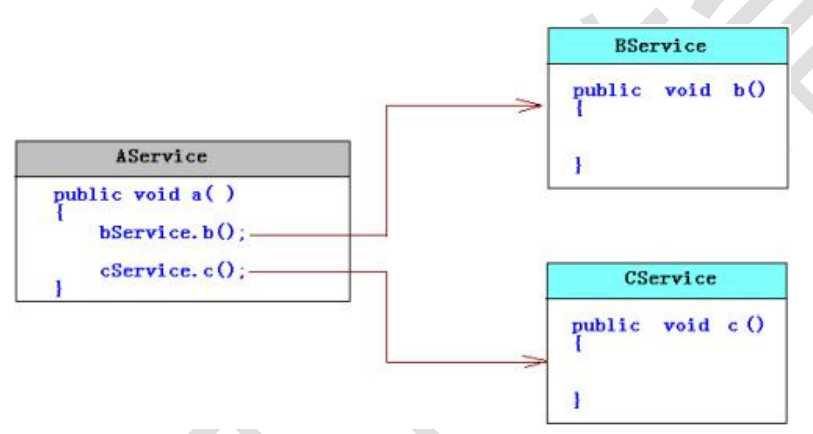
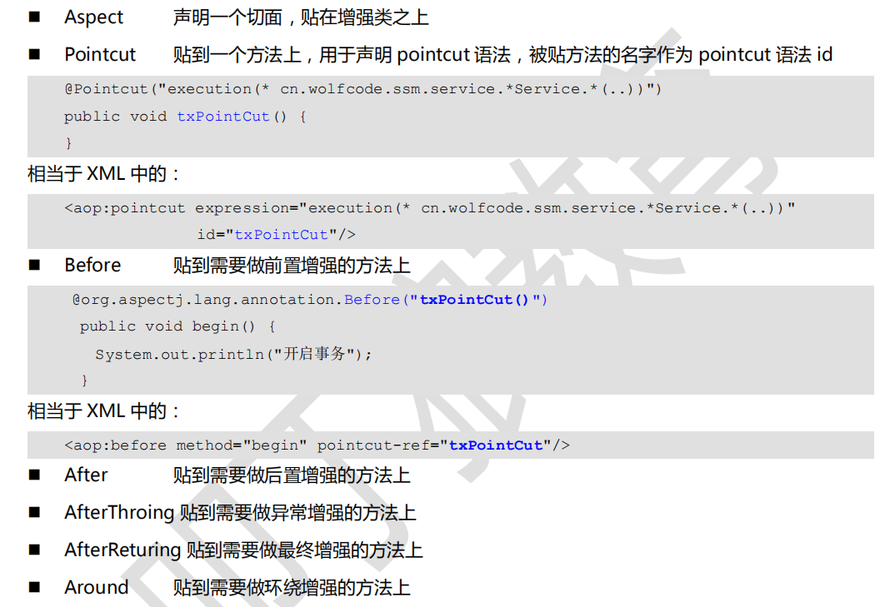

## Spring 事务&注解
---
### Spring 持久层技术
解决的问题
* jdbc 操作代码臃肿，重复
* spring 支持对事务的管理

### Spring JDBC
#### jdbc 模板类

### Spring 事务
事务: 把多个不可分割的操作堪称一个整体

#### 事务API
 TransactionDefine

#### 常用的事务管理器
* DataSourceTransactionManager:jdbc,mybatis事务管理器
* HibernateTransactionManager :支持Hibernate

#### 事务的传播规则(传播行为)
一个事务方法调用其他事务方法，事务如何传播



##### Spring 定义了7中规则

1. 遵从当前事务
  * REQUIRED : 如果存在则加入该事务, 如果当前没有事务，则创建一个事务
  * SUPPORTS : 支持当前事务,如果存在事务则加入该事务，如果没有，则不使用事务
  * MANDATORY : 使用当前事务执行,如果当前没有事务，抛出异常

2. 不遵从当前事务
  * REQUIRED_NEW : 不管当前是否存在事务，都创建新的事务
  * NO_SUPPORTS : 如果当前存在事务，将事务停止，不使用事务运行
  * NEVER : 如果当前存在事务则抛出异常


<br>
---

### 事务的配置

事务增强，好比时环绕增强,spring 专门为这一个特殊的增强加了一个命名空间
```xml
配置事务管理器
<bean id="txManager" class="DataSourceTransactionManager权限定名">
  <property name="dataSource" ref="myDataSource"></property>
</bean>

配置管理事务的增强
<tx:advice id="txAdvice" transaction-manager="txManager" >
  <tx:attributes>
      <!--
      name : 事务管理的方法
      isolation : 设置隔离级别
      read-only : 事务是否只读
      propagation : 事务的传播行为
      -->
      <tx:method name="*" isolation="DEFAULT" read-only="false" propagation="REQUIRED"/>
  </tx:attributes>
</tx:advice>

配置切面 : 切入点 + 增强
<aop:config>
  <aop:pointcut expression="execution(xxx)" id="txPC"/>
  <aop:advisor advice-ref="txAdvice" pointcut-ref="txPointcut"/>
</aop:config>

```


#### 事务属性方法配置
```
read-only : 只读事务，查询事务设置为只读
isolation : 隔离级别
propagation : 事务的传播方式
rollback-for="java.lang.RunTimeException" : 遇见哪些异常就回滚
no-rollback-for : 遇到哪些异常，不回滚
```

<br>
---
### 注解开发

##### ＤＩ注解

* 引用类型:
  * Autowired注解: spring 提供,先按类型查找，再按名字查找,和Qualifier结合使用 <br>
  * Resource 注解: javaee提供，先按名字查找，再按类型查找

```
需要在applicationContext.xml 中 DI配置注解 <br>
<context:annotation-config/>
```

代码示例

```java
@Component("byx")
public class Book {

	@Value("《白夜行》")
	private String name;

	@Value("123")
	private BigDecimal price;

}


@Component("bookStore")
public class BookStore {

	@Value("解忧书店")
	private String bookStoreName;

	//使用DI 注解
	@Autowired
	@Qualifier("byx")
	private Book book;

	@Resource(name="byx")
	private Book book2;

}

--------相当于在xml中-----------
<bean id="byx" class="Book">
  <property name="" value=""/>
</bean>
<bean id="bookStore" class="BookStore">
  <property name="" ref=""/>
</bean>
```

#### IoC 注解解析器
1. 指定IoC 注解解析器，组件扫描指定包下的注解

```xml
<context:component-scan base-package="包名"/>
```


bean 组件版型: 组件的功能时相同的,只是用来标注不同类型的组件
* Respository : 标记 dao 组件
* Service : 标记service组件
* Controller : 标记控制层组件
* Component : 其他组件

代码示例

```java
@Component("byx")
public class Book {
}

@Component("bookStore")
public class BookStore {
	//使用DI 注解
	@Autowired
	private Book book;
}

------------applicationContext.xml----------
<!-- IoC 依赖分析器 ==在指定包下扫描注解创建对象 -->
<context:component-scan  base-p ackage="com.kiva"/>
```


<br>
---

#### AOP 注解
1. 设置AOP 解析器

```
<!-- 开启aop 解释器 -->
<aop:aspectj-autoproxy/>
```



代码示例
```java
@Aspect
@Component
public class TransactionManager {

	//配置切入点 方法名作为增强方法的 pointcut 的id
	@Pointcut("execution(* com.kiva.ssm.service.*Service.*(..))")
	public void txPC(){
	}

	//方法执行之前调用
	@Before("execution(* com.kiva.ssm.service.*Service.*(..))")
	public void begin(){
		System.out.println("---开启事务---");
	}

	//方法正常结束后执行
	@After("txPC()")
	public void commit(){
		System.out.println("---提交事务---");
	}

	//方法执行出现异常时执行
	@AfterThrowing("txPC()")
	public void rollback(){
		System.out.println("---回滚事务---");
	}

  //最终执行
	@AfterReturning("txPC()")
	public void close(){
		System.out.println("---释放资源---");
	}

}

------注意-----
这里的after和afterReturn 和xml 配置中的相反
```

<br>
---

### 事务注解
操作步骤:
1. 配置事务管理器 DataSourceTransactionManager
2. 添加注解解析器 , 关联事务管理
3. 在需要做事务增强的类中添加 Transactional 注解

代码示例
```
```


#### 接口配置igurer
1. mapper 接口扫描器
<bean class="MapperScannerConfigu">
  <property name="basePackage" value="mapper 接口所在的包"/>
</bean>

2. 配置解析器
DI 注解解析器
<context:annotation-config/>
Ioc注解解析器
<context:property-placeholder location=""/>

@Service
@Transactional
class UserService Implement xx{

}

3. 配置事务
  |--- 配置Tx  注解解析器,配置事务管理器
      <
  |-- 配置事务管理器 DataSourceTransactionManager
  |-- 在service中配置Transactional()

4. 配置aop 注解
  |--aop 注解解析器
  |-- 配置
5. 使用NameThreadLocal实现记录运行时间

```
@Aspect
public class SystemLog{

  @Point("execution(* xxx*.service.*(..))")
  public void xx(){

  }

}
```


```java
IoC注解
  |-- Reposity ： dao组件
  |-- Service  : service 类
  |-- Controller: Controller 类
  |-- Component : 其他类型

  配置注解解析器
  <context:component-scan basePackage="包名"/>

  xml
  <bean id="" class ="" scope="singleton"
      init-method="" destroy-method=""/>

  注解
  @Component
  @Scope("singleton")
  class Somebean{
    @PostConstruct
    public void open(){}
    @PreDestroy
    public void close(){}
  }


DI 注解:
  作用: 从容器中找到指定的bean对象，并设置给字段
  注解 : Autowired / Resource
  解析器: <context:annotation-config/>
  xml:
  <bean id="" class="">
    <property name="" ref=""/>
  </bean>

  注解:
  @Component
  class OtherBean(){ }

  @Component
  class Somebean(){
    @Autowired
    private OtherBean other;
  }

Tx 注解:
  作用:增加service 组件支持事务管理
  注解:Transactional

  xml 配置

  注解配置
  1. 配置事务管理器
  2. 增加解析器
  <tx:annotation-driven transaction-manager="txManager"/>
  3. 在service 实现类上，使用Transactional 注解

MVC 注解
  注解:
    |-- Controller : 生命当前类为控制器，spring 容器创建对象
    |-- RequestMapping : 在类和方法上，访问当前方法的URL
    解析器
    <context:component-scan basePackage="包名"/>
    <mvc:annotation-driven/>

  @RequestMapping("/hello")
  @Controller
  public class HelloController{

      @RequestMapping("/sayHello")
      public ModelAndView sayHello(){
          return null;
      }

  }

AOP注解


xml
what :
<bean id="logAdvice" class=""/>
<aop:config ref="logAdvice">
  <aop:pointcut expression="execution()" id="pc"/>
  <aop:before method="writeLog" pointcut-ref=""/>
</aop:config>
注解解析器

注解
  Aspect : 贴在增强类上,表示切面
  Pointcut : 编写切入点表达式

  @Aspect
  @Component
  class LogManager{
    @Pointcut("execution(xxxx)")
    public void logPointcut(){

    }
    @Before("logPointcut")
    public void writeLog(){

    }

  }

```
