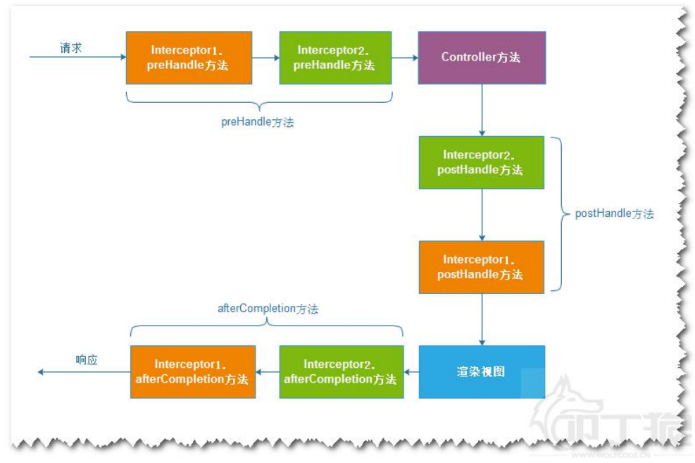

## SSM 综合案例

---
### Mybatis 逆向工程(mybatis-generator)
* 一个Maven 插件，根据数据的表生成实体类和Mapper接口

#### 导入插件
```
1. 在pom.xml中引入插件
    |--- overwrite : false --> 只进行追加，不会覆盖
2. 导入配置文件generatorConfig.xml,修改数据库连接信息,生成文件存放路径,表名
3. 使用maven-> build 执行命令mybatis-generator:generate
4. 在本地仓库中覆盖jar包，新的jar 包修改了部分源码
```

```xml
<!-- mybatis genetator 代码生成器 -->
	<plugin>
		<groupId>org.mybatis.generator</groupId>
		<artifactId>mybatis-generator-maven-plugin</artifactId>
		<version>1.3.2</version>
		<configuration>
			<verbose>true</verbose>
			<overwrite>false</overwrite>
		</configuration>

		<dependencies>
			<dependency>
				<groupId>mysql</groupId>
				<artifactId>mysql-connector-java</artifactId>
				<version>5.1.21</version>
			</dependency>
		</dependencies>
	</plugin>
```

事务管理
1. 测试事务是否生效: 判断service.getClass(),返回的类型是否时Proxy代理类型


<br>
---
### 登陆案例

```html
<form action="index.html" method="post">
  账号:<input type="text" name="username"/><br>
  密码:<input type="text" name="password"/><br>
  <input type="submit" value="登陆">
</form>
```
Controller 实现
```java
public class LoginController{

  @AutoWited
  private IUserService service;

  public String login(Model model,String username,String password){
      User currentUser=service.login(username,password);
      if(user==null){
        model.setAttribute("errorMsg","账号或密码")
        return "forward:/login.jsp";
      }else{//登陆成功
        session.setAttribute("USER_IN_SESSION",user);
        return "redirect:/department/list";
      }
  }
}
```
service 实现
```java
public class UserServiceImpl implements UserService{
  UserMapper userMapper;
  public User login(String username,String password){
      return userMapper.getUserByNameAndPwd(username,password);
  }
}
```

<br>
----
### 拦截器
类似于Servlet 开发中的过滤器Filter,对Controller 进行预处理和后处理

#### 操作步骤:
1. 定义拦截器类,实现接口HandlerInterceptor
2. 在mvc.xml配置文件中配置拦截器

#### 拦截器方法的执行时机:
1. preHandle: 控制器方法执行之前执行,返回结果为true表示放行,如果返回为false,表示拦截(可以做权限拦截,登录检查拦截).
2. postHandle: 控制器方法执行后,视图渲染之前执行(可以加入统一的响应信息).
3. afterCompletion: 视图渲染之后执行(处理Controller异常信息,记录操作日志，清理资源等)



<br>
代码示例

```java
public class CheckLoginInterceptor implements HandlerInterceptor{

  public boolean preHandle(req,resp){
    //从session 中 获取用户信息
    Object user=req.getSession().getAttribute();
    if(user==null){
        //空--> 没有登陆,回到登陆页面
        response.sendRedirect("/login.jsp");
        return false;
    }
    //不为空，放行
    return true;
  }
}
```
```xml
----------配置拦截器--------------
<mvc:inerceptors>
  <mvc:inerceptor>
    <!-- 指定需要拦截的资源路径,可以包含多级路径 /a/b/c  -->
    <mvc:mapping path="/**">
    <!-- 指定不需要拦截的资源路径 -->
    <mvc:exclude-mapping path="/login"/>
    <bean class="拦截器类的权限定名"/>
  </mvc:inerceptor>
</mvc:inerceptors>

注意:
/ * :只能拦截一级目录
/ ** :可以拦截一级或多级目录
```
