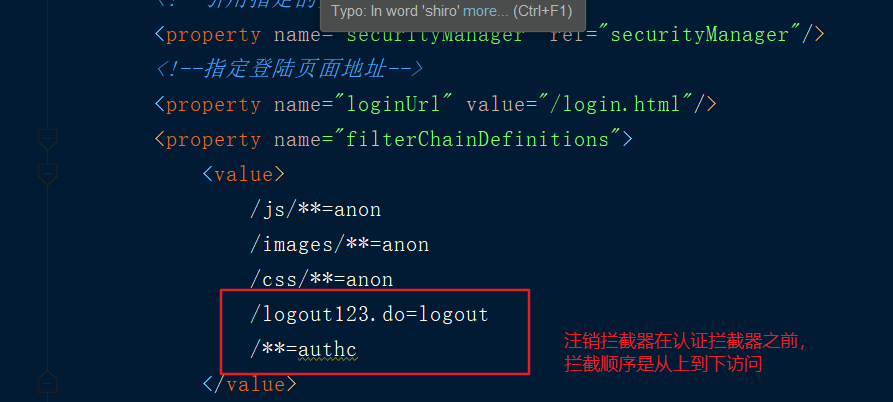

## shrio 权限管理

---

### Shiro 简介

#### Shiro 权限管理
1. Apache : 更容易使用,学习成本低,不跟任何框架绑定，可以独立运行
2. Spring Security:功能更加强大，和spring集成比较简单

#### Shiro 能做什么
帮助开发者完成:认证，授权，加密，缓存等

#### Shiro 架构
* Subject(用户): 主体可以是用户程序等
  * User currentUser=SecurityUtils.getSubject();在程序任意位置获取

* Security Manager :安全管理器,shiro实现的核心,实现subject委托的各种功能，负责其他组件之间的交互,类似于springmvc中的前端控制器

* Authenticator : 认证器，协调一个或者多个Realm，从Realm指定的数据源取
得数据之后进行执行具体的认证

* Authorrizer: 授权器
* SessionManager :会话管理
* CacheManageer: 缓存管理

* Realms(数据源): Realms 相当于安全数据和shiro 的桥梁,可以把Realm看成DataSource，执行认证（登录）和授权（访问控制）时，Shiro会从应用配置的Realm中查找相关的比对数据。以确认用户是否合法，操作是否合理
* Cryptography:加密算法


<br>
---

### javase shiro认证
基于ini 的shiro认证
1. 导包(junit+common-logging+shire-core)
2. 编写ini配置文件 :shiro.ini

```ini
用户=密码
-----------shiro.ini----------
[users]
decade=123
kiva=123
```

使用shiro 相关api实现身份认证
```java
@Test
public void test01() {

   //加载shiro 配置文件，读取用户配置信息(账号+密码)
   IniSecurityManagerFactory factory=new IniSecurityManagerFactory("classpath:shiro.ini");
   //获取安全管理器
   SecurityManager manager = factory.getInstance();
   //加载安全管理器到当前运行环境中
   SecurityUtils.setSecurityManager(manager);

   //获取用户主体对象
   Subject subject = SecurityUtils.getSubject();
   //创建用户登陆凭证
   UsernamePasswordToken token=new UsernamePasswordToken("decade","123");
   System.out.println("认证前"+subject.isAuthenticated());
   subject.login(token);
   System.out.println("认证后"+subject.isAuthenticated());
}
```
运行结果
* UnknowAccountExcetion:未知账户异常
* IncorrectRedentialsException:错误的凭证

<br>
---
### 源码分析

```
login方法:
  |-- secManager.login(subject,token);

  |--DefaulSecManager :
      |-- authenticate(token);
          |-- AbstraAuthen
            |--doAuthenticate(token):根据数据源的个数调用不同的方法
            |-- doSingleRealAuthentication()
              |--doGetAuthenticationIbfo(token):账号的认证和密码的认证
                  |--判断账号是否被锁，或者是过期
                  |-- 账号不为空，校验密码
                      |-- doCredentialMath
      |-- catch : onFail

```

<br>
---

### 自定义Realms(数据源)
* 默认使用的是SimpleAccountRealm来处理账户的校验，认证需要的账户信息通常来自程序或者数据库中，需要重写Realms从数据库中查询账户信息进行校验


步骤:
1. 定义Realm 类继承AuthorizingRealm(缓存，认证，授权)
2. 重写doGetAuthenticationInfo方法
    * 将用户的账号发送到数据库去查询
    * 结果为null.账号错误
    * 不为空,账号正确，继续验证密码
3. 在ini 文件中将自定义 CRMRealm 设置给安全管理器
4. 再使用测试方法进行测试

##### 创建一个CRMRealm
```java
public class CRMRealm extends AuthorizingRealm{

  //获取认证信息
  protected AuthenticationInfo doGetAuthenticationInfo_test(AuthenticationToken token) throws AuthenticationException {

      //获取用户输入账号
      Object username = token.getPrincipal();
      Object password = token.getCredentials();//获取用户输入密码
      //判断账号
      if("decade".equals(username)){
      //查询不为空，账号正确，继续校验密码  abc=数据库查询出的密码
          return new SimpleAuthenticationInfo(username,"abc",this.getName());
      }
      //将用户输入账户发送到数据库查询
      // 查询结果为空,账号错误
      //查询不为空，账号正确，继续校验密码
      return null;
  }

  //获取授权信息
  doGetAuthorizationInfo(){
  }

}
```
crm存在ini 中配置
```java
#自定义的Realm信息
crmRealm= com.kiva.crm.shiro.realm.CRMRealm
#将crmRealm设置到当前的环境中
securityManager.realms=$crmRealm
```

<br>
---

### CRM 中集成Shiro认证
##### 需要解决的问题
1. 访问项目资源时，shiro 对用户身份的检查的位置
  * 在web.xml 配置一个委托过滤器代理，根据shiroFilter去查找spring容器中对应的过滤器并部署，通过这个过滤器去spring容器中查找配置好的过滤器
  * shiroFilter 拦截器配置:每次访问资源请求都会访问这些拦截器:由这个拦截器分发给匿名拦截器和认证拦截器(过滤器对象交给spring创建)
2. 使用哪一个安全管理器
  * 在shiro拦截器对象中配置
3. 在哪里指定使用的自定义Realm
  * 创建安全管理器时指定自定义Realm
4. 根据后台认证结果,怎么处理跳转页面，如何传递数据
  * 需要重写认证过滤器的loginSuccess()和loginFailure()方法

步骤:
```
1. 添加相关依赖:web,和spring集成,enhance缓存
2. 访问资源时，需要做一系列的预处理,使用委托的过滤器的代理,在web.xml配置代理过滤器
3. 创建一个shiro的配置文件, 配置shiroFilter,配置相关的过滤器配置
  |-- 配置一个安全管理器
  |-- 指定登陆页面
  |-- 指定哪些过滤器拦截哪些资源(过滤器定义),
  |-- id和web.xml的name保持一致
4. 配置安全管理器，自定义Realm 注入到安全管理中
    |-- CRMRealm类对象交给Spring创建
```

web.xml委托过滤器代理的配置
```xml
<!--shiroFilter拦截器:每次访问资源请求都会访问这个拦截器:
		由这个拦截器分发给匿名拦截器和认证拦截器-->
<filter>
	<filter-name>shiroFilter</filter-name>
	<filter-class>
		org.springframework.web.filter.DelegatingFilterProxy
	</filter-class>
</filter>
<filter-mapping>
	<filter-name>shiroFilter</filter-name>
	<url-pattern>/*</url-pattern>
</filter-mapping>
```
过滤器相关配置
```xml
<!--创建一个shiro委托的过滤器-->
<bean id="shiroFilter"
	  class="org.apache.shiro.spring.web.ShiroFilterFactoryBean">
	<!--引用指定的安全管理器-->
	<property name="securityManager" ref="securityManager"/>
	<!--指定登陆页面地址-->
	<property name="loginUrl" value="/login.html"/>
	<property name="filterChainDefinitions">
		<value>
			/js/**=anon
			/images/**=anon
			/css/**=anon
      <!--注销拦截  -->
			/logout123.do=logout
			/**=authc
		</value>
	</property>
	<!--配置自定义拦截器-->
	<property name="filters">
		<map>
			<entry key="authc" value-ref="crmFormAuthenticationFilter"/>
		</map>
	</property>
</bean>

<!--配置安全管理器 ： 添加realms 数据源 -->
<bean id="securityManager" class="org.apache.shiro.web.mgt.DefaultWebSecurityManager">
	<property name="realm" ref="crmRealm"/>
</bean>
```

##### 自定义Realm 数据源
* 用于在数据库中查询账户信息和用户输入信息进行匹配

```java
@Component("crmRealm")
public class CRMRealm extends AuthorizingRealm {

    @Autowired
    EmployeeMapper mapper;

    //获取认证信息
    @Override
    protected AuthenticationInfo doGetAuthenticationInfo(AuthenticationToken token) throws AuthenticationException {

        //获取用户输入的账号密码
        String username=token.getPrincipal().toString();

        //根据用户的账号去数据库中查询真实用户信息
        Employee employee=mapper.selectByName(username);

        // 查询结果为空,账号错误
        if(employee!=null){
            //查询结果正确，校验密码
            // currentEmp : 作为身份对象私用，因为后面需要使用当前登陆的用户信息
            return new SimpleAuthenticationInfo(employee,employee.getPassword(),this.getName());
        }
        //查询不为空，账号正确，继续校验密码
        return null;
      }
}
```

#### 自定义表单认证拦截器
* 根据后台认证结果,处理跳转页面，传递响应数据,因此需要重写表单认证拦截器

步骤:
1. 定义一个CRMFormAuthenticationFilter 过滤器exhends FormAuthenticationFilter
2. 重写onLoginSuccess(),onLoginFailure();
3. 在shiro.xml中配置filters指定authcs使用自定义的过滤器

自定义表单认证拦截器代码示例
```java
/**
 * 登陆成功或失败都需要返回数据给前端页面
 */
@Component("crmFormAuthenticationFilter")
public class CRMFormAuthenticationFilter extends FormAuthenticationFilter {

    @Override
    protected boolean onLoginSuccess(AuthenticationToken token, Subject subject, ServletRequest request, ServletResponse response) throws Exception {
        try {
            JsonResult jsonResult=new JsonResult();
            response.setContentType("application/json;charset=utf-8");
            System.out.println(JSON.toJSON(jsonResult));
            response.getWriter().print(JSON.toJSON(jsonResult));
        } catch (IOException ex) {
            ex.printStackTrace();
        }
        return false;
    }

    @Override
    protected boolean onLoginFailure(AuthenticationToken token, AuthenticationException e, ServletRequest request, ServletResponse response) {
        try {
            JsonResult jsonResult=new JsonResult();
            jsonResult.sendErrorMsg("账号或密码不正确");

            response.setContentType("application/json;charset=utf-8");
            System.out.println(JSON.toJSON(jsonResult));
            response.getWriter().print(JSON.toJSON(jsonResult));
        } catch (IOException ex) {
            ex.printStackTrace();
        }
        return false;
    }
}
```

#### 编写login.html
1. 账号的name 使用username
2. 密码的name 使用password
3. form 表单action使用/login.html
  * 如果使用get方式访问loginUrl,就是在访问登陆页面
  * 如果使用post方式访问loginUrl,就是在做登陆认证--> 调用subject.login
4. 使用异步请求提交数据

```js
$(function{
  $.(".submitBtn").click(function{
      $("#loginForm").ajaxSubmit(function(data){
        if(data.success){
          window.location.hre="/department/list";
        }else{
          $.messager.alert("温馨提示",data.errorMsg);
        }
      })
    })
})
```

#### 细节注意
* 在登陆成功后，回退，不能再进行重新登陆,需要先注销才能实现登陆

* 注销操作再shiro过滤器上配置logout过滤器 /logout=logout,当访问 /logout这个资源时，会执行过滤器

* 在点击注销标签上，设置访问资源使用/logout访问

```html
<a href="/logout123.do">注销</a>
```




总结:
```
1. 访问登陆页面
  使用get方式的请求访问login.html页面
2. 登陆的验证
  使用post方式的请求访问login.html页面
3. shiro发起登陆的验证
  subject.login(token)
4. 验证账号
  自定义realm ,在realm 中实现账号的验证
  账号错误，抛出异常
5. 验证密码
  shiro 在账号正确的情况下验证密码
  密码错误，抛出异常
6. 处理验证的结果
  FormAuthenticationFilter
  有异常: 执行过滤器中的onLoginFailure()
  没异常: 执行过滤器中的onLoginSuccess()
7. 响应页面中的结果数据
  自定义过滤器，继承FormAuthenticationFilter
```
