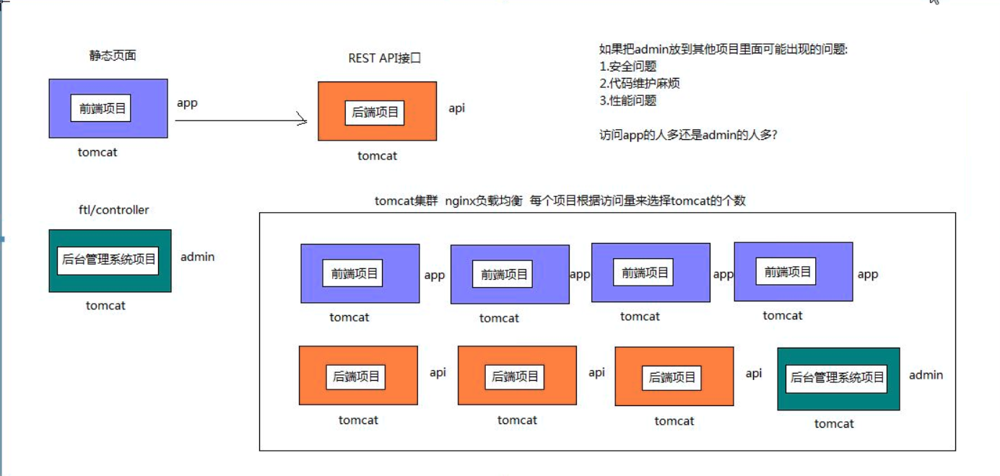
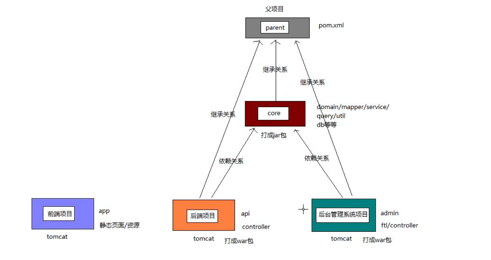

### day01

---

### 项目分离

如果将admin 放在其他项目中，可能出现的问题:
1. 安全问题
2. 代码维护麻烦
3. 性能问题 : app 访问数量比较大

可以使用tomcat 集群，ngnix 负载均衡，每个项目根据访问量来选择tomcat的个数

### 拆分项目和部署
#### 项目拆分：
parent：父项目，以pom项目的形式存在，不写代码，只用来管理项目和依赖；
core：主要包括domain，mapper和service，还包括admin和api中重复用到的组件；(打成jar包)
api：主要包括提供给前端的RESTful API接口；(tomcat部署)
admin：主要包括后台管理相关的交互操作和视图层控制；(tomcat部署)
app：纯前端项目(html+css+js等)，没有任何后台代码；(tomcat部署)

#### 依赖包管理
1.如果所有的子项目都需要使用同一个包，就添加
在parent中，parent中添加dependency，所有子项目都会自动获取该依赖

2.如果只有某个子项目用的，就直接加到子项目就可以了

3.假如只有部份子项目用到，就使用dependencyManagement来进行统一版本管理

 
---

#### 项目搭建
1. parent
    |-- 创建maven 项目,projectName=trip
    |-- 删除src目录
    |-- 添加依赖
      * |-- 编译插件 maven
2. core
    |-- 在parent 创建core moudle
    |-- <pagkage>jar
    |-- core 插件: mybatis代码生成器
    |-- 添加数据库相关的依赖
    |-- 拷贝资源文件 db/application.xml/
    |-- 创建包名com.kiva.trip.core
      * |-- domain mapper query service util
3. admin 端口 : 8280
  * |-- 在parent 创建admin moudle
  * |-- <pagkage> war
  * |-- 关联core dependency
      * |-- tomcat 插件
      * |-- freemark
  * |-- 创建包名com.kiva.trip.admin
  * |-- 创建webapp
4. api  端口 : 8180
  * |-- 在parent 创建api moudle
  * |-- <pagkage> war
  * |-- 关联core dependency
  * |-- 添加依赖
      * |-- tomcat 插件
  * |-- 创建包名com.kiva.trip.api
  * |-- 创建webapp
  * |-- 配置restful 的web.xml
  * |-- mvc.xml
      * |-- 引入core中的application.xml
      * |-- 引入文件上传解析器
5. app  端口 : 80
  * |-- static web 项目，创建app
  * |-- 导入静态文件资源,使用tomcat 启动

细节:
* 设置忽略显示项目中的文件
setting->editor-->file types-->ignore files-->.idea,* .iml

* api 项目引用core 需要先将core,parent 打包到本地仓库

 
---

### 总结

解决跨域问题:
后台：mvc 添加配置，授权某个域名可以访问
前端: 设置ajax 的属性，允许跨域+携带cookie

1. 注册功能
  |-- 邮箱不能为空
  |-- 设置默认的头像和封面
2. 登陆功能
  |-- 检查账号是否存在
  |-- 登陆成功使用UserContext保存用户数据
  |-- 返回user对象给前端
  |-- 前端使用sessionStorge存储用户(先转json字符串再存储)
  |-- 发送请求时，抽取域名和端口
3. 个人信息页面
  |-- 使用jrender进行渲染

4. 注销
  |-- 销毁session对象,前端sessionStorage的用户页需要清空
  |-- window.parent进行跳转
5. 前端路由控制
  |-- 抽取checkLogin.js文件，判断sessionStorage是否有登陆用户信息，

数据库更新问题
