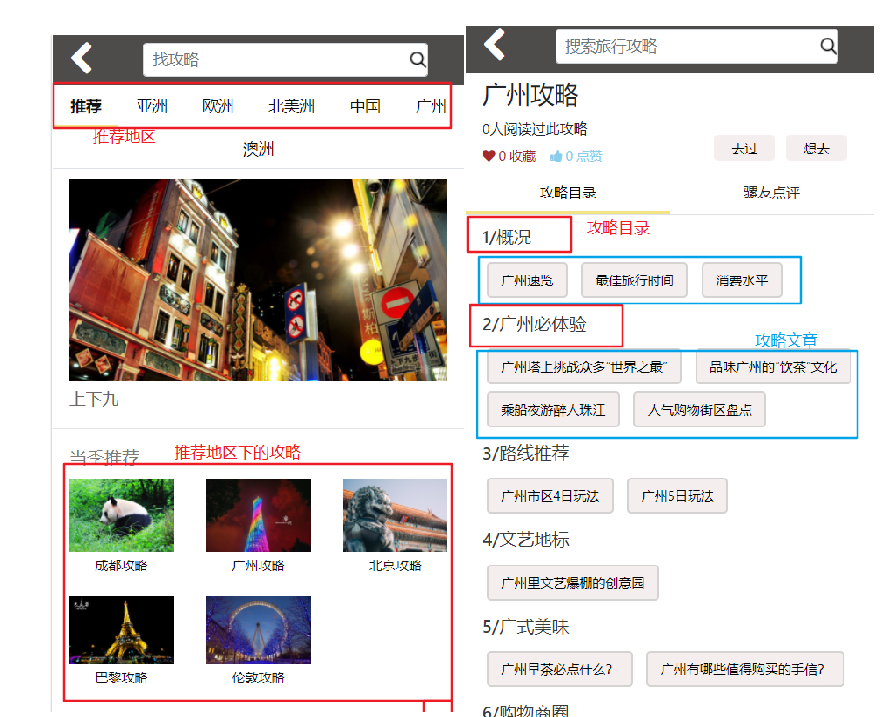
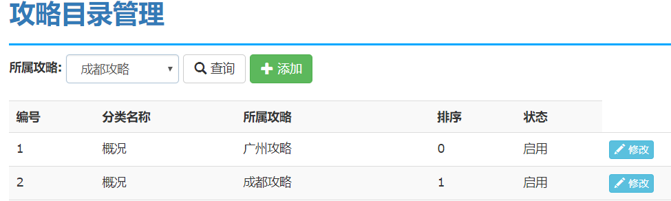
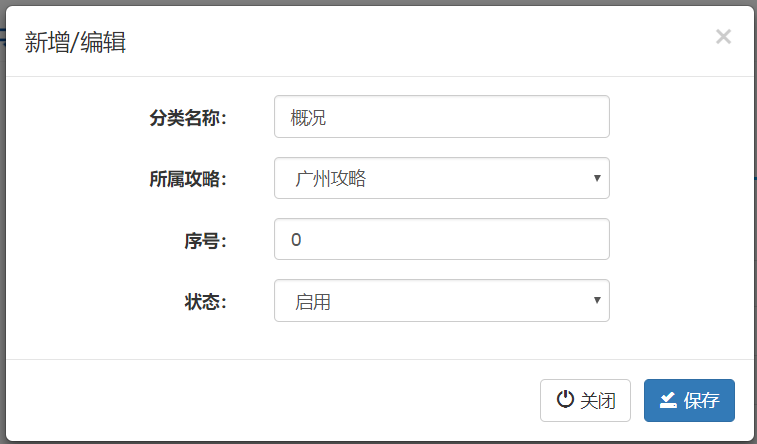
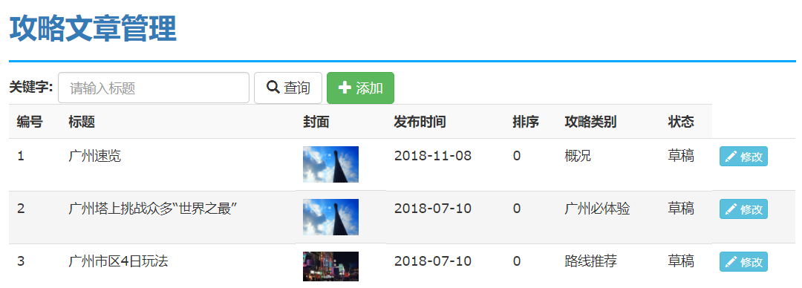
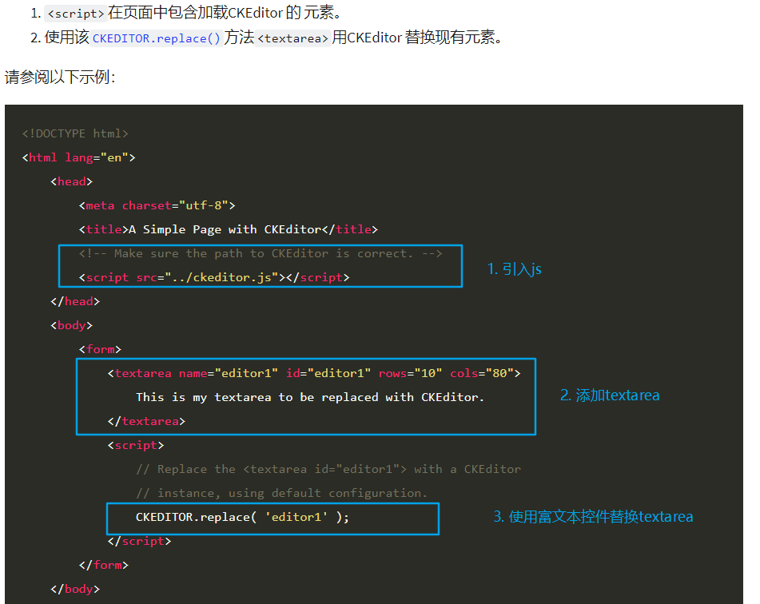

### 攻略管理
---

需求分析:
大攻略--> 攻略分类-->攻略文章




<br>
---
### 表结构设计

#### 大攻略

| 表字段  | 注释     |  实体类属性  |
| :------------- | :------------- |:------------- |
| id         | 主键       |id       |
| place_id   | 所属地区id      |Region place     |
| title      | 攻略标题       | String title    |
| subTitle   | 攻略副标题      |String subTitle   |
| coverUrl   | 封面    | String coverUrl      |
| state      | 状态    |Integer state<br>STATE_COMMON = 0;//禁用<br>STATE_HOT = 1;//热门<br>STATE_DISABLE = -1;//禁用      |


#### 攻略目录

| 表字段  | 注释     |  实体类属性  |
| :------------- | :------------- | :------------- |
| id       | Item Two       |Item Two       |
| name       | 攻略分类目录名称       |String name       |
| strategy_id      | 大攻略id     |Strategy strategy   |
| sequence       | 序号(用于排序)    |Integer sequence       |
| state       | 状态(启动，禁用)      |Boolean state  |


#### 攻略文章

| 表字段  | 注释     |  实体类属性  |
| :------------- | :------------- | :------------- |
| id       |文章id     |        |
| title       | 标题       |String title       |
| createTime      | 创建时间   | Date    |
| releaseTime       | 发布时间  |Date       |
| sequence       | 序号      |Integer sequence |
| catalog_id       | 攻略目录分类id      |StrategyContent  |
| coverUrl       | 封面      |String coverUrl  |
| state       | 状态(草稿, 启动，禁用)      |STATE_COMMON = 0;//草稿<br>STATE_RELEASE = 1;//发布<br>STATE_DISABLE= -1;//禁用  |

#### 攻略内容表
| 表字段  | 注释     |  实体类属性  |
| :------------- | :------------- | :------------- |
| id       | 文章id       |    Long    |
| content       | 富文本内容       |String|


### admin 攻略管理


#### 查询攻略列表:
实现步骤:
1. 书写controller分页方法
2. 前端显示分页列表数据
3. 根据关键字查询标题和副标题


#### 新增和修改
* 前端页面:
    * |-- 设置json和点击事件
    * |-- 显示模态框，渲染数据
    * |-- 回显封面字段控件:
      * |-- img : 编辑时回显
      * |-- hidden : 防止编辑时，图片的丢失
      * |-- file: 用来上传文件
    * |-- 回显地区列表(查询不被禁用的地区数据)

* 后台处理保存/修改:
    * |-- 书写后台saveOrUpdate方法
    * |-- 使用multipartFile接收文件上传类型,上传封面到sso服务器
      * |-- 条件: 如果 file!=null&&file.getSize()>0
      * |-- 返回url保存到数据库

后台处理保存/编辑代码示例:
```java
@RequestMapping("/saveOrUpdate")
@ResponseBody
public JsonResult saveOrUpdate(Strategy strategy, MultipartFile file){
    JsonResult jsonResult=new JsonResult();
    try {
        if(file!=null&&file.getSize()>0){
            String url = UploadUtil.uploadAli(file);
            strategy.setCoverUrl(url);
        }
        strategyService.saveOrUpdate(strategy);
    } catch (Exception e) {
        e.printStackTrace();
        jsonResult.setErrorMsg(e.getMessage());
    }
    return jsonResult;
}
```


<br>
---

### 攻略分类

#### 攻略分类界面列表显示



实现步骤:
1. 书写controller分页方法
2. 前端显示分页列表数据，关联查询对应所属的大攻略
3. 根据state 状态显示 启动和禁用
    ${entity.state?string("启用","禁用")}
4. 按照序号进行正序排序,实现攻略目录的前后显示的关系
    |-- qo.setOrderBy(sequence);


#### 攻略分类下拉框
1. 查询所有的攻略,在下拉框中显示
2. 根据所选大攻略进行查询分类目录列表筛选
  |-- 创建接收StraegyCatalogyQueryObject 接收 strategyId
  |-- sql中 判断 where strategyId=strategyId;

controller代码
```java
-----------------StrategyCatalogQuery----------
public class StrategyCatalogQuery extends QueryObject{
    // 大攻略的id
    private Long strategyId=-1L;
}

---------------controller-------------------
@RequestMapping("/list")
 public String list(@ModelAttribute("qo") StrategyCatalogQuery qo, Model model){
     //设置按照序号升序排序
     qo.setOrderBy("sequence");
     PageInfo<StrategyCatalog> pageInfo =strategyCatalogService.query(qo);
     model.addAttribute("pageInfo",pageInfo);
     model.addAttribute("strategyList",strategyService.listAll());//查询攻略数据
     return "strategyCatalog/list";
 }
```


<br>
---

#### 添加/编辑攻略



1. 添加时获取选中的下拉框中的值设置到模态框表单下拉框
      $("#modelStrategySelect").val($("#strategySelect").val());
2. 编辑时回显数据
  |-- 编辑时根据编辑按钮当前的选项中，攻略的值设置到表单下拉框
  |--  option中设置启用和禁用,true 和false 值需要转换成字符串

前端页面数据回显代码:
```js
$(".inputBtn").click(function () {
    $("#inputModal input").val("");

    //数据回显
    var json=$(this).data("json");
    if(json){//编辑时界面回显
        $("#inputModal input[name=id]").val(json.id);
        $("#inputModal input[name=name]").val(json.name);
        $("#inputModal input[name=sequence]").val(json.sequence);

        //设置状态，boolean值需要设置成 "true"字符串
        $("#inputModal select[name=state]").val(json.state+"");
        $("#modelStrategySelect").val(json.strategyId);
    }else{
        //--模态框所属攻略下拉框数据和页面当前选中的所属攻略
        $("#modelStrategySelect").val($("#strategySelect").val());
    }
    $("#inputModal").modal("show");
})
```

3. 新增时序号不填时，序号实现自动自增
  * |-- 在service 中判断用户是否填了序号,没有填，就自增


##### 保存或修改业务逻辑层代码实现:
```java
public void saveOrUpdate(StrategyCatalog strategyCatalog) {
    if(strategyCatalog.getId()!=null){ //更新
        strategyCatalogMapper.updateByPrimaryKey(strategyCatalog);
    }else{// 添加攻略目录时，序号为空时，默认序号自增添加
        if(strategyCatalog.getSequence()==null){
            //根据大攻略的id 的分类查询最大的序号
            Integer max=strategyCatalogMapper.selectMaxSequenceByStrategyId(strategyCatalog.getStrategy().getId());
            strategyCatalog.setSequence(max+1);  //设置自动增长的序号
        }
        strategyCatalogMapper.insert(strategyCatalog);
    }
}
```


##### sql语句:根据大攻略的id 的分类查询最大的序号
```sql
// 设置默认是0
select IFNULL(MAX(sequence),0) from strategycatalog WHERE strategy_id=#{strategyId}
```

<br>
---

### 攻略文章管理

文章列表显示:



实现步骤:
1. 显示分页列表数据
2. 关联攻略分类类别查询id和name
3. 高级查询，根据keyword搜索
4. 按照排序字段进行升序排序，实现根据排序修改显示位置

### 攻略+攻略分类二级联动

实现步骤:
1. 先查询大攻略列表数据下拉框
2. 监听大攻略列表下拉框的值改变事件
3. 获取选中的大攻略id值
4. 根据大攻略id值查询攻略目录
    |-- 调用在 strategyCatalogController中listByStrateById
5. 异步获取攻略目录的列表
6. 拼接option 到catalogSelect

二级联动前端核心代码:
```js
//所属攻略分类回显 : 所属攻略改变时发送异步请求查询分类
 $("#strategySelect").change(function () {
     var id=$(this).val();//获取当前选中的大攻略id

     $.get("/strategyCatalog/listByStrategyId.do",{strategyId:id},function (data) {
         //获取攻略分类列表，显示数据
         var temp;
         $.each(data,function (index,ele) {
             temp+='<option value="'+ele.id+'">'+ele.name+'</option>';
         })
         $("#catalogSelect").html(temp);
     })
 })
```


### 攻略文章序号排序
* 根据攻略的目录查询最大序号，再自增

```sql
// 设置默认是0
select IFNULL(MAX(sequence),0) from stragedetail WHERE catalogId=2
```

<br>
---

### 富文本编辑器 ckEditor简单使用
插件选择: PC端可以使用ckEditor 或 ueditor插件,这里使用ckEditor

参考网站:https://ckeditor.com/docs/ckeditor4/latest/guide/dev_installation.html

<br>
##### 使用步骤:
1. 引入ckeditor.js的js文件
2. 添加一个textarea标签
3. 使用ckeditor 替换textarea





4. config.js中设置图片上传的地址,指定了/image.do作为富文上传文件的路径,因此，需要，创建一个接口上传富文本的编辑器，并返回响应

```js
//配置图片上传的地址
config.filebrowserUploadUrl= '/images.do';
```

5. 修改插件上传文件名 (upload)
6. 上传成功后,指定返回数据格式(uploaded)

文件上传接口:
```java
public class ImageController {
    @PostMapping
    public Map uploadUserImg(MultipartFile upload){//文件参数为upload
        Map<String,Object> map=new HashMap<>();
        try {
            String fileUrl=UploadUtil.uploadAli(upload);
            map.put("uploaded",1);  //返回字段为uploaded
            map.put("url",fileUrl);
        } catch (Exception e) {
            e.printStackTrace();
            map.put("uploaded",0);
            map.put("msg","服务器空间不足，上传失败");
        }
        return map;
    }
}
```


7. 保存操作，设置创建时间默认值
8. 设置发布时间
  * |-- 在service中判断是否是发布状态，如果是就设置发布时间
9. 保存时，需要先保存攻略文章表，再保存攻略内容表
10. 表单提交之前需要先获取富文本中的内容,将数据设置到表单控件中,否则获取不到表单数据
  * |-- 再将内容设置到textarea中
11. 富文本内容回显，使用异步请求查询指定文章id的富文本内容


```java
@Override
public void saveOrUpdate(StrategyDetail strategyDetail) {
    if(strategyDetail.getId()!=null){
        strategyDetailMapper.updateByPrimaryKey(strategyDetail);  
    }else{
        //如果是发布状态，设置发布时间
        if(strategyDetail.getState()==StrategyDetail.STATE_RELEASE){
            strategyDetail.setReleaseTime(new Date());
        }

        //默认序号自增---> 查询攻略分类的最大id实现自增
        if(strategyDetail.getId()==null){
            Integer max=strategyDetailMapper.selectMaxSequenceByCatalogId(strategyDetail.getCatalog().getId());
            strategyDetail.setSequence(max+1);
        }
        strategyDetailMapper.insert(strategyDetail);

        //保存文章内容数据
        StrategyContent strategyContent = strategyDetail.getStrategyContent();
        strategyContent.setId(strategyDetail.getId());
        contentMapper.insert(strategyContent);
    }
}
```

点击提交表单数据

```js
//点击提交表单数据
$(".submitBtn").click(function () {
    //表单提交之前，获取富文本内容并设置到textrea中
    var data=ckEditer.getData();
    $("#editor1").val(data);
    //提交表单数据
    $("#editForm").ajaxSubmit(function (data) {
        showResult(data);
    })
})
```
攻略文章内容数据回显:
```js
$.get("/strategyDetail/selectStrategyContent.do",{id:json.id},function (data) {
    ckEditer.setData(data.content);
})
```

### 修改
1. 数据回显
2. 获取攻略id,获取分类的外键strategyId  sc_s_id
3. 封装时，在association(sc_)中添加association(s_)
4. 先回显大攻略的下拉框
5. 根据大攻略id查询攻略目录数据
6. 回显攻略目录下拉框
7. 获取攻略内容，编辑时才进行查询
8. 更新时，不更新发布时间
9. 清空模态框数据
    |-- 清空编辑器 ckEditor.setData("");


### 总结
1. app 看游记页面
2. app 游记内容页面
3. admin 大攻略管理页面
  |-- 提交表单时，才上传图片
  清空 图片 $(img).removeAttr("src");
4. admin 攻略目录管理页面
  |-- 按照序号正序排序
  |-- 可以根据大攻略下拉框进行查询
  |-- 点击添加按钮
  |-- 保存时，没有序号，默认自增
5. admin 攻略文章管理页面
  |-- 模态框使用二级联动的方式选择攻略类别
  |-- 保存时，没有序号，默认自增
  |-- 如果是发布状态需要设置发布时间
  |-- 富文本编辑器，保存时，需要先获取文本编辑器的内容，设置到textarea中，才能提交
  |-- 富文本编辑器的上传图片:设置接收的参数名upload和返回的状态uploaded 0/1
  |-- 先保存文章表，再保存内容表
