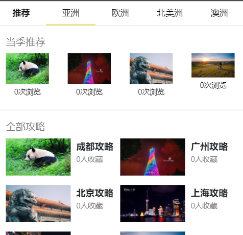
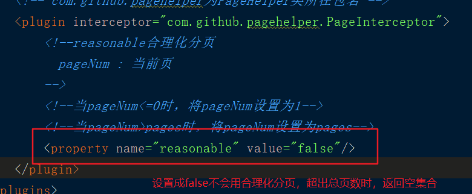
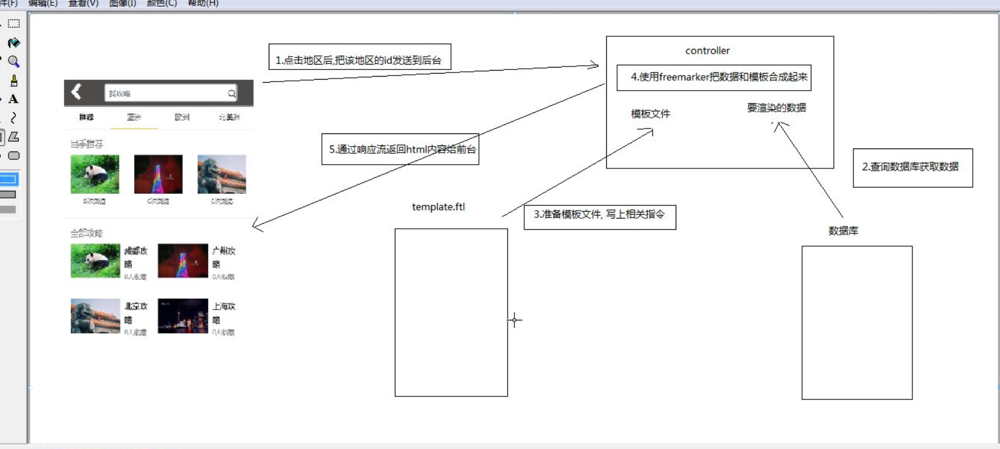
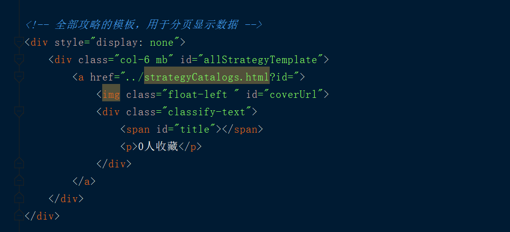
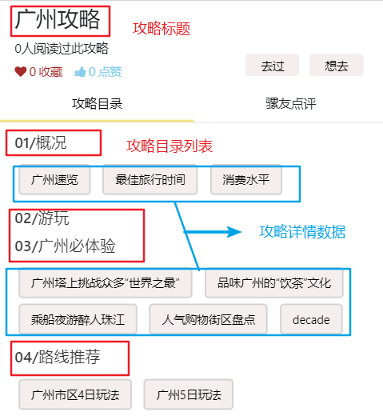
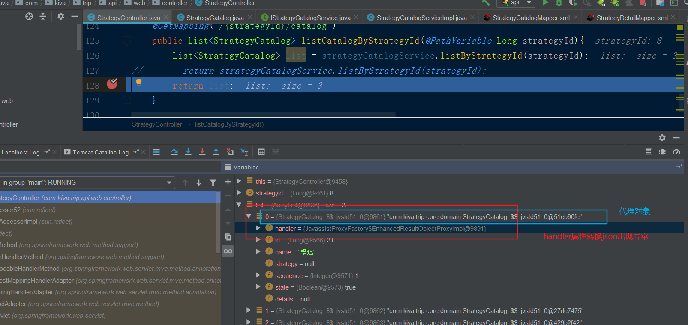
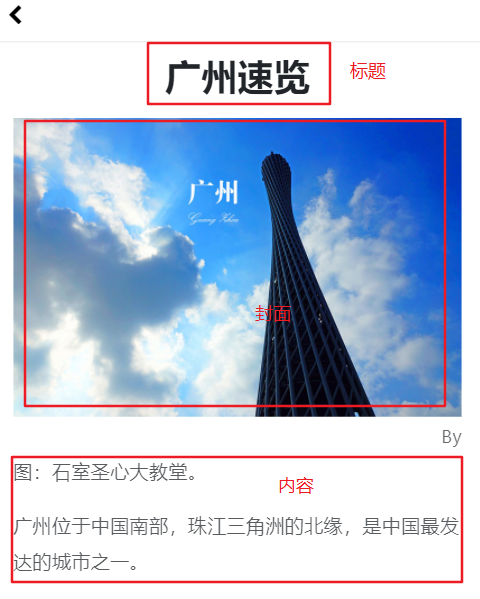

### app找攻略
标签导航页面使用bootstrap的标签页插件
参考网站: https://v3.bootcss.com/javascript/#tabs

#### 推荐攻略需求分析:
1. 获取地区表中状态为推荐的数据
2. 获取大攻略表状态为推荐的数据


#### 热门地区(点击导航栏):
1. 获取当前地区下的推荐状态的大攻略(不分页0)
2. 获取当前地区下的全部攻略(需要分页)




#### 获取推荐状态下的大攻略数据
接口设计
资源路径: /strategies
请求动作: get
请求参数: state=1
返回结果: PageInfo

StrategyController
```java
/**
 *  获取推荐状态下的大攻略数据(不分页)
 *  accept="application/json"   : 指定返回类型是json数据
 */
@GetMapping(headers ="accept=application/json")
public PageInfo<Strategy> queryList(StrategyQuery qo){
//        qo.setPageSize(0);//设置为0，不会进行分页
    return strategyService.query(qo);
}

------------StrategyQuery -----------
class StrategyQuery extends QueryObject{
  Integer state;  //根据状态查询
}
```


##### 前端页面
```js
//请求获取推荐大攻略的数据，不分页
$.get(baseUrl + "/strategies", {state: 1, pageSize: 0}, function (data) {
    $(".strategyCommend").renderValues(data,{
        myHref:function(item,value) {
            var url=$(item).data("url");
            $(item).attr("href",url+value);
        }
    });
},"json")

------------设置用于跳转页面时携带id参数---------
<a data-url="strategyCatalogs.html?id=" render-key="list.id" render-fun="myHref">
    
    <p render-html="list.title"></p>
</a>
```

<br>
---

## 动态显示地区列表

bootstrap 显示标签页参考:
https://v3.bootcss.com/javascript/#tabs


#### 动态显示地区列表步骤分析
1. 设计接口获取地区中状态为推荐的数据
2. 发送请求获取地区中状态为推荐的数据
3. 标签页的每一个 li 对应一个 div(content)
      |-- li标签中的 href---> div 的id
      |-- 设计在使用地区的id 来设置 href 和 div的对应关系
3. 循环列表数据，拼接li标签添加到ul中(ul.append)(导航)
4. 拼接content中的div，拼接到pill-content中 (内容)
5. li 标签中的href对应tab-content中的div,使用id 作为href中的对应div


#### 前端请求获取地区推荐数据
步骤分析:
1. 给每一个li绑定点击事件(需要在地区数据回显完成之后才能)
2. li 添加data-id保存id数据,使用选择器进行点击事件的判断
    |-- li[data-id] : 只有包含data-id 才设置点击事件s
    |-- 不需要给推荐设置点击事件
    |-- 每次点击导航栏设置分页数据 currentPage=2 和 pages=2
    |-- 获取地区id
    |-- 发送请求,查询对应地区的 推荐攻略和所有攻略
    |-- 返回html数据显示在对应的content
7. 请求标签内容页面时，使用freeMark动态生成html

```java

//请求获取推荐的地区数据，不分页
$.get(baseUrl + "/regions", {state: 1}, function (data) {
    // 使用jrender会出现样式丢失，因此使用标签拼接的方式
    var temp="";
    var content="";
    $.each(data,function (index,ele) {
        temp+='<li class="nav-item" data-id="'+ele.id+'"><a class="nav-link" data-toggle="pill" href="#pills-'+ele.id+'">'+ele.name+'</a></li>';
        content+='<div class="tab-pane fade" id="pills-'+ele.id+'">'+ele.name+'</div>'
    })
    //添加拼接的标签
    $("#pills-tab").append(temp);
    //添加拼接的内容div
    $("#pills-tabContent").append(content);

    //设置导航栏的点击事件
    $(".nav-item[data-id]").click(function () {

        currentPage=2;// 每次导航栏点击，需要重新设置当前页
        pages=2;//每次点击导航栏，重新设置总页数为2

        placeId=$(this).data("id");

        if(placeId){
            //获取当前地区的id查询 推荐攻略和所有攻略
            $.get(baseUrl + "/strategies", {placeId: placeId}, function (data) {

                //返回html数据显示在对应的 tab-pane div上 , 根据id查找 pills-placeId
                $("#pills-"+placeId).html(data);
            },"html")
        }
    })

})

```

注意:
1. 使用分页获取数据，初始化currentPage=2,如果数据库中的数据只有一页数据,分页插件如果使用合理化分页，会导致出现重复数据





<br>
---
### 使用freeMark动态生成html

步骤分析:
1. 点击地区，将地区的id发送到后台
2. 查询数据库获取数据
3. 准备一个模板文件,template.ftl文件
    |-- 模板文件写上相关指令
4. 使用freeMark合成数据+模板
5. 将合成结果输出到浏览器




#### 接口设计

获取大攻略中状态为推荐的数据(json)
资源路径: /strategies      accept="application/json"
请求动作:get
参数: state=1
返回类型 : PageInfo


获取大攻略的数据(html)
资源路径: /strategies      accept="text/html"
请求动作:get
参数: 地区的id
返回类型 : html


#### 前端请求实现步骤:
1. 编写俩个方法指定返回类型,指定请求头信息
2. ajax 请求设置头信息:
    |--  $.get(url,参数,回调函数,'json')
    |--  $.post(url,参数,回调函数,'html')
3. 点击地区发送请求，携带地区id
4. 后台需要在query中添加地区id的参数接收
5. 修改sql,根据地区id查询大攻略数据
6. 显示数据,获取当前选中的id
  $("#pills-"+placeId).html(data);

```js
//获取当前地区的id查询 推荐攻略和所有攻略
$.get(baseUrl + "/strategies", {placeId: placeId}, function (data) {

    //返回html数据显示在对应的 tab-pane div上 , 根据id查找 pills-placeId
    $("#pills-"+placeId).html(data);
},"html")
```


#### 后端实现
* 使用freemarker生成html模板数据返回页面进行显示

实现步骤:
1. 在webapp中创建一个templates/templates
2. 查询数据
    |-- 查询当季推荐的数据(不分页)
    |-- 查询全部攻略的数据(分页)
3. 编写模板
4. 合成数据和模板
    |-- 添加freemark的依赖
    |-- 创建配置类 Configuration--> 指定版本
    |-- 设置模板所在的目录new File(ServletContext.getRealPath("templates"))
    |-- 设置编码 setDefaultEncoding("utf-8")
    |-- 获取模板文件getTemplate("template.ftl");
    |-- 设置数据和输出流 template.process(map,response.getWriter);


```java
     /**
     *  获取推荐状态下的大攻略数据(不分页)
     *  accept="application/json"   : 指定返回类型是json数据
     * @return
     */
    @GetMapping(headers ="accept=application/json")
    public PageInfo<Strategy> queryList(StrategyQuery qo){
//        qo.setPageSize(0);//设置不进行分页
        return strategyService.query(qo);
    }

    /**
     *
     * 获取指定地区下的大攻略数据
     * 资源路径: /strategies      accept="text/html"
     * 请求动作:get
     * 参数: 地区的id
     * 返回类型 : html
     */
    @GetMapping(headers ="accept=text/html")
    public void queryListByPlaceId(StrategyQuery qo, HttpServletResponse resp) throws Exception {
        // 推荐大攻略 () :  不分页 + 推荐状态
        qo.setState(Strategy.STATE_HOT);
        qo.setPageSize(0);
        PageInfo<Strategy> hot = strategyService.query(qo);

        //+ 所有的攻略 : 所有攻略+分页
        qo.setState(null);
        qo.setPageSize(4);
        PageInfo<Strategy> all = strategyService.query(qo);

        //-----将数据封装到freemark模板中-------
        // 需要设置输出的编码格式
        resp.setContentType("text/html;charset=utf-8");

        // 指定freemark的版本
        Configuration cfg = new Configuration(Configuration.VERSION_2_3_23);
        // 指定模板文件从何处加载的数据源，这里设置成一个文件目录。
        //  ----> 获取webapp下的文件夹路径
        cfg.setDirectoryForTemplateLoading(new File(servletContext.getRealPath("templates")));
        //指定编码格式
        cfg.setDefaultEncoding("utf-8");

        // 指定模板数据
        Map root = new HashMap();
        root.put("hot",hot);
        root.put("all",all);

        //----指定模板文件名
        Template temp = cfg.getTemplate("strategy_template.ftl");
        // 指定模板的数据和输出的流
        temp.process(root, resp.getWriter());
    }


---------模板中取数据进行显示-----------
<#list hot.list as s></#list>
<#list all.list as s></#list>
```


<br>
---

## 使用滑动加载下一页

#### 实现步骤:
1. 当前页2  总页数2
2. 设置pageSize和后台一样
3. 请求大攻略分页获取下一页数据,使用clone添加元素
4. list 的item项div进行克隆
5. 将克隆出来的div添加到页面上

模板数据如下:


问题:
* 推荐列表不需要发送分页请求,请求josn 数据查询下一页
* 在滑动时判断，如果有地区id,才进入分页查询

核心代码如下:
```js
// 根据当前页进行查询
function query(){
    console.log(placeId+"------placeId---------");
    if(flag){return;}
    flag=true;
    $.get(baseUrl+"/strategies",{placeId: placeId,currentPage:currentPage,pageSize: 4},function (data) {
        pages=data.pages;

        //遍历数组,使用克隆模板的方式，填充数据，添加到 .classify <div>上
        $.each(data.list,function (index, ele) {
            var addStrategy=$("#allStrategyTemplate").clone();
            $(addStrategy).find("img[id=coverUrl]").attr("src",ele.coverUrl);
            $(addStrategy).find("span[id=title]").html(ele.title);

            //添加数据到.classify <div>
            $(".classify").append(addStrategy);
        })

        currentPage++;
        flag=false;  //可以再次请求
    },"json")
}
```

注意:
+ 每次点击导航设置currentPage=2,page=2
+ Ajax 发送数据类型dataType属性


<br>
---
## 攻略目录页面



1. 使用render-key 和 render-fun 携带id数据到攻略目录页面
2. 根据大攻略id查询大攻略信息
3. 前端页面发送请求获取大攻略数据，显示标题


##### 根据大攻略id查询大攻略信息
接口设计:
资源路径: /strategies/{id}
动作:get
参数:无
返回类型:Strategy对象

##### 根据大攻略id查询攻略目录信息
接口设计:
资源路径: /strategis/{id}/catalogs
动作:get
参数:无
返回类型: List<攻略目录对象>(不分页)

步骤:
1. 在strategisController添加一个listAllByStrategyId()查询
2. 使用攻略目录的service查询
3. 在前端使用render-loop 显示攻略目录的数据
4. 使用render-key 和 render-fun 动态显示标题 01/标题
5. 后台需要根据序号进行排序


```sql
<!-- 根据攻略id查询对应的攻略目录 -->
<select id="selectListByStrategyId" resultMap="BaseResultMap">
  select id, name, strategy_id, sequence, state
  from strategycatalog
  where strategy_id=#{strategyId}
  order by sequence
</select>
```

#### 查询目录下文章
在查询目录时，使用额外sql查询文章集合
```
1. 在domain中添加List<StrategyDetail>
2. 使用额外sql 查询
3. 根据目录id查询文章详情
4. render-html="list.detail.title" 显示数据
```

```xml
<!--查询关联的文章列表数据-->
<collection property="details"
   select="com.kiva.trip.core.mapper.StrategyDetailMapper.selectByCatalogId"
   column="id">
 </collection>

 <!-- 根据攻略目录id 查询文章 -->
<select id="selectByCatalogId" resultMap="BaseResultMap">
 SELECT
id, title, createTime, releaseTime, sequence, catalog_id, coverUrl, state
 FROM
 strategydetail
 WHERE
 catalog_id = #{id}
</select>
```


##### 500 json转换问题:
* 额外sql查询时,由于额外sql具有懒加载功能，需要使用代理对象，当需要调用方法时，才会进行懒加载
* 代理对象中有一个handler属性,转换json会出错，因此，需要忽略该属性

##### 解决方式:
@JsonIgnoreProperties("handler") : 在domain类中转json数据的时候把该属性忽略掉




<br>
---
## 攻略详情页面

接口设计:
资源路径: /strategyDetails/{id}
请求方式: get
请求参数: 无
返回结果: 攻略文章对象

步骤:
1. 使用render-key ,render-fun 传递攻略id到攻略详情页面
2. 创建文章资源控制器,创建getById(Long id)方法
3. 书写多表查询sql,关联文章内容
4. 请求返回回去数据进行页面回显




<br>
----

总结:
1. admin 攻略文章回显
  |-- 二级联动下拉框回显(先按照大攻略查询攻略目录，再回显目录)
  |-- 发送ajax 获取文章内容
      |-- ckEditer.setData(xxx);

2. app 找攻略页面
  |-- 查询推荐栏目下[当季推荐],查询大攻略中所有状态为推荐的数据(不用分页),使用jrender
  |-- 实现导航栏地区数据的回显(推荐状态,不分页)
  |-- 点击地区，发送ajax请求，获取该地区的攻略数据，返回(html)
      |-- 后台根据地区id
          |-- 查询当季推荐攻略数据(不分页)
          |-- 全部攻略数据(分页)
      |-- 准备html模板，写上相关指令
      |-- 使用freemarker 的工具进行渲染
      |-- 通过response流响应给前台
  |-- 页面滑动分页功能,获取该地区的攻略数据(json 格式的数据)
      |-- 滚动时，判断是否有地区id，没有不去查询
      |-- 滚动时，默认查询第二页的数据,总页数从2开始
      |-- 回调函数中通过模板克隆的方式拼接到指定的选择器中

3. app 的攻略目录页面
  |-- 根据大攻略的id查询大攻略数据
  |-- 根据大攻略的id查询攻略目录数据,同时使用懒加载查询文章，封装到文章集合
  |-- 解决json转换问题
