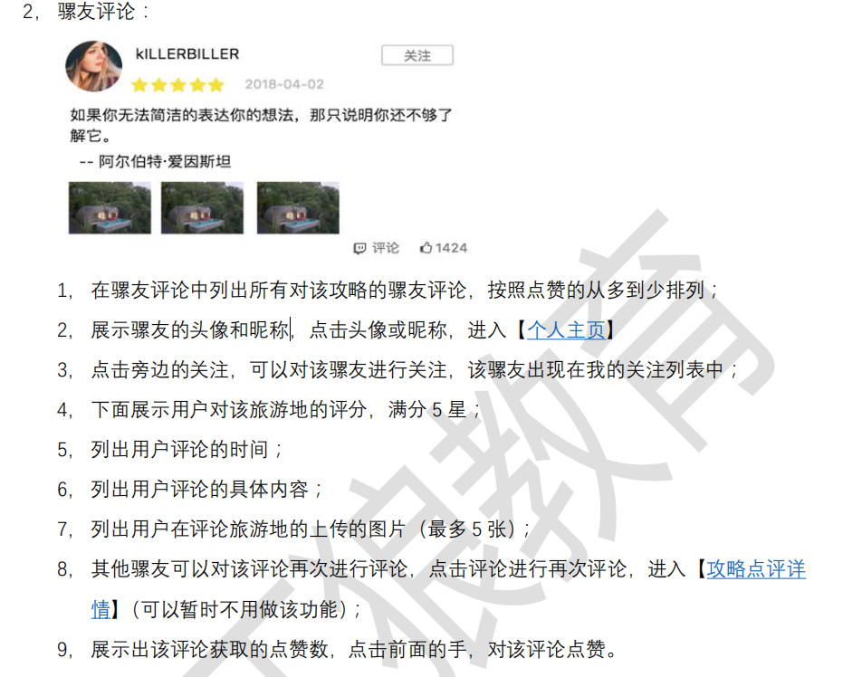

### 使用相关插件
星星图标:使用Font Awesome :css样式图标
参考官网 : http://www.fontawesome.com.cn/icons-ui/

<br>
---

### app 点评

#### 评论表

| 字段   | 描述      | 实体类|
| :------------- | :------------- |
|id | id     | Item Two       |
|user_id| 评论人id   | User     |
|createTime| 评论时间       | Date    |
|content| 评论内容      | String       |
|imgUrls| 评论图片       | String     |
|starNum| 星星数量       | Integer     |
|strategy_id| 攻略id     | Strategy    |
|state| 状态      | Integer<br>普通，推荐，禁用       |
|commendTime| 头条推荐时间      | Date    |

#### 标签表

| 标签表     |
| :------------- | :------------- |
| id       | 描述      |
| name       | 标签名称      |

#### 中间表
| 中间表    |
| :------------- | :------------- |
| comment_id   | 评论id      |
| tag_id       | 标签id      |


<br>
---


## 螺友评论列表显示

#### 需求分析



### 根据大攻略id查询评论数据

#### 接口设计
1. 资源路径: /strategies/{id}/comments
2. 请求动作: get
3. 请求参数: 分页参数
4. 返回结果: pageInfo

#### 开发步骤
1. 创建controller定义查询评论列表的方法
2. 定义分页queryObject
3. 在sql 中添加strategyId 条件判断
4. 多表关联user表，查询攻略点评的用户信息
5. 按照创建时间进行排序

StrategyController
```java
@GetMapping("{strategyId}/comments")
public PageInfo<StrategyComment> queryDetailById(StrategyCommentQuery qo){
   qo.setOrderBy("createTime desc");
   return commentService.query(qo);
}

--------------评论查询条件封装---------------------
class StrategyCommentQuery{
  Long strategyId;
}
```

#### 前端发送请求获取评论列表
步骤:
1. 在strategyCatalog.html中,使用滑动分页加载攻略评论列表
2. 请求数据，使用render回显数据
3. 使用render-loop遍历评论列表
4. 显示评论的星星数
  |-- 使用render-key 传递starNum
  |-- render-fun 指定渲染时调用getStar函数
  |-- 在render-value注入值定义getStar函数
  |-- 拼接starNum个实心星星,5-starNum个空心星星

```js

$.get(url,{currentPage:currentPage},function (data) {
       pages=data.pages;
       //保存每次分页的数据 ,合并两个数组到第一个数组上。
       $.merge(pageArr,data.list);

       //设置值到rennder中    pageArr:需要设置 list属性
       $("#comment").renderValues({list: pageArr},{
           getStar:function (item, value) {
               //根据星星数，添加 value个实心星星  5-value个空心
               var temp="";
               for(var i=0;i<value;i++){  
                   temp+='<i class="fa fa-star">';
               }
               for(var i=0;i<5-value;i++){
                   temp+='<i class="fa fa-star-o">';
               }
               $(item).append(temp);
           }
       })
}


<!--显示星星数-->
<span class="comment-star" render-key="list.starNum" render-fun="showStar">
</span>
```

5. 图片url进行切割
  * |--  在domain 中定义一个img图片的数组属性，对imgUrls进行切割
  * |--  在前端使用 render-loop 遍历数组
  * |--  使用render-src="list.imgArr.self"回显数据
       * |-- :返回的数组没有属性名获取，使用self获取值

```java

----------后端数据切割-----------
public String[] getImgArr(){
   return imgUrls.split(";");
}

-----------返回数据----------------
"imgArr": [
  "https://kiva.oss-cn-shenzhen.aliyuncs.com/trip/1e02655e-b8cc-418d-9624-fc67ef590f31.jpeg",
  "https://kiva.oss-cn-shenzhen.aliyuncs.com/trip/b81b4df5-c6c3-4459-a35b-27625d66a44b.jpeg"
]

----------------前端获取图片-----------
<ul class="comment-img" render-loop="list.imgArr">
     <li>
         
     </li>
 </ul>

```

6. 可以使用移动端Dialog显示图片大图
  |-- 绑定图片的点击事件
  |-- 使用移动Dialog显示大图

```js
//设置评论图片的点击事件
 $(".comment-img img").click(function () {
     var src=$(this).attr("src");
     $(document).dialog({
         titleShow: false,
         overlayClose: true,
         content: '',
     });
 })
```

<br>
---

总结:
```
1. 攻略文章内容页面
2. 攻略目录页的骡友点评列表
    |-- 滚动分页
      |-- 显示评论的星星数
      |-- 使用render-key 传递starNum
      |-- render-fun 指定渲染时调用getStar函数
      |-- 在render-value注入值定义getStar函数
      |-- 拼接starNum个实心星星,5-starNum个空心星星
    |-- 图片显示，在domian 中添加一个方法，将图片url切成数组
      |-- 通过self来取值(没有属性名的情况下)
    |-- 图片点击事件:利用弹框实现

3. 攻略点评页面 mine/addComment.html
    星星点击:data-num绑定星星数
      |-- 根据num循环设置样式
      |-- 设置之前，先清空样式
    上传图片:
      |-- 抽取变量，存储当前点击的div,回显图片时使用
      |-- 先上传图片，根据图片上传的url，回显数据
    标签处理
      |-- 系统推荐(".active input")以及自定义标签$("#myTags")全部放在数组中
      |-- 传值时，不添加[]
      |-- 添加配置

    参数拼接
      |-- 星星数: 可以在点击时通过 data-num 获取
      |-- 评论内容:从文本框中获取值
      |-- 攻略id : 从界面传递参数获取
      |-- 标签数组： 定义一个数组，添加自选标签的选中标签的数组+用户自定义的标签数组
          |-- 自选标签: 遍历标签组件有 .active 选择样式，获取值，添加到数组中
          |-- 自定义:
          |-- 使用空格切割标签数组，将数组中非空元素拼接到标签数组中
      |-- 图片：需要获取图片的url,用 ; 进行拼接
      
后台处理标签数组
    |-- 先保存评论
    |-- 再循环标签数组去保存标签
    |-- 最后关联中间表,维护评论和标签的关系

swagger2 了解作用，熟悉常见的注解

```
