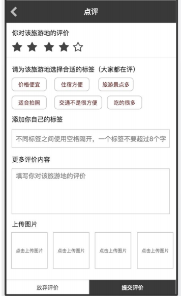

<br>


## 攻略点评页面

 


需求分析:
* 在攻略页面点击评论，进入攻略评论页面
* 导入的页面需要存放在mine中(登陆才能进行访问)
* 跳转页面时，携带strategyId,指定需要对哪个攻略进行点评

前端传递参数:
1. 星星数量 2. 标签数组 3. 评论内容 4. 上传图片  5. 攻略的id

后端默认设置参数:
1. user_id  : 默认用户登陆的id
2. createTime : (差关键时) 数据库默认当前时间
3. state: 默认普通状态

#### 使用js 设置星星点击效果
```js
$(".star i").click(function(){
    //获取星星的数值
    var num=$(this).data("num");
    // 获取所有的星星
    var arr=$(".star i");
    //清空实心样式，添加空心样式
    arr.addClass('fa-star-o').removeClass("fa-star");
    for(var i=0;i<num;i++){
        //清空空心样式，添加实心样式
        $(arr[i]).addClass('fa-star').removeClass("fa-star-o");
    }
})
-----------星星标签设置data-num 属性----------
<li data-num="1"></li>
<li data-num="2"></li>
```
#### 上传图片处理


```js

var div; //点击的图片框

// 图片框的点击事件
$(".rect").click(function(){
    div=$(this);
    $("#inputFile").click();
})
//文件框值改变事件
$("#inputFile").change(function(){
  if($(this).val()){
    $("#fileForm").ajaxXubmit({
      url:baseUrl+'/images',
      function(data){
          if(data.status==1){//上传成功
            $(div).html('<imag src='+data.url+'/>');
          }
      }
    })
  }
})

<!--文件上传表单 : 设置post/多字段文件上传格式 -->
<form id="uploadForm" method="post" enctype="multipart/form-data" style="display: none">
    <input type="file" name="file" id="uploadFile">
</form>

```


### 新增攻略评论
接口设计
1. 资源路径: /StrategyComments
2. 请求动作: post
3. 请求参数: 评论对象  StrategyComment
4. 返回结果: jsonResult

```java
//----------攻略评论资源控制器---------
@RestController
@RequestMapping("strategyComment")
class StrategyCommentController{

  @PostMapping
  @RequiredLogin  //登陆才能访问
  public JsonResult save(StrategyComment comment,String[] tags){
      ...
      service.saveOrUpdate(comment,tags);
      ...
  }
}
```
service中
1. 添加时，需要添加标签到数据库中，并使用中间表维护标签和评论表的关系
2. sql 中删除createTime字段，在数据库中设置默认时间
3. 设置登陆用户的id

```java
@Override
public void saveOrUpdate(StrategyComment strategyComment,String[] tags) {
      ...
      // 评论表需要添加作者id
       strategyComment.setUser(UserContext.getUser());
       strategyCommentMapper.insert(strategyComment);

       //遍历标签内容，添加数据到中间表 + 标签表中
       for(String tagStr:tags){
           Tag tag=new Tag();
           tag.setName(tagStr);
           tagMapper.insert(tag);
           //添加数据到中间表
           strategyCommentMapper.insertCommentAndTag(strategyComment.getId(),tag.getId());
       }
      ...
}
```


<br>
---

### 前端表单提交

标签: 应该查询广州攻略被使用的最多的前6个
配置 : 数组传值时，不添加 []
```js
//数组传值时，不添加[]
$.ajaxSettings.traditional = true;//防止深度序列化
```
步骤:
1. 使用ajax 异步请求的方式，拼接参数，进行提交数据
2. 提交数组时需要设置防止深度序列化
3. 星星数: 可以在点击时通过 data-num 获取
4. 评论内容:从文本框中获取值
5. 攻略id : 从界面传递参数获取
6. 标签数组： 定义一个数组，添加自选标签的选中标签的数组+用户自定义的标签数组
  * |-- 自选标签 ： 遍历标签组件有 .active 选择样式，获取值，添加到数组中
  * |-- 自定义:
      * |-- 使用空格切割标签数组，将数组中非空元素拼接到标签数组中
7. 图片：需要获取图片的url,用 ; 进行拼接

```js
$("#submitbtn").click(function(){

  // 获取所有div的img 标签
  //循环并使用 ； 进行拼接
  var imgs=$(".imgs img");
  var imagesUrl="";
  $.each("imgs",function(index,ele){
      imgUrls+=$(ele).attr("src")+";";
  })

  //标签数组
  var tagArr=[];
  // 获取有active样式的标签
  var inputArr=$(".active input");
  $.each(inputArr,function(index,ele){
      inputArr.push($(ele).val());
  })

  //获取用户填的标签
  var myTags=$("myTags").val();
  var myTagsArr=myTags.split(" ");
  for(var i=0;i<myTagsArr.length;i++){
    if(myTagsArr[i]!=""){
        myTags.push(myTagsArr[i]);
    }
  }

  var json={
    starNum:num, //星星数
    content:$("#content").val(),//评论内容
    imgUrls:imgUrls,
    'strategy.id':param.id,
    tags:tagArr
  };

  $.post(baseUrl+"StrategyComments",json,function(data){
    window.location.href="/strategyCatalog.html?id"=id;
  })
})
```
