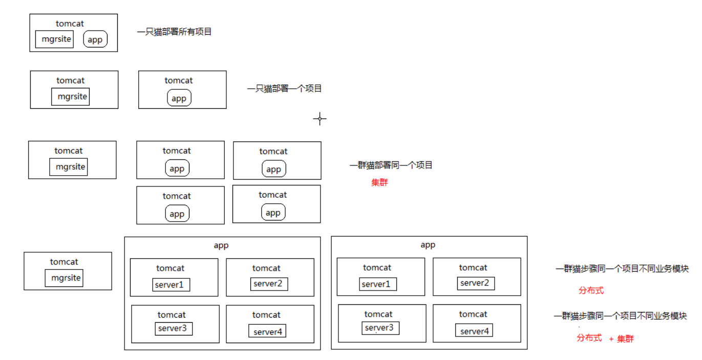
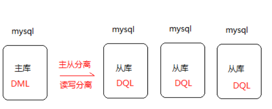
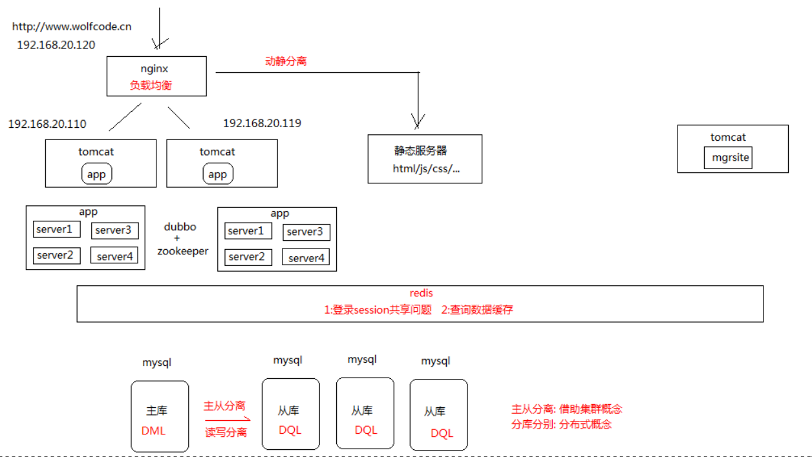

# 架构演变

* 第一种架构: 一个tomcat 服务器部署多个项目(前后端不分离)
  * |-- 一个项目启动失败，所有项目都不能访问，不利于维护
  * |-- 维护度较低,前台一改,后台也需要变
  * |-- 放在一块部署,意味前后台的地址的访问域名是一样的,这样就存在了风险
  * |-- 部署在一起，意味着前后台的用户都是在占用同一个Tomcat的资源

* 第二种架构: 一个tomcat 部署一个项目
* 第三种结构: 多个服务器部署同一个项目(集群)
* 第四阶段: 将项目分成不同的功能服务模块分别部署在不同的服务器上(分布式) + 集群
  * |-- 分布式: 部署操作
  * |-- 微服务: 业务拆分

#### 负载均衡ngnix:
* 请求并发量大时,使用多个服务器部署同一个项目时,选择访问并发量少的服务器

#### 动静分离别
* 动静分离:将静态资源存放在静态服务器,由ngnix去分发访问

#### 不同服务器之间的服务怎么访问?
  * 微服务开发: 使用 dubbo/springclound

数据库:
* 主从分离:(读写分离):借助集群的概念
  主库:做增删改  
  从库:做查询
* 主从同步:(实时同步)
* 分库分别:分布式概念

#### 多次访问同一条sql,都会访问数据库，性能不好，使用redis
1. 登陆session共享问题
2. 查询数据缓存

总结:
1. 集群：同一个业务，部署在多个服务器上
2. 分布式
3. 微服务
都是将一个业务拆分成不同子业务模块部署在不同的服务器上
分布式偏向于技术部署
微服务偏向于业务拆分

大型项目一般采用:分布式/微服务+集群

技术路线:
1. 数据库: MySql +mongodb +elasticsearch
2. 持久层: MyBatis+Redis(缓存)
3. 业务层: SpringBoot
4. Web : SpringMVC
5. 中间件 : dubbo + zookeeper
6. 前端: jQuery + Bootstrap3/纯js + css
