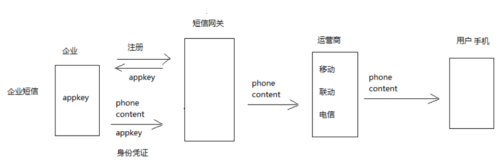

## 短信验证

> 在分布式开发中,俩个请求可能会被ngnix 负载均衡服务器，分别分发给不同服务器，因此，存在session数据不能共享的问题
-- 页面上传验证码跟之前随机生成的验证对比,分布式项目中不能共享session
问题:怎么解决生成验证码保存在服务器端的问题?
-- 使用redis 在生成验证码时，将验证码保存到redis服务器上


#### 需求分析:
1. 前端验证码的发送
2. 验证码生成与缓存
3. 验证码的校验

#### 短信验证功能分析
```java
  |-- VerifyCodeController.sendVerifyCode方法
      |-- 随机生成一个验证码
      |-- 发送短信
      |-- 将验证码保存到服务器上+失效的时间
  |-- LoginController.userRegist方法
      |-- 页面上传验证码跟之前随机生成的验证对比
        |-- 分布式项目中不能共享session
        |-- 从redis服务器中获取验证码信息
```


操作步骤:
```
前端
|-- 点击获取验证码，发送请求

后端
trip-website
VerifyCodeController.sendVerifyCode
  |-- 定义一个方法
  |-- 校验手机号
  |-- 生成4位验证码   UUID.ramdomUUID
  |-- 发送到用户手机
    |-- 拼接短信信息("短信验证码是+code+"短信验证时间")
    |-- 使用HttpURLConnection 请求短信接口,发送短信信息
  |-- 使用redis缓存验证码
    |-- springboot集成redis,创建trip-cache-api，trip-cache-server
    |-- 引用IVerifyCodeRedisService ，调用VerifyCodeRedisService.setVerfyCode(phone,code)

trip-cache-api
  |-- 添加依赖 springboot-redis，properties文件
  |-- 创建RedisConfig 配置类,引用properties文件
      |-- 使用springboot 模板，需要配置key-value序列化
  |-- 创建验证码服务接口 IVerifyCodeRedisService
  |-- 创建redis的总服务接口 IRedisService

redis key 值的设计:
  |-- api 创建prefix.BaseKeyPrefix (基本redis key的前基类)
      |-- prefix + time
  |-- 实现类 VerifyCodeKeyPrefix  保存短信验证码前缀,设置过时时间

trip-cache-server
  |-- 添加依赖 trip-cache-api
  |-- 创建验证码服务接口实现 VerifyCodeRedisServiceImpl
      |-- 封装了验证码保存到redis相关的业务方法
  |-- 创建redis的总服务接口实现 RedisServiceImpl
      |-- 定义了redis保存和获取key等与业务无关的操作
  |-- 创建CacheServer启动服务


注册时校验验证码
  |-- 调用VerifyCodeRedisService的getVerifyCode()方法
  |-- 如果验证码输入不正确,抛出异常
```

#### 相关代码逻辑

```java
// 基本redis key的前缀基类
class BaseKeyPrefix{
  private String prefix;//前缀
  private int time;//时间，key 值的失效时间---> 如果为负数，代表不失效
  //有参构造器
}
// 短信验证码前缀
class VerifyCodeKeyPrefix extends BaseKeyPrefix{
  public static final  VerifyCodeKeyPrefix verify_code_prefix=new VerifyCodeKeyPrefix("verify_code",Consts.Time*60);
  //重写有参数构造器
}
```

```java
// 封装短信验证相关逻辑操作
class VerifyCodeRedisServiceImpl{

  @Autowrie
  IRedisService redisService;

  void setVerifyCode(phone,code){
    // 发短信频率限制
    if(!redisService.exists(VerifyCodeKeyPrefix.verify_code_prefix,phone)){
        redisService.set(VerifyCodeKeyPrefix.verify_code_prefix,phone,code);
    }else{
        throw new DisableException("短信已经发送，请勿重复操作");
    }
  }
}

// redis 的总服务类
// 执行redis数据库一些命令，get,set,del等
//不涉及业务逻辑，将业务逻辑交给 xxxRedisServiceImpl
class RedisServiceImpl{

  @Autowrie
  RedisTemplate redisTemplate;

  void set(BaseKeyPrefix prefix,String key,String value){
      // 真实key值
      String realKey=prefix.getPrefix()+":"+key;
      ValueOperations op=redisTemplate.opsForValue();
      if(prefix.getTime()>=0){
        op.set(realKey,value,prefix.getTime(),TimeUnit.SECONDS);
      }else{
        op.set(realKey,value);
      }
  }

  // 判断key 是否存在
  boolean exists(BaseKeyPrefix prefix,String key){
    String realKey=prefix.getPrefix+":"+key;
    return redisTemplate.hasKey(key);
  }
}
```

##### 代码设计结构图


<br>
----

#### 短信接口的接入
* 接口调用原理图



### java jdk 网络请求

* 方式1：HttpClient 这个开源框架， 完全可以模拟出浏览器所有操作
* 方式2：jdk自带的 HttpURLConnection

```java
 //指定访问地址
URL url=new URL("");
//建立连接
HttpURLConnection connection=url.openConnection();

//设置请求方法
connection.setRequestMethod("GET");

//设置请求参数
StringBuilder sb = new StringBuilder(100);
sb.append("shouji=").append("13726944970")
  .append("&appkey=").append("4386f48e691a8616156b51dadb115d71");

   //默认是false， 设置true表示输出参数
connection.setOutput(true);
connection.getOutputStream().write(sb.toString().getBytes("utf-8"))
//请求连接
connection.connect();

//获取响应数据
String resp = StreamUtils.copyToString(connection.getInputStream(), Charset.forName("UTF-8"));
System.out.println(resp);
```

在UserInfoServiceImpl 中发送短信验证方法
```java
@Value("${msg.url}")
private String msgUrl; //从配置文件中获取数据

sendMsg(String phone,String content){
  // 使用京东万象或其他短信接口平台
  //发送成功后，返回结果进行分析
  // |-- 失败时发送异常
}
-------  application.properties文件 ---------
msg.url=https://way.jd.com/flyer/vcodesms
```
