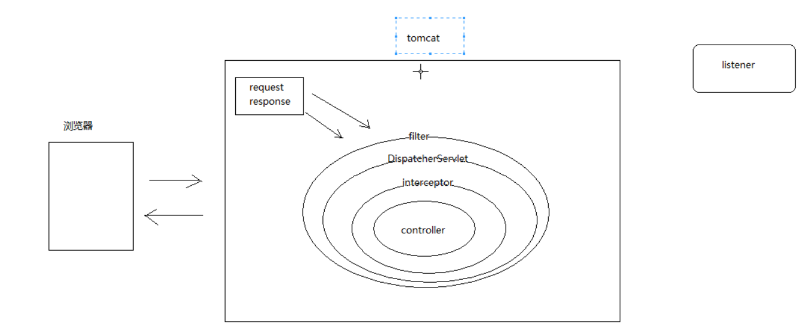

## 拦截分析



#### 登陆控制:选用fiter或inerceptor
filter 过滤器 : 最底层过滤，可引入需要依赖功能模块(service)比较少
interceptor 拦截器: springmvc提供的操作，使用方便

## 登陆拦截校验


#### 步骤分析:
1. 定义CheckLoginInterceptor拦截器，对需要拦截的资源进行拦截操作
  * |-- 判断是否是HandlerMethod对象(不拦截静态资源方法)
    * |-- HandlerMethod 是controller请求映射方法的封装对象
    * |-- 静态资源处理使用的是另一个对象
  * |-- 判断方法上是否有自定义登陆拦截标签
    * |-- 有登陆注解时才进行登陆校验
  * |-- 从浏览器端获取到登陆的cookie
  * |--获取token 查询redis 是否存在登陆信息(用户对象)
    * |-- 不存在，跳转登陆页面
    * |-- 存在，放行

2. 自定义一个拦截注解,在需要登陆权限校验的方法上添加注解
3. springboot 添加拦截器，需要在主配置类中实现WebMvcConfigurer,添加拦截器
    |-- 实现WebMvcConfigurer接口，重写addInterceptors方法
    |-- 创建拦截器对象，添加拦截器
    |-- 配置放行资源 /** 拦截所有,不拦截登陆和注册资源

相关代码逻辑
```java
/**
 * 登陆验证拦截器
 */
@Component
public class CheckLoginInterceptor implements HandlerInterceptor {
    @Reference
    IUserInfoRedisService userInfoRedisService;

    @Override
    public boolean preHandle(HttpServletRequest request, HttpServletResponse response, Object handler) throws Exception {
        //  只拦截请求映射方法的封装对象，不拦截静态资源
        if(handler instanceof HandlerMethod){

            //判断方法上是否有登陆验证权限标签--->没有权限验证注解直接放行
            if(!((HandlerMethod) handler).hasMethodAnnotation(RequiredLogin.class)){
                return true;
            }

            //从cookie 中获取token ，从redis中判断登陆信息是否存在
            Cookie c=CookieUtils.getCookie(request,CookieUtils.USER_TOKEN_IN_SESSION);

            UserInfo userInfo=null;
            if(c!=null){
                String token = c.getValue();
                userInfo= userInfoRedisService.getToken(token);
            }

            // 不存在-->登陆页面
            if(c==null||userInfo==null){
                response.sendRedirect("/login.html");
                return false; //拦截资源
            }
        }

        //存在--> 放行
        return true;
    }
}
```

在主配置类中添加登陆拦截器

```java
@SpringBootApplication(exclude= {DataSourceAutoConfiguration.class})
@EnableDubbo
public class WebsiteApp implements WebMvcConfigurer {
      @Autowired
      CheckLoginInterceptor checkLoginInterceptor;

      //添加拦截器
      @Override
      public void addInterceptors(InterceptorRegistry registry) {
          //添加登陆拦截
          registry.addInterceptor(checkLoginInterceptor)
                  .addPathPatterns("/**")
                  .excludePathPatterns("/regist.html")
                  .excludePathPatterns("/userRegist")
                  .excludePathPatterns("/login.html")
                  .excludePathPatterns("/userLogin")
                  .excludePathPatterns("/css/**")
                  .excludePathPatterns("/images/**")
                  .excludePathPatterns("/js/**");
      }
}
```
