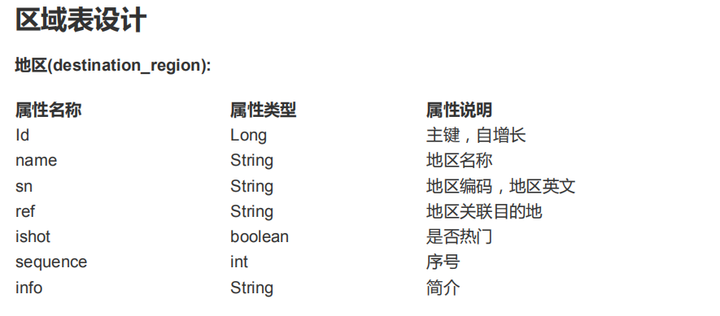
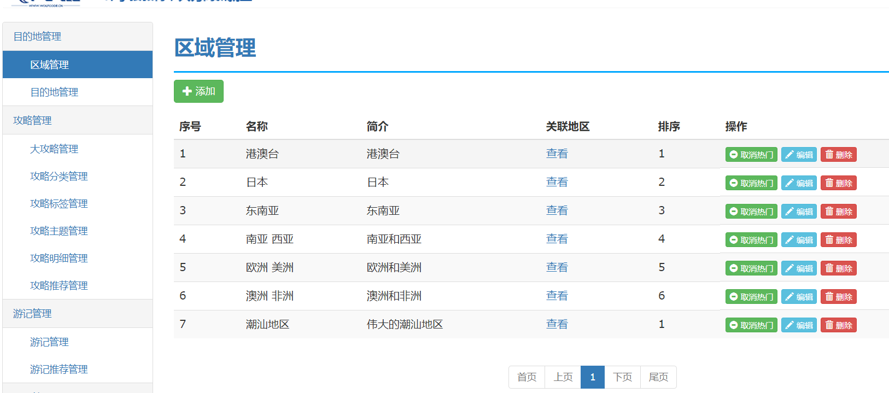
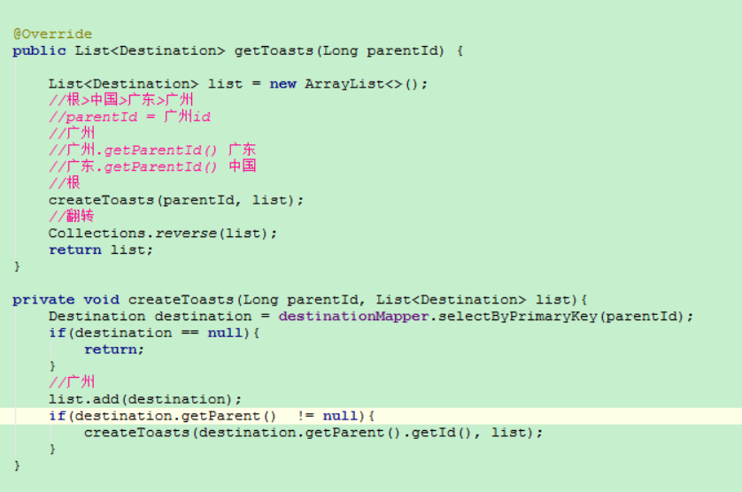

## 项目搭建

```java
trip-acticle-api
  |-- 主要存放地区列表数据库相关操作+service接口
  |-- ArticleConfig 配置类需要配置
      |-- @Configuration
      |-- @PropertySource("classpath:数据库连接池信息的properties")
      |-- @MapperScan(basePackages = "com.kiva.luowowo")
trip-acticle-server
  |-- 引入trip-acticle-api和dubbo依赖
  |-- 主要存放地区相关service的实现
  |--  ActicleServer配置类中
      |-- @SpringBootApplication
      |-- @Import(ArticleConfig.class)
      |-- @EnableDubbo
trip-mgrsite
  |-- 引入trip-acticle-api和dubbo依赖
```

* 注意: 分布式不能直接使用Transactional事务控制


## 区域管理




ref 用于关联多个地区,使用逗号隔开

### 实体类设计
```java
public class Region extends BaseDomain {
    public static final boolean STATE_HOT = true;
    public static final boolean STATE_NORMAL = false;

    private String name;// 区域名称
    private String sn; //区域编码
    private String ref; //关联目的地 id 字符串 ,使用 ,隔开
    private Long[] refIds;
    private Boolean ishot = STATE_NORMAL; //是否热门
    private Integer sequence; //序号
    private String info; //简介

    //添加编辑时，前端传入是long数组， 数据库保存的是id拼接的字符串
    public String getRef() {
        //id1,id2,id3
        return StringUtils.join(refIds, ",");
    }

    //从数据库拿出的id拼接字符串转换成数组
    public Long[] getRefIds() {
        Long[] ids = null;
        if (StringUtils.isNotBlank(ref)) {
            String[] strs = ref.split(",");
            ids = new Long[strs.length];
            for (int i = 0; i < strs.length; i++) {
                ids[i] = Long.parseLong(strs[i]);
            }
        }
        return ids;
    }

    public String getJsonString() {
        Map<String, Object> map = new HashMap<>();
        map.put("id", id);
        map.put("name", name);
        map.put("sn", sn);
        map.put("ref", ref);
        map.put("refIds", getRefIds());
        map.put("ishot", ishot);
        map.put("sequence", sequence);
        map.put("info", info);
        return JSON.toJSONString(map);
    }
}
```

#### 列表
需求分析:

将区域核心字段列表显示， 显示 添加 查看 取消热门 编辑 删除功能



1. 区域列表数据分页显示:使用pageHelper进行分页操作

```
trip-acticle-api
  |-- query  -> RegionQuery类封装查询
  |-- service->RegionServiceImpl中使用pageHelper分页查询
trip-cmomon
  |-- QueryObject : currentPage  +pageSize
trip-mgrsite
  |-- 定义RegionController.list(Model,QueryObject);
```

### 添加操作


页面设计
    |-- 页面需要bootstrap 多选下拉框,用于显示区域关联的目的地
    |-- 约定查询的目的地:国家省份城市deep参数
目的地表
trip-acticle-api
    |-- mapper
      |-- parent --> Destination(使用多表关联查询)
      |-- region -->Region(使用多表关联查询)
      |-- coverUrl --> 目的地的封面
      |-- 创建一个IDestinationService
      |-- queryDestByDeep --> 查询id,name where deep<=#{deep}
trip-acticle-server
    |-- 创建一个DestinationServiceImpl
    |-- 查询目的地方法queryDestByDeep(int deep) 查询
        |-- 约定查询的目的地:国家省份城市

trip-mgrsite
    |-- 定义getDestByDeep(int deep)方法
    |-- 定义一个saveOrUpdate(Region region)方法
目的地表设计
    |--

查看关联地区
1. 定义一个List<Destination> getDestByRegionId(rid)
2. 先根据id查询region再查询出refIds数据
3. 根据refIds查询对应的目的地(sql使用in关键字)
4. 需要执行一个分支:国内的分支

取消热门(updateHot(Long id,boolean hot))

删除(设置删除状态,不需要删除真实数据，因为数据关联时不能删除数据)


目的地列表
1. 分页+keyword+热门状态查询
2. 添加数据可以使用excel文档来操作

编辑操作: updateInfo(id,info)

目的地切换
select * from dest where parent_id is null
select * from dest where parent_id=中国id
select * from dest where parent_id=广东id
select * from dest where parent_id=广州id

位置导航
从国家位置开始，一直往下探，根>>中国>>广东>>广州
  |-- 根据当前的parent_id查找到最上一级
  |-- List<Destination> getToast(parent_id)
  |-- 使用递归
  |-- 使用Conllections.reverse();

List<Destincation> createToast(Long parentId,List<Destincation> list){

}





总结:
1. 用户登陆拦截 (拦截器的使用+区分是否需要登陆权限)
2. 用户对象的注入
3. 区域管理
4. 目的地区管理
