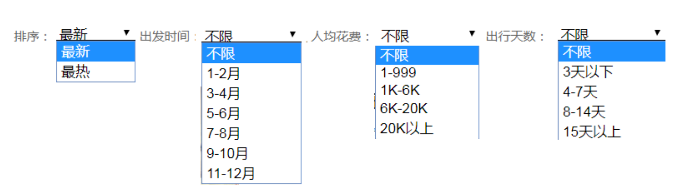
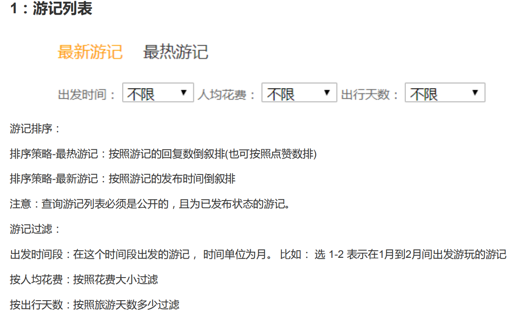

## 目的地明细游记列表

需求:根据目的地查询指定条件相关游记


查询时按照如下条件查询


步骤分析:
```
/travels
  |-- 根据目的地destId查询
  |-- 排序类型
      |-- 最新 : creatime
      |-- 最热 : 阅读量
  |-- 旅游天数
  |-- 出发时间 travelTimeType  
        |-- 获取时间的月份判断 month(travelTime)
  |-- 人均消费 perExpends
  |-- 游记状态为发布状态的才可以查看

范围查询参数封装
  |-- TravelCondiction: min max
  |-- 定义一个Map<dayType,TravelCondiction>根据传入的类型获取最大和最小值，这里最大和最小是常量数据
```

条件封装相关java代码

```java
public class TravelQuery extends QueryObject {

    //目的地
    private Long destId;
    // 排序 ： 最新 或 热门
    private int orderType;
    //出发时间
    private int travelTimeType;
    //人均消费
    private int perExpendType;
    // 出行天数
    private int dayType;
    //游记状态
    private int state;

    // 出行天数条件封装
    public TravelCondition getDayCondition(){
        return TravelCondition.TRAVEL_DAYS_CONDITION.get(dayType);
    }
    // 人均消费条件封装
    public TravelCondition getPerExpendCondition(){
        return TravelCondition.TRAVEL_PER_EXPEND_CONDITION.get(perExpendType);
    }
    // 出发时间条件封装
    public TravelCondition getTravelTimeCondition(){
        return TravelCondition.TRAVEL_TRAVEL_TIME_CONDITION.get(travelTimeType);
    }
    // 排序条件
    public String getOrderByCondition(){
        if(orderType==1){  // 最新游记
            return "createTime desc";
        }else{// 最热 : 点击量最多
            return "viewnum desc";
        }
    }
}
```

```java
/**
 * 封装旅行日记的查询条件
 */
public class TravelCondition {

    // 旅行天数
    public static final Map<Integer,TravelCondition> TRAVEL_DAYS_CONDITION=new HashMap<>();
    // 人均费用
    public static final Map<Integer,TravelCondition> TRAVEL_PER_EXPEND_CONDITION=new HashMap<>();
    //出发时间
    public static final Map<Integer,TravelCondition> TRAVEL_TRAVEL_TIME_CONDITION=new HashMap<>();


    static {
        // 旅行天数的条件封装 3以下  4-7  8-14  15以上
        TRAVEL_DAYS_CONDITION.put(-1,new TravelCondition(-1,Integer.MAX_VALUE));
        TRAVEL_DAYS_CONDITION.put(1,new TravelCondition(-1,3));
        TRAVEL_DAYS_CONDITION.put(2,new TravelCondition(4,7));
        TRAVEL_DAYS_CONDITION.put(3,new TravelCondition(8,14));
        TRAVEL_DAYS_CONDITION.put(4,new TravelCondition(15,Integer.MAX_VALUE));

        // 人均费用 不限 1-999   1K-6K   6K-20K  20K以上
        TRAVEL_PER_EXPEND_CONDITION.put(-1,new TravelCondition(-1,Integer.MAX_VALUE));
        TRAVEL_PER_EXPEND_CONDITION.put(1,new TravelCondition(1,999));
        TRAVEL_PER_EXPEND_CONDITION.put(2,new TravelCondition(1000,6000));
        TRAVEL_PER_EXPEND_CONDITION.put(3,new TravelCondition(6000,20000));
        TRAVEL_PER_EXPEND_CONDITION.put(4,new TravelCondition(6000,20000));
        TRAVEL_PER_EXPEND_CONDITION.put(5,new TravelCondition(20000,Integer.MAX_VALUE));

        // 出发时间： 不限  1-2月  3-4月 5-6月  7-8月  9-10月  11-12月
        TRAVEL_TRAVEL_TIME_CONDITION.put(-1,new TravelCondition(-1,Integer.MAX_VALUE));
        TRAVEL_TRAVEL_TIME_CONDITION.put(1,new TravelCondition(1,2));
        TRAVEL_TRAVEL_TIME_CONDITION.put(2,new TravelCondition(3,4));
        TRAVEL_TRAVEL_TIME_CONDITION.put(3,new TravelCondition(5,6));
        TRAVEL_TRAVEL_TIME_CONDITION.put(4,new TravelCondition(7,8));
        TRAVEL_TRAVEL_TIME_CONDITION.put(5,new TravelCondition(9,10));
        TRAVEL_TRAVEL_TIME_CONDITION.put(6,new TravelCondition(11,12));
    }

    private int min;
    private int max;

    public TravelCondition(int min, int max) {
        this.min = min;
        this.max = max;
    }
}
```

条件查询sql 语句
```sql
 select * from travel t
 <where>
   <if test="destId !=null">
     and t.dest_id=#{destId}
   </if>
   <if test="dayCondition!=null">
     and (t.days &gt;= #{dayCondition.min} and t.days &lt;=#{dayCondition.max})
   </if>
   <if test="travelTimeCondition!=null">
     and ( month(t.travelTime) &gt;= #{travelTimeCondition.min} and month(t.travelTime) &lt;=#{travelTimeCondition.max})
   </if>
   <if test="perExpendCondition!=null">
     and ( t.perExpends &gt;= #{perExpendCondition.min} and t.perExpends &lt;=#{perExpendCondition.max})
   </if>
   <if test="state!=-1">
     and t.state=#{state}
   </if>
 </where>
```


<br>
---

### 游记首页列表页面

游记列表条件查询与目的地游记列表类似，区别在于游记列表查询不需要加地区查询


```java
--------使用freemark处理摘要缩略文本问题---------
<#if thing.title?length gt 33>
	${thing.title?substring(0,30)}...
<#else>${thing.title!}
</#if>
```

<br>
---
