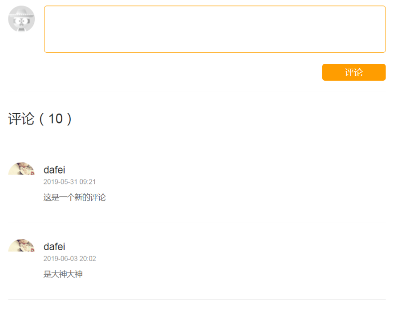

## 攻略内容评论

#### 需求分析:
攻略评论使用一级评论的方式


#### 环境搭建
```
使用mongodb 实现
  |-- trip-comment-api:评论系统服务接口
      |-- 添加mongodb 依赖
      |-- properties中配置mongodb连接信息
      |-- 创建一个MongoDBConfig
      |-- 添加StrategyComment,做为mongdb文档操作的数据封装类
  |-- trip-comment-server : 评论系统服务接口实现
      |-- dubbo 依赖和 comment-api依赖
      |-- 创建CommentServerApp启动类
```

```
service操作
  |-- 使用jpa 操作mongodb
    |-- 原理:spring-data在加载类时，会扫描所有实现MongoRepository所有接口
    |-- 然后通过AOP方法方式实现crud,pageing query等功能
  |-- repository包下创建IStrategyCommentRepository接口(处理crud操作)
  |-- 在service中注入IStrategyCommentRepository接口对象(用于处理复杂操作)
```

##### IStrategyCommentRepository接口相关代码
```java
// --------------使用mongodb的jpa规范处理crud操作--------------
// 1. 必须实现 MongoRespository 接口
// 2. 需要指定操作类型,可以通过类型获取文档名字，以及文档字段
// 3. 指定id的类型，即贴有这个@Id标签的字段
interface IStrategyCommentRepository extends MongoRespository<StrategyComment,String>{
}
```

##### 攻略评论相关代码
```java
/**
 * 攻略评论
 */
@Setter
@Getter
@Document("strategy_comment")
public class StrategyComment implements Serializable {
    @Id
    private String id;  //mongodb默认的是id
    private Long detailId;  //攻略(明细)id
    private String detailTitle; //游记标题

    private Long userId;    //用户id
    private String username;  //用户名
    private String city;
    private int level;
    private String headUrl;     //头像

    private Date createTime;    //创建时间
    private String content;      //评论内容
    private int thumbupnum;     //点赞数
    private List<Long> thumbuplist = new ArrayList<>(); //保存评论点赞人的id
}
```
```java
@Service
public class StrategyCommentServiceImpl implements IStrategyCommentService {
    @Autowired
    private IStrategyCommentRepository   strategyCommentRepository;
    // 用于操作较复杂的查询
    @Autowired
    MongoTemplate mongoTemplate;
}
```


* 问题: 依赖注入启动不了的原因，需要检查springbootApplication


#### 评论类型
  * |-- 微信评论
  * |-- 盖楼式评论

#### 评论添加和分页查询

1. commentAdd 添加评论
具体步骤:

```
|-- 接收 攻略明细id+ 评论内容 + 登陆用户的相关信息
|-- 手动设置参数
    |-- 游记标题: 从前端页面传递
    |-- 创建时间
    |-- 更新需要设置点赞数和评论点赞人的id
```
相关代码

```java
// 用于操作较复杂的查询
@Autowired
MongoTemplate mongoTemplate;

// 操作简单的crud
@Autowired
IStrategyCommentRepository dao;

@Override
public void save(StrategyComment strategyComment) {
    if(strategyComment.getId()==null){
        strategyComment.setCreateTime(new Date());
    }
    dao.save(strategyComment);
}
```

2. comment 评论列表请求
    |-- 分页时使用spring 中的Page类(spring data 提供的分页封装对象)
    |-- 使用 template 实现分页
    |-- pageImpl 会出现序列化问题

```java
@Override
public Page<StrategyComment> query(StrategyCommentQuery qo) {
    // 使用mongoTemplate完成分页操作
    Query query=new Query();

    Criteria criteria=null;
    if(qo.getDetailId()!=-1){  //查询对应id的数据
        criteria=Criteria.where("detailId").is(qo.getDetailId());
    }else{//查询
        criteria=Criteria.where("detailId").ne(qo.getDetailId()); //不等于-1的数据
    }
    query.addCriteria(criteria);


    // 分页条件 + 排序(创建时间降序排序)
    Pageable pageable= PageRequest.of(qo.getCurrentPage() - 1, qo.getPageSize());
    query.with(pageable)
            .with(new Sort(Sort.Direction.DESC,"createTime"));

    //查询总记录数
    long count = mongoTemplate.count(query, StrategyComment.class);
    // 查询数据
    List<StrategyComment> list = mongoTemplate.find(query, StrategyComment.class);

    return new PageImpl<>(list,pageable,count);
}
````

#### 小问题: pageImpl 不能被序列化
dubbo 中有2中序列化方式:
1. Hession: 需要所有类都实现Serializable,同时需要空参构造器(默认使用)
2. ktyo:也是一种序列化的方式,相对于Hession速度更快，不需要实现Seriazable


1. 修改序列化方式：
> 必须配置给提供者的配置文件中配置:
序列化方式
dubbo.protocol.serialization=kryo

2. 添加相关依赖


### 评论点赞

思路分析：
```
前端传递评论toId和点赞用户的fromId
  |-- 根据评论id查询评论数据,获取评论数据中的点赞人列表数据
  |-- 判断点赞人列表数据是否包含 fromId
      |-- 包含(取消点赞): 点赞数-1 , 点赞人列表 移除fromId
      |-- 不包含(添加点赞): 点赞数+1 , 点赞人列表 添加fromId
  |-- 前端页面根据返回的列表数据判断是否包含当前用户，动态显示点赞的选中状态
```

* toId ： 评论id
* fromId：点赞用户的id

相关代码逻辑
```java
//返回值 :true 点赞成功  false: 取消点赞
public boolean thumbUp(String toid, Long fromid) {
    // 根据评论id 查询出评论
    Optional<StrategyComment> optional = dao.findById(toid);

    if(optional.isPresent()){
        StrategyComment comment = optional.get();

        // 如果点赞列表包含 评论人 , 就是取消点赞
        // 点赞数-1    移除评论人
        if( comment.getThumbuplist().contains(fromid)){
            comment.setThumbupnum(comment.getThumbupnum()-1);
            comment.getThumbuplist().remove(fromid);
        }else{
            // 如果点赞列表不包含 评论人 , 就是点赞
            // 点赞数+1    添加评论人
            comment.setThumbupnum(comment.getThumbupnum()+1);
            comment.getThumbuplist().add(fromid);
        }
        this.save(comment);
        return true;
    }
    return false;
}
```
