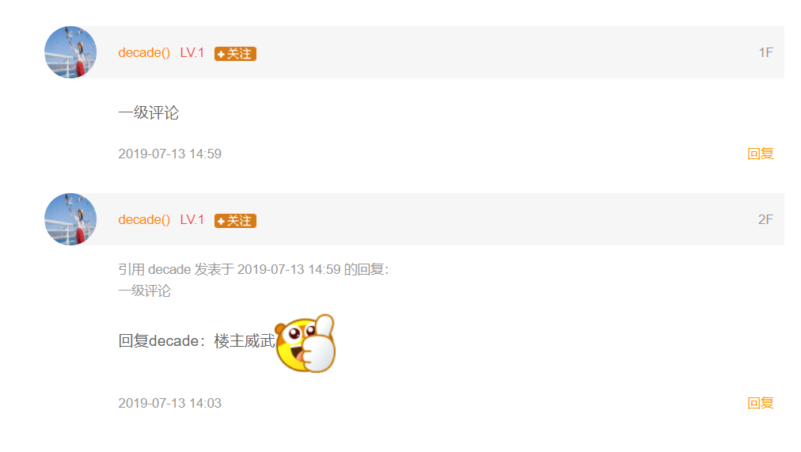

## 游记评论

需求:评论采用的是一级评论方式显示， 但可以使用引用方式显示上一级评论

技术点:
* 使用mongodb保存评论内容的相关数据

### 实体类设计

在实体类上添加一个 refComment 引用要评论的内容，不能自己引用自己
* |-- 使用type字段区分是普通评论还是评论的评论
* |-- 游记列表中中不写分页

```java
/**
 * 游记评论
 */
@Setter
@Getter
@Document("travel_comment")
public class TravelComment implements Serializable {
    public static final int TRAVLE_COMMENT_TYPE_COMMENT = 0; //普通评论
    public static final int TRAVLE_COMMENT_TYPE = 1; //评论的评论
    //----------前端传递数据---------
    @Id
    private String id;  //id
    private Long travelId;  //游记id
    private String travelTitle; //游记标题
    private String content;  //评论内容
    private int type = TRAVLE_COMMENT_TYPE_COMMENT; //评论类别

    //-----------后端设置数据---------
    private Long userId;    //用户id
    private String username; //用户名
    private String headUrl;   // 用户头像
    private String city;
    private int level;

    private Date createTime; //创建时间
    private TravelComment refComment;  //关联的评论
}

```


### 添加评论

* 添加评论需要校验用户是否登陆
* 使用 ITravelCommentRepository mongodb保存方式

```java
|-- commentAdd(TravelComment comment,int floor,@UserParam UserInfo userInfo)
comment参数设置
    |-- 手动设置用户参数信息
    |-- 设置创建时间
    |-- 如果travelComment.ref.id==null 说明是一级评论，不需要添加关联评论
    |-- 否则，根据ref.id查询出评论数据，将数据添加到comment中
返回参数设置
    |-- 添加评论成功后返回模板回列表页面进行拼接
      |-- 返回commentTpl.ftl模板生成html文本
    |-- 需要共享floor数据:  floor+1回显
    |-- comment对象: 返回保存成功后的对象

emoji.js 相关表情处理
    |-- 评论内容中包含表情数据时，如
    |-- js 代码中使用正则表达式匹配中文
        |-- 如果匹配成功，将文本替换成img
        |-- "(愤怒小蜂)": "/images/emoji/brands_v3/38@2x.png"
```

### 评论列表数据



* 进入游记详情页面时，从mongodb中查询出当前游记相关的评论数据，不需要分页

相关技术点:
* 使用 mongoTemplate 查询分页数据
* 调用page.getContent()返回列表数据
