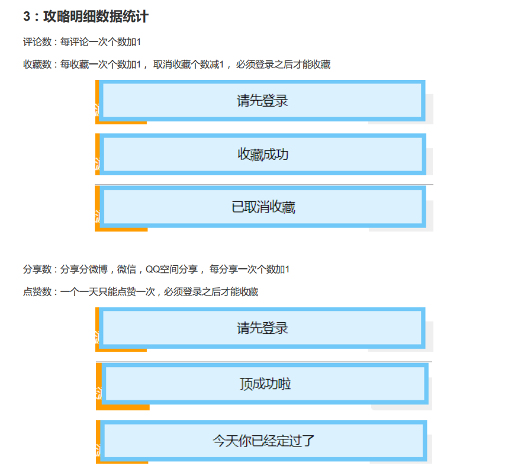

## 初始化redis数据



需求 ： 服务启动时,从mysql中查询数据,初始化redis相关数据
使用技术:spring 监听器

问题：选用在mgrsite服务器中监听服务器启动?
原因:website使用集群的情况下，会多次启动去初始化数据

步骤:(redis数据初始化监听器)
```java
|-- 定义RedisDataInitListener类
  |--  添加@Compomemnt
|-- 实现ApplicationListener<ContextRefreshEvent>
  |-- onApplicatioEvent() : 当spring 容器启动时立即执行方法
  |-- 将mysql中的数据同步到redis缓存中
  |-- 查询出strategyDetailList
  |-- 使用StrategyStatisVO封装统计数据
  |-- 迭代每一个数据保存,如果不包含才进行保存到redis中
```

<br>
---
相关代码
```java
/**
 * redis数据初始化类
 * spring 监听器
 */
@Component
public class RedisDataInitListener implements ApplicationListener<ContextRefreshedEvent> {

    @Reference
    IStrategyDetailService strategyDetailService;

    @Reference
    IRedisService iRedisService;

    //在服务启动时调用
    @Override
    public void onApplicationEvent(ContextRefreshedEvent contextRefreshedEvent) {
        // 初始化redis相关缓存数据
        initStrategy();
    }

    private void initStrategy() {
        // 1.从数据库中查询出所有的攻略详情数据
        // 2. 将数据封装成 strategy 统计数据封装对象
        // 3. 保存到redis数据库中
        // 4. 如果数据库中包含该key 则不保存
        List<StrategyDetail> strategyDetails = strategyDetailService.queryList();
        if (strategyDetails != null) {

            try {
                for (StrategyDetail detail : strategyDetails) {
                    StrategyStaticsRedisKeyPrefix.STRATEGY_STATICS_VO.setKey(detail.getId()+"");
                    //如果key存在，则不同步到redis中
                    if(iRedisService.exist(StrategyStaticsRedisKeyPrefix.STRATEGY_STATICS_VO)){
                        continue;
                    }
                    // 不存在 --> 添加vo缓存到redis中
                    StrategyStatisVO vo = new StrategyStatisVO();
                    // 初始化数据
                    BeanUtils.copyProperties(vo, detail);
                    vo.setDestId(detail.getDest().getId());
                    vo.setDestName(detail.getDest().getName());
                    vo.setStrategyId(detail.getId());
                    iRedisService.set(StrategyStaticsRedisKeyPrefix.STRATEGY_STATICS_VO,vo);
                }
            } catch (Exception e) {
                e.printStackTrace();
            }
        }
    }
}
```
