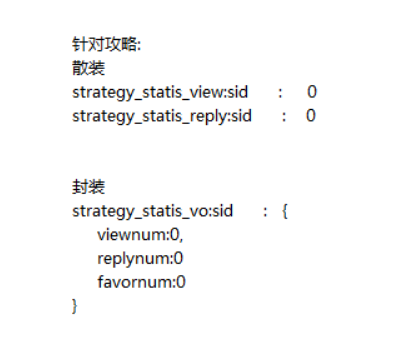
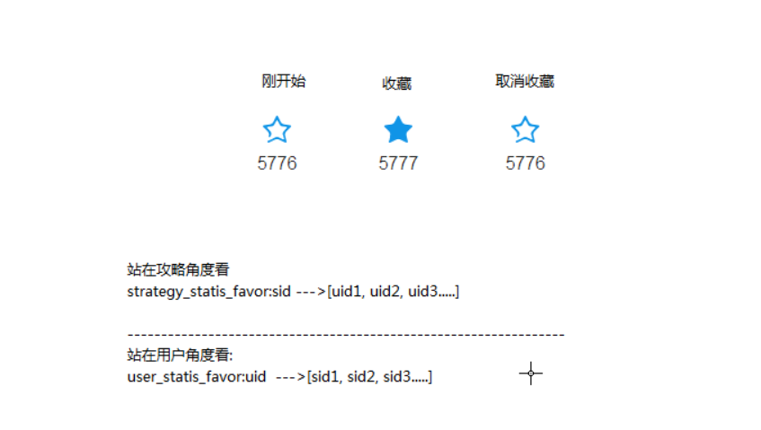
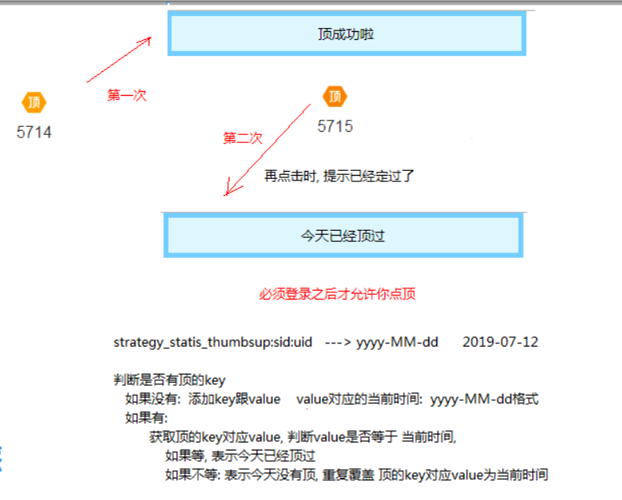

## 数据统计
统计方式: 使用redis临时缓存，隔开一段时间保存到数据库中

#### 统计对象设计
```java
/**
 * 攻略redis中统计数据
 * 运用模块：
 *  1：数据统计(回复，点赞，收藏，分享，查看)
 *  2：排行数据查询
 */
@Getter
@Setter
public class StrategyStatisVO implements Serializable {

    private Long strategyDetailId;  //攻略详情的id

    private int viewnum;  //点击数
    private int replynum;  //攻略评论数
    private int favornum; //收藏数
    private int sharenum; //分享数
    private int thumbsupnum; //点赞个数
}
```

<br>
#### 阅读数量 | 评论数
思路分析: 每次访问攻略详情页面时，阅读数量需要+1，需要在redis中更新缓存中的阅读数量

#### redis 如何保存阅读数量的数据?


以上俩种方式中，使用封装的方式，将封装指定攻略的数据统计


#### 步骤:

```java
  |-- 定义StrategyStatisVO 封装统计数据
  |-- 定义攻略数据统计对象在redis的前缀,不需要设置过期时间
      |-- 后期使用定时器，定时将缓存中的数据保存到数据库中
  |-- 定义攻略统计数据的服务StrategyStaticsService

统计攻略阅读数
  |-- 每次访问detail阅读数+1
  |-- service.viewIncrease(id)
  |-- 1. 判断vo对应key值是否存在
  |-- 2. 存在
        |--获取vo值,viewnum+1
  |---3. 不存在
        |-- 创建vo对象, 查询对应的攻略明细数据(从mysql 中同步数据)，设置属性到vo中
        |-- viewnum+1,再添加到redis中
  |-- 4. 统一设置vo,提供setVO/getVO方法
  |-- 阅读数量添加成功后，需要修改页面阅读数，将redis中的评论数返回

评论数(步骤同上)
  |-- 每次添加评论成功后,评论数+1
  |-- 评论成功后，需要修改页面评论数，将redis中的评论数返回
```


```java
// 设置阅读数
@Override
public StrategyStatisVO viewIncrease(Long id) {
    StrategyStatisVO vo = getStrategyStaticsVO(id);
    // 观看数量+1
    vo.setViewnum(vo.getViewnum()+1);
    //统一保存vo数据
    this.setStrategyStaticVO(vo);
    return vo;
}

//设置评论数量
@Override
public StrategyStatisVO replyIncrease(Long detailId) {
    // 获取评论数量,设置评论数量+1
    StrategyStatisVO vo = getStrategyStaticsVO(detailId);
    vo.setReplynum(vo.getReplynum()+1);
    this.setStrategyStaticVO(vo);
    return vo;
}


public void setStrategyStaticVO(StrategyStatisVO vo){
    // key拼接
    StrategyStaticsRedisKeyPrefix.STRATEGY_STATICS_VO.setKey(vo.getStrategyId()+"");
    redisService.set(StrategyStaticsRedisKeyPrefix.STRATEGY_STATICS_VO,vo);
}
// 根据攻略id获取数据
@Override
public StrategyStatisVO getStrategyStaticsVO(Long sid) {
    // 从redis 中查询对应的游记VO缓存数据是否存在
    StrategyStaticsRedisKeyPrefix.STRATEGY_STATICS_VO.setKey(sid + "");
    boolean exist = redisService.exist(StrategyStaticsRedisKeyPrefix.STRATEGY_STATICS_VO);

    StrategyStatisVO vo=null;
    if (exist) {
        // 存在--> 获取的vo缓存中的数据，重新设置viewnum值
        vo=redisService.get(StrategyStaticsRedisKeyPrefix.STRATEGY_STATICS_VO.getKey(),StrategyStatisVO.class);
    } else {
        try {
            // 不存在 --> 添加vo缓存到redis中
            StrategyDetail detail = strategyDetailService.queryById(sid);
            vo = new StrategyStatisVO();
            // 初始化数据
            BeanUtils.copyProperties(vo, detail);
            vo.setDestId(detail.getDest().getId());
            vo.setDestName(detail.getDest().getName());
            vo.setStrategyId(sid);
        } catch (Exception e) {
            e.printStackTrace();
        }
    }
    return vo;
}
```

<br>
---

#### 收藏数
思路分析:
1. 在攻略的角度看:
  favor:sid--> [uid,uid] 保存数据
  |-- 当用户需要查看自己收藏的数据时，需要遍历所有favor前缀的数据，查询所有的favor是否包含用户的uid
2. 在用户的角度看：
  favor:uid--> [sid,sid] 保存数据
  |-- 点击收藏, 从[]中移除sid
  |-- 取消收藏，将sid添加到[]中
  |-- isFavor : 根据uid中是否包含sid进行判断


```java
key--value设计：
key :  "strategy_statics_favor:sid"
value : [uid,uid,uid....]

  |-- 点击收藏调用favor(detailId,uid),返回boolean用于是否收藏成功
  |-- 判断 key 是否存在
      |-- 不存在，添加收藏key,vo中favorNum+1
      |-- 存在
          |-- 获取收藏key对应的value值，判断value值是否包含uid
          |-- 如果包含(取消收藏)：value值 删除uid vo中favorNum-1
          |-- 如果不包含(要收藏)：value值 添加uid vo中favorNum+1
  |-- 统一保存vo跟收藏的value值

注意:
* 在get方法中如果vo不存在时，在get方法中进行初始化，获取vo数据
* redis 会自动清除数据，不能将永久的数据保存在缓存中,需要定时保存数据
* list 不使用泛型的情况下，会导致 remove 和 contains没办法使用
    |-- 使用string 可以使用
    |-- 也可以使用JSON.parseArray()指定泛型

页面控制
  |-- 没有登陆时，不直接跳转到登陆页面,不加登陆注解
    |-- 返回json中包含登陆的状态码102,提示需要登陆
    |-- ajax 异步请求经过拦截器会出现302,不会直接跳转到登陆页面
  |-- 页面根据收藏结果返回 true|false 判断 收藏|取消收藏
  |-- 查询返回收藏的记录数
```

```java
public boolean setFavor(Long sid, Long uid) {

    StrategyStaticsRedisKeyPrefix.STRATEGY_STATICS_FAVOR.setKey(sid+"");
    String key = StrategyStaticsRedisKeyPrefix.STRATEGY_STATICS_FAVOR.getKey();

    boolean flag=false;//标记是否收藏成功

    //获取对应的收藏 key 是否存在
    boolean exist = redisService.exist(StrategyStaticsRedisKeyPrefix.STRATEGY_STATICS_FAVOR);
    StrategyStatisVO vo = getStrategyStaticsVO(sid);

    List<Long> list=new ArrayList<>();
    // 不存在时，创建key， 设置收藏信息
    if(!exist){
        list.add(uid);
        vo.setFavornum(vo.getFavornum()+1);
        flag=true;
    }else{
    // 存在时，根据key 获取收藏信息[uid,uid] ,判断是否包含uid
        list = redisService.getArray(key, Long.class);
        if(list.contains(uid)){
            // 包含uid则是取消收藏， 需要移除uid ,并设置 vo 中的favornum-1
            list.remove(uid);
            vo.setFavornum(vo.getFavornum()-1);
            flag=false;
        }else{
            // 包含uid则是收藏成功， 需要添加uid ,并设置 vo 中的favornum+1
            list.add(uid);
            vo.setFavornum(vo.getFavornum()+1);
            flag=true;
        }
    }
    //同时设置统一数据
    redisService.set(StrategyStaticsRedisKeyPrefix.STRATEGY_STATICS_FAVOR,list);
    this.setStrategyStaticVO(vo);
    return flag;
}

```

<br>
---

### 点赞数

需求: 登陆的时候才能顶，而且每天只能顶一次




点赞步骤
```java
|-- 定义一个boolean thumbUp(sid,uid)方法
|-- 判断key是否存在
  |-- 不存在，创建key,设置value为当前时间
      |-- vo.thumbsupnum+1
  |-- 存在，判断当前时间是否是当前时间
      |-- 是，已经顶过
      |-- 不是，今天可以顶，修改时间,vo.thumbsupnum+1
```

```java
@Override
    public boolean thumbup(Long sid, Long id) {
        // 1.判断key 是否存在
        StrategyStaticsRedisKeyPrefix.STRATEGY_STATICS_THUMBUP.setKey(sid+":"+id);
        String key = StrategyStaticsRedisKeyPrefix.STRATEGY_STATICS_THUMBUP.getKey();

        boolean exist = redisService.exist(StrategyStaticsRedisKeyPrefix.STRATEGY_STATICS_THUMBUP);

        StrategyStatisVO vo = getStrategyStaticsVO(sid);
        String today=DateUtil.getCurrentTimeStr("yyyy-MM-dd");

        //1. 判断key是否存在
        if(!exist){
            // 2. 如果不存在，说明没有顶过,创建key值 ,设置当前时间 ，vo.thumbsupnum +1
            redisService.set(StrategyStaticsRedisKeyPrefix.STRATEGY_STATICS_THUMBUP,today);
            vo.setThumbsupnum(vo.getThumbsupnum()+1);
            setStrategyStaticVO(vo);
            return true;
        }else{
            //3. 如果存在
            //根据key 值获取value值，如果    yyyy-MM-dd   的数据是否等于今天
            String thumbTime = redisService.get(key, String.class);

            //如果是今天，不再点赞,不做处理
            // 如果不是今天，可以再次点赞，更新时间
            if(!today.equals(thumbTime)){
                redisService.set(StrategyStaticsRedisKeyPrefix.STRATEGY_STATICS_THUMBUP,today);
                vo.setThumbsupnum(vo.getThumbsupnum()+1);
                setStrategyStaticVO(vo);
                return true;
            }
        }
        return false;
    }
```
