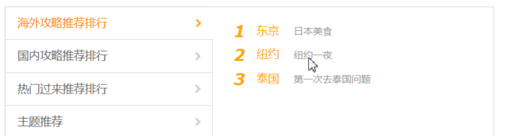
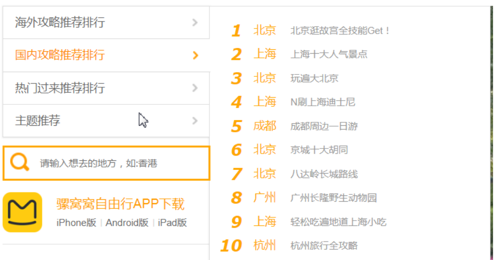
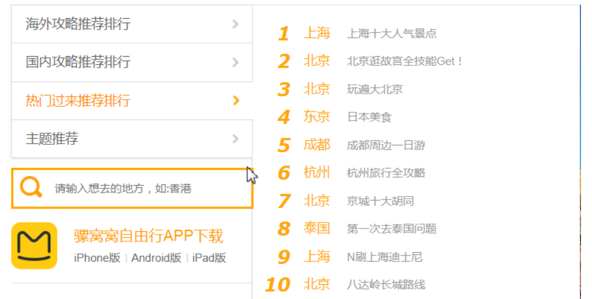
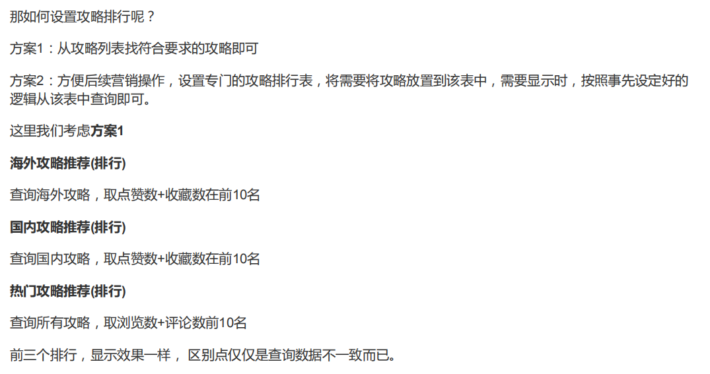
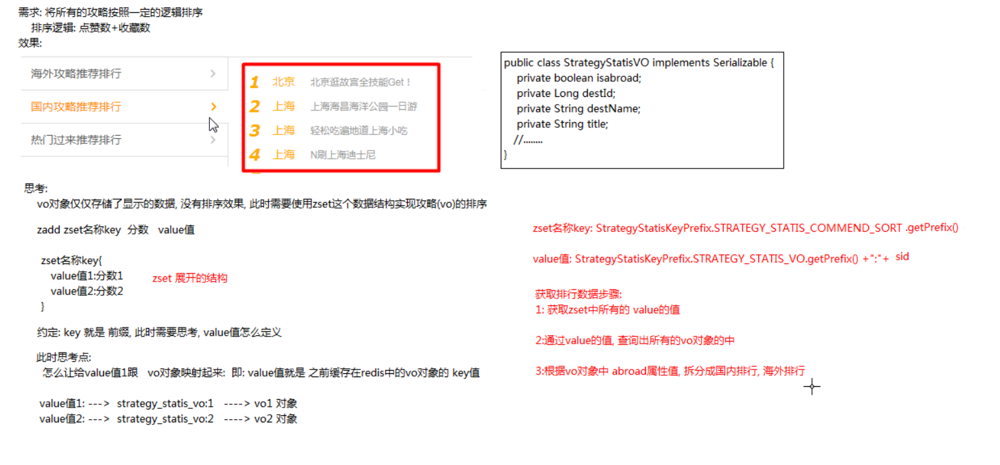

## topN排序

#### 攻略推荐排行
旅游攻略推荐(这里我们说排行)分四种，海外攻略排行， 国内攻略排行，热门攻略排行，主题攻略排行。

需求分析:

#### 海外攻略推荐数据

#### 国内攻略推荐数据

#### 热门攻略推荐数据




实现思路分析



相关redis命令
```
#添加
zadd myset 分数  value

#加分
zincrby myset 分数 value

#遍历
从小到大
zrange myset 0 -1

从大到小
zrevrange myset 0 -1
```

### 海外/国内推荐数据
```
海外攻略排行
需求：点赞数+收藏数在前10名
  |-- 点赞数和收藏数是实时数据,所以需要在redis中查询数据
国内攻略排行
需求：点赞数+收藏数在前10名

实现思路:
1. 需要显示的攻略数据信息，可以保存在vo缓存统计对象中
2. 设计一张专门的攻略排行集合，将需要将攻略放置到该表中，使用zset数据格式保存数据
3. zset key-value的设计
  key : strategy_static_commend_sort
  value : strategy_statis_vo:sid
4. 查询时，可以根据value 值查询出相关的vo对象数据返回页面显示
5. 实现国内/海外可以根据获取到的vo数据的isAbroad判断
```

具体实现步骤：
```
1. 点赞成功后
    |-- 需要指定key,value的数据分数+1
2. 收藏:添加收藏+取消收藏
    |-- 添加收藏时，设置key,value的数据分数+1
    |-- 取消收藏时，设置key,value的数据分数-1
3. 在返回攻略首页时设置相关排行数据
    |-- 根据分许倒序查询出zset中所有攻略对应 vo 对象的key集合
    |-- 遍历key集合，获取vo对象，添加到vo集合中
    |-- 遍历vo集合，判断是国内/海外数据
    |-- 分别封装成 国内 / 海外 俩个数据,返回前端页面显示
4. |-- 初始化时点赞数+收藏数作为分数
```

添加分数相关代码
```java
public void addScore(Long sid, StrategyStaticsRedisKeyPrefix key, int score) {
       // key  <-->  value: vo:sid  映射对应的vo对象的key值
       String value = StrategyStaticsRedisKeyPrefix.STRATEGY_STATICS_VO.getPrefix()+":"+sid;
         //封装zset添加分数的操作
       redisService.addScore(key.getPrefix(),value,score);
}
//-------------redisService 中----------------
public void addScore(String key, String value, int score) {
      redisTemplate.opsForZSet().incrementScore(key,value,score);
}
```
查询国内/海外相关代码
```java
// --------------------IndexController中-------
public void index(){
  //abroadCds : 海外攻略排行数据(排名前10)
  List<StrategyStatisVO> abroadCds=new ArrayList<>();
  //unabroadCds : 国内攻略排行数据(排名前10)
  List<StrategyStatisVO> unabroadCds=new ArrayList<>();

  // ---(国内/海外)获取所有按照分数排行的攻略数据，通过对应的vo:id值获取对应的vo对象
  List<StrategyStatisVO> all=strategyStaticsService.getAllStrategyCommends();
  //-- (热门推荐数据)获取所有攻略，取浏览数+评论数前10名
  List<StrategyStatisVO> hotCds=strategyStaticsService.getHotStrategyCommends();

  // ----根据vo对象中的isAbroad判断是海外还是国内
  for (StrategyStatisVO vo : all) {
      if(vo.isIsabroad()){//海外
          if(abroadCds.size()<10){ // 只查询前10条数据
              abroadCds.add(vo);
          }
      }else{// 国内数据
          if(unabroadCds.size()<10){// 只查询前10条数据
              unabroadCds.add(vo);
          }
      }
  }
}
```
```java
public List<StrategyStatisVO> getAllStrategyCommends() {
     String key = StrategyStaticsRedisKeyPrefix.STRATEGY_STATIC_COMMEND_SORT.getPrefix();
     // 查询set集合中所有的按照分数逆序排行的攻略推荐数据 value: vo:sid
     // reverseRange key 0 -1 withScores
     return redisService.reverseRanges(key,0,-1,StrategyStatisVO.class);
 }
```

```java
//-------------redisService 中----------------
public <T> List<T> reverseRanges(String key, int start, int end, Class<T> clazz) {
      // 获取所有的vos key值
      Set set = redisTemplate.opsForZSet().reverseRange(key, start, end);
      List<T> vos=new ArrayList<>();
      if(set==null||set.size()==0){
          return vos;
      }
      //根据value值获取相关 vo:sid 的数据，转成vo对象，返回
      for (Object o : set) {
          String voKey=o.toString();
          //根据voKey获取vo对象添加到列表数据
          vos.add(get(voKey,clazz));
      }
      return vos;
  }

```


#### 热门推荐排行榜
1. 根据浏览量和评论数,增加分数
2. 查询时逆序查询分数最高的前10个数据
