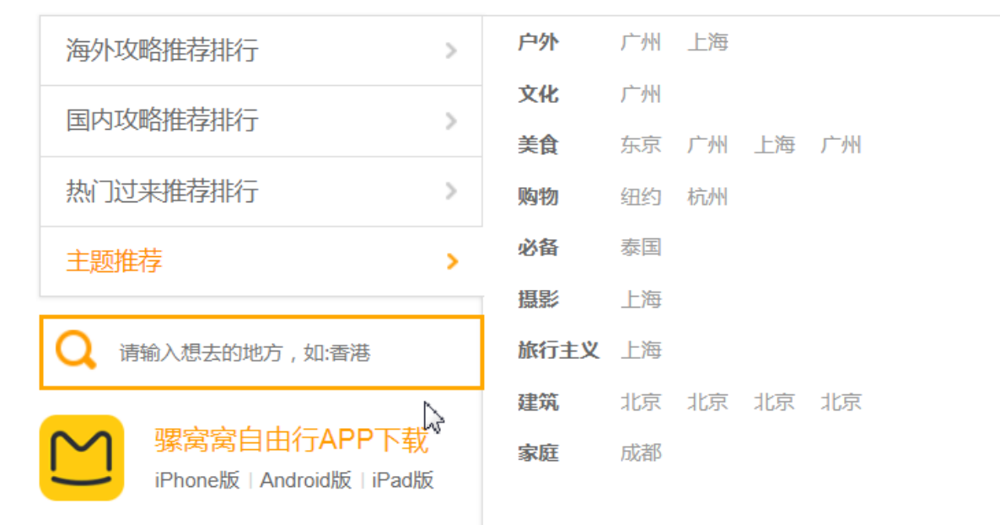
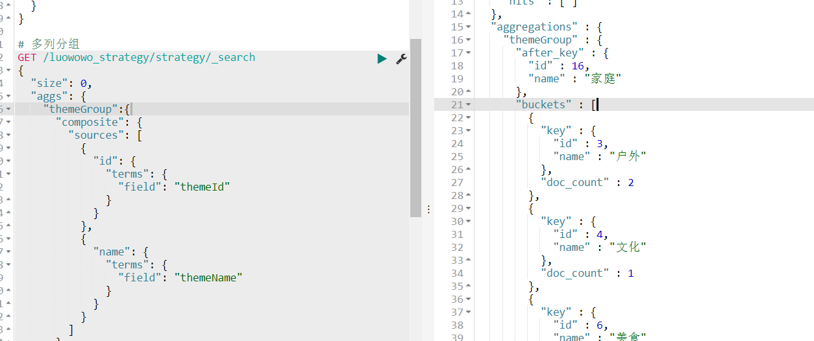
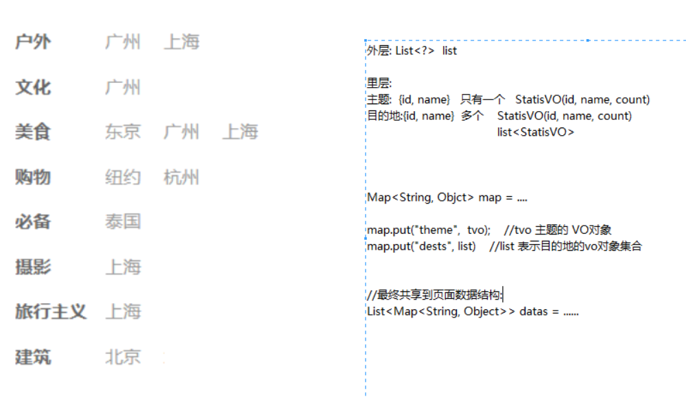

## 主题推荐
需求: 根据攻略明细按照主题分组,按照数量最多进行排序
显示数据 : 攻略对应的主题，主题下的攻略目的地




### 主题推荐分析

使用sql 查询:

```sql
-- 根据主题对攻略明细进行分组
SELECT theme_id,COUNT(theme_id) FROM strategy_detail GROUP BY theme_id  ORDER BY COUNT(theme_id) desc

-- 根据主题的id 查询攻略关联的地区数据
SELECT  DISTINCT dest_id FROM strategy_detail WHERE theme_id=6
```


es 查询:
```js
// 单列分组
GET /luowowo_strategy/strategy/_search{
  size:0,
  aggs:{
    "themeGroup":{
      "terms":{"field":"themeId"}
    }
  }
}
// 多列分组
GET /luowowo_strategy/strategy/_search{
  size:0,
  aggs:{
    "themeGroup":{
      "composite":{
        "sources":[
          "id": {
            "terms": {
              "field": "themeId"
            }
          },
          "name": {
            "terms": {
              "field": "themeName"
            }
          }
        ]
      }
    }
  }
}
```

查询结果如下:


攻略首页共享攻略主题推荐 themeCds 数据封装分析:



需求： 需要查询按照主题对攻略明细进行分组，按照主题中的攻略个数进行排序
显示数据 : 主题(分组查询) + 主题对应攻略明细的目的地(根据主题的id获取)

```java
数据封装 : 主题 : id+ name(单个)    目的地 : id+name (多个)
1. 定义一个StatisVO 封装 id 和 name属性数据
2. 主题 StatisVO + 目的地 List<StatisVO>  
3. 可以使用map 封装一行主题+目的地的记录
    |-- "theme" : StatisVO
    |-- "dest" ： List<StatisVO>
4. 返回页面显示List<Map<String,Object>> ret
```

查询数据
1.

步骤:
1. 分组查询拥有攻略的主题name和id，保存到List<StatisVO>
2. 先排序， 截取前10条数据
3. 遍历主题集合，根据themeId查询目的地数据(多个数据)
4. 封装主题和目的数据返回前端页面显示
  |-- List<Map<String,Object>> data=queryThemeCommends();


相关代码如下:

```java
// ----在search中创建一个StatisVO 统计数据包装对象
public class StatisVO {
    private Long id; // 关联的id
    private String name; // 显示的名称数据
    private Long count; //个数
}

```
查询主题攻略数据
```java
public List<Map<String, Object>> queryThemeCommends(){
  //查询拥有最多攻略的主题， 取前5
  List<CompositeValuesSourceBuilder<?>> sources = new ArrayList<>();

      // 构建分组字段对象
       TermsValuesSourceBuilder themeIdTerm = new TermsValuesSourceBuilder("id")
               .field("themeId")  //分组字段
               .missingBucket(true); //忽略不满足条件bucket
       TermsValuesSourceBuilder themeNameTerm = new TermsValuesSourceBuilder("name")
               .field(nameField)
               .missingBucket(true);
       sources.add(themeIdTerm);
       sources.add(themeNameTerm);
       //聚合对象  1.分组名字   2。分组字段集合
        CompositeAggregationBuilder composite=CompositeAggregationBuilder("themeGroup", sources);
      // 查询请求对象
      SearchRequest searchRequest = new SearchRequest(StrategyTemplate.INDEX_NAME) //设置索引名
                    .types(StrategyTemplate.TYPE_NAME)//设置类型
                    .source(new SearchSourceBuilder()
                            .size(0)
                            .aggregation(composite)
                            //.query(query)
                    );

//发起请求
 SearchResponse searchResponse = client.search(searchRequest).actionGet();

 //数据解析
 Aggregations aggregations = searchResponse.getAggregations();
//聚合查询 分组对象
 CompositeAggregation parsedComposite = aggregations.get("themeGroup");


 List<? extends CompositeAggregation.Bucket> bucketList = parsedComposite.getBuckets();

 List<StatisVO> vos = new ArrayList<>();

 StatisVO vo;
 for(CompositeAggregation.Bucket bucket:bucketList){
     vo = new StatisVO();
     Map<String, Object> keyMap = bucket.getKey();
     vo.setId(Long.valueOf(keyMap.get("id")+""));
     vo.setName(keyMap.get("name")+"");
     vo.setCount(bucket.getDocCount());
     vos.add(vo);
 }

 // 先排序
 Collections.sort(tos, new Comparator<StatisVO>() {
     @Override
     public int compare(StatisVO o1, StatisVO o2) {
         return o2.getCount().compareTo(o1.getCount());
     }
 });
// 截取前10条数据

if(tos.size()>10){
   tos=tos.subList(0,10);
 }

//内层:主题+目的地集合
Map<String,Object> map;
// 外层的list
List<Map<String,Object>> datas=new ArrayList();
 for(StatisVO vo:vos){
    List<StatisVO> dest=queryDestByThemeId(vo.getId());
    map.put("theme",vos);
    map.put("dests",vos);
    list.add(map);
 }
 return datas;
}

//------------根据主题id查询目的地---------
public List<StatisVO> queryDestByThemeId(Long themeId){
   List<StatisVO> list = new ArrayList<>();
   Iterable<StrategyTemplate> iterable=dao.search(QueryBuilders.termQuery("themeId",themeId));
   List<String> destName=new ArrayList();
   // 迭代遍历
   iterable.forEach(s->{
     // 做重复判断处理
     if(!destName.contains(s.getName())){
       StatisVO vo=new StatisVO();
       vo.setId(s.getDestId());
       vo.setName(s.getDestName());
       list.add(vo);
       destName.add(vo);
     }
   })
   return list;
}
```
