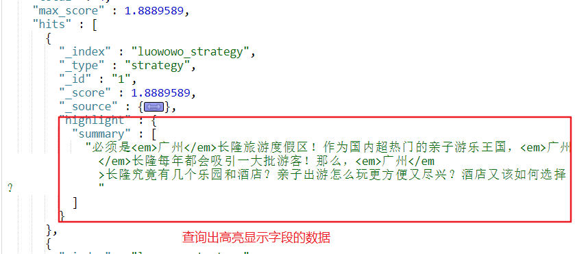
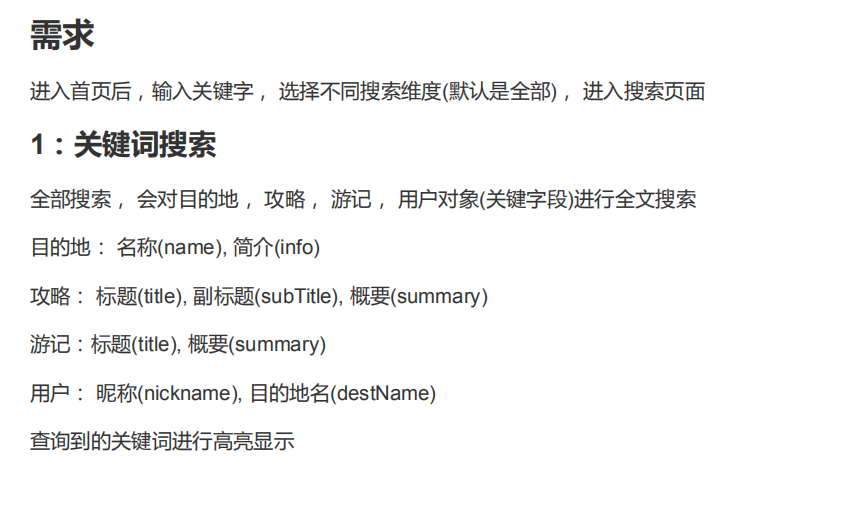

## 关键字搜索

#### 首页: 目的地关键字搜索
需求: 输入关键词是精确查询，可以查询到目的地下的攻略，游记，用户


步骤：

```
|-- 创建一个searchController,封装全文搜索
|-- 根据请求不同类型返回需要跳转不同的页面和数据
   |-- type==-1 查询全部
   |-- type==0  目的地
   |-- type==1  攻略
   |-- type==2  游记
   |-- type==3  用户
```

```java
// 首页搜索访问
@RequestMapping("/q")
public String q(Model model, @ModelAttribute("qo") SearchQueryObject qo){
    switch (qo.getType()){
        case 0://目的地
            return searchDest(model,qo);
        case 1:// 攻略
            return searchStrategy(model,qo);
        case 2://游记
            return searchTravel(model,qo);
        case 3://找人
            return searchUser(model,qo);
        default://所有
            return searchAll(model,qo);
    }
}
```

### 目的搜索页面
步骤分析:
```
  |--1. 根据关键字查询目的地对象
    |-- 如果存在，查询该目的地下所有的攻略，游记，用户
    |-- 如果不存在，提示查询条数为0
  |-- 2. 定义一个SearchResultVO封装查询条件攻略，游记，用户
  |-- 3. 获取总数通过getTotalElements()获取
  |-- 4. 用户查询使用destName去查询
```

根据查询目的地相关代码

```java
private String searchDest(Model model, SearchQueryObject qo) {
    //1. 根据目的地的名字查询目的地
    DestinationTemplate dest =destinationSearchService.queryByDestName(qo.getKeyword());
    if(dest!=null){

        // 查询结果需要分页
        qo.setPageSize(5);
        qo.setDestId(dest.getId());
        //  如果目的地存在，查询相关目的地的id 相关的 攻略 + 游记 + 用户信息
        Page<StrategyTemplate> strategysPage = strategySearchService.query(qo);
        Page<TravelTemplate> travels=travelSearchService.query(qo);
        Page<UserInfoTemplate> users=userInfoSearchService.queryByDestName(dest.getName());
        //  返回数据+ 总条数
        StatisResultVO data=new StatisResultVO();
        data.setStrategys(strategysPage.getContent());
        data.setTravels(travels.getContent());
        data.setUsers(users.getContent());

        data.setTotal(strategysPage.getTotalElements()+travels.getTotalElements()+users.getTotalElements());

        model.addAttribute("data",data);
    }
    // 页面会根据dest判断需要显示的数据
    model.addAttribute("dest",dest);

    // 如果不存在，提示搜索条数为0
    return "index/searchDest";
}

// -------- 根据目的地名字查询目的地---------
public DestinationTemplate queryByDestName(String keyword) {
     List<DestinationTemplate> dests=new ArrayList<>();
     // 查询name与关键字相关的地区数据
     Iterable<DestinationTemplate> iterable = dao.search(QueryBuilders.termQuery("name", keyword));
     iterable.forEach(s->dests.add(s));
     //可能查询多个，返回第一个
     if(dests.size()>0){
         return dests.get(0);
     }
     return null;
}

//--------- 根据目的地查询对应的攻略/游记/用户---------
public Page<TravelTemplate> query(SearchQueryObject qo) {
      Page<TravelTemplate> page = dao.search(QueryBuilders.termQuery("destId", qo.getDestId()), qo.getPageable());
      return page;
}

```


### 高亮显示
定义一个ISearchService编写高亮查询的方法

es 语法
查询结果如下
```js
# 高亮显示
GET /luowowo_strategy/strategy/_search
{
  "query":{
     "multi_match": {
       "query": "广州",
       "fields": ["title","subTitle","summary"]
     }
  },
  "from": 0,
  "size":3,
  "highlight": {
     "fields" : {
        "title" : {},
        "subTitle" : {},
        "summary" : {}
      }
  }
}
```
执行结果如下:


### 方法解析

```java
@Autowired
private ElasticsearchTemplate elasticsearchTemplate;


@Override
public <T> Page<T> searchWithHighlight(String index, String type, Class<T> clz, SearchQueryObject qo, String... fields) {
    String preTags = "<span style='color:red;'>";
    String postTags = "</span>";
    // 声明需要给那几个字段高亮显示
    HighlightBuilder.Field[] fs = new HighlightBuilder.Field[fields.length];
    for(int i = 0; i < fs.length; i++){
        fs[i] = new HighlightBuilder.Field(fields[i])
                .preTags(preTags)
                .postTags(postTags);
    }
    NativeSearchQueryBuilder searchQuery = new NativeSearchQueryBuilder();
    // 设置索引和类型
    searchQuery.withIndices(index).withTypes(type);
    //设置查询条件，多字段查询
    searchQuery.withQuery(QueryBuilders.multiMatchQuery(qo.getKeyword(), fields));
    //设置分页数据
    searchQuery.withPageable(qo.getPageable());
    //设置高亮显示字段
    searchQuery.withHighlightFields(fs);

    //封装结果数据
    //参数1: 查询条件
    //参数2：结果封装对象(泛型)
    // 参数3：结果封装逻辑
    return elasticsearchTemplate.queryForPage(searchQuery.build(), clz, new SearchResultMapper() {
        @Override
        public <T> AggregatedPage<T> mapResults(SearchResponse response, Class<T> clazz, Pageable pageable) {
            List<T>  list = new ArrayList<>();
            SearchHits hits = response.getHits();
            SearchHit[] searchHits = hits.getHits();
            for (SearchHit searchHit : searchHits) {
                //仅仅是结果封装成功指定的泛型对象，此时查询字段没有高亮效果
                T t = JSON.parseObject(searchHit.getSourceAsString(), clazz);
                //将查询出来的具有高亮效果的字段替换原来的字段
                highlightFieldsCopy(t, searchHit.getHighlightFields(), fields);
                list.add(t);
            }
            AggregatedPage<T> result = new AggregatedPageImpl<T>((List<T>) list, pageable,
                    response.getHits().getTotalHits());
            return result;
        }
    });
}

private <T> void highlightFieldsCopy(T t, Map<String, HighlightField> map, String ...fields){

    Map<String, String> mm = new HashMap<>();

    for (String field : fields) {
        // 高亮显示的字段
        HighlightField hf = map.get(field);
        if (hf != null) {
            //高亮显示字段返回结果是数组，所以需要将结果拼接成一个字符串
            Text[] fragments = hf.fragments();
            String str = "";
            for (Text text : fragments) {
                str += text;
            }
            mm.put(field, str);
        }
    }
    try {
        //替换
        BeanUtils.copyProperties(t, mm);
    } catch (IllegalAccessException e) {
        e.printStackTrace();
    } catch (InvocationTargetException e) {
        e.printStackTrace();
    }
}
```
度越桥思君

## 全文搜索



代码实现如下:

```java
private String searchAll(Model model, SearchQueryObject qo) {
   // 全部搜索， 会对目的地， 攻略， 游记， 用户对象(关键字段)进行全文搜索
   qo.setPageSize(5);
   //目的地
   Page<DestinationTemplate> destPage = searchService.searchWithHighlight(DestinationTemplate.INDEX_NAME, DestinationTemplate.TYPE_NAME,
           DestinationTemplate.class, qo, "name", "info");
   //攻略
   Page<StrategyTemplate> strategyPage = searchService.searchWithHighlight(StrategyTemplate.INDEX_NAME, StrategyTemplate.TYPE_NAME,
           StrategyTemplate.class, qo, "title", "subTitle","summary");
   //游记
   Page<TravelTemplate> travelPage = searchService.searchWithHighlight(TravelTemplate.INDEX_NAME, TravelTemplate.TYPE_NAME,
           TravelTemplate.class, qo, "title", "summary");
   // 用户对象
   Page<UserInfoTemplate> userInfoPage = searchService.searchWithHighlight(UserInfoTemplate.INDEX_NAME, UserInfoTemplate.TYPE_NAME,
           UserInfoTemplate.class, qo, "nickname", "destName");


   //  返回数据+ 总条数
   StatisResultVO data=new StatisResultVO();
   data.setStrategys(strategyPage.getContent());
   data.setTravels(travelPage.getContent());
   data.setUsers(userInfoPage.getContent());
   data.setDests(destPage.getContent());

   data.setTotal(destPage.getTotalElements()+strategyPage.getTotalElements()+travelPage.getTotalElements()+userInfoPage.getTotalElements());

   model.addAttribute("data",data);

   return "index/searchAll";
}
```
