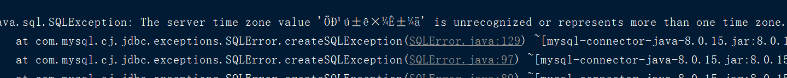

### sql 出现异常,需要设置编码



```
解决方法：
1.在原来的参数“url”后面，拼上这个字符串：?serverTimezone=GMT%2B8，
　　　　如：jdbc:mysql://localhost:3306/test?serverTimezone=GMT%2B8

　　　　　　东八区的表示：
　　　　　　　　GMT%2B8，即GMT+8，北京时间东八区
　　　　　　　　Asia/Shangha，上海时间
　　　　　　为何没有asia/beijing时区？

2.设置mysql的时区
　　　　MySQL默认的时区是UTC时区
（1）永久的修改：修改mysql的配置文件，添加：default-time-zone='+08:00'，重启mysql生效
（2）临时的修改：执行mysql命令 set global time_zone='+08:00'，立即生效，重启mysql后失效
```
