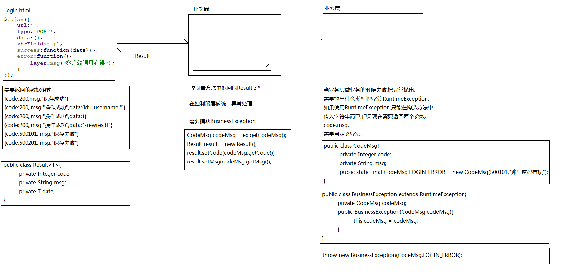

### +定义后端请求返回的数据格式

#### 前端页面

发送异步请求后，获取前端响应的数据进行处理
```html
{code:500101,msg:"操作失败"}
{code:500201,msg:"操作失败"}
{code:200,msg:"操作成功",data:{id:1,username:kiva}}
```

```java
public class Result <T> implements Serializable {

    private static final int SUCCESS_CODE = 200;
    private static final int ERROR_CODE = 500000;
    private static final String SUCCESS_MESSAGE = "操作成功";
    private static final String ERROR_MESSAGE = "系统繁忙，请稍后重试";

    private Integer code; // 用于区分不同服务下的响应码
    private String msg;
    private T data;

    public  static <T> Result success(T data){
        return new Result<>(SUCCESS_CODE,SUCCESS_MESSAGE,data);
    }

    public  static  Result defaultError(){
        return new Result<>(ERROR_CODE,ERROR_MESSAGE,null);
    }

    public  static  Result error(CodeMsg codeMsg){
        return new Result<>(codeMsg.getCode(),codeMsg.getMsg(),null);
    }
}

```

#### 控制层
对业务层抛出的异常进行统一异常处理，获取异常信息封装成Result,响应给前端

```java
public class CommonControllerAdvice {

    @ExceptionHandler(BussinessException.class)
    @ResponseBody
    public Result handlerBussinessException(BussinessException e){
        return Result.error(e.getCodeMsg());
    }

    @ExceptionHandler(Exception.class)
    @ResponseBody
    public Result handlerException(Exception e){
        e.printStackTrace();
        return Result.defaultError();
    }

}

```

#### 业务层
当业务操作失败时，需要将异常信息抛出，使用自定义异常封装code和msg

```java
public class CodeMsg{
  private Integer code;
  private String msg;
  static final CodeMsg login_error=new CodeMsg(500101,"登陆异常");
}

public class BussinessException extends RunTimeException{
  CodeMsg codeMsg;
  public BussinessException(CodeMsg codeMsg){
      this.codeMsg=codeMsg;
  }
}

// 操作失败时抛出异常
throw new BussinessException(CodeMsg.login_error);
```




### 统一异常处理
1. common 中定义Result + CodeMsg
2. member 中定义MemberServerCodeMsg 继承CodeMsg
    |-- 500101 , 登陆异常
    |-- 500102 , 非法操作
    |-- 500103 , 参数不规范:{0}
3. 自定义MemberControllerAdvice  extends CommonControllerAdvice

```java
public class MemberServerCodeMsg extends CodeMsg {

    public MemberServerCodeMsg() {}

    public MemberServerCodeMsg(Integer code, String msg) {
        super(code, msg);
    }
    // 登陆异常
    public static final MemberServerCodeMsg LOGIN_ERROR = new MemberServerCodeMsg(500101,"用户名或密码输入不正确");
    // 操作异常
    public static final MemberServerCodeMsg OP_ERROR = new MemberServerCodeMsg(500102,"非法操作");
    // 参数校验异常
    public static final MemberServerCodeMsg PARAM_ERROR = new MemberServerCodeMsg(500103,"参数不规范:{0}");


    // PARAM_ERROR是静态变量，如果多次调用可能导致占位符会被覆盖，重新创建一个对象填充占位符
    public MemberServerCodeMsg fillArg(Object... args){
        return new MemberServerCodeMsg(this.getCode(),MessageFormat.format(this.getMsg(),args));
    }

}
```
